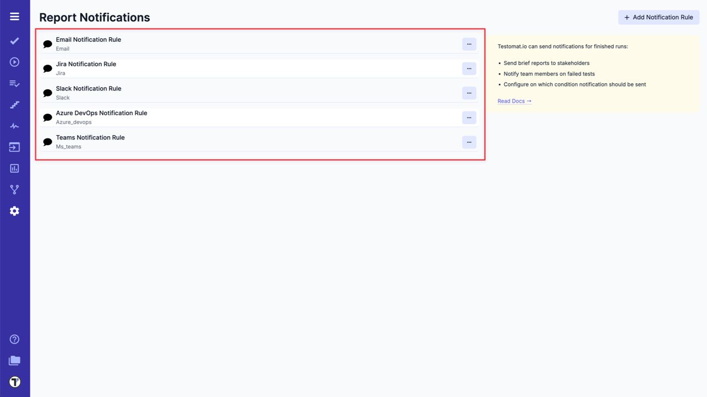
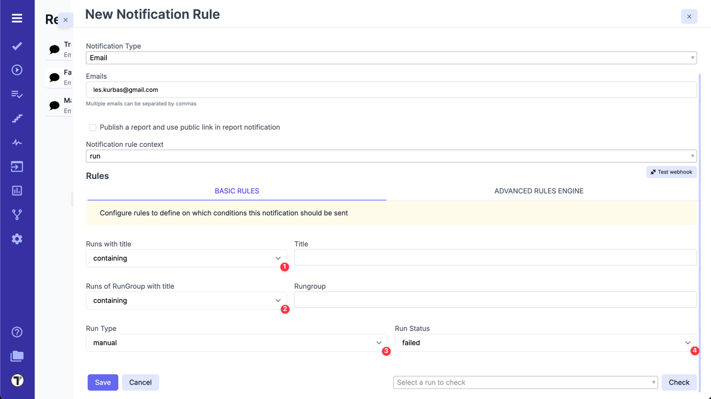
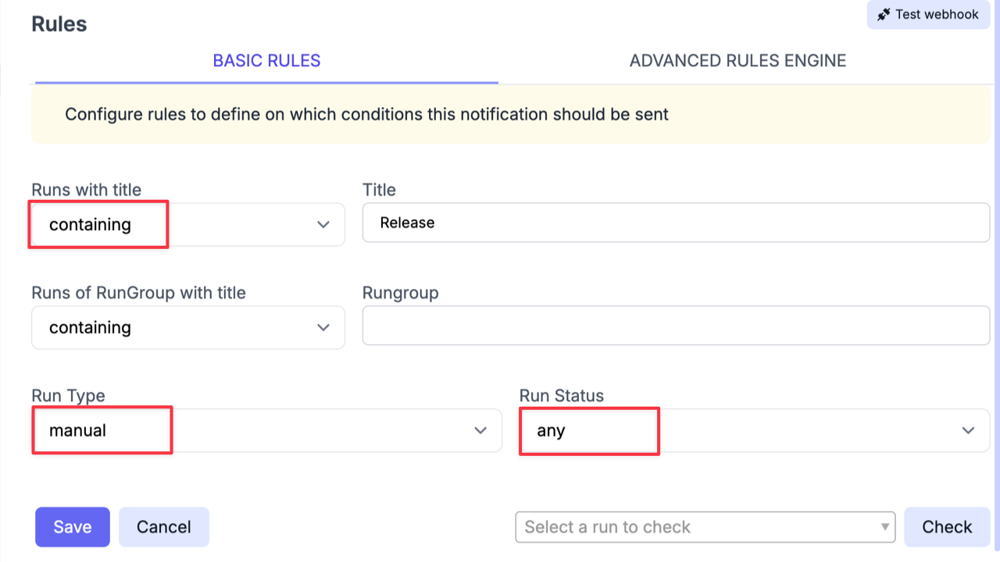
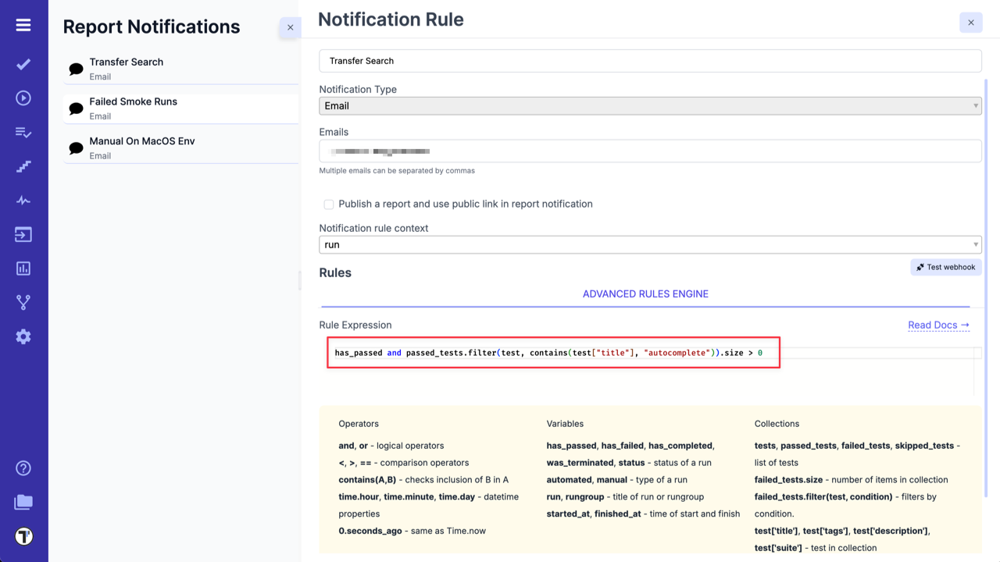
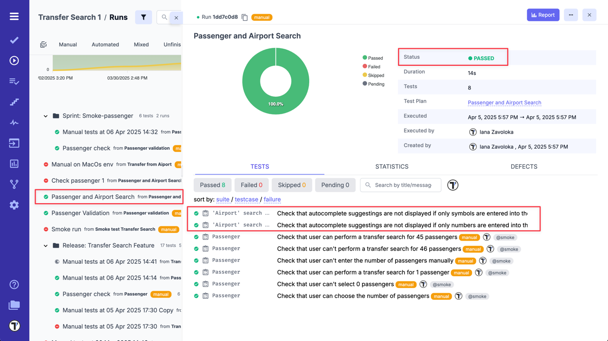
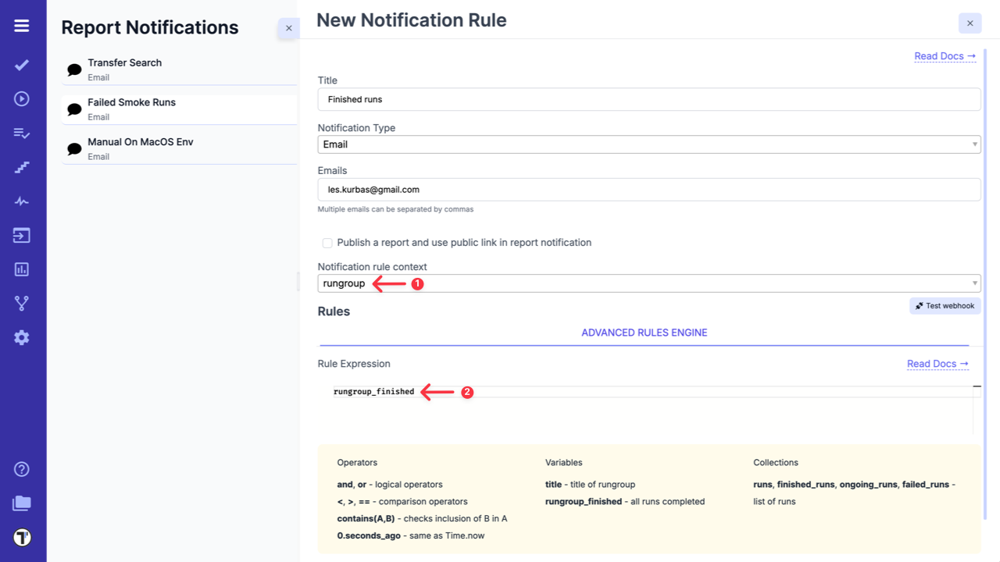
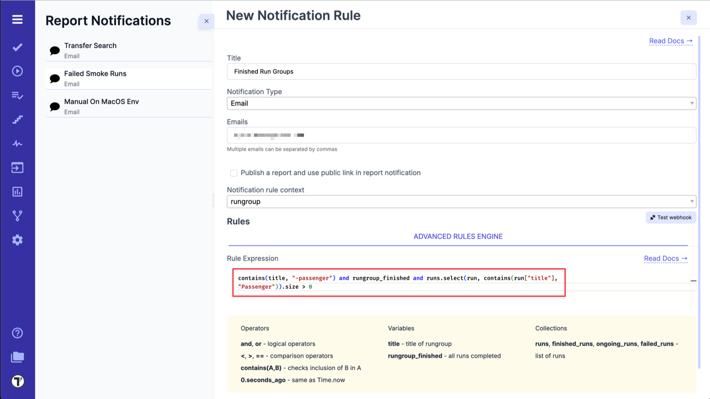
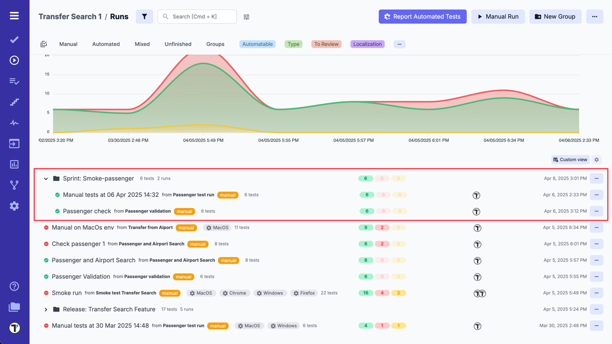
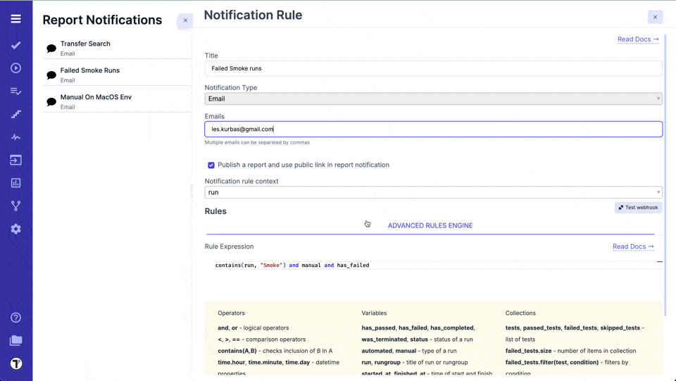

**Notification** is one of the attractive Agile testing tool features. Test management web application Testomat.io provides for collaborative purposes notification QA team, development team and business. So, keeping the teams engaged with project updates and getting fast feedback from business owners is simpler than ever! In addition, you as the test manager or team owner through **Team Management Dashboard** will have end-to-end visibility on your collaboration process.

**Available to notify by:**

- **Email** notifications.
- **Slack** notification.
- **Microsoft Teams** notification.
- **Jira** notification.
- **Azure DevOps** notification.
- **Telegram** notification.

Testomat.io allows sending notifications for finished runs:

- Send brief reports to stakeholders.
- Notify team members of failed or passed tests.
- Notify test results after test executions.
- Configure on which condition notification should be sent.

Testomat.io has powerful rule engine which can be used to define on which conditions a notification should be sent. You can have multiple notification types with different notification channels in use for a single project.



## How to Setup Notification

Sending configuration thanks to seamless integration is really simple. Enable notification you can on **Settings Dashboard** -> **Report Notification**. You are free to select an environment and configure condition notification should be sent. Simply fill the fields using **Basic rules**. Then modify your notification scheme to notify a group of people of your choice. Also, notification settings might be configured through the **Advanced rules engine** with using variables.

You can read more about how to setup your notification in the sections below.

## Basic Rules

There is a basic and advanced rules engine.

Inside Basic rules you can define simple conditions on which notifications should be sent:

1. Runs with title.
2. Runs of RunGroup with title.
3. Run Type.
4. Run Status.



For instance, here is the rule for all manual runs with **"Release"** word in title to be reported:



## Quick Toggle for Report Notifications
You can enable or disable report notifications directly from the notification profile using a quick toggle. Switch notifications on or off without changing the full configuration. This is useful when notifications need to be temporarily paused during debugging or active development.

## Advanced Rules

The advanced rules engine allows writing conditions in a special expression language similar to Ruby or JavaScript.

This is the same rule we defined previously in Basic mode written in the format of Advanced mode. A notification will be sent for all manual runs that contain the word "Release":

```
manual and contains(run, "Release")
```

A complete list of allowed variables:

- `automated` - boolean. True if a run is automated
- `manual` - boolean. True if a run is manual
- `has_failed` - boolean. True if a run has failed
- `has_passed` - boolean. True if a run has passed
- `was_terminated` - boolean. True if a run was terminated
- `run` - string. Title of a run
- `rungroup` - title. Title of rungroup a run belongs to
- `status` - string. Status of run, 'passed' or 'failed' as a string.
- `started_at` - datetime. Time when the run was started.
- `finished_at` - datetime. Time when the run was finished
- `passed_tests` - collection. A list of all passed tests in a run.
- `failed_tests` - collection. A list of all failed tests in a run.
- `skipped_tests` - collection. A list of all skipped tests in a run.
- `env` - collection. A list of environments.

An expression should return a boolean value. To deal with types other than boolean functions and methods can be used:

**String**

String values can be checked with equal `==` or not equal `!=` operators. Also there is `contains` function which checks inclusion of a string in another string:

```
contains(run, "New")
```

**Collection**

Collections contain an array of objects.

Use `.size` to check for the size of items in the collection. For instance, this rule is activated when a number of failed tests is more than 10.

```
failed_tests.size > 10
```

Collection of tests can be filtered. Tests in the collection have following properties:

- `test['title']` - title of a test
- `test['suite']` - title of a suite of a test
- `test['id']` - id of a test
- `test['suite_id']` - id of a suite
- `test['status']` - status of a test in collection

For instance, this is how to check if a collection of failed tests contains at least one test with `@important` tag in its name:

```
failed_tests.filter(test, contains(test["title"], "@important")).size > 0
```

**DateTime**

`started_at` and `finished_at` variables are of datetime type. They have properties from [Date](https://ruby-doc.org/stdlib-2.6.1/libdoc/date/rdoc/Date.html) and [DateTime](https://ruby-doc.org/stdlib-2.6.1/libdoc/date/rdoc/DateTime.html) classes of Ruby that can be used in expressions. Most used ones are:

- `hour`
- `minute`
- `day`
- `wday`
- `month`
- `year`
- [etc](https://ruby-doc.org/stdlib-2.6.1/libdoc/date/rdoc/Date.html)

For instance, this is how notification can be enabled for reports finished in non-business time:

```
(finished_at.hour > 18 or finished_at.hour < 9)
```

## Examples

**Notify when tests are failing on CI:**

To match tests executed on CI specify a Run title with "[CI]" prefix to identify that these tests were executed on CI:

```
TESTOMATIO_TITLE="[CI] Automated Tests"
```

Then write a notification rule that will check only for failing runs with "[CI]" in their title:

```
contains(run, "[CI]") and has_failed
```

**Notify when automated tests are terminated:**

```
automated and was_terminated
```

### Examples for Runs Notifications

**Notify when a Run has failed between 10 PM and 9 AM:**

```
has_failed and (finished_at.hour > 22 or finished_at.hour < 9)
```

**Notify when an automated Run has failed on alpha environment:**

```
automated and has_failed and contains (env, "alpha”)
```

**Notify when a Run that contains at least one test with the word "autocomplete" in the title has passed:**

```
has_passed and passed_tests.filter(test, contains(test["title"], "autocomplete")).size > 0
```

For example:



And Run that matches this Notification rule:



## Run Group Notifications

:::note

Please note that Run Group Notifications are available for **Email notification** type only.

:::

To configure Notification Rule for Run Group you need:

1. Select rungroup for Notification rule context
2. Add your Rule Expression, for example, you can use `rungroup_finished` variable if you want to get notification when all Run report inside the group are finished.



### Rules for Run Group Notifications

The rules engine allows writing conditions in a special expression language similar to Ruby or JavaScript.

A list of allowed variables:

- `title` - string. Title of a rungroup
- `rungroup_finished` - boolean. True if all runs completed => True if rungroup contains only finished runs.
- `runs` - collection. A list of all runs inside a rungroup
- `finished_runs` - collection. A list of finished (passed or failed) runs inside a rungroup
- `ongoing_runs` - collection. A list of pending runs (scheduled, in progress) runs inside a rungroup
- `failed_runs` - collection. A list of failed runs inside a rungroup

### Examples for Run Groups Notifications

**Notify when all runs within one Run Group (Run Group include more than 1 run) are finished:**

```
(runs.size > 1) and rungroup_finished
```

**Notify when there is at least one run in the `finished_runs` collection whose `finished_at` timestamp is older than 100 seconds ago:**

```
finished_runs.filter(run, run['finished_at'] < 100.seconds_ago).size > 0
```

**Notify when there are no currently ongoing runs in the run Group (means all runs are finished):**

```
ongoing_runs.filter(run, run['created_at'] <= 0.seconds_ago).size == 0
```

**Notify when next rules are met:**

- the title of the Run Group contains the substring 'str-' and
- all runs within this Run Group are finished and
- at least one of the runs within this Run Group has a title that contains the exact string 'islast: true'

```
contains(title, "str-") and rungroup_finished and (runs.select(run, contains(run["title"], "islast: true")).size > 0)
```

For example:



And Run Group that matches this Notification rule:



:::note

Testomat.io allows you to check which of your Runs or Run Groups match the created notification rule:



:::
