Testomat.io can send Notifications to a specific **Slack channel**. Prepare a channel inside Slack workspace to which notifications will be sent:

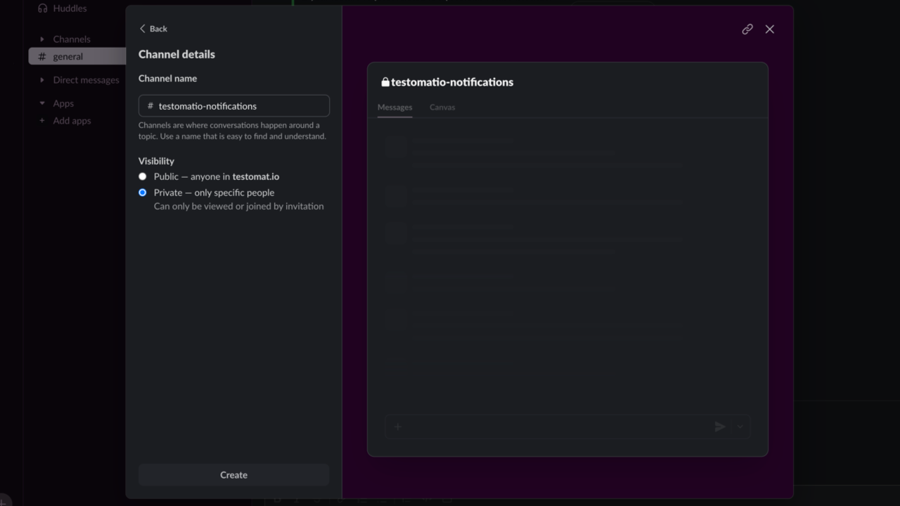

To enable Slack notification [create an incoming webhook by opening this link](https://api.slack.com/messaging/webhooks) and following the instructions:

1. Click on 'Create your Slack App' button.

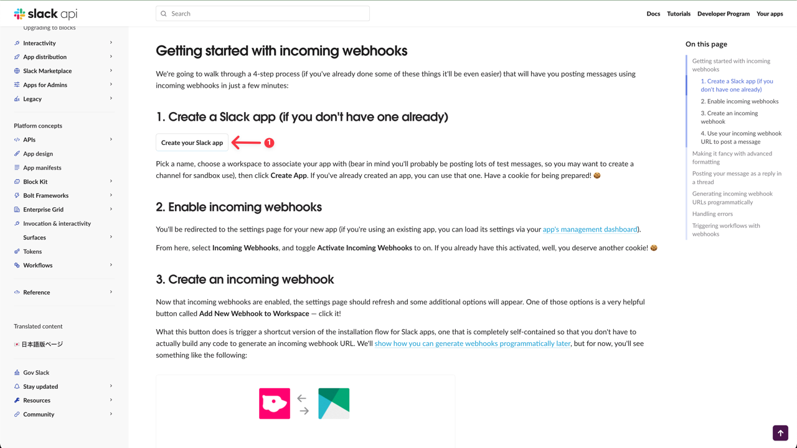

2. Select **'From scratch'** option.

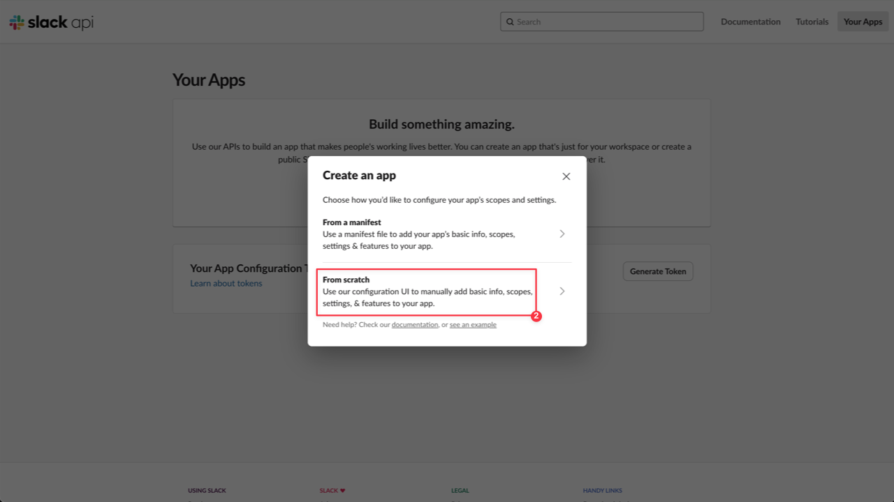

3. Add App title.
4. Pick a workspace to develop your app in from the dropdown list.
5. Click on 'Create App' button

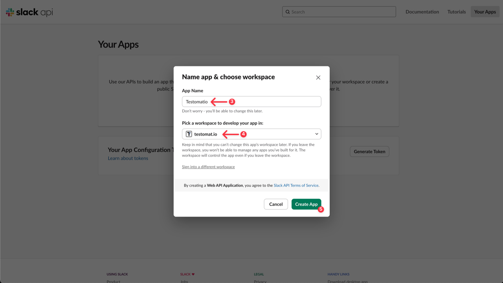

6. Activate Incoming Webhooks for this app -> toggle on.
7. Add a new Webhook for app -> Click on **'Add New Webhook'** button

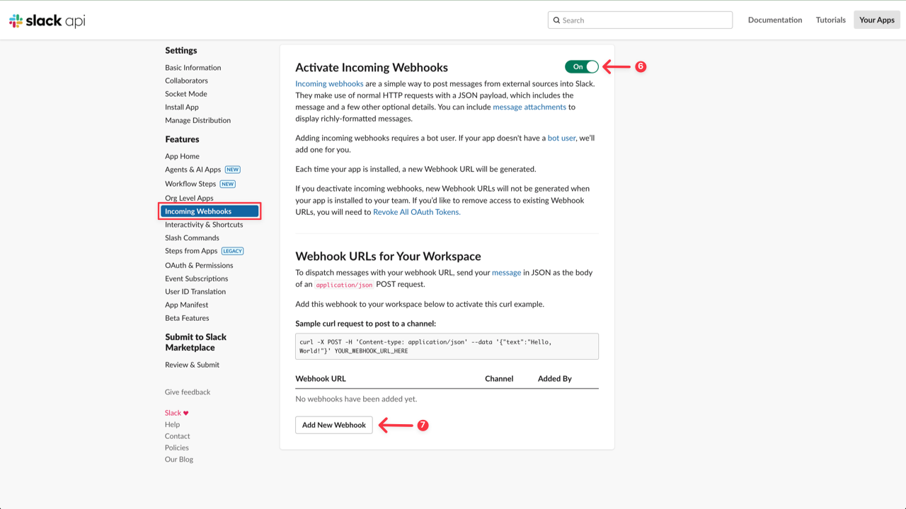

8. Select a channel to which notification will be sent.

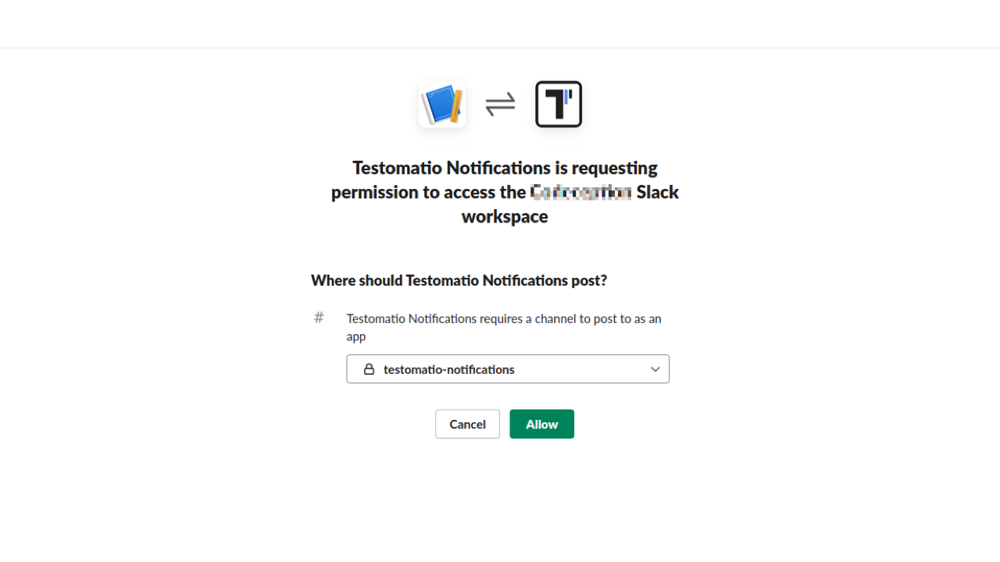

9. Copy Webhook URL.

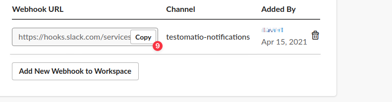

After Slack is Set up, open your Project in Testomat.io and go to the **Settings (1) -> Report Notifications(2)** and click on **Add Notification Rule (3)**.

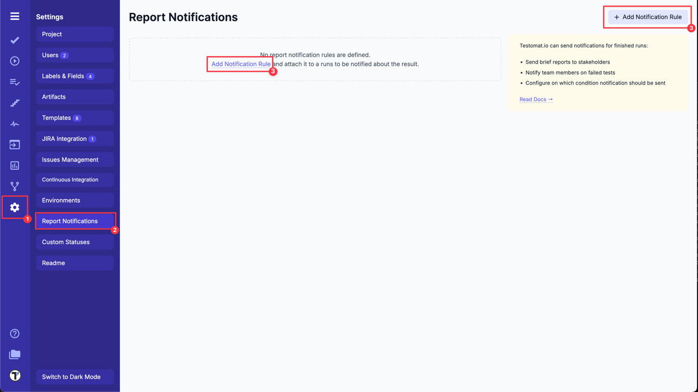

Create a new Notification Rule for Slack following next steps:

1. Add a title for Notification Rule.
2. Choose **Slack** from the dropdown list.

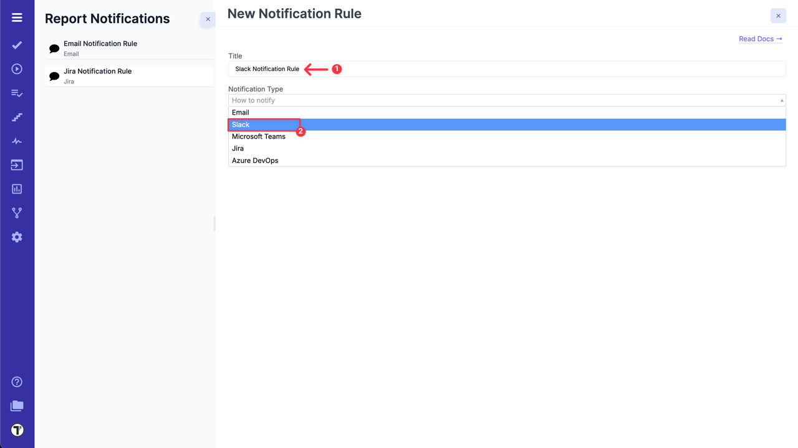

3. Paste Slack Webhook URL.
4. Select **'Publish a report and use public link in report notification'** option, if you need it.
5. Configure rules to define on which conditions this notification should be sent in **BASIC RULES** section

OR

use **ADVANCED RULES ENGINE** to enter your rule expression.

6. Click on **Save** button.

| **Basic Rules**             | **Advanced Rules Engine**             |
| --------------------------- | ------------------------------------- |
| 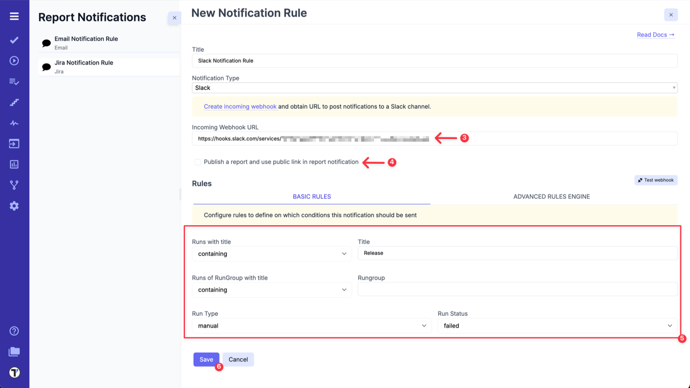 | 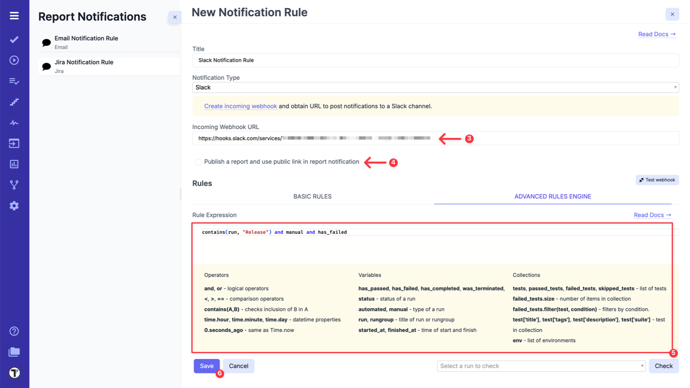 |

**How does it work?**
Each time Testomat.io creates Run Report, which corresponds to your Slack Notification Rule, it will be sent to selected Slack channel.

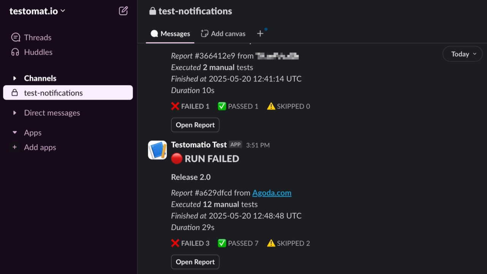

:::note

When **'Publish a report and use public link in report notification'** option is enabled, the public report will be generated and everyone who has this link will be able to see it.

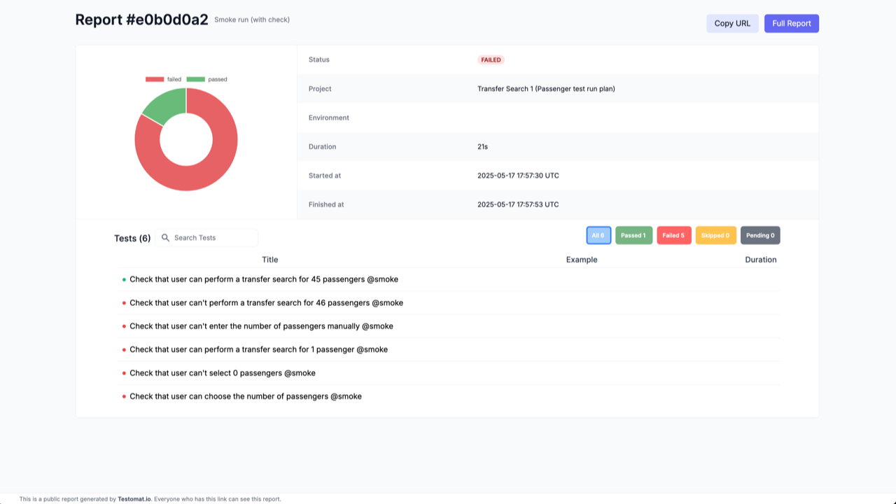

:::