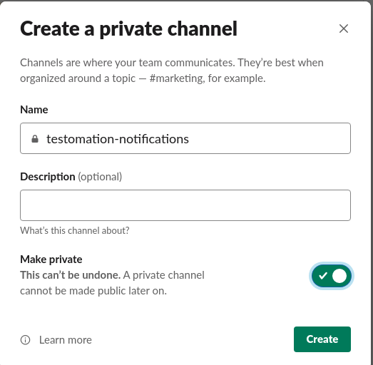
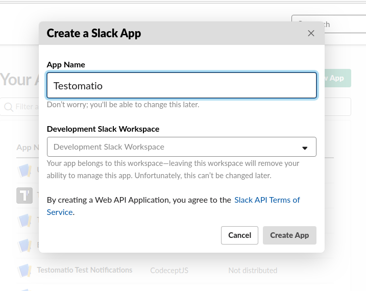
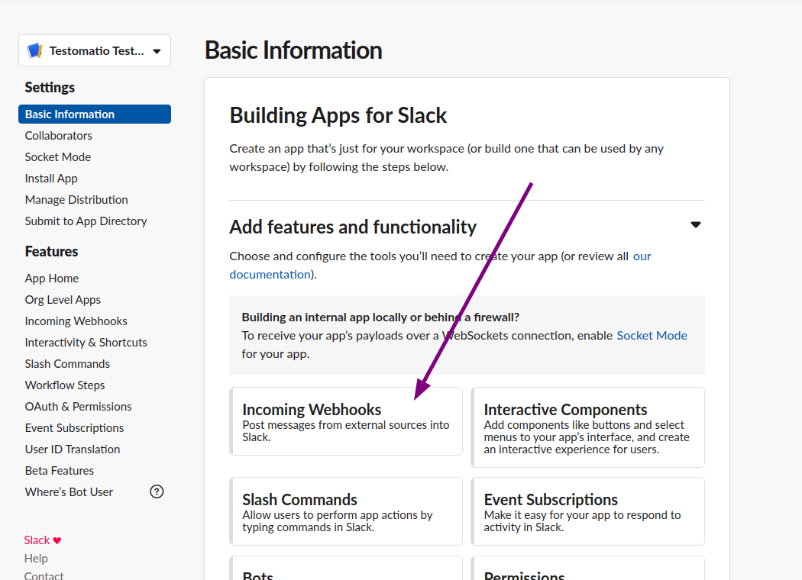
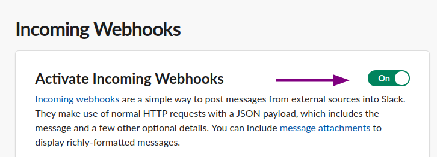
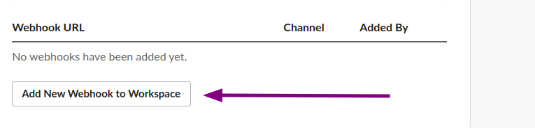
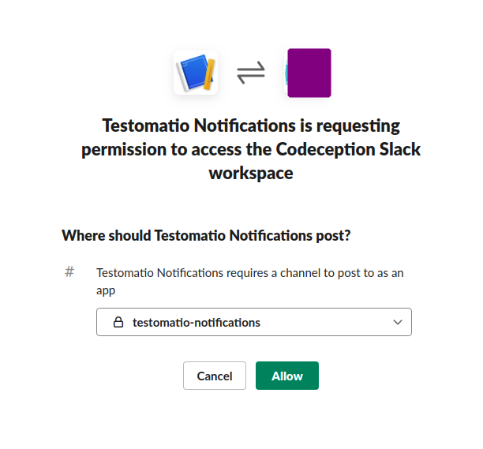
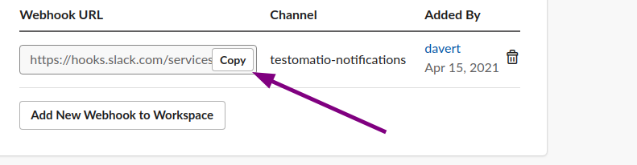
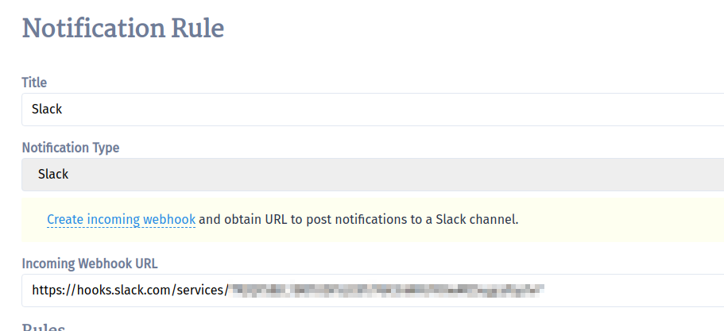

Testomatio can send notifications to a specific Slack channel. Prepare a channel inside Slack workspace to which notifications will be sent:

To enable Slack notification [create an incoming webhook by opening this link](https://api.slack.com/messaging/webhooks). Create a new Slack App:

Activate webhooks for this app:

Add a new webhook for app:

Select a channel to which notification will be sent:

Copy Webhook URL:

Create a new notification in Testomatio, select "Slack" and paste webhook URL into Url:

