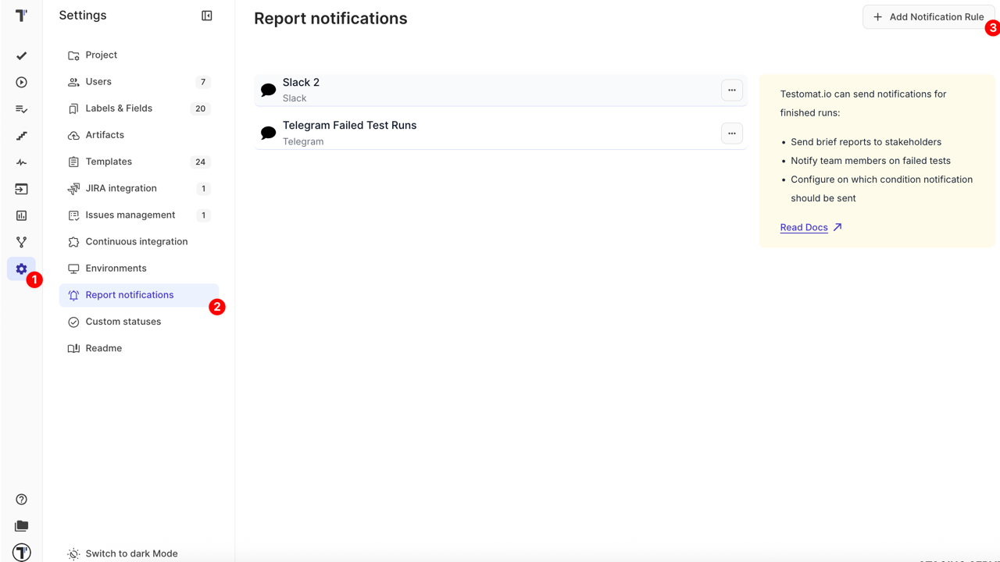
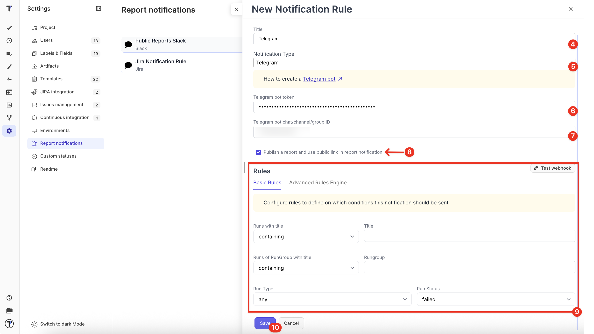
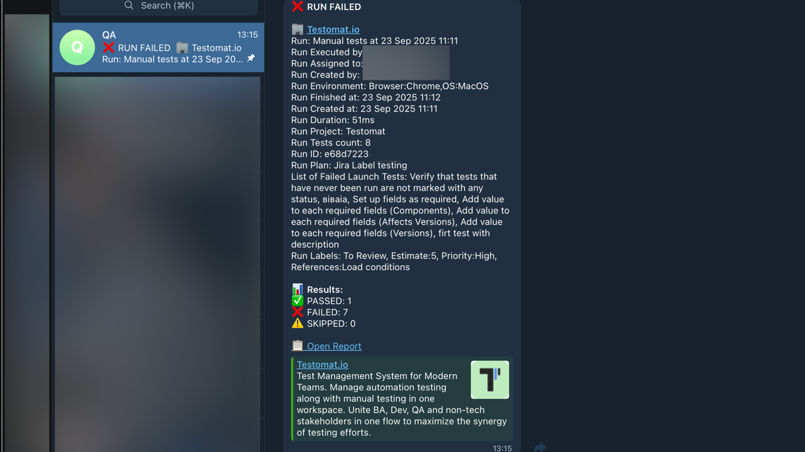

Testomat.io provides integration with **Telegram** to deliver real-time notifications about your test results directly into your chat. This integration allows you to keep the entire team updated about failed test runs, published reports, or other key QA events without leaving Telegram.

Before creating a **New Notification Rule** in Testomat.io, you need to have:

- **Telegram bot token** — if you don’t have one yet, follow the official Telegram instructions to [create a new bot](https://core.telegram.org/bots#creating-a-new-bot).

## How to get a Chat/Channel/Group ID

To send notifications from Testomat.io to Telegram, you need a unique identifier (ID) for the destination:

- **Chat ID** is used for sending notifications to a personal/individual chat
- **Channel/Group ID** is used for sending notifications to a shared channel or group

### Individual Chat Notifications

1. Open a chat with your bot in Telegram
2. Send any message to the bot
3. Forward this message to [@username_to_id_bot](https://t.me/username_to_id_bot) to get the **Chat ID**
4. Paste the returned ID into the **Telegram bot chat/channel/group ID** field in Testomat.io

### Channel/Group Notifications

1. Create a channel (or group) in Telegram
2. Add your bot as an **administrator**
3. In the channel/group, send any message
4. Forward this message to [@username_to_id_bot](https://t.me/username_to_id_bot) to get the **Channel/Group ID**
5. Paste the returned ID into the **Telegram bot chat/channel/group ID** field in Testomat.io

## How to Create a New Notification Rule for Telegram

1. Navigate to **Settings** in the left sidebar
2. Open the **Report notifications** page
3. Click on the **Add Notification Rule** button

Once the page opens, fill in the following fields:

4. **Title** — Notification rule name (required)
5. **Notification Type** — select **Telegram** from the dropdown (required)
6. **Telegram bot token** (required)
7. **Telegram bot chat/channel/group ID** (required)

:::note

Add the bot as an **administrator** of the channel/group. Without admin rights, Testomat.io cannot deliver notifications, even with the correct Channel/Group ID.

:::

8. Enable **Publish a report and use public link in report notification** (optional)
9. Configure Rules: choose [Basic Rules](https://docs.testomat.io/integrations/report-notifications/rules/#basic-rules) or [Advanced Rules Engine](https://docs.testomat.io/integrations/report-notifications/rules/#advanced-rules)
10. Click **Save** button to create the new Notification Rule

After saving your rule:

- Use the **Test webhook** button to send a sample notification and confirm that everything is working correctly
- Run a test in Testomat.io and check that a notification with test results appears in your Telegram chat/channel/group

