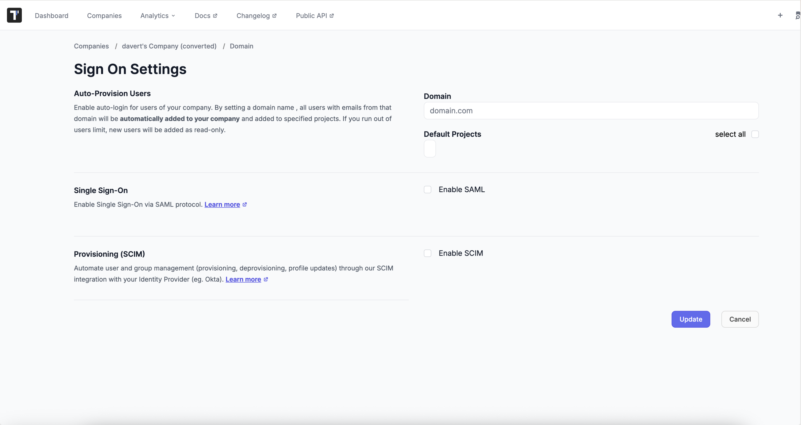
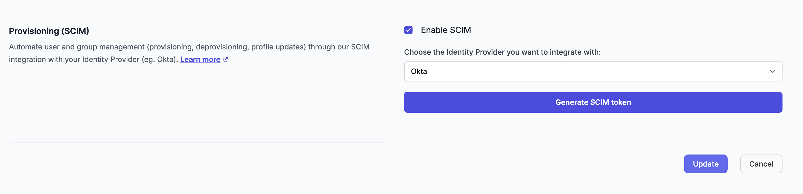
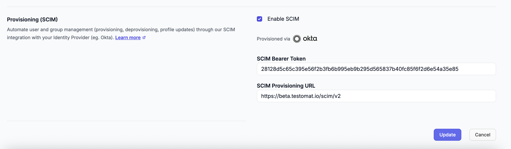

Testomat.io supports [SCIM](https://datatracker.ietf.org/doc/html/rfc7642) (System for Cross-domain Identity Management), which allows you to automate your team's provisioning and de-provisioning. You can use Testomat.io at scale across your organization and control access to it with your identity provider.

:::note

SCIM provisioning is only available with a Testomat.io **enterprise** plan.

:::

This guide shows how to set up user management via SCIM provisioning for various identity providers.

## What is SCIM provisioning?

[SCIM](https://datatracker.ietf.org/doc/html/rfc7642) (System for Cross-domain Identity Management) is an open standard that facilitates the automation of user provisioning and de-provisioning between identity providers (IdPs) and service providers. By implementing SCIM, Testomat.io enables seamless integration with various IdPs, allowing for efficient user management.

## SCIM features

Testomat.io's SCIM implementation supports the following provisioning features:

### User provisioning

- **Create User**: Automates the creation of new user accounts in Testomat.io when users are assigned in your identity provider. New users are automatically added to your company and can be assigned to default projects.

:::tip

The newly added user will have the QA role in Testomat.io by default. You can later [update account roles in Testomat.io](https://docs.testomat.io/management/company/users-and-permissions/#_top).

:::

- **Update User Information**:
  - *Update User Attributes*: Modifies user details such as name and email address.
  - *Activate User*: Creates and activates a new user account if one does not already exist.
  - *Deactivate User*: Removes a user from the system and deactivates their account, preventing authentication. This is a soft delete operation that preserves the user record. **Please note:** User accounts and the data corresponding to them won’t be deleted.

  - *Reactivate User*: Reactivates a previously deactivated user account, restoring authentication capabilities.

- **Set User Roles**: Assigns roles to users using the Testomat extension schema. Supported roles include:
  - `qa` - Quality assurance role (default)
  - `manager` - Manager role
  - `billing` - Billing administrator role
  - `read` - Read-only access status

### Group provisioning

- **Create Group**: Establishes new user groups (teams) within Testomat.io based on group assignments in your identity provider.

- **Delete Group**: Removes user groups from the system.

- **Update Group Information**:
  - *Update Group Attributes*: Changes group names and other attributes.
  - *Update Group Members*: Adds or removes users from groups as needed.

## Prerequisites

Before enabling SCIM provisioning, ensure the following:

* You have a company in Testomat.io, and you are [**owner of this company**](https://docs.testomat.io/management/company/users-and-permissions/#roles-within-a-company).
* Company is on an **Enterprise plan**.
* You have configured [Single Sign-On (SSO)](https://docs.testomat.io/integrations/single-sign-on/) in Testomat.io. SSO must be configured before you can enable SCIM.
* Your identity provider supports SCIM 2.0 protocol (e.g., Okta, Microsoft Entra ID, OneLogin).
* You have administrative privileges in both Testomat.io and your identity provider.

## Enabling SCIM provisioning

You must [configure SSO](https://docs.testomat.io/integrations/single-sign-on/) in Testomat.io before you can enable SCIM for your Testomat.io team.

### Enabling SCIM in Testomat.io

1. Open Testomat.io and navigate to [Companies](https://app.testomat.io/companies) > in the Testomat.io header.

2. Click on the company where you want to enable SCIM provisioning.

3. Click **Authentication** in the right sidebar.

4. Select the **Enable SCIM** toggle to turn it on.

### Generating SCIM API credentials

After enabling SCIM provisioning, you need to generate SCIM API credentials:

1. Under **SCIM Provisioning**, choose **Identity Provider** (Okta f.e.) and click on **Generate SCIM token** button to generate SCIM token.

2. Copy and securely store the following information:
   - **SCIM Base URL**: This is your company-specific SCIM endpoint URL (format: `https://app.testomat.io/scim/v2`)
   - **SCIM Bearer Token**: This token is used for authentication in SCIM API requests

:::caution

**Important**: Keep the SCIM Bearer Token secret and secure. You'll need both the Base URL and Bearer Token to configure SCIM in your identity provider. If you need to rotate the token, you can disable SCIM and re-enable it to generate a new token.

:::

### Configuring your identity provider

After generating your SCIM credentials, configure SCIM provisioning in your identity provider:

- [Configure SCIM with Okta](/integrations/scim-provisioning/okta)

## SCIM API endpoints

Testomat.io implements SCIM 2.0 endpoints for user and group management:

### Users endpoints

- `GET /scim/v2/Users` - List users (supports pagination and filtering)
- `GET /scim/v2/Users/{id}` - Get user details
- `POST /scim/v2/Users` - Create a new user
- `PUT /scim/v2/Users/{id}` - Replace user information
- `PATCH /scim/v2/Users/{id}` - Partially update user information
- `DELETE /scim/v2/Users/{id}` - Deactivate a user (soft delete)

### Groups endpoints

- `GET /scim/v2/Groups` - List groups
- `GET /scim/v2/Groups/{id}` - Get group details
- `POST /scim/v2/Groups` - Create a new group
- `PUT /scim/v2/Groups/{id}` - Replace group information
- `PATCH /scim/v2/Groups/{id}` - Partially update group information
- `DELETE /scim/v2/Groups/{id}` - Delete a group

### Discovery endpoint

- `GET /.well-known/scim-configuration` - Returns ServiceProviderConfig with server capabilities

All SCIM requests use `application/scim+json` content type and require Bearer token authentication in the `Authorization` header.

## Supported attributes

### User attributes

**Core attributes:**
- `id` - User ID (read-only)
- `userName` - Maps to user email address
- `name.formatted` - Full name of the user
- `active` - Boolean indicating if user is active (false deactivates user and removes access)
- `emails[0].value` - Primary email address
- `meta.created` / `meta.lastModified` - Timestamps (read-only)

**Testomat extension schema:**
- Schema: `urn:ietf:params:scim:schemas:extension:testomat:2.0:User`
- `testomat_roles` - Multi-valued array of roles: `qa`, `manager`, `billing`, `read`

### Group attributes

- `id` - Group ID (read-only)
- `displayName` - Group/team name
- `members[]` - Array of users in the group (contains `value`: user ID, `display`: user name)
- `meta.created` / `meta.lastModified` - Timestamps (read-only)

## Limitations

While SCIM simplifies user management, be aware of the following limitations:

- **Attribute Mapping**: Not all user attributes may be supported or mapped between Testomat.io and your IdP. Review attribute mappings to ensure accuracy.

- **Group Management**: Group provisioning is supported; however, nested groups or complex group hierarchies may not be fully replicated. Group deletion is currently a destructive operation.

- **Filtering**: Only the `eq` (equals) operator is supported for filtering on `userName` (Users) and `displayName` (Groups). Other filter operators return a 501 Not Implemented error.

- **Real-Time Sync**: There may be a delay between changes in the IdP and their reflection in Testomat.io, depending on synchronization schedules configured in your identity provider.

- **Password Management**: SCIM does not support password synchronization or password updates.

- **Bidirectional Sync**: Testomat.io does not push user or group changes back to the identity provider.

## Troubleshooting

If you encounter issues with SCIM provisioning:

- Verify that SSO is properly configured before enabling SCIM
- Ensure the SCIM Bearer Token is correctly configured in your identity provider
- Check that the SCIM Base URL matches the value provided in Company Settings
- Verify user email addresses match between your IdP and Testomat.io
- Review synchronization logs in your identity provider for error messages

:::tip

For more information or help with configuring SCIM, [contact Testomat.io support](/support).

:::

import DirectoryLinks from '/src/components/DirectoryLinks.astro';
import { Steps } from '@astrojs/starlight/components';

<DirectoryLinks directory="integrations/scim-provisioning" />
