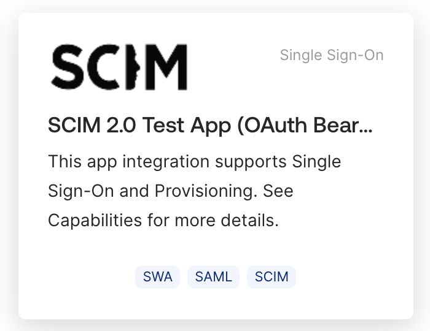
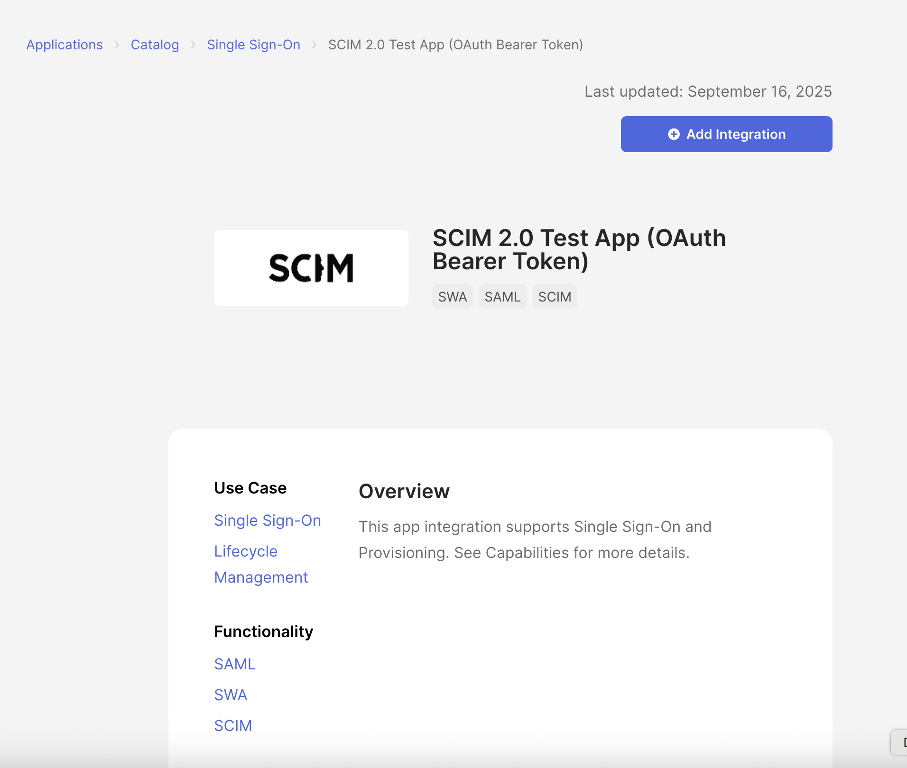
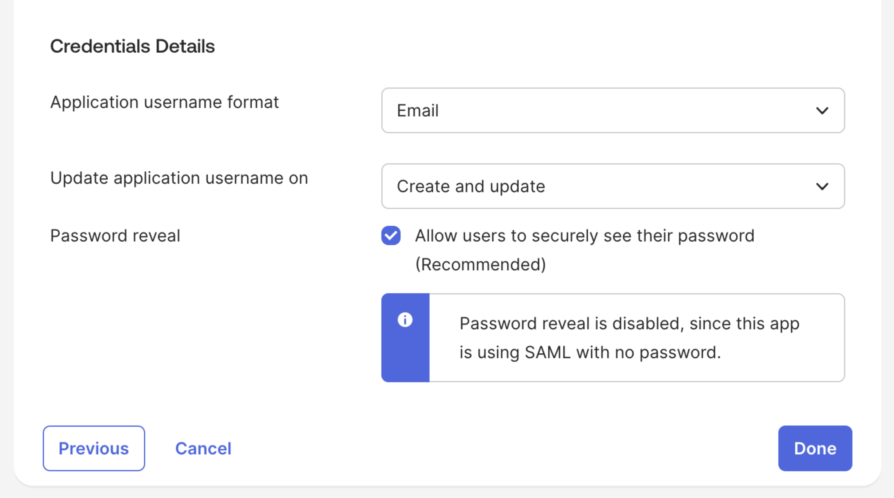
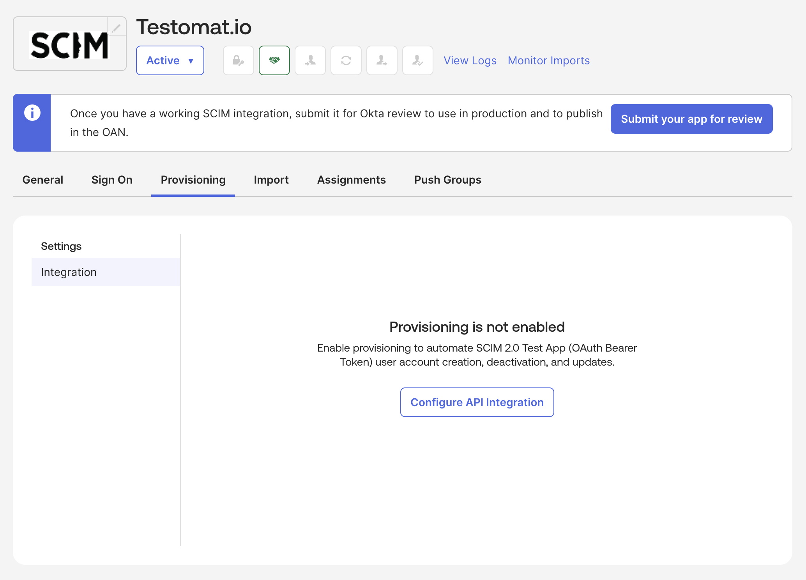
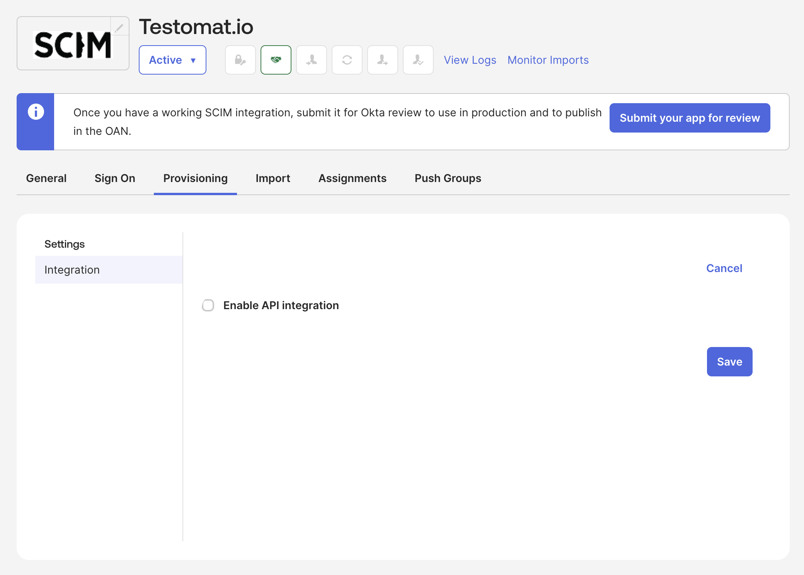
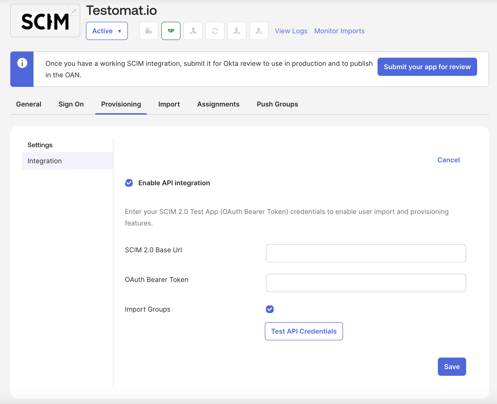
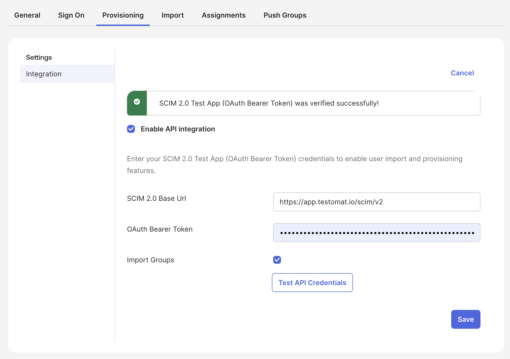
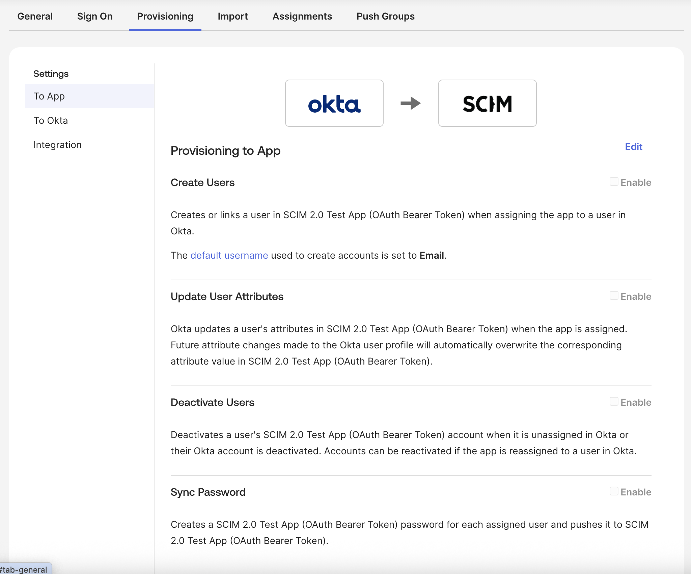
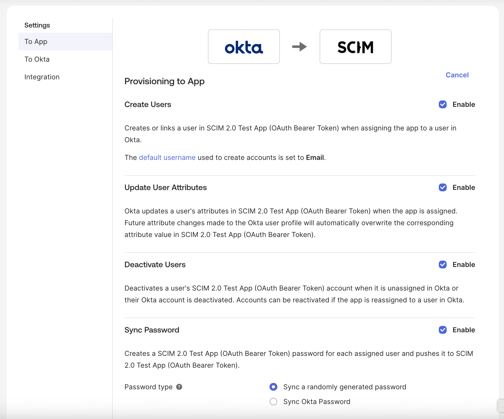
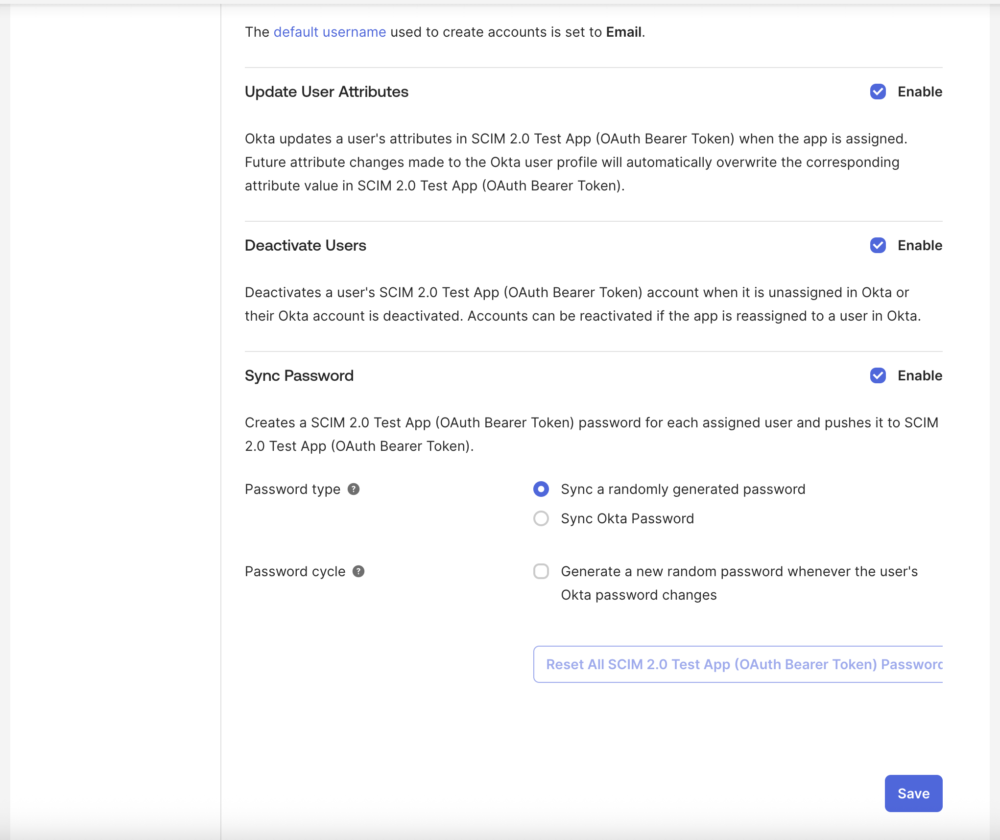

This guide walks you through configuring SCIM provisioning with Okta for Testomat.io. With SCIM enabled, Okta will automatically provision and de-provision users and groups in Testomat.io based on assignments in your Okta organization.

## Prerequisites

Before configuring SCIM with Okta, ensure you have:

- A Testomat.io company on an **enterprise plan**
- [SSO configured](https://docs.testomat.io/integrations/single-sign-on/okta) in Testomat.io with Okta
- SCIM provisioning enabled in Testomat.io (see [SCIM provisioning overview](/integrations/scim-provisioning))
- SCIM Base URL and Bearer Token from Testomat.io (available in Company Settings → Domains after enabling SCIM)
- Administrator access to your Okta organization

## Configure SCIM in Okta

This section shows how to connect Okta to Testomat.io using SCIM 2.0 so that users can be created and updated from Okta.

### Step 1: Create a SCIM 2.0 Test Application

1. Log in to Okta as an Administrator.

2. Navigate to **Applications** > **Applications** in the Okta admin console.

3. Click **Browse App Catalog**.

4. Search for "SCIM 2.0 Test App (OAuth Bearer Token)".

5. Click **Add Integration** to add the application to your Okta organization.

6. Configure the application settings:
   - **Application label**: Enter "Testomat.io" or a descriptive name
   - **Application visibility**: Choose whether to show the app icon to users
   - Click **Next** to proceed to next tab **Sign-In Options**

7. In **Sign-In Options** scroll to the section **Credentials Details** and set **Application username format** to: "Email". Everything else leave as on the screen, after that you can proceed further ans click **Done**.

7. In **Sign-In Options**, scroll to **Credentials Details** and set **Application username format** to **Email**.
Leave the other settings as shown on the screenshot (password reveal stays disabled because the app uses SAML).
Click **Done**.

### Step 2: Configure API Integration Settings

1. In the application configuration page, click the **Provisioning** tab.

2. Click **Configure API Integration** button.

3. Click **Enable API Integration** checkbox.

4. Configure the SCIM API Integration settings:
   - **SCIM 2.0 base URL**: Enter the SCIM Base URL from Testomat.io (format: `https://app.testomat.io/scim/v2`)
   - **OAuth Bearer Token**: Enter the SCIM Bearer Token from Testomat.io
   - **Import Groups** Leave it as shown on the screenshot (checked)
5. Click **Test API Credentials** to test the Testomat SCIM credentials entered above.

6. Click **Save** to save the authentication settings.

### Step 3: Configure Provisioning Options

1. Still in the **Provisioning** tab, click on **Edit** and configure the provisioning options:

   

   **To App** section:
   - ✓ Enable **Create Users**
   - ✓ Enable **Update User Attributes**
   - ✓ Enable **Deactivate Users**
   - Optionally enable **Sync Okta Password** (if supported). **Sync Password** settings are left to your own.

   
   

   **To Okta** section (optional):
   - Enable **Import Users** if you want to import existing Testomat.io users into Okta
   - Enable **Import New Users** to automatically import new users
   - Enable **Import Profile Updates** to sync profile changes

2. Click **Save** to save the provisioning options.

### Step 4: Configure Attribute Mappings

1. In the application configuration page, click the **Attribute Mappings** tab.

2. Configure the attribute mappings for users:

   **User attributes:**
   - `userName` → `user.email` (this maps Okta email to SCIM userName)
   - `name.formatted` → `user.firstName + " " + user.lastName` or `user.displayName`
   - `active` → `user.status` (maps Okta user status to SCIM active status)
   - `emails[0].value` → `user.email`

   **Testomat extension attributes** (if supported in your Okta configuration):
   - `urn:ietf:params:scim:schemas:extension:testomat:2.0:User.testomat_roles` → Map to Okta group memberships or custom attributes
     - You can map Okta groups to Testomat roles:
       - Groups containing "manager" → `["manager"]`
       - Groups containing "billing" → `["billing"]`
       - Groups containing "read-only" → `["read"]`
       - Default → `["qa"]`

3. Click **Save** to save the attribute mappings.

### Step 5: Configure Group Mappings (Optional)

If you want to provision groups (teams) from Okta to Testomat.io:

1. In the application configuration page, click the **Push Groups** tab.

2. Select the Okta groups you want to push to Testomat.io.

3. Configure group attribute mappings:
   - `displayName` → Group name in Okta
   - `members` → Automatically mapped from Okta group membership

4. Click **Save** to save the group mappings.

### Step 6: Assign Users and Groups

1. In the application configuration page, click the **Assignments** tab.

2. Click **Assign** to assign users or groups to the application.

3. Select users or groups you want to provision to Testomat.io.

4. Click **Assign** to complete the assignment.

5. Optionally, configure assignment-specific settings:
   - **User name format**: Choose how usernames are formatted
   - **Application username**: Override if needed

:::note

Now Okta will start provisioning users and groups to Testomat.io according to your configuration.

:::

## Verify SCIM Provisioning

After activating SCIM provisioning, verify that it's working correctly:

1. **Check user provisioning:**
   - Assign a new user to the Testomat.io application in Okta
   - Wait a few minutes for synchronization
   - Verify the user appears in Testomat.io under Company Settings → Users

2. **Check user updates:**
   - Update a user's name or email in Okta
   - Wait for synchronization
   - Verify the changes are reflected in Testomat.io

3. **Check user deactivation:**
   - Deactivate a user in Okta or remove them from the application assignment
   - Wait for synchronization
   - Verify the user is deactivated in Testomat.io

4. **Check group provisioning** (if enabled):
   - Create or update a group in Okta that's assigned to the application
   - Wait for synchronization
   - Verify the group (team) appears in Testomat.io

## Troubleshooting

If SCIM provisioning is not working correctly:

- **Verify authentication**: Test the API connection in the Provisioning tab
- **Check Okta logs**: Review the System Log in Okta for SCIM-related errors
- **Verify SCIM credentials**: Ensure the SCIM Base URL and Bearer Token are correct in Okta
- **Check attribute mappings**: Verify that attribute mappings are correctly configured
- **Review synchronization schedule**: Okta may have a delay between changes and synchronization
- **Verify SSO configuration**: Ensure SSO is properly configured before SCIM provisioning

:::tip

For more information or help with configuring SCIM with Okta, [contact Testomat.io support](/support).

:::