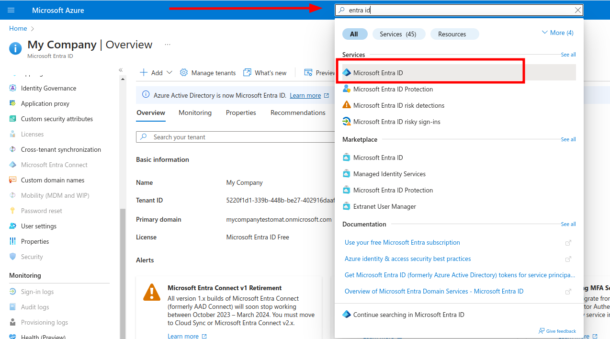
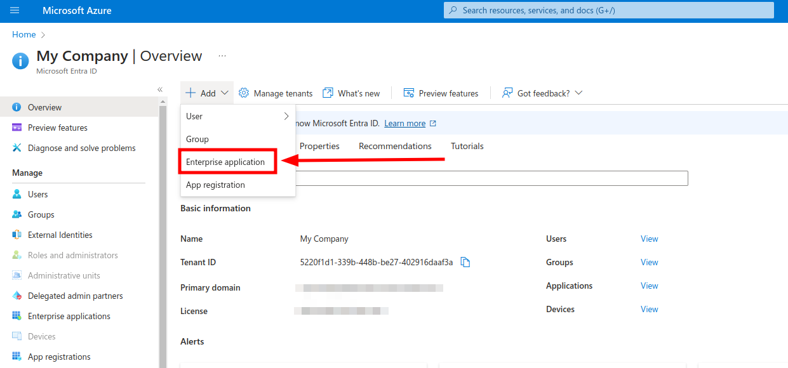
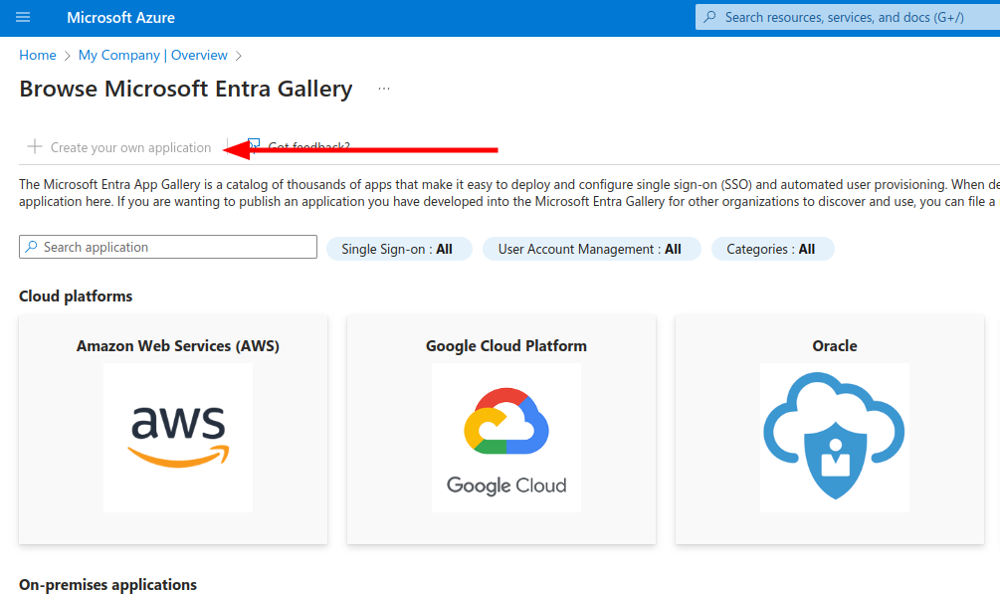

Open Azure portal and search for Entra ID service:



Add new Enterprise application



On the next screen create a new Application



Enter the "Testomat" as the name of integration, select Integrate any other application you don't find in the gallery (Non-gallery) and click Create. 

Select **Single Sign On** on the left and click "SAML" to configure connection settings.

On the **Basic SAML Configuration** fill in following values

* `Identifier (Entity ID)` → `https://app.testomat.io/users/saml/metadata`
* `Reply URL (ACS URL)` → `https://app.testomat.io/users/saml/auth`
* `Sign on URL` → `https://app.testomat.io/users/sso`


Save this form. Now edit **Attributes & Claims**.

Remove default attributes.

Add the following attributes that will be sent to Testomat.io:

* `http://schemas.xmlsoap.org/ws/2005/05/identity/claims/emailaddress` → `email`
* `http://schemas.xmlsoap.org/ws/2005/05/identity/claims/name`         → `name`
* `http://schemas.xmlsoap.org/ws/2005/05/identity/claims/givenname`    → `first_name`
* `http://schemas.xmlsoap.org/ws/2005/05/identity/claims/surname`      → `last_name`


Close the dialog. 

On **SAML Signing Certificate** card download **Certificate (Base 64)**.

On **Set up Testomat** card copy following values

* **Login URL** 
* **Azure ID Idenitifier** 

Add Users to application on the **Users and Groups** section in sidebar. This users will be able to log in to Testomat.io via SAML.

Now, open Company page in [Testomat.io](https://app.testomat.io/companies) and select Single Sign On options

> If you don't see Single Sign On option, check that you are an owner of this company

Fill in the form:

1. **Company domain**. This is required to identify SSO connection by user's email. Example: `mycompany.com`.
2. **Default Projects**. Select projects to new users will be added to (optional).
3. Enable SAML:


4. Set **Azure ID Idenitifier** (or Azure Entra ID) from Microsoft Entra ID (formerly Azure AD) as **IdP Entity ID**. Should be like `https://sts.windows.net/.../` (ensure it ends with `/`)
5. Set **Login URL** from Microsoft Entra ID as **Sign In URL**
6. Upload certificate.


7. Set `Authn Context` by selecting "Password Protected Transport". The actual value should become:

```
urn:oasis:names:tc:SAML:2.0:ac:classes:PasswordProtectedTransport
```


And save the form.


Now, use any assigned user from Microsoft Entra ID (formerly Azure AD) to Log In into Testomat.io. Select "SSO" on the Sign In page, enter the email, and if everything is correct user will get inside Testomat.io, assigned to your company and added to default projects.

> In case user sees 404 page on Microsoft Entra ID (formerly Azure AD), check that Single Sign-On URL was correctly set.
