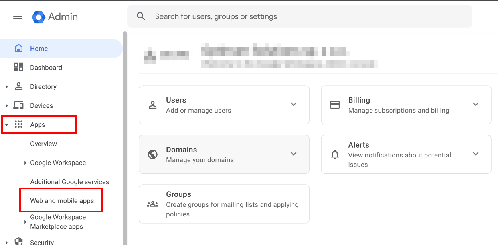
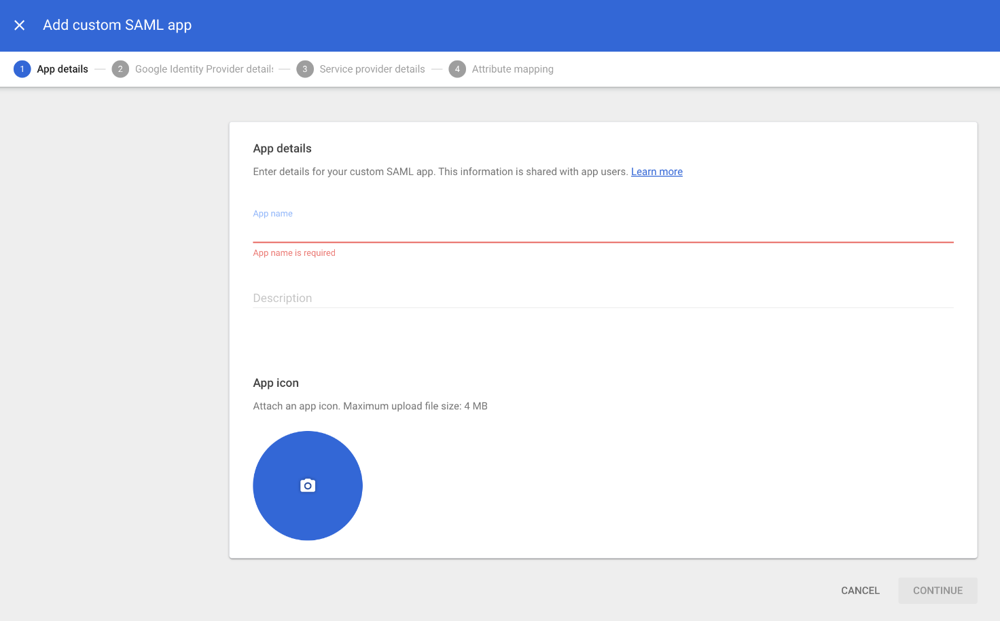
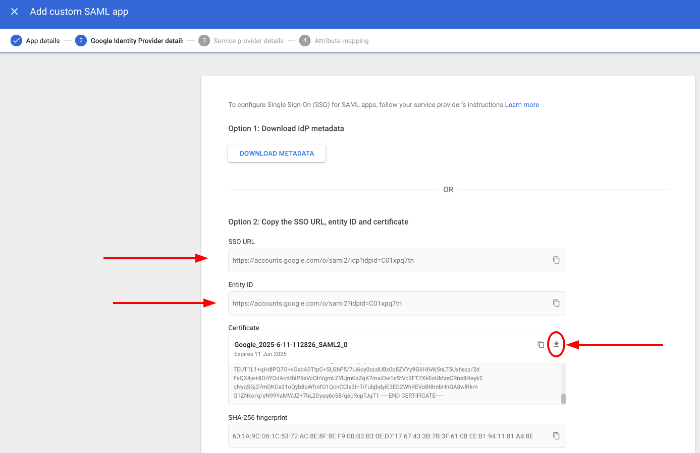
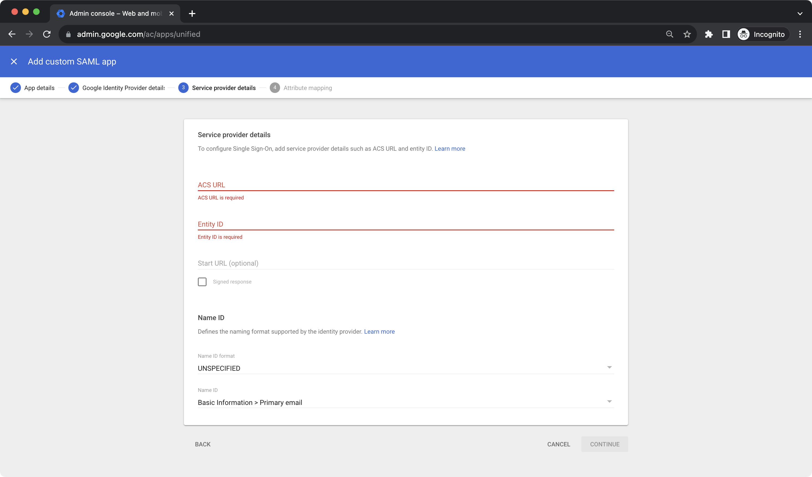
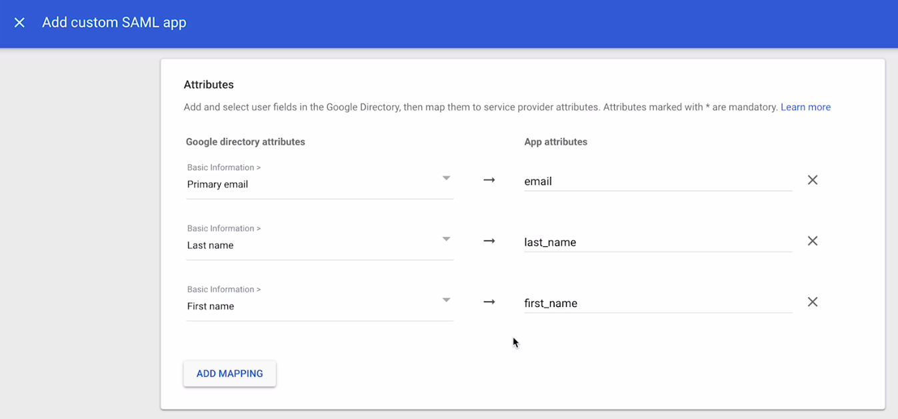
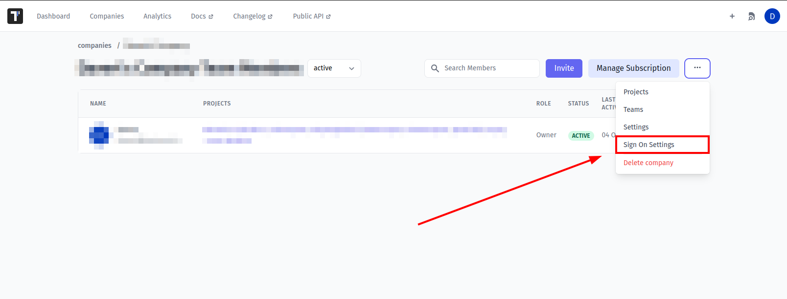

Inside Google Admin open **Apps** > **Web & Mobile Apps**:

Add Custom SAML App.

Use "Testomatio" as **App Name** and continue

Copy the following information:

* **SSO URL**
* **Entity ID**
* **Certificate** should be downloaded as file

And continue.

On this step fill the form:

* **ACS URL**: `https://app.testomat.io/users/saml/auth`
* **Entity ID**: `https://app.testomat.io/users/saml/metadata`

On the next page add attributes mappings:

* Add `email`
* Last name as `last_name`
* First name as `first_name`

Finish set up.

Now, open Company page in Testomat.io and select Single Sign On options

> If you don't see Single Sign On option, check that you are an owner of this company

Fill in the form:

1. **Company domain**. This is required to identify SSO connection by user's email. Example: `mycompany.com`.
2. **Default Projects**. Select projects to new users will be added to(optional).
3. Enable SAML:

4. Set **Entity ID** you copied previously as **IdP Entity ID**
5. Set **SSO URL** you copied previously as **Sign In URL**
6. Upload certificate.

And save the form.

Now, use any assigned user from Okta to Log In into Testomat.io. Select "SSO" on the Sign In page, enter the email, and if everything is correct user will get inside Testomat.io, assigned to your company and added to default projects.