Okta authorization can be enabled via SAML. As a prerequisite a [company](https://docs.testomat.io/subscriptions/companies/) for your domain should be created on Testomat.io. 

Log in to Okta as Administrator and **Create Application Integration**

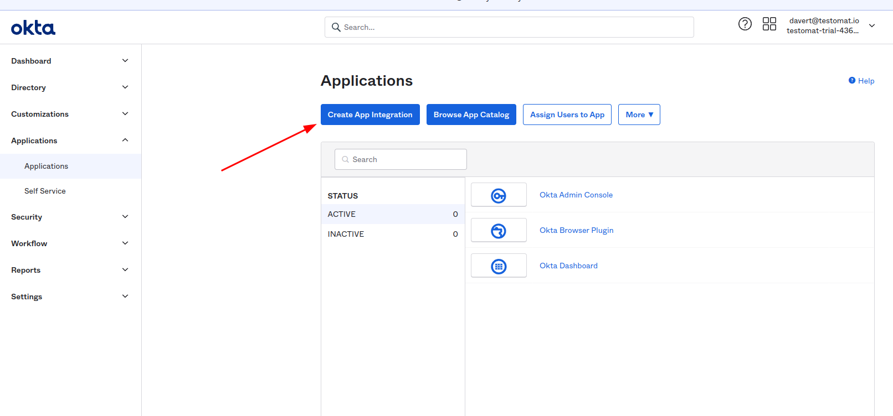

Choose **SAML 2** as sign-in method

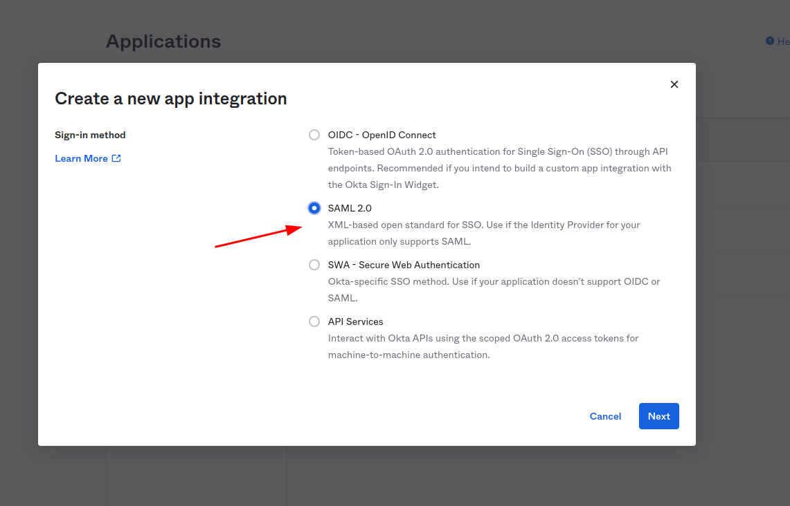

Set "Testomat.io" as the application name and click "Next"

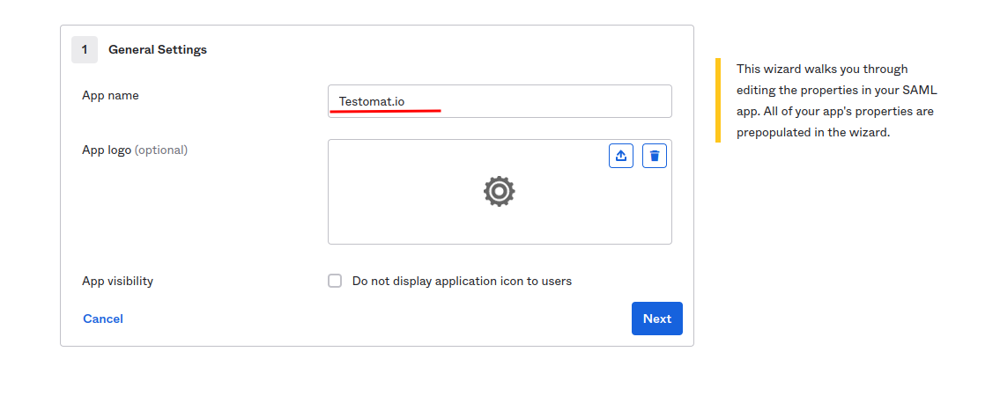

In the next step, you need to set values for **Single sign on URL**:

```
https://app.testomat.io/users/saml/auth
```

and **Audience URI (SP Entity ID)**:

```
https://app.testomat.io/users/saml/metadata
```

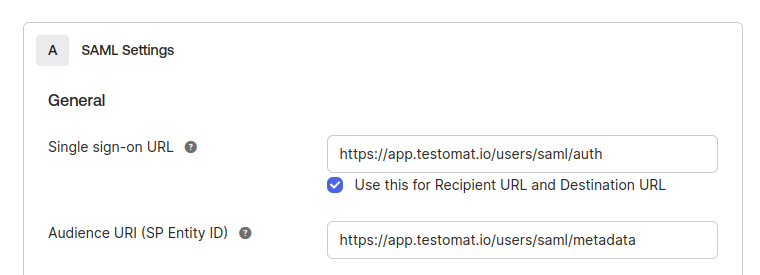

Specify the **Attribute Statements**:

* `email` should be set to `user.email`
* `name` should be set to `user.firstName + " " + user.lastName`

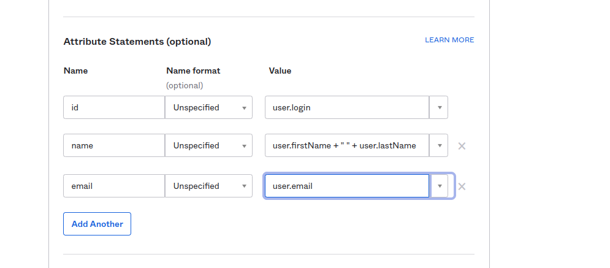

Click "Next" to proceed.

On the lastest step check **I'm an Okta customer adding an internal app**

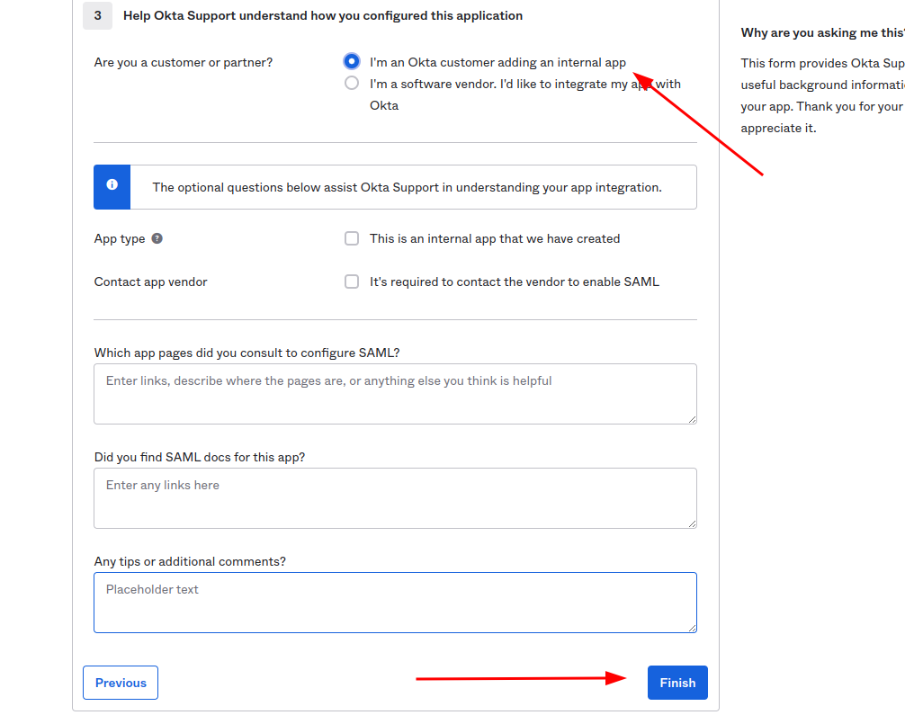

And finish the integration of application.

After interaction was saved click **View SAML setup instructions**

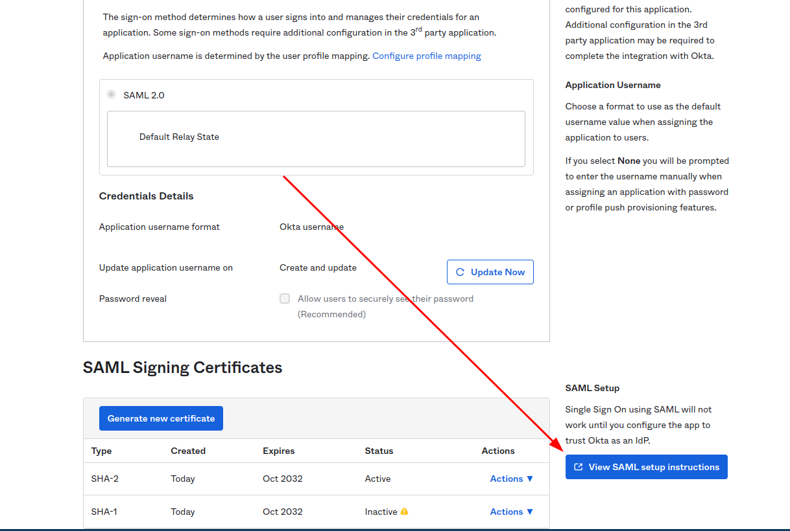

The following information is needed to proceed with integration.

* **Identity Provider Single Sign-On URL**
* **Identity Provider Issuer**
* **X.509 Certificate**

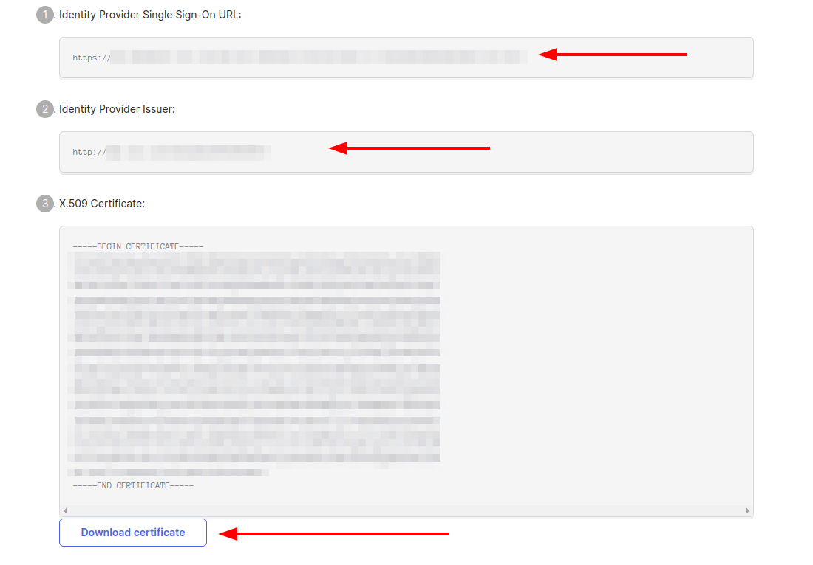

Assign users to this application so they could join Testomat.io:

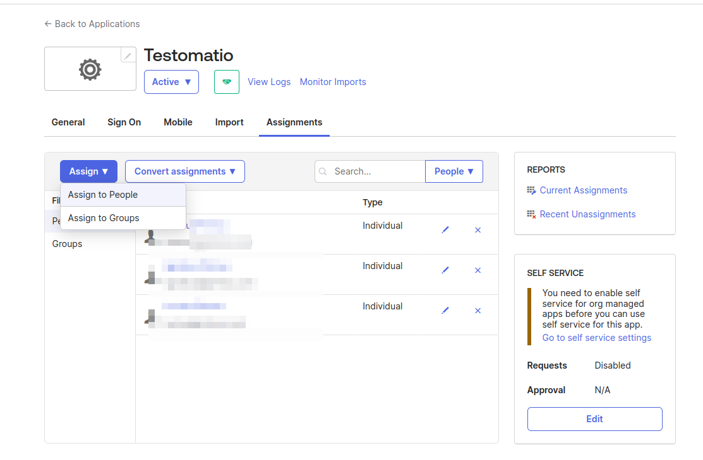


Now, open Company page in Testomat.io and select Single Sign On options

> If you don't see Single Sign On option, check that you are an owner of this company

Fill in the form:

1. **Company domain**. This is required to identify SSO connection by user's email. Example: `mycompany.com`.
2. **Default Projects**. Select projects to new users will be added to(optional).
3. Enable SAML:

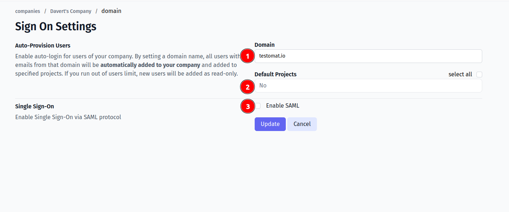

4. Set **Identity Provider Issuer** from Okta as **IdP Entity ID**
5. Set **Identity Provider Single Sign-On URL** from Okta as **Sign In URL**
6. Upload certificate.

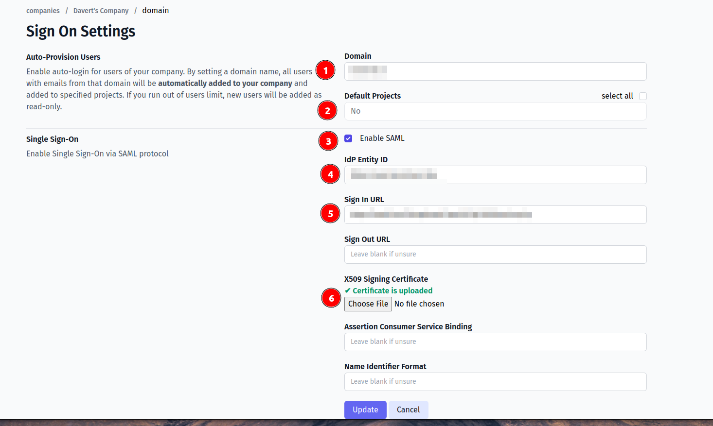

7. Set `Authn Context` by selecting "Password Protected Transport". The actual value should become:

```
urn:oasis:names:tc:SAML:2.0:ac:classes:PasswordProtectedTransport
```

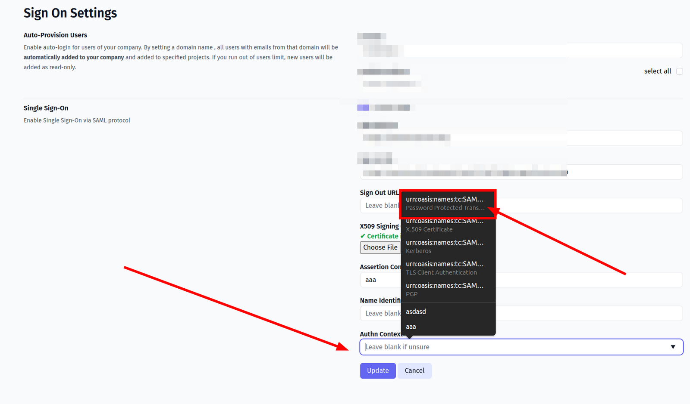

And save the form.

Now, use any assigned user from Okta to Log In into Testomat.io. Select "SSO" on the Sign In page, enter the email, and if everything is correct user will get inside Testomat.io, assigned to your company and added to default projects.

> In case user sees 404 page on Okta, check that Single Sign-On URL was correctly set.