## How to Create a Company

In Testomat.io, a Company is required to manage projects and enable subscriptions.

:::note

Each user can create only one Company as an owner. If you already own a Company, the **‘Create’** button will not be available.

:::

To create a Company in Testomat.io, follow these steps:

1. Open the **’Companies**’ tab
2. Click the **’Create’** button

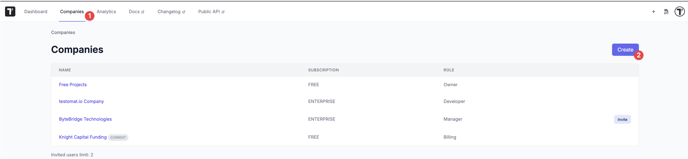

3. Enter the Company Name in the **’Title’** field
4. Click the **’Create’** button to finalize the process

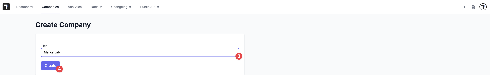

Once your Company is created, you can proceed with [Enabling a Subscription](https://docs.testomat.io/management/company/subscriptions/#how-to-enable-subscription).

## Company Settings

The **'Company Settings'** section allows owners to manage company-specific configurations, including updating the company name, adjusting sharing options, and utilize AI features. These settings ensure the proper access control and facilitate the sharing of specific data within the company. Below is an overview of the main functionalities:

### Update Company Name

:::note

Only users with **’Owner’** role have permission to update the company name. If you do not have the necessary access, please contact your company administrator. For more details on roles, you can find information here: [Roles within a company](https://docs.testomat.io/management/company/#roles-within-a-company)

:::

1. Click **'Companies'** in the header
2. Click the **'Settings'** button

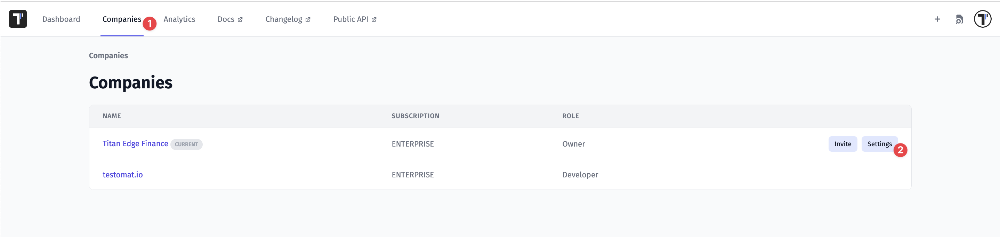

3. Update a company name in the **'Company Name'** text field
4. Click the **'Save'** button to apply updates

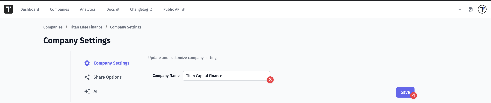

5. A confirmation message **'Company [Company Name] was successfully updated!'** is shown. The user is redirected back to the **'Companies'** page

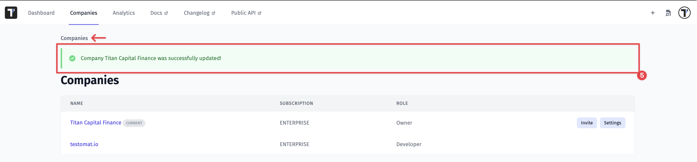

### Share Options

Allows control over company-wide permissions, enabling users to share specific reports and data.

:::note

Only available for paid plans, such as **’Enterprise’** or **’Professional’**. For more details on subscriptions, you can find information here: [Subscriptions](https://docs.testomat.io/management/company/subscriptions/)

:::

- **Living Documentation**

Enables company users to create and share living documentation without requiring a login.

1. Enable this feature at the company level

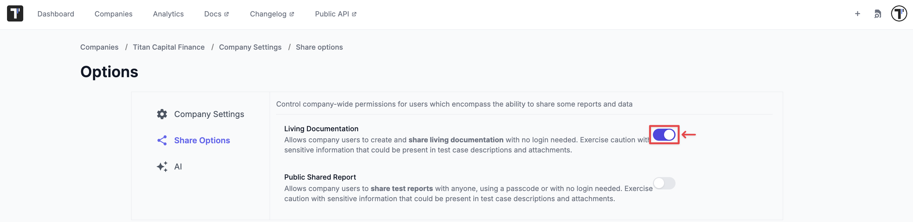

2. Navigate to the general **'Settings'** tab in the sidebar
3. Click the **'Project'** tab
4. Enable **'Share Living Docs'** in the **'Sharing'** section
5. The link appears under the **'Share Living Docs'** button

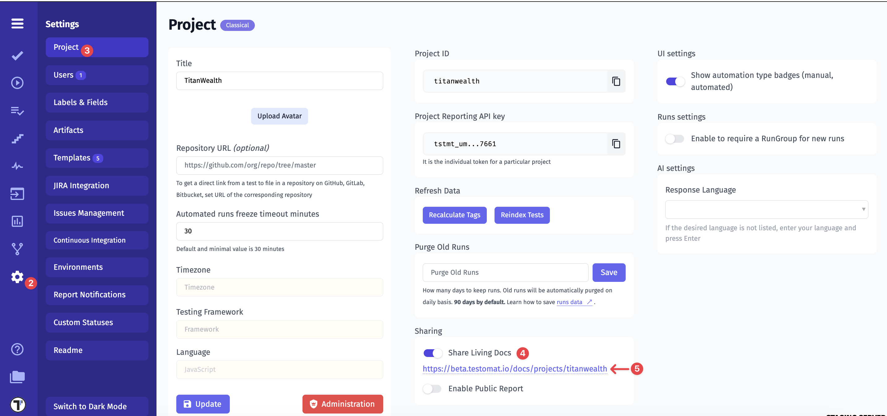

- **Public Shared Report**

Allows company users to share test reports with anyone, either using a passcode or without requiring a login.

1. Enable this feature at the Company level

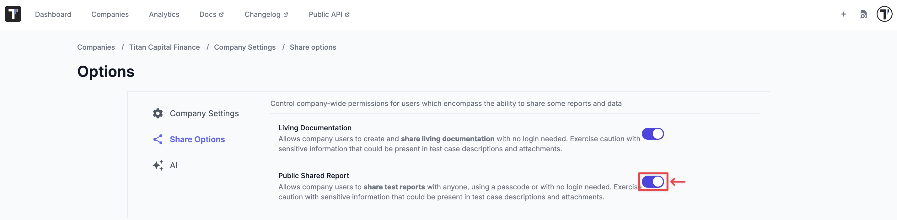

2. Navigate to the General **'Settings'** tab in the sidebar
3. Click the **'Project'** tab
4. **'Enable Public Report'** in the **'Sharing'** section

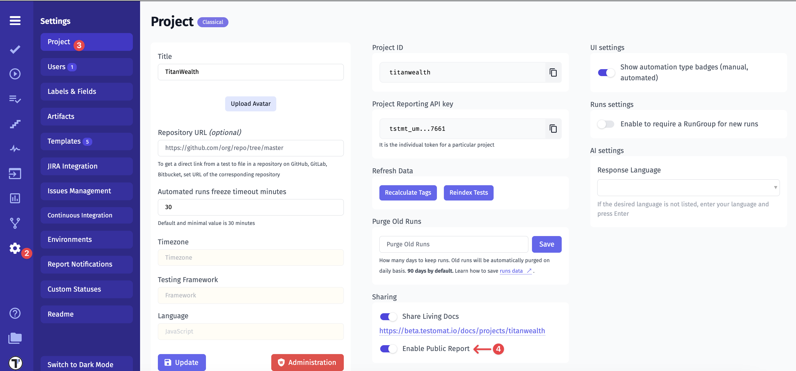

After activation, the **'Share Report Publicly'** option becomes available in the [Test Run Report](https://docs.testomat.io/getting-started/#test-run-report)

5. Click the **'Share Report Publicly'** button

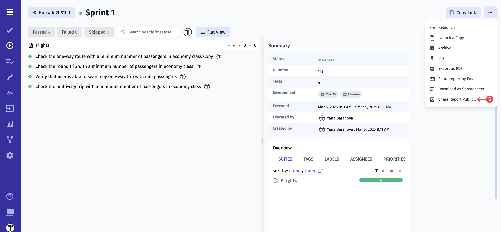

6. Select the **'Expiration Date'** from the date picker
7. Check the **'Protect by passcode'** checkbox, if you would like to increase protection
8. Click the **'Share'** button

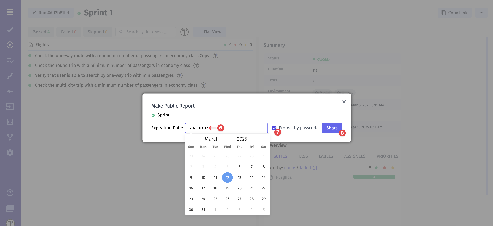

The report is now being shared. You have several options,

1. **'Open Link'** in a separated tab
2. **'Stop Sharing'** report
3. Or copy data manually, such as **'Link'**, or **'Passcode'**, or **'Expiration Date'**

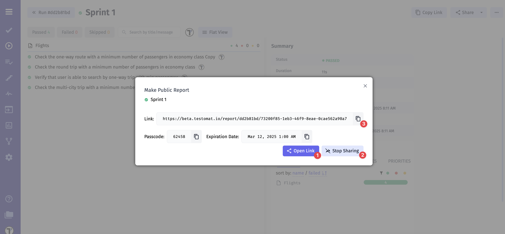

### AI

The AI Features section allows company members to utilize AI-powered capabilities for enhanced test management and data analysis. With AI enabled, teams can automate routine tasks, gain deeper insights, and improve overall efficiency.

Testomat.io offers two AI configuration options:

**Built-in AI Provider**

Testomat.io uses Groq as the main AI provider. Groq uses only open-source models like Llama or Mixtra. Your data is not used for AI model training. However, enable AI features only if you are sure that your data is not sensitive.

How to enable built-in AI?

1. Click **'Companies'** in the header
2. Click the **'Settings'** button
3. Click the **'AI'** option
4. Enable the **'AI Features'** option

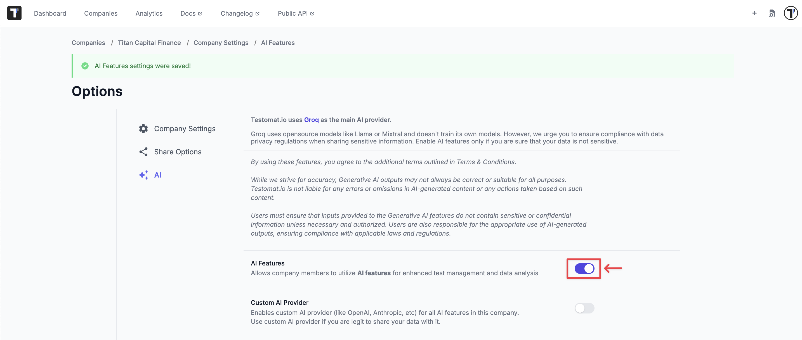

**Custom AI Provider**

If your company prefers using an AI provider that you trust, Testomat.io allows integration with third-party AI services such as OpenAI, Anthropic, and others. This option ensures flexibility, allowing you to choose an AI provider that aligns with your security and compliance requirements.

How to enable a custom AI provider?

1. Enable the **'Custom AI Provider'** option
2. Select a specific provider from the dropdown
3. Enter the **'API Key'**
4. Enter the **'Model'** name
5. Enter **'Max Tokens'**, if required by the provider
6. Click the **'Save Settings'** button

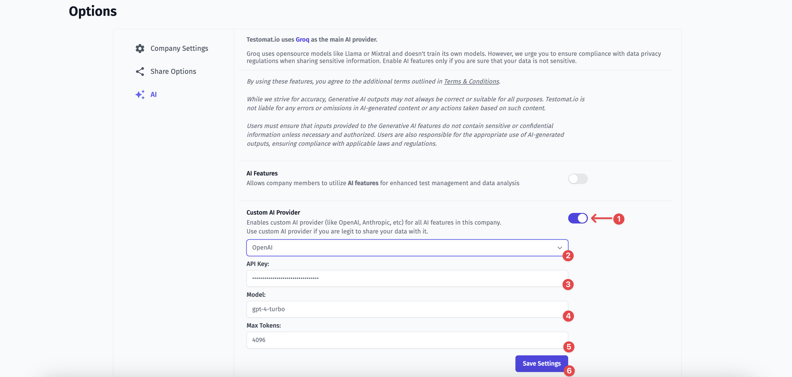

## Owner Access To Manage Team Projects

As a **Company Owner**, you have full oversight and control over all projects within your organization, even those that were created by other users without explicitly inviting you.

Whenever a new project is created by a team member and you are not involved, you will see a message on the **Dashboard**. This ensures that you stay informed and have the option to join and manage any new projects as needed.

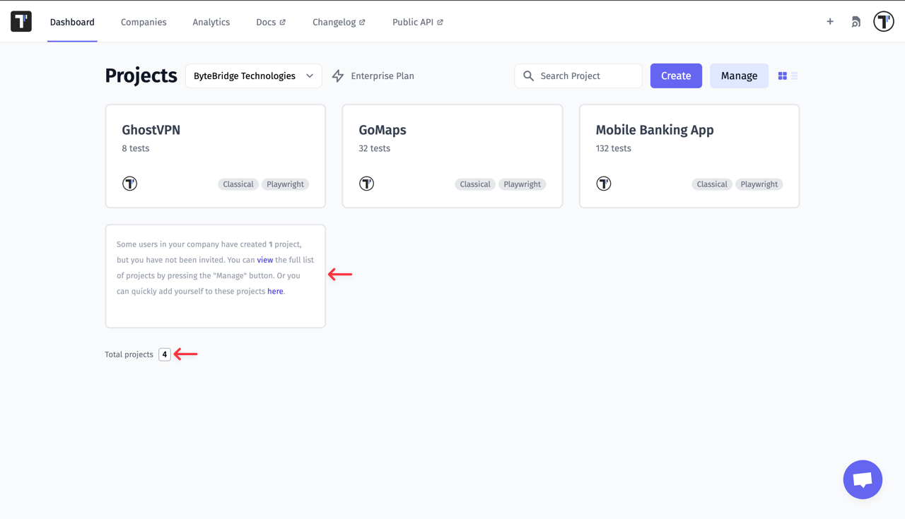

You have access to view a comprehensive list of all projects created by users within your company. To see the list of projects, click the `view` link in the message.

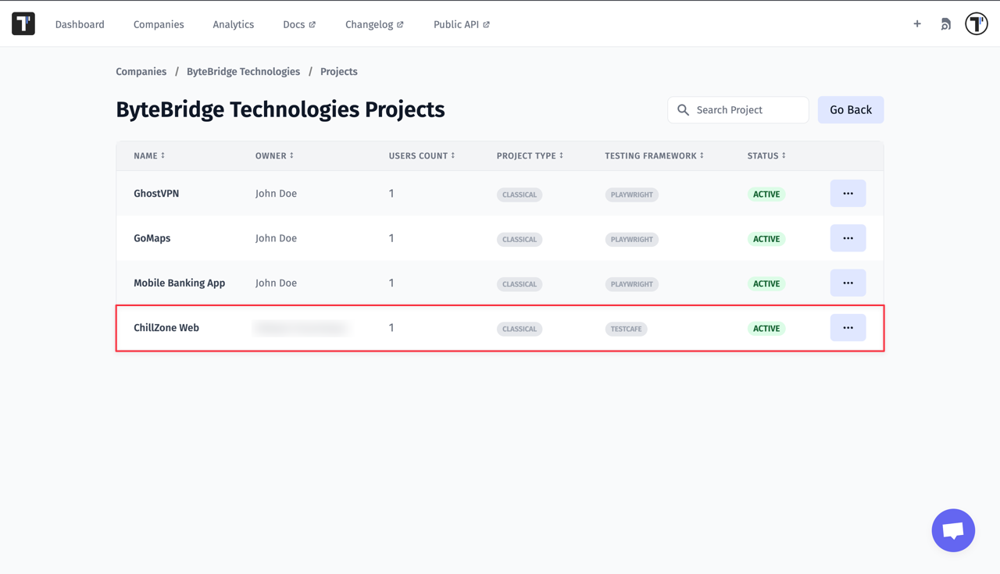

Lastly, you have the ability to manually add yourself to projects. To do it, click the `here` link in the message. Then find the project where you are absent and click the **Add to Project** button.

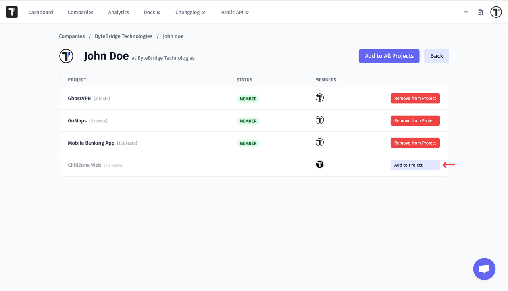

## Auto-Provision for Company Users

In Testomat.io, owners of a company under the **Enterprise plan** have access to the **auto-provisioning** feature, which allows them to set up auto-login for company users. This means users with your company domain will be automatically added to the projects of your choosing — either one or all of them.

### How to Access and Set Up Auto-Provision

1. **Log in** as the company owner.
2. Go to the **Companies** tab.
3. Select your company.
4. Click the drop-down menu (three dots next to the "Manage Subscription" button).
5. Select **Authentication**.
6. You will be navigated to the **Sign-On Settings** page, where you can set up **auto-provisioning**.

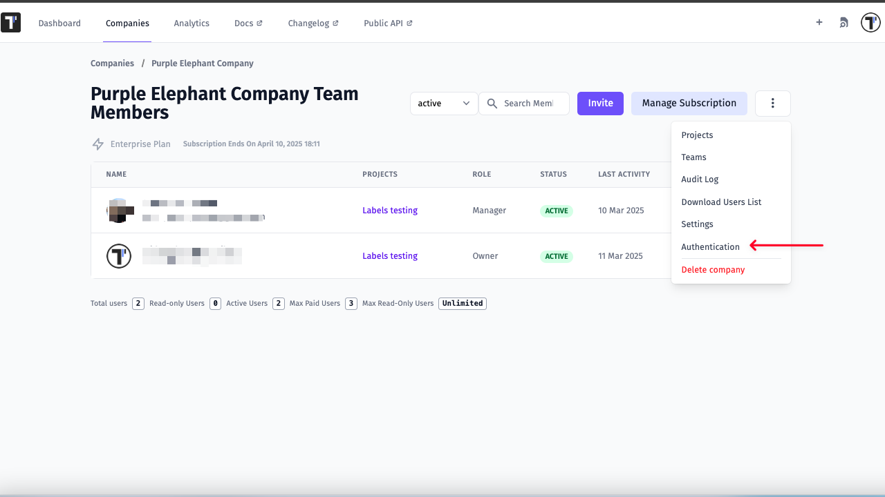

On the Sign On Settings page, you can enter a domain in the corresponding field and then either select a specific project from the dropdown menu or choose all projects by checking the "Select All" checkbox. This will automatically add all users with the specified domain to your company and the selected projects.

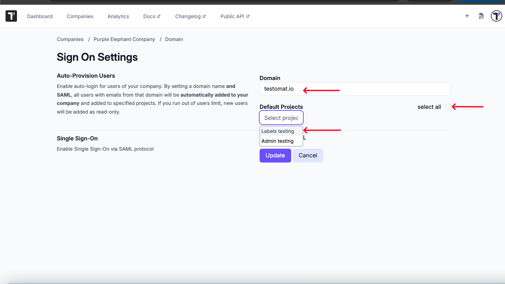

For more detailed instructions on how to set up auto-provisioning, check the official documentation:  
[Single Sign-On in Testomat.io](https://docs.testomat.io/integrations/single-sign-on/)

## Global Search

Testomat.io offers a Global Search functionality designed to help you quickly find tests or test suites, even as the number of projects, companies, and tests increases. This feature allows you to search across all companies and projects you have access to, making it easier to navigate and find what you're looking for.

Global Search is available from the Dashboard, Companies and Analytics tabs. You can search for tests using either keywords or tags, and the results will be displayed in a drop-down list for easy selection.

### How to Search

1. In the top right corner, click the **Global Search** icon to open the search window.
2. Enter a keyword or part of it (e.g. **module**) to search for tests or test suites.
3. Search using tags (e.g. **@manual**).

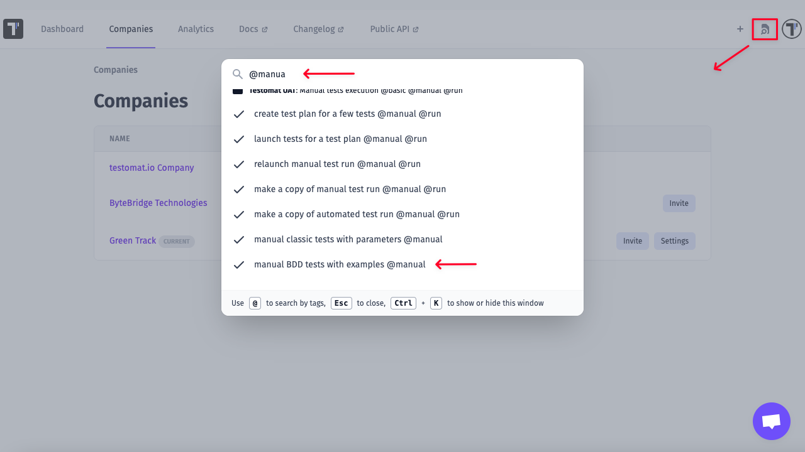

## Managing Projects on the Project Board

Company Owners and Managers can administer projects via the **Project board** in the **Company** section.

### To access the board:

1. Log in to your account.
2. Go to the **Companies** section.
3. Select your company.
4. Click the three dots (⋮) next to the **Manage Subscription** button.
5. Select **Projects**.
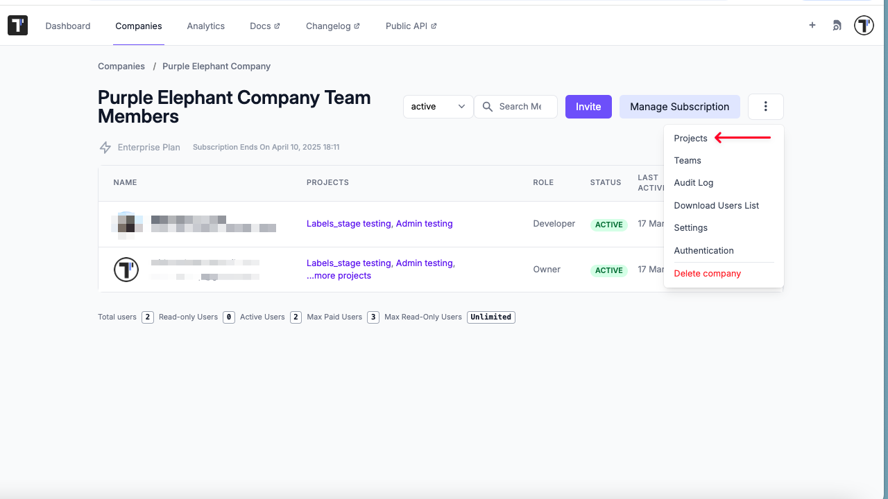

Once you’ve selected **Projects**, you’ll be directed to the Project board for your Company.

## Project Actions:
Next to each project in the list, you'll find a three-dot (⋮) menu. You can perform the following actions:

- **Edit**: Change the project’s name.
- **Change Owner**: Assign a new owner from the list.
- **Clone**: Duplicate the project along with all test data (excluding user access).
- **Archive/Unarchive**: Archive a project to prevent edits while retaining read-only access. Unarchive when needed.
- **Delete**: Permanently delete a project. **Note:** This action is irreversible.

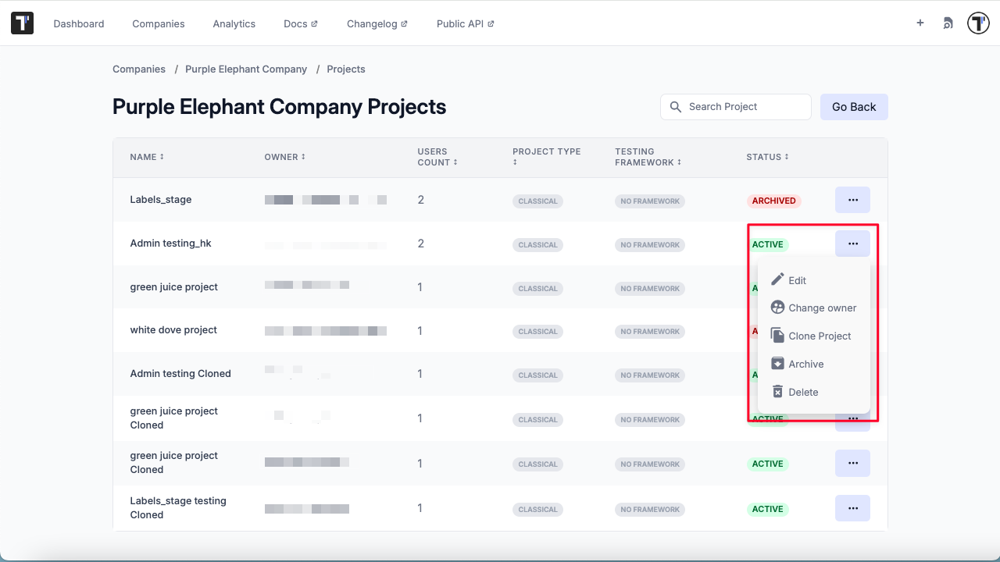

