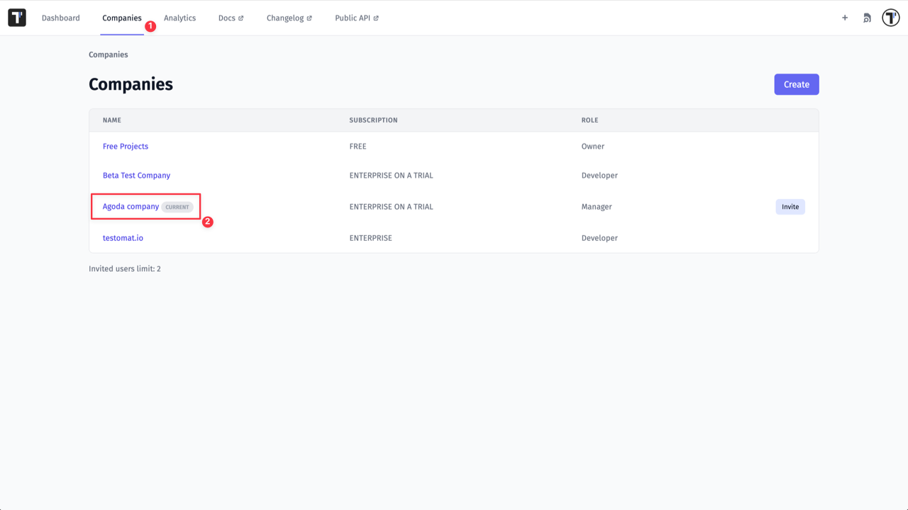
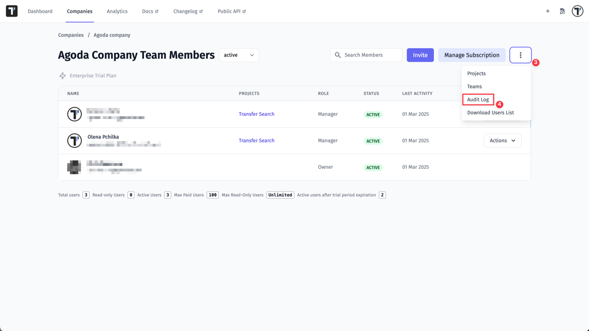
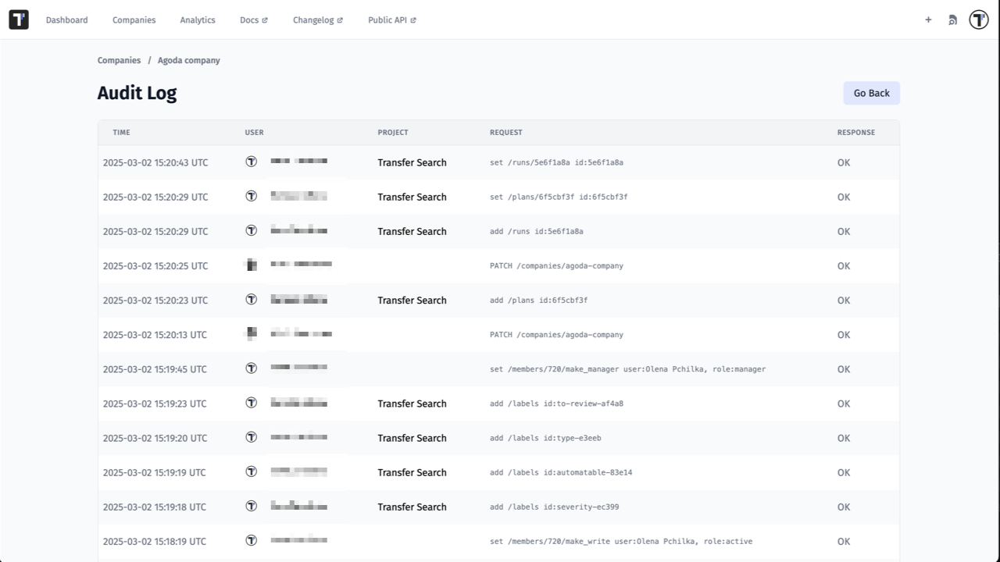

In Testomat.io, all your activities within the platform on Company level are recorded and can be tracked via **Audit Log** feature. 
Audit Log provides a detailed record of system actions, including the user who performed the action, the time and date at which it occurred (according to UTC timezone), where this action was done and what exactly was done.

Only users with the **Company Owner or Manager roles** can access Audit Log feature.

To access the Audit Log:

1. Click Companies
2. Select a Company that you want to review

3. Click Extra menu button
4. Click Audit Log

Audit Log page:

:::note

The **Audit Log** feature is available exclusively for Enterprise plans. 
Historical data is stored for **180 days**.

:::

In essence, Audit Logs provide a detailed, chronological record of activities, enabling organizations to monitor, analyze, and understand actions performed at the Company level, which is vital for security and compliance.