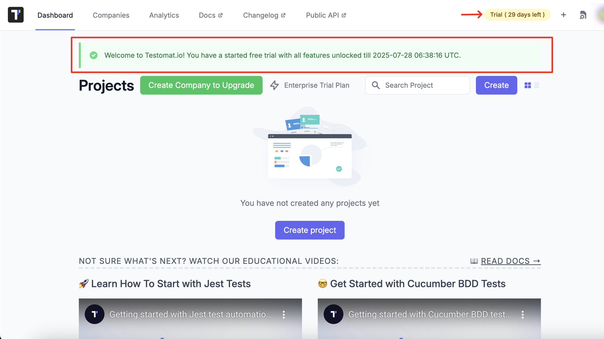
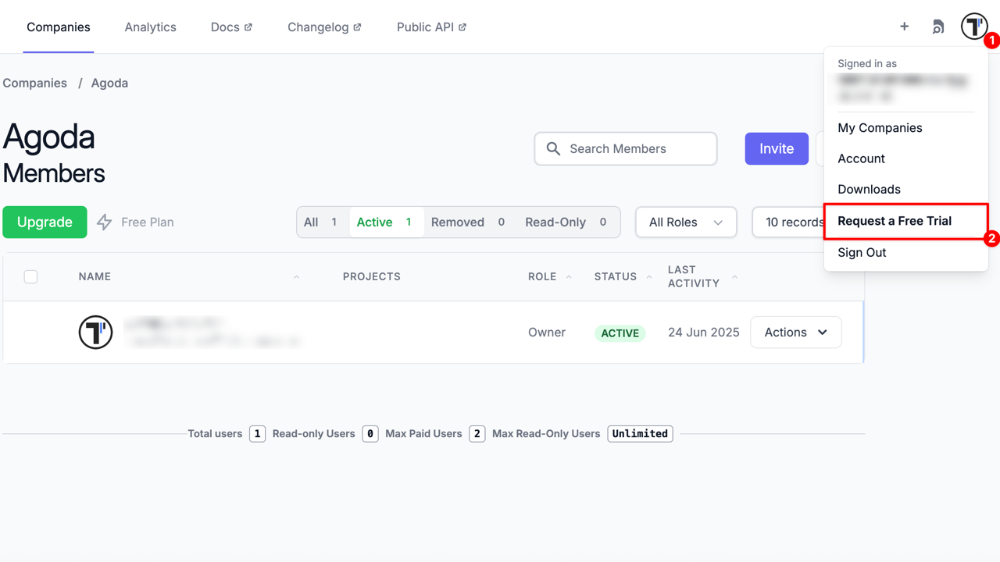
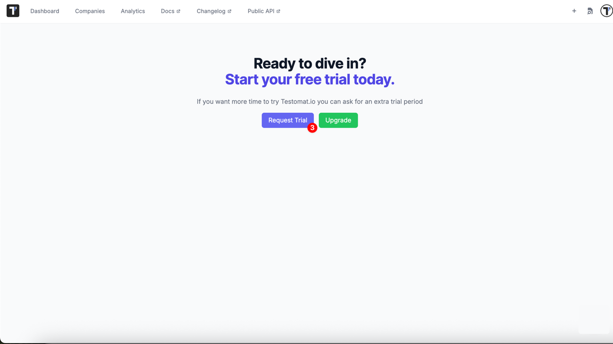

Your journey with Testomat.io begins with a **free 30-Day Trial** plan that gives you full access to the Enterprise feature set — no limitations, no credit card required. If you need more time to evaluate, you can activate a one-time **14-day Extra Trial** at any point after the initial trial ends. Let’s explore both options in detail.

## Free 30-Day Trial

All new users receive an automatic 30-day free trial. It provides full access to all Enterprise features, including:

- Unlimited users
- Unlimited projects
- Branches
- Bug trackers integration (Jira)
- Jira plugin (BDD, Classical tests)
- Notifications (MS Teams, Slack, Jira)
- Public reports for read-only access
- Living documentation
- Documentation management integration (Confluence)
- Rerun failed manual/automated tests
- Runs and Runs Groups Archive
- Attachment 100 Mb per attachment
- Unlimited Runs History

Enjoy the full power of Testomat.io without any limits — invite your whole team and explore every feature freely.

## Extended 14-Day Trial

Need more time to evaluate? We’ve got you covered. You can activate an additional **14-day trial** once per company — completely free.

- Available after the 30-day trial ends
- Cannot be paused once started
- Grants full Enterprise access again

### How To Activate

1. Click your avatar icon in the top-right corner of the screen
2. Select **'Request a Free Trial'** from the dropdown menu

3. Confirm your request by clicking the **'Request Trial'** button

Your extended trial will begin immediately — use this opportunity to explore advanced features, automate more tests, and collaborate effectively with your team.

## When the Trial Ends

Once your trial ends:

- Your company will be moved to the **Free Plan**
- Advanced features will be disabled
- All your data and projects will be safely retained

You can upgrade to the **Professional** or **Enterprise** plan anytime to regain access to premium features. For details, check our [**pricing plans**](https://testomat.io/pricing/).

## Need Help?

If you are a large company, have specific requirements, or if your evaluation requires more flexibility than the limits described above, feel free to contact us at **[contact@testomat.io](mailto:contact@testomat.io)**
