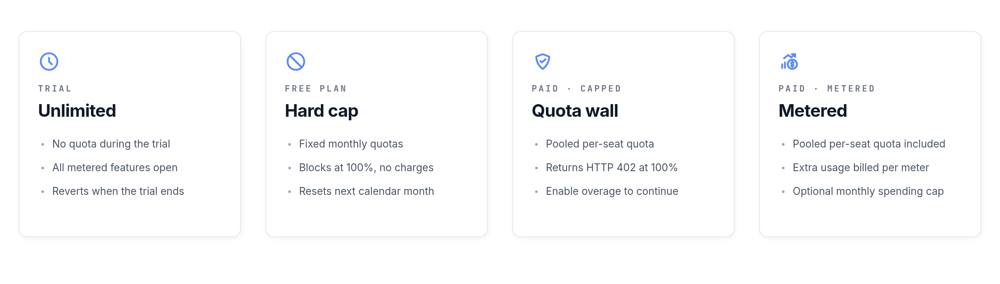

Usage-based billing adds metered limits on top of your per-seat subscription. Each billable user grants a monthly quota for three metrics — **test reports**, **API requests**, and **AI tokens**. When a quota is exhausted, the feature is blocked by default. You can opt in to overage billing so traffic continues and the extra usage is charged per unit. A monthly spending cap protects you from unexpected charges.

This page explains how quotas are calculated, what each metric counts, how to enable overage, and where to track your current usage.

## Usage across billing modes

How metered features behave depends on which billing mode your company is in. The four modes — Trial, Free plan, Paid with overage off, and Paid with overage on — apply the same quota model in different ways.



- **Trial — Unlimited.** During the Free Trial no quotas are enforced. Every metered feature works without limits until the trial ends.
- **Free plan — Hard cap.** The Free plan has fixed monthly quotas and **no** overage option. Once a quota is reached, that feature is blocked until the next calendar month or until you upgrade. You are never charged extra on the Free plan.
- **Paid, overage off — Quota wall.** On a paid subscription with overage disabled, you use a pooled per-seat quota each month. Below the quota everything works as normal. At 100%, billable requests return HTTP **402 Payment Required** until the next billing period or until you enable overage.
- **Paid, overage on — Metered.** Same pooled per-seat quota, but traffic continues past it. Each extra unit is reported daily to Stripe and billed per meter rate. An optional monthly spending cap acts as a hard ceiling on overage charges.

The rest of this page details the quota model, what each metric counts, and how to switch overage on or off.

## How quotas are calculated

Quotas are pooled across your company and recalculated on every request from your current billable seat count:

```
monthly quota = number of billable users × per-seat quota for the plan
```

Each plan defines its own per-seat quota for every metric. If you have 10 Professional seats and the Professional plan grants 5,000 test reports per seat, your company has a pool of 50,000 test reports for the month.

The period is the calendar month. This applies to both monthly and yearly subscriptions — yearly plans still receive a fresh quota on the first of each month.

:::note
Quotas are pooled, not per user. Any user on a billable seat draws from the same monthly pool.
:::

## What is metered

Three metrics are tracked against your monthly quota.

### Test reports

A test report is a single test result uploaded to Testomat.io. Reports come from the `@testomatio/reporter` package, JUnit XML imports, the API report ingestion endpoints, and load data endpoints. Every report counts as **1 unit**, regardless of status (passed, failed, skipped).

### API requests

API requests count writes and other billable operations against the Testomat.io API. Reads, UI traffic, and report ingestion do not count here — report ingestion is covered by the **test reports** metric.

Weighting depends on the API version:

- **API v2** (`/api/v2/...`) — counts **1 unit** per billable request.
- **Legacy API v1** (`/api/...`) with an `Authorization` header — counts **2 units** per billable request. The doubled rate is there to push integrations toward v2.
- **Legacy API v1** called with cookie authentication (UI traffic from the Testomat.io app) — **not billed**.

Only write-style operations are billable: `POST`, `PATCH`, `PUT`, and `DELETE` on resource endpoints such as tests, suites, runs, test runs, plans, labels, issues, attachments, and similar. Ordinary `GET` reads do not consume API requests. See [What counts as a billable API request](#what-counts-as-a-billable-api-request) below for the full list.

### AI tokens

AI tokens count language-model usage for built-in AI features — test generation, AI editing, conversational helpers. Each AI call is estimated before it runs and reconciled afterwards against the actual token count returned by the provider.

If your company uses a **custom LLM provider** (your own API key), AI calls go through your provider and are not metered by Testomat.io.

## Free plan limits

The Free plan is included in usage-based billing with fixed monthly quotas. The Free plan does **not** support overage billing — once a metric reaches its quota, the feature is blocked until the next calendar month or until you upgrade to a paid plan.

Free plan quotas are visible on the billing page for any company on the Free plan, and on the Upgrade page. Test reports inventory remains visible on Usage Statistics even after the quota is exhausted.

:::note
On the Free plan, hitting a quota does not charge you. It pauses the metered feature for the rest of the month.
:::

## How overage billing works

Overage billing is **off by default**. With overage off:

- Below the quota, everything works as normal.
- At 100% of the quota, the metered feature is blocked. Requests to that feature return HTTP **402 Payment Required** until the next billing period or until you turn on overage.

With overage on:

- Usage continues past the quota.
- Each unit over the quota is billed at the plan's overage rate (for example, $0.01 per 100 extra test reports, $0.01 per 1,000 extra API requests, $0.05 per 10,000 extra AI tokens).
- Overage is reported daily to Stripe and appears on your next invoice.

A single toggle covers all three metrics — you cannot opt in to overage for only one metric.

[Screenshot: the Usage & Billing page showing the overage toggle and per-metric usage cards]

## How to enable overage billing

Overage requires a paid Stripe subscription. Only company managers and billing users can change the setting.

1. Navigate to the **Companies** tab and open your company.
2. Go to **Settings → Billing**.
3. Review the per-metric usage cards and the indicative overage rates.
4. Toggle **Allow overage billing** on.
5. Confirm the consent prompt. The user, IP, and timestamp are recorded in your audit log.

[Screenshot: the Allow overage billing toggle and consent confirmation modal]

To turn overage off, repeat the steps and toggle it back. The change takes effect immediately — usage at or above the quota will be blocked again from that point on.

## How to set a monthly spending cap

The spending cap puts a hard ceiling on overage charges per calendar month. When the projected overage cost reaches the cap, all metered features are blocked for the rest of the month — even with overage on.

1. Open the **Billing** page for your company.
2. Enter an amount, in US dollars, in the **Monthly spending cap** field.
3. Click **Save**.

Leave the field empty to disable the cap. With no cap set, overage runs at the plan rates without an upper limit.

:::note
The spending cap applies to overage only. Your base subscription seats are billed separately and are not affected by the cap.
:::

## How to view current usage

The **Billing** page shows live usage for every metric:

- **Used** — total usage so far this month, including today.
- **Quota** — the pooled monthly quota at the current seat count.
- **Remaining** — quota minus used.
- **Projected overage** — for paid plans with overage on, the estimated charge based on current usage trends.

Per-project usage and a "by user" breakdown for API and AI activity are available on the company's **Usage Statistics** page. Test reports, runs, and seat counts are tracked at the company level and are not split per user.

You can also query the current state programmatically from any project:

```bash
GET /api/{project_slug}/quota
```

The response returns quota, used, and remaining for each metric, along with the company-level overage toggle and spending cap.

## Notifications

Testomat.io sends email notifications to company managers and billing users at key thresholds. Each notification is sent at most once per company per metric per month.

- **Quota warning** — at 80% and at 100% of the monthly quota.
- **Quota exceeded** — at 100% when overage is off, so traffic on that metric is now blocked.
- **Overage started** — at 100% when overage is on, so the next unit of usage will be billed.
- **Spending cap reached** — when overage charges reach the configured cap and all metered features are blocked for the rest of the month.

## What counts as a billable API request

The following routes consume the **API requests** metric. Every entry in the **API v2** table costs 1 unit per call. Entries in the **Legacy API v1** table cost 2 units per call when called with an `Authorization` header, and 0 units when called with UI cookie authentication.

### API v2 (1 unit per call)

| Route | Billable methods |
|-------|------------------|
| `/api/v2/{project_id}/tests`, `/api/v2/{project_id}/tests/{id}` | `POST`, `PATCH`, `PUT`, `DELETE` |
| `/api/v2/{project_id}/suites`, `/api/v2/{project_id}/suites/{id}` | `POST`, `PATCH`, `PUT`, `DELETE` |
| `/api/v2/{project_id}/plans`, `/api/v2/{project_id}/plans/{id}` | `POST`, `PATCH`, `PUT`, `DELETE` |
| `/api/v2/{project_id}/runs`, `/api/v2/{project_id}/runs/{id}` | `POST`, `PATCH`, `PUT`, `DELETE` |
| `/api/v2/{project_id}/testruns`, `/api/v2/{project_id}/testruns/{id}` | `POST`, `PATCH`, `PUT`, `DELETE` |
| `/api/v2/{project_id}/rungroups`, `/api/v2/{project_id}/rungroups/{id}` | `POST`, `PATCH`, `PUT`, `DELETE` |
| `/api/v2/{project_id}/steps`, `/api/v2/{project_id}/steps/{id}` | `POST`, `PATCH`, `PUT`, `DELETE` |
| `/api/v2/{project_id}/snippets`, `/api/v2/{project_id}/snippets/{id}` | `POST`, `PATCH`, `PUT`, `DELETE` |
| `/api/v2/{project_id}/labels`, `/api/v2/{project_id}/labels/{id}` | `POST`, `PATCH`, `PUT`, `DELETE` |
| `/api/v2/{project_id}/issues`, `/api/v2/{project_id}/issues/{id}` | `POST`, `DELETE` |
| `/api/v2/{project_id}/requirements`, `/api/v2/{project_id}/requirements/{id}` | `POST`, `PATCH`, `PUT`, `DELETE` |

### Legacy API v1 (2 units per call with `Authorization` header)

| Route | Billable methods |
|-------|------------------|
| `/api/projects/{id}` | `PATCH`, `PUT`, `DELETE` |
| `/api/{project_id}/avatar`, `/api/{project_id}/artifacts` | `POST` |
| `/api/{project_id}/tests`, `/api/{project_id}/tests/{id}`, `/api/{project_id}/tests/delete_detached`, `/api/{project_id}/tests/{test_id}/copy` | `POST`, `PATCH`, `PUT`, `DELETE` |
| `/api/{project_id}/suites`, `/api/{project_id}/suites/{id}`, `/api/{project_id}/suites/delete_empty`, `/api/{project_id}/suites/{suite_id}/copy`, `/api/{project_id}/suites/{suite_id}/markdown` | `POST`, `PATCH`, `PUT`, `DELETE` |
| `/api/{project_id}/branches`, `/api/{project_id}/branches/{id}`, `/api/{project_id}/branches/destroy_merged`, `/api/{project_id}/branches/{branch_id}/destroy_item`, `/api/{project_id}/branches/{branch_id}/revert` | `POST`, `PATCH`, `PUT`, `DELETE` |
| `/api/{project_id}/templates`, `/api/{project_id}/templates/{id}` | `POST`, `PATCH`, `PUT`, `DELETE` |
| `/api/{project_id}/diagrams`, `/api/{project_id}/diagrams/{id}` | `POST`, `PATCH`, `PUT`, `DELETE` |
| `/api/{project_id}/plans`, `/api/{project_id}/plans/{id}` | `POST`, `PATCH`, `PUT`, `DELETE` |
| `/api/{project_id}/rungroups`, `/api/{project_id}/rungroups/{id}`, `/api/{project_id}/rungroups/delete_multiple` | `POST`, `PATCH`, `PUT`, `DELETE` |
| `/api/{project_id}/testruns`, `/api/{project_id}/testruns/{id}` | `POST`, `PATCH`, `PUT`, `DELETE` |
| `/api/{project_id}/steps`, `/api/{project_id}/steps/{id}`, `/api/{project_id}/steps/delete_multiple`, `/api/{project_id}/steps/merge` | `POST`, `PATCH`, `PUT`, `DELETE` |
| `/api/{project_id}/runs`, `/api/{project_id}/runs/{id}`, `/api/{project_id}/runs/delete_multiple`, `/api/{project_id}/runs/merge`, `/api/{project_id}/runs/{run_id}/relaunch`, `/api/{project_id}/runs/{run_id}/relaunch_copy`, `/api/{project_id}/runs/{run_id}/email`, `/api/{project_id}/runs/{run_id}/plan` | `POST`, `PATCH`, `PUT`, `DELETE` |
| `/api/{project_id}/labels`, `/api/{project_id}/labels/{id}`, `/api/{project_id}/labels/{label_id}/link` | `POST`, `DELETE` |
| `/api/{project_id}/attachments`, `/api/{project_id}/attachments/{id}` | `POST`, `DELETE` |
| `/api/{project_id}/tests/{test_id}/attachment`, `/api/{project_id}/testruns/{testrun_id}/attachment` | `POST`, `DELETE` |
| `/api/{project_id}/settings` | `PATCH`, `PUT` |
| `/api/{project_id}/sharings` | `POST` |
| `/api/{project_id}/pdf_export` | `GET` |
| `/api/{project_id}/prompts`, `/api/{project_id}/prompts/{id}` | `POST`, `PATCH`, `PUT` |
| `/api/{project_id}/analytics/query_settings` | `POST` |
| `/api/{project_id}/jira/projects`, `/api/{project_id}/jira/projects/{jiraproject_id}`, `/api/{project_id}/jira/projects/connect` | `POST`, `PATCH`, `PUT`, `DELETE` |
| `/api/{project_id}/ims/config` | `POST`, `DELETE` |

The following requests are **not** billed against API requests:

- `GET /api/{project_id}/quota` and any read that is not in the tables above.
- Any legacy API v1 request made with UI cookie authentication.
- Report ingestion routes (`/api/reporter/*`, `/api/load`, `/api/test_data`, `/api/test_grep`). These count against **test reports** instead.

<Aside type="caution" title="402 Payment Required">
When a quota is reached and overage is off, billable API and report endpoints return HTTP **402 Payment Required**. Make sure CI pipelines and scheduled jobs handle this response — for example, fail the build with a clear message rather than retrying in a loop.
</Aside>

## Exceptions and edge cases

A few situations bypass the standard quota rules.

- **Free Trial** — usage during a Free Trial is not enforced. Trial accounts can use metered features without quota limits while the trial is active.
- **Enterprise (custom) subscriptions** — quotas can be set high for blocking purposes, but overage is never billed.
- **Self-hosted (On-Premise) installations** — usage-based billing does not apply. Enforcement and reporting are disabled on self-hosted instances.
- **Custom LLM provider** — when your company is configured with its own AI provider, AI tokens are not metered or billed by Testomat.io.
- **Tests inventory** — your `tests` count remains visible on Usage Statistics, but tests are not metered or quota-enforced.
- **Mid-period seat changes** — when you add or remove seats during a month, the monthly quota is recalculated immediately from the new seat count.
- **Plan changes** — when you switch plans mid-period, remaining quota is preserved and the new per-seat rate takes effect at the start of the next billing period.

## What's Next?

- [Subscriptions](./subscriptions.md)
- [Plan Features Comparison](./plan-features-comparison.md)
- [Audit Log](./audit-log.md)
