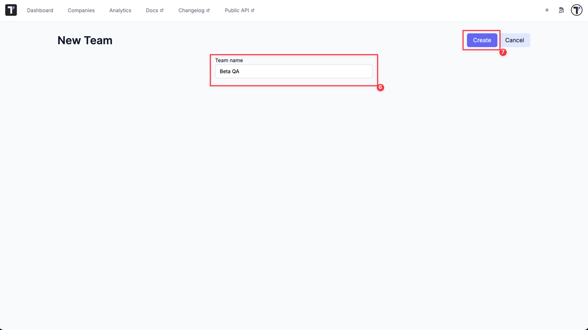
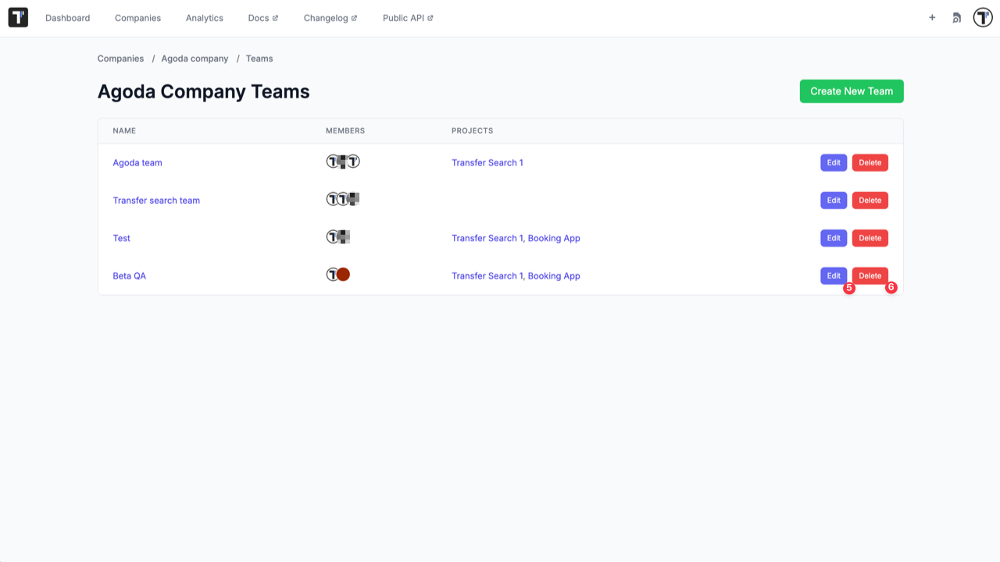

## Teams

You need to manage project access for some user groups. With this feature, you can import all users of one project into another. Namely, you can group users into different **teams** to add them to different projects.

### How To Create a Team

To create a Team you need:

1. Go to the 'Companies' page.
2. Open your Company.

3. Click 'Extra menu' button.
4. Select 'Teams' option from the list.

5. Click 'Create New Team' button.

6. Enter Team name.
7. Click 'Create' button.

Team is created and now you need to add Projects and Users to your new team.

### How To Assign a Team To a Project

To add Projects:

1. Click 'Add Project' button.

2. Select projects from the list.
3. Click 'Add Project' button.

To add Users:

1. Click 'Add User' button.

2. Select users from the list.
3. Click 'Add User' button.

You can also edit your Team, add/remove user or assign the Team to another project by editing it at any time later.

Namely, you can:

1. Delete a team from a project by removing a project from the Team.
2. Delete a user from the Team.
3. Assign the Team to a project by adding a project to the Team.
4. Add a new member to the Team.

5. Edit the Team name.
6. Delete the Team.

