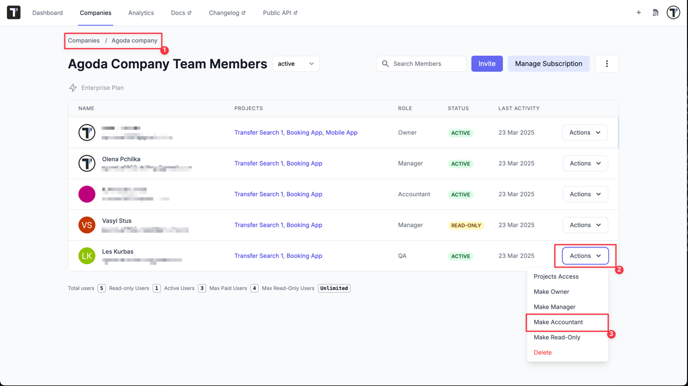

## Accountant User

The Accountant user in a system is a role assigned to a user responsible for managing financial records, tracking expenses, and overseeing payments. They are typically the primary point of contact for any billing-related inquiries or issues.

**Common Permissions for Accountant User:**

1. **View Invoices & Transactions** – Access to all past and current invoices, receipts, and payment history.
2. **Manage Billing Information** – Update company billing details, tax information, and payment methods.
3. **Download Financial Reports** – Export financial summaries, statements, or transaction reports.
4. **Monitor Subscription Plans** – Review and track active subscriptions or service plans.
5. **Limited Payment Permissions** – In some systems, accountants can process payments; in others, they can only review them.

**Restricted Permissions for Accountant User:**

1. No access to system administration settings.
2. No ability to modify user roles or permissions.
3. Limited or no access to operational features beyond financial management.

:::note

To change Accountant User role to **Read-Only**, simply select **Make Manager** or **Make QA**.  
This is free and allows them to view projects under the selected role without editing rights.
Please note, that Accountant User can only work with payments and is not considered to view projects data.
:::

### How to Add an Accountant User to a Company

Our system allows the addition of Accountant users for free, it means that multiple individuals or entities can be designated as Accountant users without incurring any additional charges specifically for that role. This can be advantageous for businesses or organizations that require multiple people to manage the billing and financial aspects of their accounts.

There are 2 ways to add a Accountant user:

1. You can invite the Accountant user to your company.

2. You can make existing company user Accountant.

