import DirectoryLinks from "/src/components/DirectoryLinks.astro";

<DirectoryLinks directory="management/company/users-and-permissions" />

Managing users and permissions in Testomat.io is essential for effective team collaboration and project organization. Everything starts at the Company level — this is where you create your team space, invite users, and assign roles.

Before you begin managing users and their permissions, make sure your company is created. If you haven’t created a company yet, follow this guide to get started: [How to Create a Company](https://docs.testomat.io/management/company/administration/#how-to-create-a-company)

:::note

Each user can only own one company to ensure project separation and clear access control.

:::

On the Companies page, you have a list of companies you participate in with mentioning your role in them.

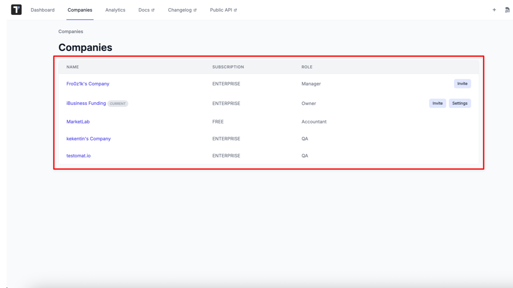

Once your company is ready, you can:

- Invite users and assign roles (Owner, Manager, QA, Accountant, or Read-Only)
- Add users to specific projects within the company
- Manage user permissions and roles at the company and project levels
- Organize users into teams for easier access control
- Use bulk management options for large teams

Use this section to learn how to effectively manage your users and ensure your team has the right access to get the job done.

## Users Roles Overview

Testomat.io provides different roles within projects and companies to make your testing process more convenient.
Different team members have different access levels to management options.

### Roles Within a Company

- **Owner** is a team member who created a company, can purchase a subscription, invite/delete members to a company and a project, change other team members' roles inside the company, create projects, and has access to all features within the project.
- **Manager** is a team member who can purchase a subscription, create projects, invite members to a company and a project, can change other team members' roles inside the company, except the owner role, and has access to all features within the project.
- **QA** is a team member who can create projects and has access to all features within the project.
- **Accountant** is a team member who can only update subscriptions and it is free of charge.
- **Read-only** is a team member who has permissions for viewing or reading information, but can't make any changes. It is free of charge and available in Professional and Enterprise plans.

### Roles Within a Project

- **Owner** is a team member who created a project, can invite/delete members and Support user to a project, change other team members' roles inside the project, and has access to all features within the project.
- **Manager** is a team member who has almost the same rights as the project owner: can invite/delete members and Support user to a project, has access to all features within the project but can't change other team members' roles inside the project.
- **Regular User** is a team member who has access to all project features but limited access to project settings, can't invite or delete members and Support user to a project, nor change their roles within the project.
- **Read-only** is a team member who has permissions for viewing or reading information, but can't make any changes. All team members with a read-only role at the company level automatically have a read-only role at the project level, and this role can only be changed to a non-read-only role at the company level.

:::note

The role within the **Company** does not always match the role within the **Project**. For example, user with the owner role at the Company level may be added to the Project within the Company as the regular user or read-only.
As well, the same user within a Company may have different roles on different projects.

:::

## How to Invite a User to a Company

Follow these steps to invite users to your company:

1. Go to the **Companies** page
2. Click the **Invite** button next to the company you want to invite users to

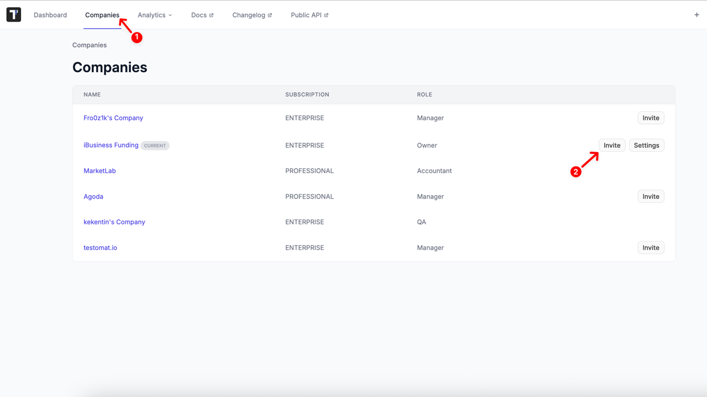

Once the **Invite Users** page opens

3. Enter the user's email. To invite multiple users, separate addresses with commas
4. Select a specific role:

- **QA** (Paid, project-level seat. Plans, designs, executes, and reports tests; creates and manages projects; files bugs, verifies fixes, and uses every feature needed for quality-assurance work within the project.)
- **Manager** (Paid, project-level seat. Includes all QA capabilities plus the ability to invite teammates to projects and purchase or modify project subscriptions.)

:::note

Manager can only be invited one at a time. If multiple emails are entered, the **Manager** role option will be disabled.

:::

- **Accountant** (Free seat. Make payments, views invoices, payment methods and updates billing or tax information; no access to any project content or settings.)
- **Read-only** (Free seat. Available on paid pricing plans. Views test cases, runs, and reports across projects but cannot edit or create anything.)

:::note

Users invited with **Read-only** access are assigned the QA role by default, but their permissions remain limited to read-only. They do not have full QA rights and cannot edit or create content.

:::

5. Click **Invite** button

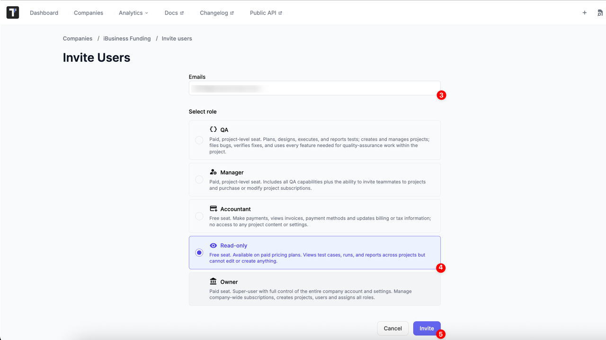

---

- You will be redirected to the Company page
- A confirmation message will appear to confirm that users have been successfully added
- If the paid seat limit is reached, only eligible users will be added
- If an invited email is invalid (wrong format or already exists), an orange warning message will appear
- After users are added to the Company, you can assign them to Projects

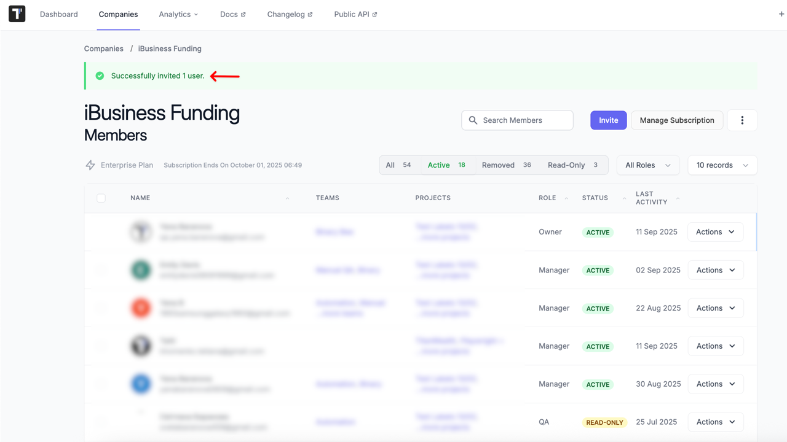

## How to Add a User to a Project

There are two ways to add a user to a Project: from the **Company Settings** or directly from the **Project Settings**.

### How to Add a User to a Project from the Company Settings

1. Go to the ‘Companies’ page.
2. Select Company.

3. Click on ‘Actions’ button and pick ‘Projects Access’ option or click on member’s name.

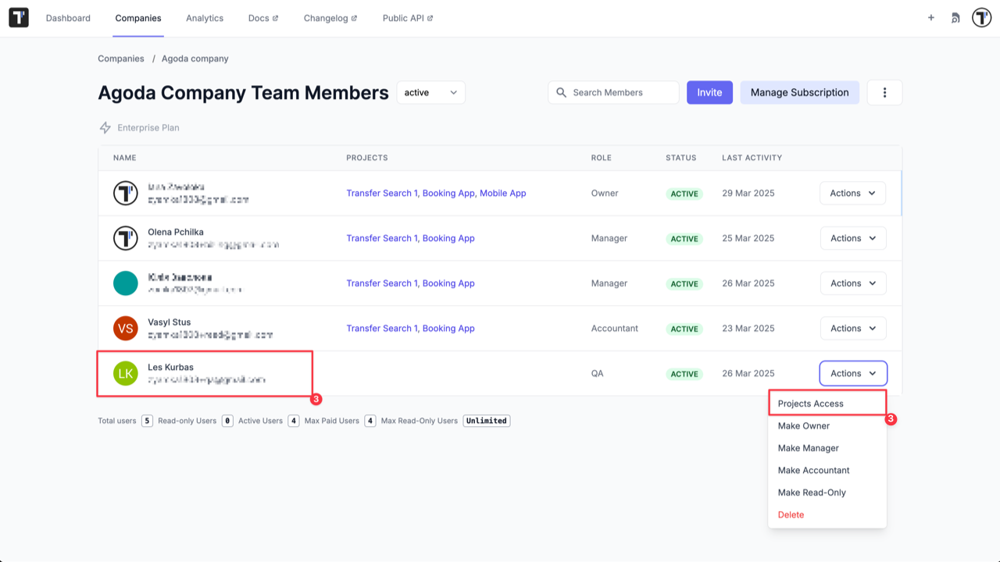

4. Choose the project via ‘Add to Project’ button or add to all projects with one click via ‘Add to All Projects’ button.

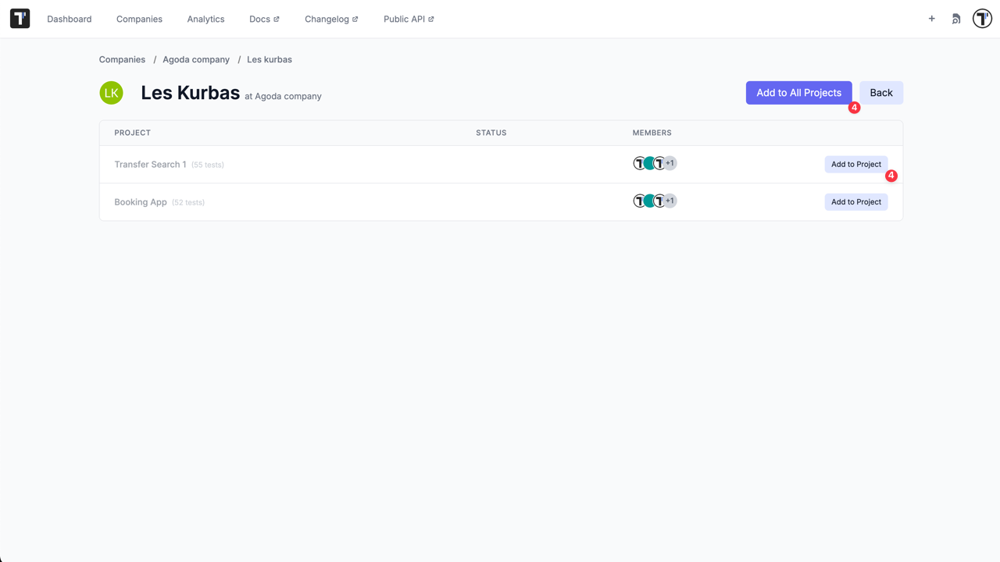

5. See that a member was successfully added to projects and click ‘Back’ button.

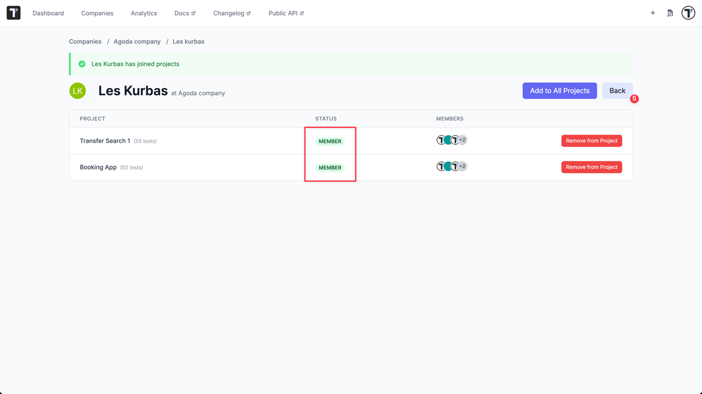

6. See that projects appeared in added member’s line.

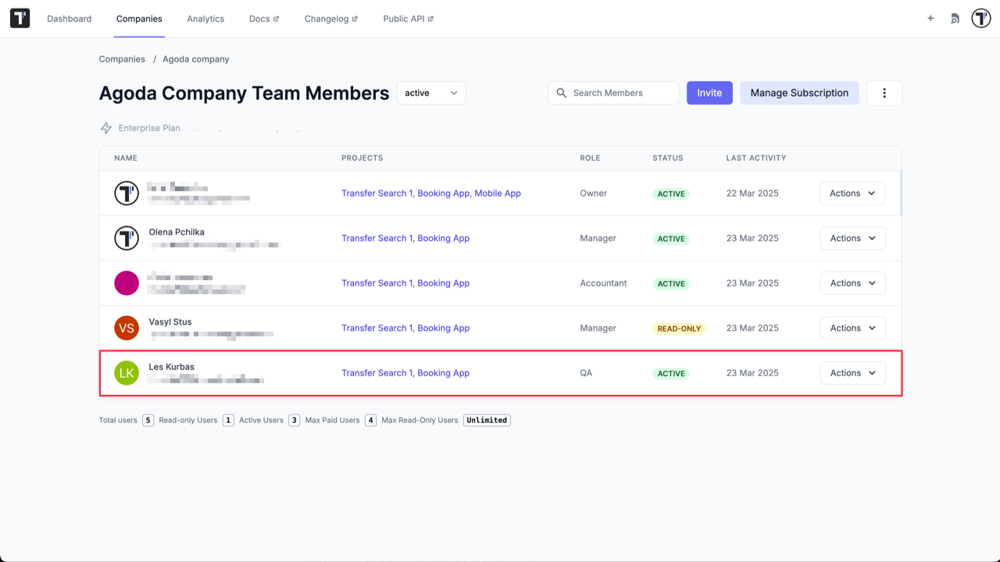

### How to Add a User to a Project from the Project Settings

1. Go to the ‘Dashboard’ page.
2. Select Company and Project.

3. Go to Settings-> Users.
4. Click ‘Invite’ button.

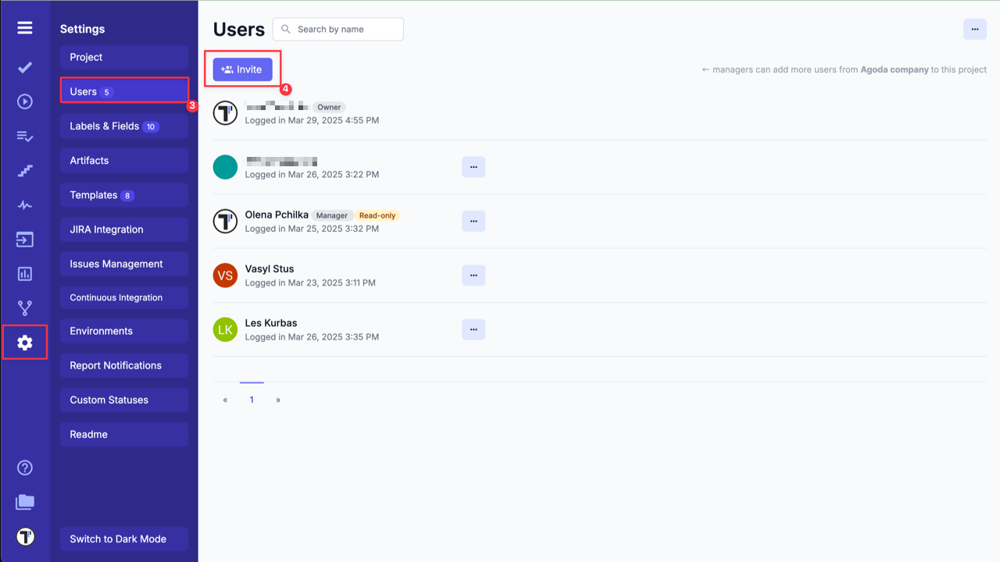

5. Choose a User from the dropdown list.
6. Click ‘Send’ button.

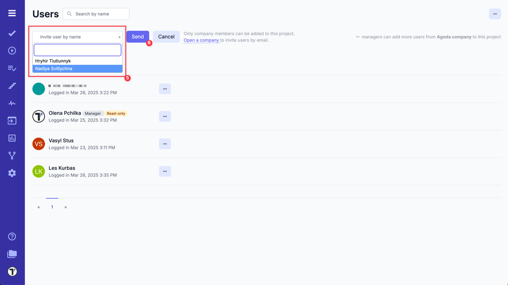

7. Invitation has been sent.

:::note

Only company members can be added to the Project via Project Settings.

:::

## How to Manage Team Members on Company Level

All invited members have a **QA** role by default. You can change the member's role on the Company Team Members page ('Companies' page -> Select Company -> 'Actions' button).

You can delete a team member by clicking on the 'Delete' button.

With this action deleted team members will be moved to the **Removed** section.

So you can reactivate them at any time with previous role by clicking on the 'Reactivate' button or with Read-Only permissions by clicking on the 'Make Read-Only' button

### How to Change Company Owner

In Testomat.io, a company can only have one Owner. There are two ways to transfer ownership:

- Transfer by the Current Owner **(recommended)**

Only the current Owner can assign ownership to another user:

1. Go to **Companies** page
2. Select the company
3. Open the **Actions** dropdown
4. Select **Make Owner** option
5. Confirm the action

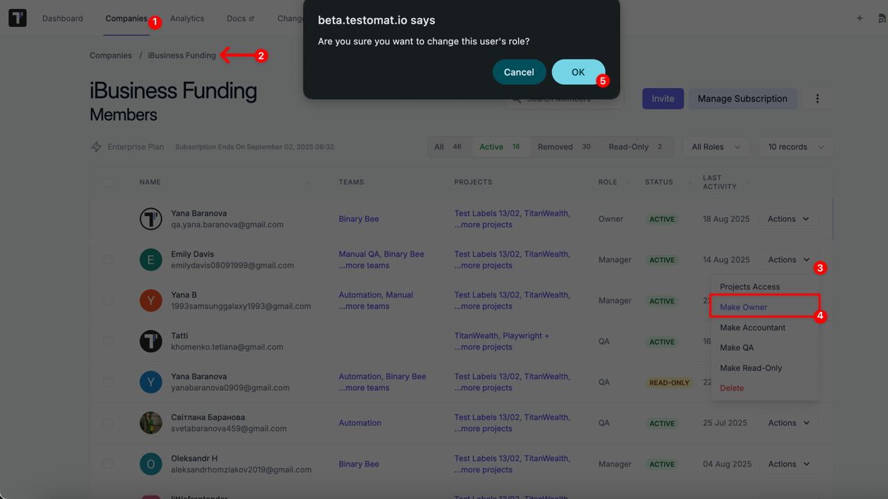

- Transfer via Support (if the Owner is **unavailable**)

If the current Owner cannot access the account (e.g. has left the company, email disabled, etc.):

- A user with the Manager role must send a request to [support@testomat.io](https://docs.testomat.io/support/)
- The request must be sent from the email address the Manager uses to log into Testomat
- The email should include:
  - the current Owner’s email
  - the new Owner’s email

:::note

We strongly recommend using the first option whenever possible, as it is the most secure and efficient way to transfer ownership.

:::

## How to Manage Team Members on Project Level

You can manage team members not only at **Company Level** but as well at **Project Level**.

All members invited to the project have a **Regular User** role by default. You can change the member's role within the project on the Users page (Select Project -> Settings -> Users -> click on 'Extra menu' button).

You can delete a team member from the project by clicking on the 'Remove' button.

:::note

In case, if a user deleted at the **company level** - they will be automatically **deleted from all projects** within the company.
In case, if a user removed at the **project level** - they will be deleted **only from that project**, but remain in the company and can be added to a project again at any time.

:::

## Bulk User Management

For faster and more convenient user management, Testomat.io provides a Bulk Actions menu. This menu appears when you select one or more users via checkboxes:

- Selecting the checkbox in the header row selects all users on the page
- Selecting a checkbox next to a specific user selects only that user

Once selected, a dropdown menu and Execute button will appear, allowing you to apply actions to one or multiple users at once.

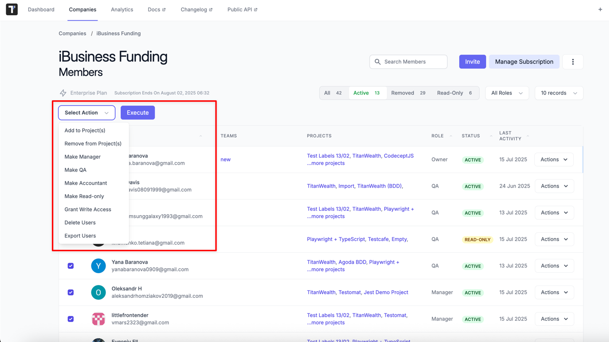

### **Available Bulk Actions**

Here’s what you can do from the bulk actions menu:

- Add to Project(s): Add selected users to one or more projects within the company
- Remove from Project(s): Remove selected users from one or more projects
- Make Manager: Assign the 'Manager' role to selected users at the company level
- Make QA: Assign the 'QA' role to selected users at the company level
- Make Accountant: Assign the 'Accountant' role at the company level
- Make Read-only: Change user access to read-only mode
- Grant Write Access: Upgrade from read-only to a regular role (QA or Manager depending on previous role)
- Delete Users: Remove selected users from the company (they will be moved to the Removed section)
- Export Users: Download selected users’ data into .csv and .xlsx files (includes Name, Email, Role, Status, etc.)

Using bulk actions is especially helpful for managing teams at scale — saving time and reducing manual effort when updating permissions or organizing access across multiple projects.

## Export Users List

You may need to get data about users who are members of your company. Fortunately, Testomat.io makes it easy and convenient:

:::note

Only users with Owner or Manager roles can export Users List

:::

The exported .csv file contains the following information about the company's users:

- Name.
- Email.
- Role.
- Status.
- Paused At (UTC).
- Last Login (UTC).

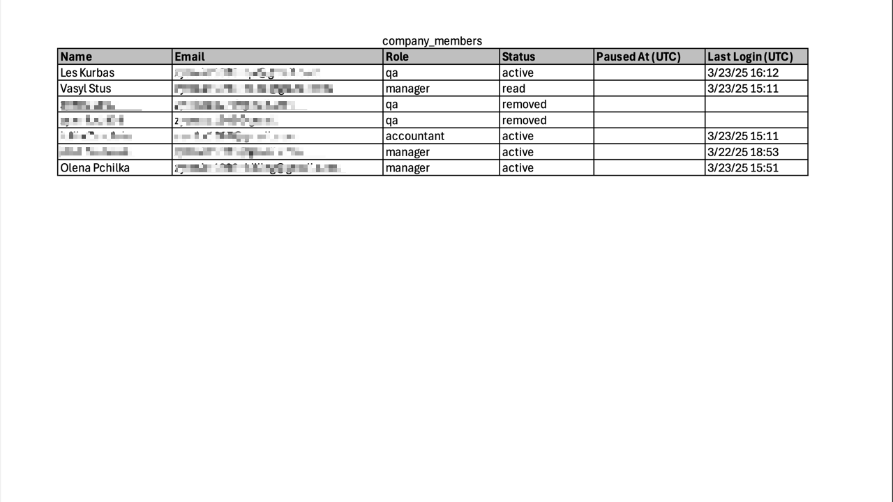
