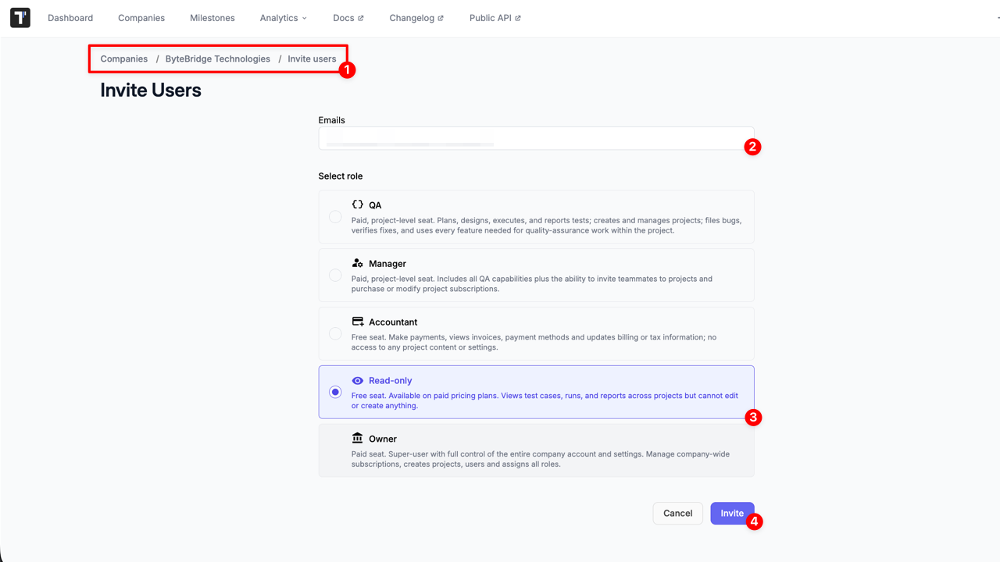
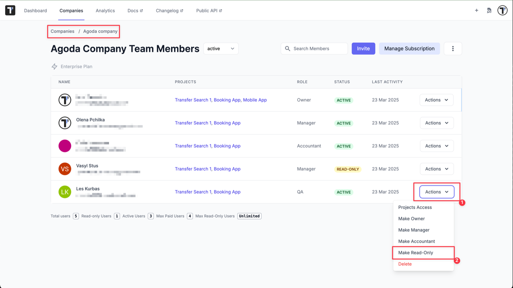
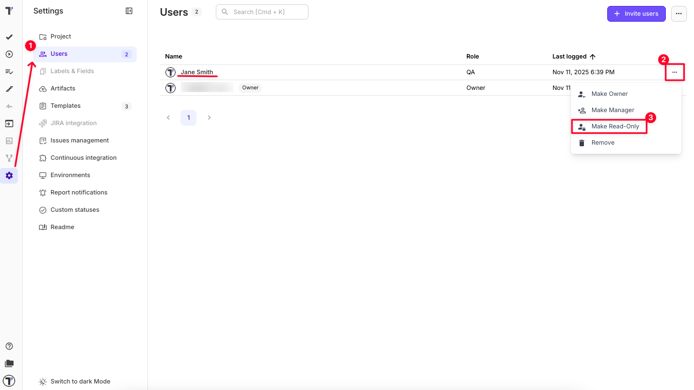
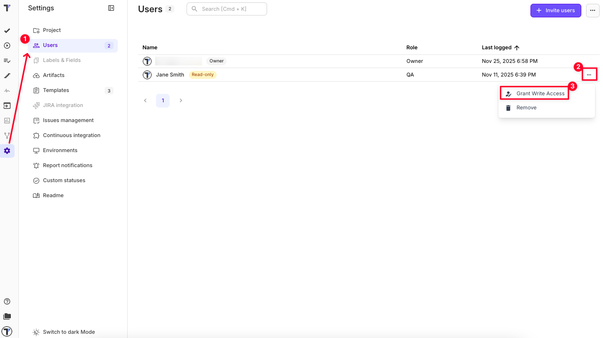

## Read-Only User

Some of your company members such as managers, BA, or other stakeholders may need to have read-only access to Tests, Run Reports, and Analytics in order to read, but not change any data. You can invite read-only users or make existing users read-only on the Company page.

### Invite Read-Only User to a Company

1. Navigate to the 'Invite users' from Company page
2. Enter valid user's email (use comma to enter multiple emails)
3. Select 'Read-only' option
4. Click 'Invite' button

:::note

By default, Read-only users are invited with a **QA role**.

:::

### Make a Company Member Read-Only

1. Click on 'Actions' button for selected member from Company page.
2. Click on 'Make Read-Only' option from the dropdown menu.

### Make the Read-Only Users a Member

1. Click on 'Actions' button for selected Read-Only user from Company page
2. Click on 'Grant Write Access' option from the dropdown menu

:::note

Read-Only users are free of charge and available in Professional and Enterprise plans.

:::

### Make user read-only on project level

1. Go to Project Settings and open the Users tab.
2. Click the three-dot menu next to the user’s name.
3. Select 'Make Read-Only' from the dropdown options.

### Make read-only user  a regular user on project level

1. Go to Project Settings and open the Users tab.
2. Click the three-dot menu next to the user’s name.
3. Select 'Grant Write Access' from the dropdown options. 

