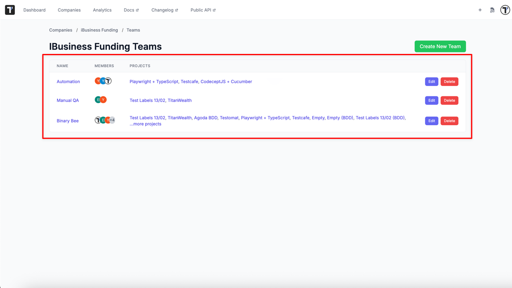
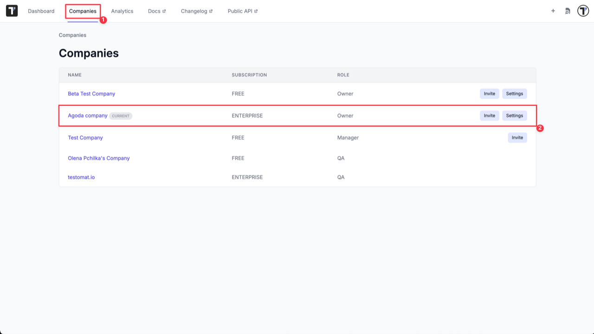
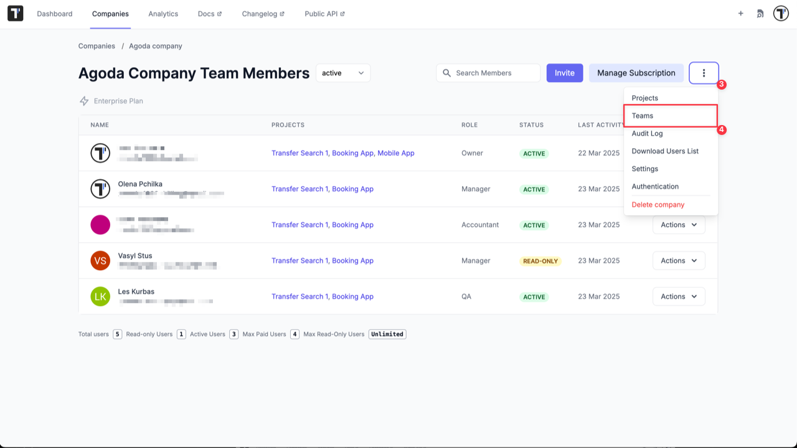
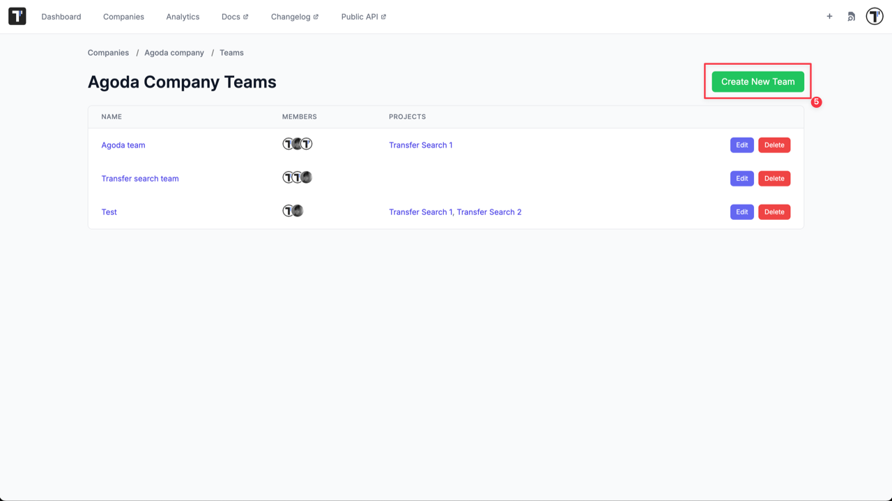
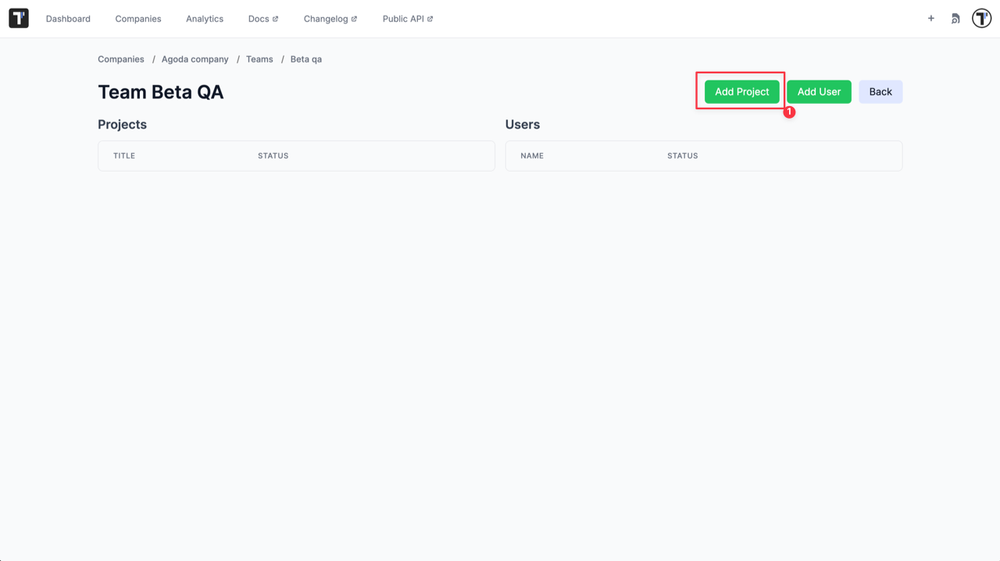
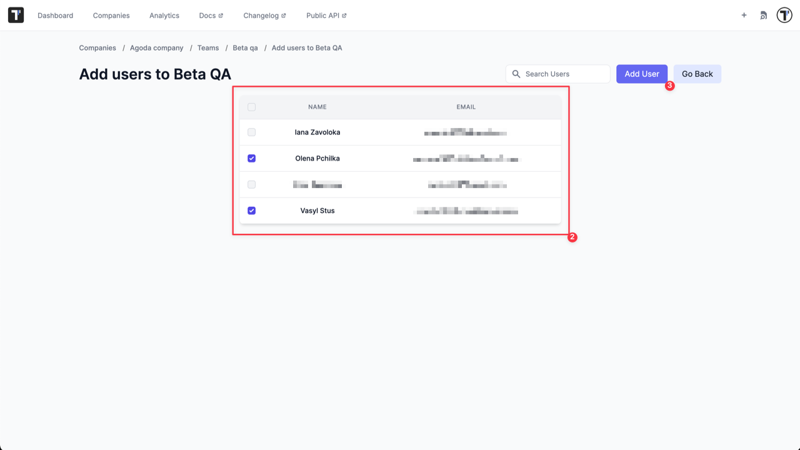
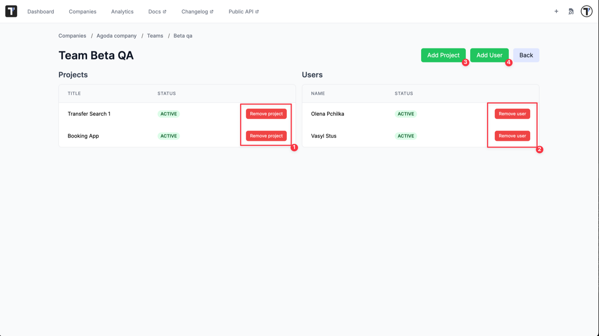

## Teams

Teams in Testomat.io help you organize your growing organization by grouping users together and managing access to multiple projects efficiently. Instead of assigning users individually to each project, you can now create Teams and assign them to any number of projects in just a few clicks.

This feature is critical for scaling organizations, improving permission control, and streamlining onboarding for new team members.

**Why Use Teams?**

- Simplified access management: Assign an entire group of people to projects in one action — no need to manage access user-by-user
- Clear structure: Organize users based on people's roles, departments, or external teams
- Consistent permissions: Ensure everyone in a specific role or team has access to the right projects — with a single assignment
- Better control: Easily update access when people join, leave, or change teams
- Visibility: See all projects and members connected to a team — all in one place

### Real-World Benefits & Use Cases

- **Onboarding new people quickly**

When a new team member joins, simply add them to the appropriate team (e.g., QA Team), and they'll automatically gain access to all relevant projects — no manual steps required.

- **Managing departments efficiently**

In companies with several functional departments — like Backend, Frontend, QA, or DevOps — it's common for each group to work on multiple projects. With Teams, you can reflect that structure: create one team per department and assign them to the projects they’re responsible for.
For example, your QA team can be granted access to 5 projects at once — no need to assign each QA engineer individually.

- **Controlling access for contractors**

Need to give external testers or developers limited access? Create a dedicated contractor team, assign only the projects they need, and manage their access independently from your core teams.

- **Supporting role changes and reassignments**

When someone changes roles — for example, moving from QA to a Project Manager position — simply remove them from their current team and add them to the new one. Their project access will be updated instantly based on the permissions of the new team.

- **Temporary cross-functional initiatives**

For time-limited efforts like major releases or audits, create a dedicated team (e.g., Release Task Force) and give them quick access to all related projects. When done, simply deactivate the team.

### Teams Dashboard

The Teams Dashboard provides a complete overview of all teams within your company — showing team names, members, assigned projects, and available actions like edit or delete.

This centralized view helps you stay organized and manage access efficiently.

To start organizing your teams and streamline access control, begin by creating your own team.

### How To Create a Team

To create a Team you need:

1. Go to the 'Companies' page.
2. Open your Company.

3. Click 'Extra menu' button.
4. Select 'Teams' option from the list.

5. Click 'Create New Team' button.

6. Enter Team name.
7. Click 'Create' button.

Team is created and now you need to add Projects and Users to your new team.

### How To Assign a Team To a Project

To add Projects:

1. Click 'Add Project' button.

2. Select projects from the list.
3. Click 'Add Project' button.

Once added, all team members automatically gain access to these projects.

### How to Add Users to a Team

:::note

Users must already be members of the company. Learn how to invite users [here](https://docs.testomat.io/management/company/users-and-permissions/#how-to-invite-a-user-to-a-company).

:::

1. Click 'Add User' button.

2. Select users from the list.
3. Click 'Add User' button.

You can also edit your Team, add/remove user or assign the Team to another project by editing it at any time later.

Namely, you can:

1. Delete a team from a project by removing a project from the Team.
2. Delete a user from the Team.
3. Assign the Team to a project by adding a project to the Team.
4. Add a new member to the Team.

5. Edit the Team name.
6. Delete the Team.

### Tips for Effective Team Management

- Regularly review team membership to ensure access remains up-to-date and relevant
- Use clear and descriptive team names that reflect their roles or functions within your organization
- Deactivate temporary teams once their projects or initiatives are completed to maintain a clean and organized workspace
