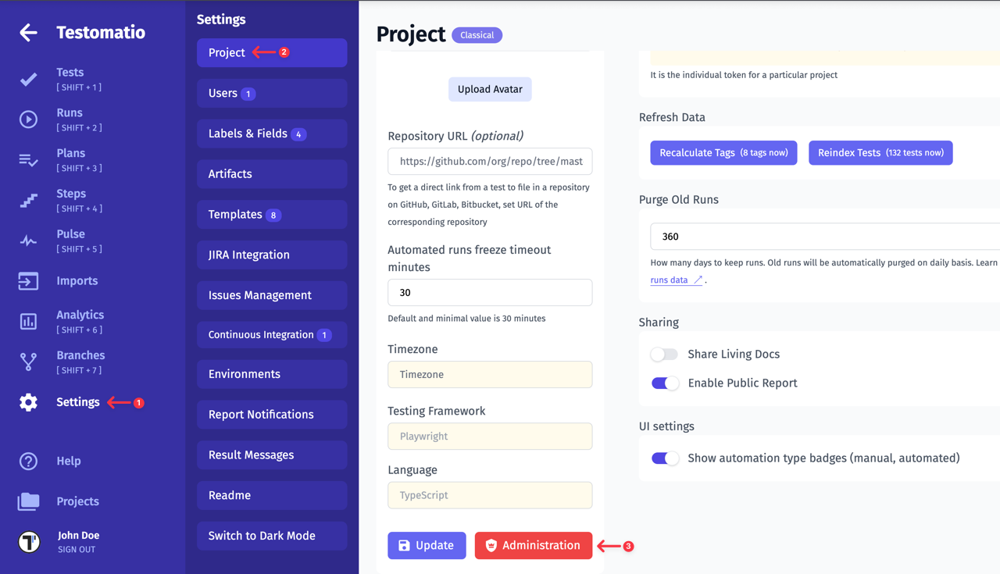
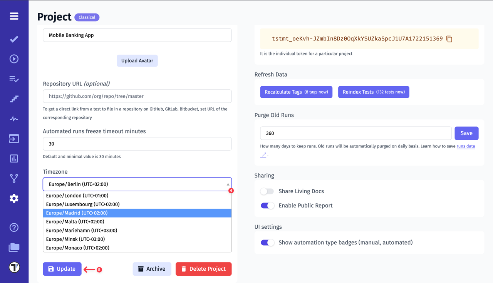
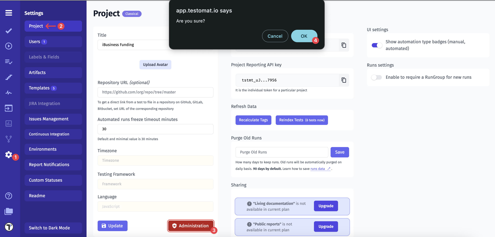
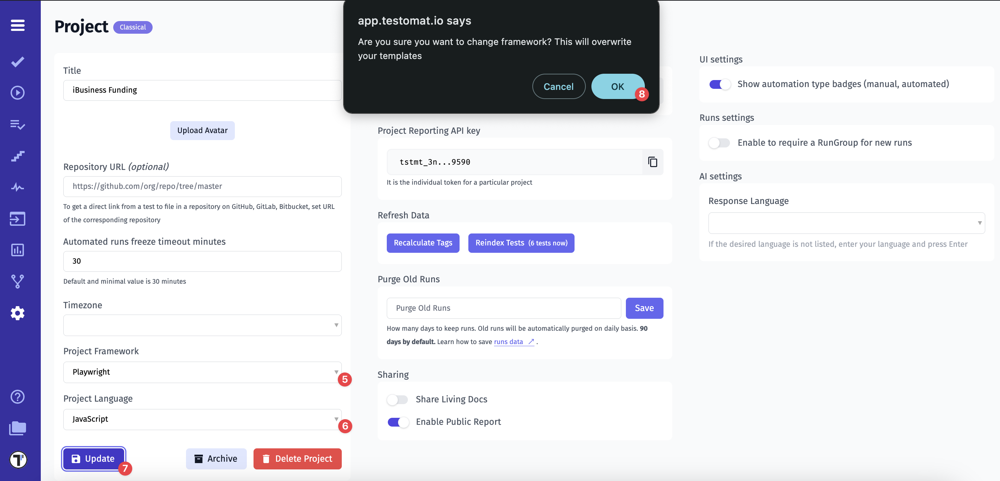
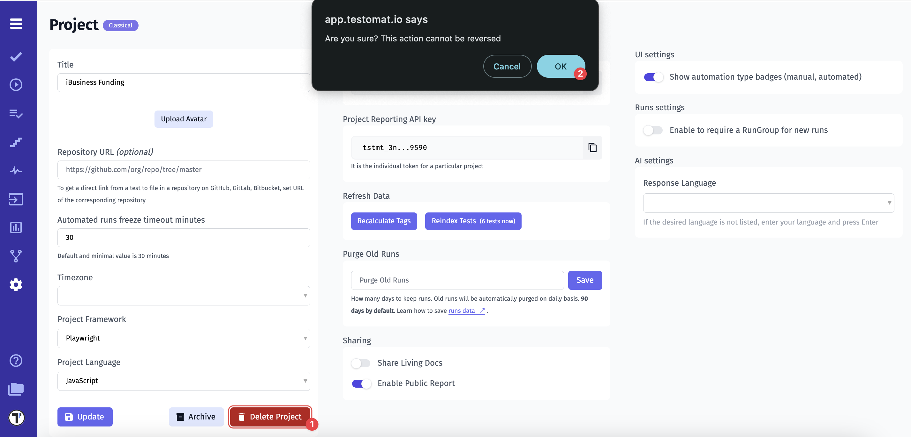
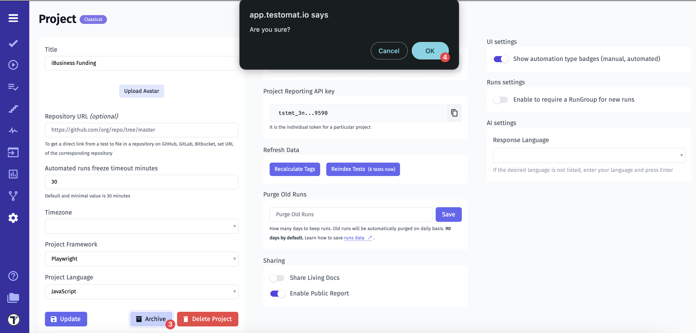
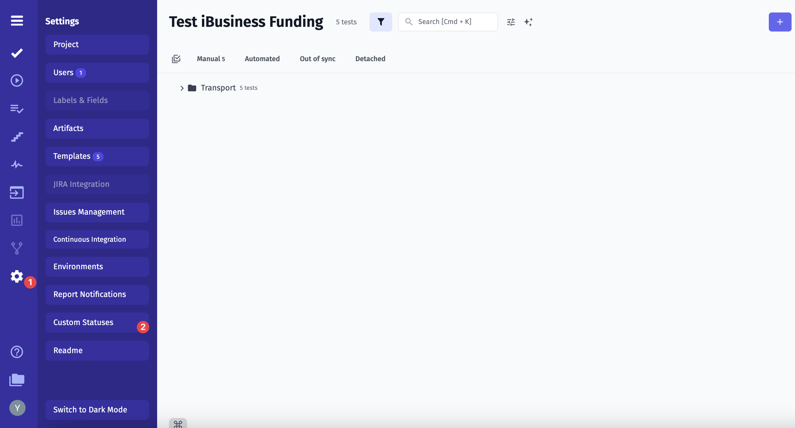
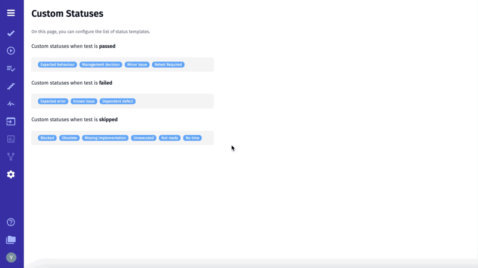
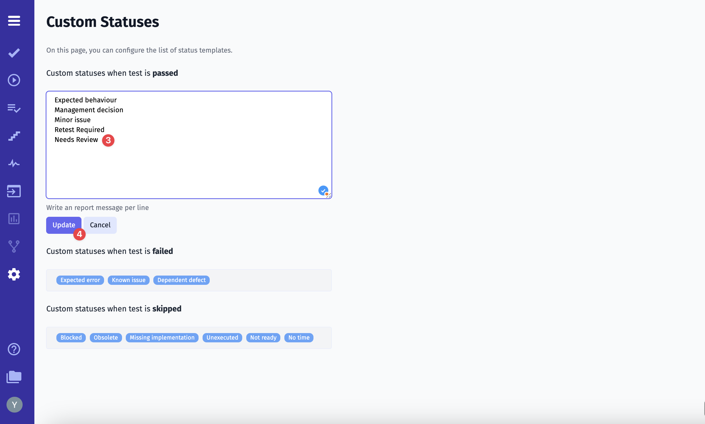

## Project Timezone

If you have a multi-national team and everyone is working in different parts of the world, you need to avoid time mismatches. All your actions in the project will be displayed at UTC+00:00 by default. So you need to specify the project time manually.

To do this, follow these steps:

1. Click on **Settings** in the sidebar
2. Click the **Project** button
3. Active **Administration** mode

4. Select the required time in the **Timezone** field
5. Click the **Update** button to save changes

## Project Testing Framework & Language

A testing framework provides a structured set of rules and best practices to ensure effective and reliable test automation. It helps testers create and manage test cases more efficiently, reducing effort and improving consistency. By using a testing framework, teams can minimize testing time and costs, decrease the risk of errors, and enhance test accuracy.

### How to Change the Testing Framework

You can change the testing framework to meet your needs. To do this, follow these steps:

1. Click on **’Settings’** in the sidebar
2. Click the **’Project’** button
3. Enable **’Administration’** mode
4. Click **’OK’** in the popup **’Are you sure?’**

5. Select **’Project Framework’** from the dropdown
6. Select a programming language you use in **’Project Language’** dropdown
7. Click **’Update’** button
8. Click **’OK’** to save the changes

In addition, when **’Administration’** mode is activated, you can:

1. Delete the project – Click the **’Delete Project’** button
2. Then confirm by clicking **’OK’** in the popup

3. Archive the project – Click the **’Archive’** button
4. Then confirm by clicking **’OK’** in the popup

If you don’t see **’Administration’** mode, please note that this option is available only to users with **Manager** or **Owner** roles at the company level.
For more details on **’How to Manage Company Roles’**, please explore here <a href="https://docs.testomat.io/management/company/#how-to-manage-company-team-members">Manage Company Roles</a>

## Custom Statuses

While default statuses are available, you can configure the list of them to align your testing workflow better.

1. Open **‘Settings’** in the sidebar
2. Click on the **‘Custom Statuses’** button

Now, you’re able to add or edit existing conditions by clicking on the field where you are interested in making changes. Let’s check how it works.

3. Write a report message per line, for example, **‘Needs Review’**
4. Click the **‘Update’** button to save changes

**Note:** The same actions can be applied to each field, such as ‘Custom statuses when test is **failed**’ or ‘Custom statuses when test is **skipped**’.
