Templates in Testomat.io empower teams to work faster and more consistently by standardizing how tests, defects, and communications are created and maintained. Whether you're reporting bugs, writing test cases, or sending test run reports to Slack, templates save time, reduce errors, and promote clarity across your QA process.

:::note

To ensure newly created **Notification Templates** are applied correctly, you must also create a new **Notification Rule**.  
Without it, Slack, Telegram or Microsoft Teams notifications will continue using the default message format with all supported variables.

Learn more: [How to create a Notification Rule](https://docs.testomat.io/integrations/report-notifications/rules/)

:::

## Types of Templates

- **Test Template**: used to define the structure and content for individual test cases;
- **Suite Template**: used to define the structure and content of individual test suites/folders;
- **Code Template**: used to define the default code structure for automated tests with dynamic variables to simplify test automation;
- **Defect Template**: used to automatically prefill the issue summary and description fields when reporting defects to integrations like Jira, GitHub, or Azure;
- **Meta Template**: defines which meta-data keys are displayed in the Run Report View; it controls how data is shown and helps enrich report context;
- **Notification Template (Slack / MS Teams / Telegram)**: used to customize the structure and content of automated messages sent to Slack, Microsoft Teams, or Telegram after a test run is completed;

:::note

For **BDD projects**, only **Defect, Meta, and Notification** templates are supported.

:::

## Managing Templates

Use the Templates section in Settings to create, edit, or delete reusable content structures for tests, suites, code, defects, meta fields, and notifications.

### How To Create Templates

All templates share a similar creation flow:

1. Navigate to **Settings** in the sidebar
2. Click on **Templates**
3. Click the **+ New Template** button

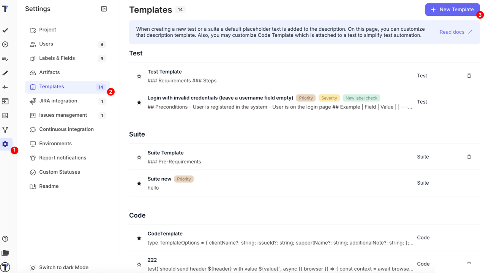

Once the **Add template** sidebar opens,

4. Fill in the following fields:

- **Title** (required): enter a unique title and optionally add tags using @ syntax (e.g., @smoke);
- **Type** (required): select the template type from the dropdown — **test** is selected by default, but you can change it to suite, defect, code, meta, notification-slack, notification-telegram, or notification-ms-teams;
- **Default** (optional): set this template as the default by clicking the **star icon**;

:::note

Marking a template as default means it will be auto-applied every time you create a new test, suite, defect, or notification — saving time and keeping your structure consistent.

:::

- **Set labels**: click to open an additional sidebar where you can select from existing Labels and Custom Fields. Only items that were previously configured (as described in the <a href="https://docs.testomat.io/advanced/tags-labels/#how-to-add-labels--custom-fields" target="_blank">How to Add Labels & Custom Fields</a>) will be available for selection. To use new ones, you must define them first using the linked guide;

:::note

Additional **Set labels** configuration is available only for **Test and Suite** templates.

:::

- **Add variables** (optional): сhoose from available variables for the selected template type, shown in the dropdown list;

:::note

Variables are not supported for Test and Suite templates.

:::

- **Body** (required): each template type comes with a predefined default body that you can edit.
  - You can format it using Markdown;
  - You can use dynamic variables with most template types, which will be automatically replaced when the template is applied;
  - For Test and Suite templates, dynamic variables are not supported — here you just work with the plain Markdown content;

5. Click **Save** button to apply changes or **Cancel** button to discard

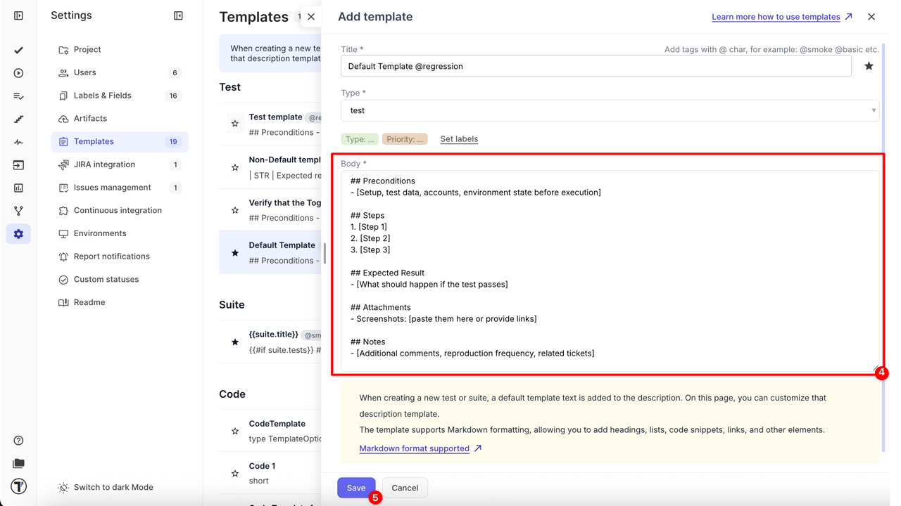

### How To Edit Templates

1. Navigate to **Settings** in the sidebar
2. Click **Templates**
3. Click a template you want to edit
4. Modify content as needed
5. Click **Update** button to save changes

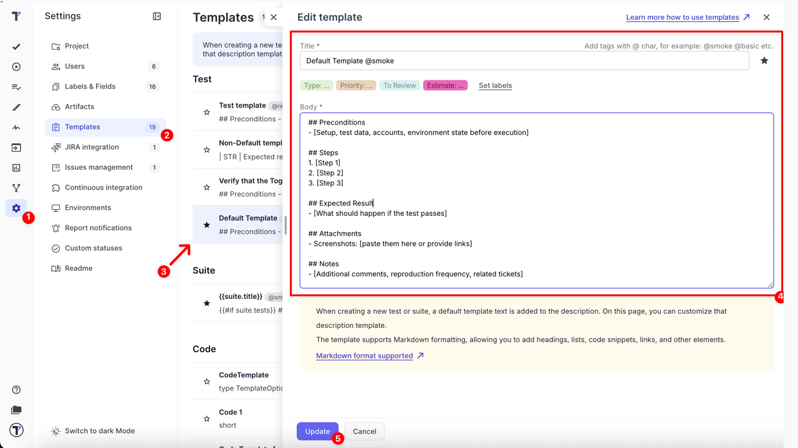

### How To Delete Templates

1. Navigate to **Settings** in the sidebar
2. Click **Templates**
3. Click the **Delete** icon next to needed template
4. Click the **Delete** button in the **'Are you sure?'** pop-up to confirm deletion

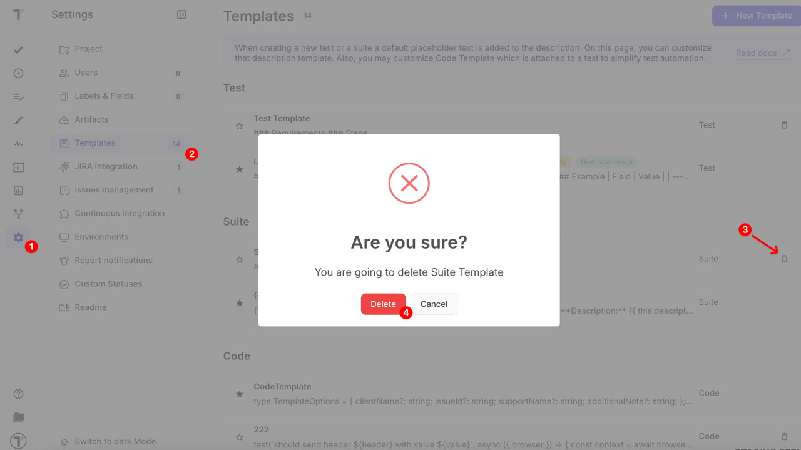

:::note

Default templates do not have a **Delete** icon. To delete a default template, you must first assign another template as a default.

:::

## Using Variables in Templates

Templates in Testomat.io support dynamic content by using variables. Variables are selected from a dropdown and automatically inserted in a conditional format, ensuring they are rendered only if data exists.

**Insertion format:**

`{{#if variable}}Label: {{ variable }}{{/if}}`

### Supported Variables

The following shows which variables are supported for each type of template that allows variables:

:::note

Test Templates and Suite Templates do not support variables.

:::

#### Code Templates

Depending on the selected framework, the corresponding block with the correct syntax will be inserted. You can use as it is, or modify it as needed.

| **Variable**         | **Inserted As**                   |
| -------------------- | --------------------------------- |
| `test.id`            | `{{ test.id }}`                   |
| `test.title`         | `{{ test.title }}`                |
| `test.description`   | `{{ test.description }}`          |
| `test.body` / `body` | `{{ test.body }}` or `{{ body }}` |
| `suite.id`           | `{{ suite.id }}`                  |
| `suite.title`        | `{{ suite.title }}`               |
| `suite.description`  | `{{ suite.description }}`         |

#### Defect Templates

**Test-related Variables**

| **Variable**       | **Inserted As**                                                                       |
| ------------------ | ------------------------------------------------------------------------------------- |
| `test.title`       | `{{#if test.title}}### Test: **{{ test.title }}**{{/if}}`                             |
| `test.id`          | `{{#if test.id}}### Test ID: **{{ test.id }}**{{/if}}`                                |
| `test.priority`    | `{{#if test.priority}}### Test Priority: **{{ test.priority }}**{{/if}}`              |
| `test.tags`        | `{{#if test.tags}}### Test Tags: **{{ test.tags }}**{{/if}}`                          |
| `test.labels`      | `{{#if test.labels}}### Test Labels: **{{ test.labels }}**{{/if}}`                    |
| `test.jiraissues`  | `{{#if test.jiraissues}}### Test Link to: **{{ test.jiraissues }}**{{/if}}`           |
| `test.assignee`    | `{{#if test.assignee}}### Test Assigned to: **{{ test.assignee }}**{{/if}}`           |
| `test.steps`       | `{{#if test.steps}}### Test Steps: **{{ test.steps }}**{{/if}}`                       |
| `test.attachments` | `{{#if test.attachments}}### Test Attachment URLs: **{{ test.attachments }}**{{/if}}` |

**Testrun-related Variables**

| **Variable**          | **Inserted As**                                                                    |
| --------------------- | ---------------------------------------------------------------------------------- |
| `testrun.title`       | `{{#if testrun.title}}### Testrun: **{{ testrun.title }}**{{/if}}`                 |
| `testrun.status`      | `{{#if testrun.status}}### Status: **{{ testrun.status }}**{{/if}}`                |
| `testrun.message`     | `{{#if testrun.message}}### Message: **{{ testrun.message }}**{{/if}}`             |
| `testrun.stack`       | `{{#if testrun.stack}}### Stack: **{{ testrun.stack }}**{{/if}}`                   |
| `testrun.attachments` | `{{#if testrun.attachments}}### Attachments: **{{ testrun.attachments }}**{{/if}}` |
| `testrun.assignee`    | `{{#if testrun.assignee}}### Assignee: **{{ testrun.assignee }}**{{/if}}`          |
| `testrun.retries`     | `{{#if testrun.retries}}### Retries: **{{ testrun.retries }}**{{/if}}`             |

**Run-related Variables**

| **Variable**      | **Inserted As**                                                                         |
| ----------------- | --------------------------------------------------------------------------------------- |
| `run.title`       | `{{#if run.title}}### Run: **{{ run.title }}**{{/if}}`                                  |
| `run.executed`    | `{{#if run.executed}}### Run Executed by: **{{ run.executed }}**{{/if}}`                |
| `run.assignee`    | `{{#if run.assignee}}### Run Assigned to: **{{ run.assignee }}**{{/if}}`                |
| `run.creator`     | `{{#if run.creator}}### Run Created by: **{{ run.creator }}**{{/if}}`                   |
| `run.environment` | `{{#if run.environment}}### Run Environment: **{{ run.environment }}**{{/if}}`          |
| `run.finished`    | `{{#if run.finished}}### Run Finished at: **{{ run.finished }}**{{/if}}`                |
| `run.created`     | `{{#if run.created}}### Run Created at: **{{ run.created }}**{{/if}}`                   |
| `run.duration`    | `{{#if run.duration}}### Run Duration: **{{ run.duration }}**{{/if}}`                   |
| `run.project`     | `{{#if run.project}}### Run Project: **{{ run.project }}**{{/if}}`                      |
| `run.tests`       | `{{#if run.tests}}### Run Tests count: **{{ run.tests }}**{{/if}}`                      |
| `run.id`          | `{{#if run.id}}### Run ID: **{{ run.id }}**{{/if}}`                                     |
| `run.plan`        | `{{#if run.plan}}### Run Plan: **{{ run.plan }}**{{/if}}`                               |
| `run.passed`      | `{{#if run.passed}}### Run Passed count: **{{ run.passed }}**{{/if}}`                   |
| `run.failed`      | `{{#if run.failed}}### Run Failed count: **{{ run.failed }}**{{/if}}`                   |
| `run.skipped`     | `{{#if run.skipped}}### Run Skipped count: **{{ run.skipped }}**{{/if}}`                |
| `run.failures`    | `{{#if run.failures}}### List of Failed Launch Test IDs: **{{ run.failures }}**{{/if}}` |
| `run.labels`      | `{{#if run.labels}}### Run Labels: **{{ run.labels }}**{{/if}}`                         |
| `run.attachments` | `{{#if run.attachments}}### Run Attachment URLs: **{{ run.attachments }}**{{/if}}`      |

**Report-related Variables**

| **Variable**   | **Inserted As**                                                       |
| -------------- | --------------------------------------------------------------------- |
| `report.title` | `{{#if report.title}}### Report Title: **{{ report.title }}**{{/if}}` |
| `report.id`    | `{{#if report.id}}### Report ID: **{{ report.id }}**{{/if}}`          |

#### Meta Templates

| **Variable**    | **Inserted As**        |
| --------------- | ---------------------- |
| `project.value` | `{{ project.value }} ` |

:::note

Use any keys **(variables)** that exist in the Run Report View. More info: [Applying Meta Templates](https://docs.testomat.io/management/project/templates/#applying-meta-templates)

:::

#### Notification Templates

| **Variable**      | **Inserted As**                                                                         |
| ----------------- | --------------------------------------------------------------------------------------- |
| `run.title`       | `{{#if run.title}}### Run: **{{ run.title }}**{{/if}}`                                  |
| `run.executed`    | `{{#if run.executed}}### Run Executed by: **{{ run.executed }}**{{/if}}`                |
| `run.assignee`    | `{{#if run.assignee}}### Run Assigned to: **{{ run.assignee }}**{{/if}}`                |
| `run.creator`     | `{{#if run.creator}}### Run Created by: **{{ run.creator }}**{{/if}}`                   |
| `run.environment` | `{{#if run.environment}}### Run Environment: **{{ run.environment }}**{{/if}}`          |
| `run.finished`    | `{{#if run.finished}}### Run Finished at: **{{ run.finished }}**{{/if}}`                |
| `run.created`     | `{{#if run.created}}### Run Created at: **{{ run.created }}**{{/if}}`                   |
| `run.duration`    | `{{#if run.duration}}### Run Duration: **{{ run.duration }}**{{/if}}`                   |
| `run.project`     | `{{#if run.project}}### Run Project: **{{ run.project }}**{{/if}}`                      |
| `run.tests`       | `{{#if run.tests}}### Run Tests count: **{{ run.tests }}**{{/if}}`                      |
| `run.id`          | `{{#if run.id}}### Run ID: **{{ run.id }}**{{/if}}`                                     |
| `run.plan`        | `{{#if run.plan}}### Run Plan: **{{ run.plan }}**{{/if}}`                               |
| `run.failures`    | `{{#if run.failures}}### List of Failed Launch Test IDs: **{{ run.failures }}**{{/if}}` |
| `run.labels`      | `{{#if run.labels}}### Run Labels: **{{ run.labels }}**{{/if}}`                         |
| `run.attachments` | `{{#if run.attachments}}### Run Attachment URLs: **{{ run.attachments }}**{{/if}}`      |

:::note

If a variable is empty or undefined, the section will not be rendered.

:::

### Examples per Template Type

**Test Template**

```
## Preconditions
- [Setup, test data, accounts, environment state before execution]

## Steps
1. [Step 1]
2. [Step 2]
3. [Step 3]
...

## Expected Result
- [What should happen if the test passes]

## Postconditions
- [State of the system after execution — e.g., data created, user logged in/out]

## Attachments
- Screenshots: [paste them here or provide links]
- Logs: [paste log file or link here]

## Notes
- [Additional comments, reproduction frequency, related tickets]
```

You can find additional examples of markdown-formatted test cases in the documentation here: [Examples of Markdown Written Test Cases](https://docs.testomat.io/project/tests/classical-test-case-editor/#examples-of-markdown-written-test-cases).

**Suite Template**

```
## Requirements

- [List of requirements or preconditions for the suite]

## Notes

- [Additional comments, related tickets, or other important information]
```

**Code Template**

```
test.describe('{{ suite }}', () => {
  test('{{ test }}', () => {
{{ body }}
  });
});

```

**Defect Template**

```
## STR

1. [Step 1]
2. [Step 2]
3. [Step 3]
   ...

## Actual result
[Describe what actually happened]

## Expected result
{{ test.title }}

Executed by: {{ run.executed }}

## Test case information
Tags: **{{ test.tags }}**
Link to: {{ test.jiraissues }}

## Environment

{{#if run.environment}}Run Environment: {{ run.environment }}{{/if}}
```

**Meta Template**

Create a template using the keys available in the Run Report View. If the test report doesn’t include a value for a specific key (e.g, ` project.value` or `browser`), the corresponding placeholders will remain empty. More info: [Applying Meta Templates](https://docs.testomat.io/management/project/templates/#applying-meta-templates)

```
{{ project.value }}
{{ browser }}
```

**Notification Template**

```
{{#if run.title}}Run: {{ run.title }}{{/if}}
{{#if run.executed}}Run Executed by: {{ run.executed }}{{/if}}
{{#if run.environment}}Run Environment: {{ run.environment }}{{/if}}
{{#if run.finished}}Run Finished at: {{ run.finished }}{{/if}}
{{#if run.created}}Run Created at: {{ run.created }}{{/if}}
{{#if run.duration}}Run Duration: {{ run.duration }}{{/if}}
{{#if run.project}}Run Project: {{ run.project }}{{/if}}
{{#if run.tests}}Run Tests count: {{ run.tests }}{{/if}}
{{#if run.id}}Run ID: {{ run.id }}{{/if}}
{{#if run.plan}}Run Plan: {{ run.plan }}{{/if}}
{{#if run.failures}}List of Failed Launch Tests: {{ run.failures }}{{/if}}
{{#if run.labels}}Run Labels: {{ run.labels }}{{/if}}
```

## Applying Templates

Templates aren't just about saving time — they help you work smarter and more consistently across your entire testing workflow.

**Key Benefits** of Using Templates:

- Save time by avoiding repetitive manual input
- Ensure consistency across test cases, suites, defects, and reports
- Improve clarity in communication with development teams
- Standardize formatting and enforce team-wide structure
- Automate integration content for tools like Jira, GitHub, Slack, etc.
- Enable reuse of best practices and proven formats

Whether you're reporting a defect, creating a new test case, or sending notifications to Slack — templates make your process faster, cleaner, and more scalable.

Templates can be applied either:

- **Automatically** — when marked as default;
- **Manually** — when selected during test, suite, or defect creation;

### Applying Templates To Tests And Suites

1. Go to **Tests** tab
2. Open the relevant test case or suite in **Edit** mode
3. Select the needed template in the **Use Template** dropdown or keep a default one

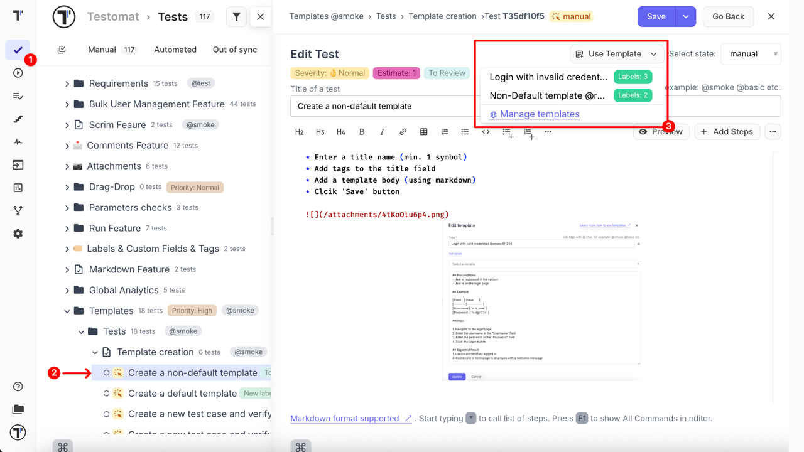

4. Confirm your selection - the template will be applied to the current item

If the selected test or suite already contains text, a confirmation window will appear:

- You are going to apply test (suite) template. Existing text will be deleted.
- Otherwise, if the test or suite is empty, this confirmation will be skipped and the template will be applied immediately.

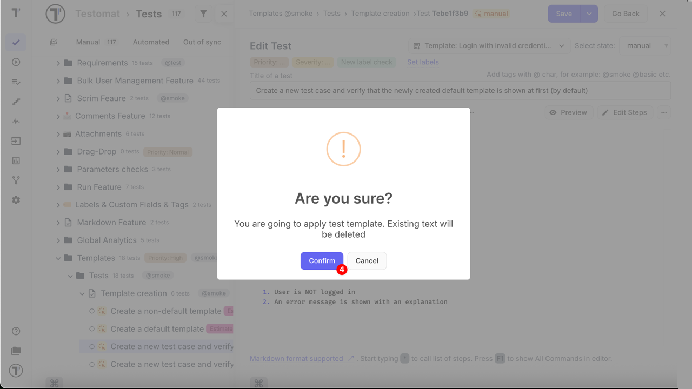

The selected template will automatically populate the fields with the predefined structure and content.

::: note

When you create a new test or suite, the default template (if configured) will be applied automatically. This helps ensure consistent formatting and structure without manual selection.

Keep in mind that required **custom fields** cannot be removed when applying templates, while **labels** remain optional and can be removed.

:::

### Applying Code Templates

1. Go to **Tests** tab
2. Open the relevant test case in the **Code template** tab
3. Select the needed template in the extra menu

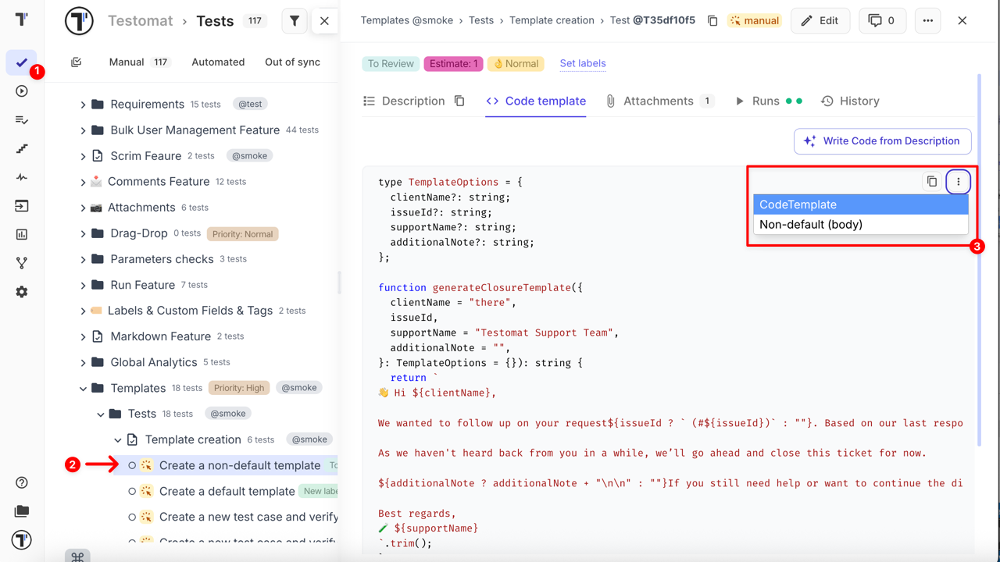

Once selected, the code will automatically update — no manual edits needeed.

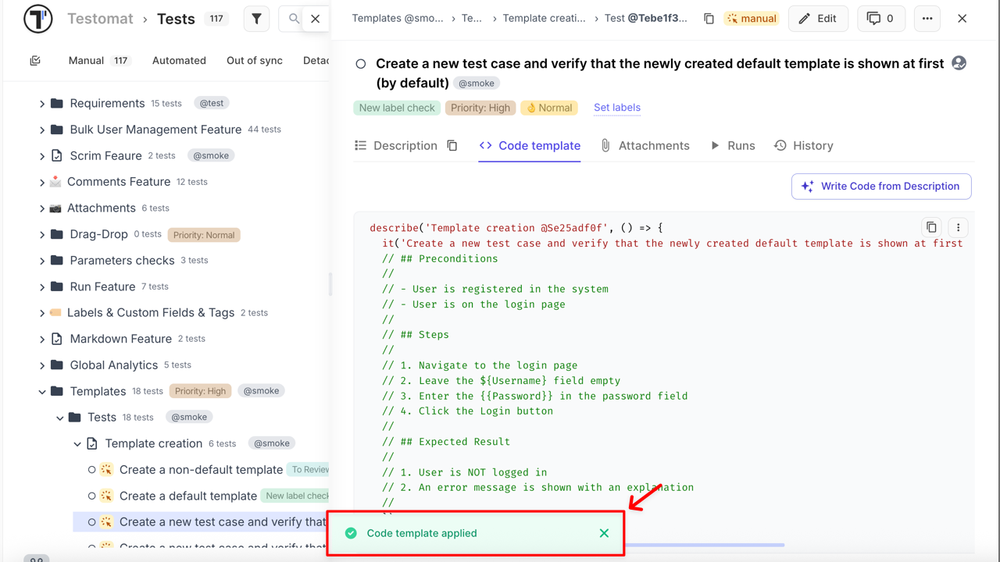

### Applying Templates To Defects

Testomat.io supports integration with a wide range of issue management systems, including:

- Jira
- GitHub
- Azure DevOps
- Linear
- ClickUp
- YouTrack
- GitLab
- Shortcut
- Confluence pages

Learn more: [How to connect to an Issue Management System (IMS)](https://docs.testomat.io/integrations/issues-management/#connect-to-ims)

Once the integration with your preferred issue management system is set up and linked, you can easily create and link issues directly from your test runs using predefined templates.

1. Go to **Runs** tab
2. Open the relevant ongoing run
3. Click the **Continue** button

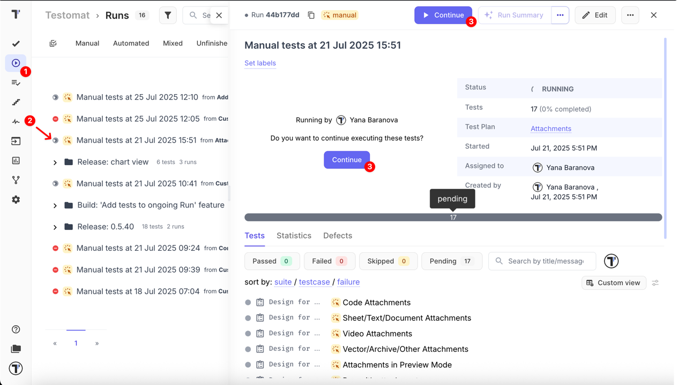

4. Click the **Link Defect** in the failed test

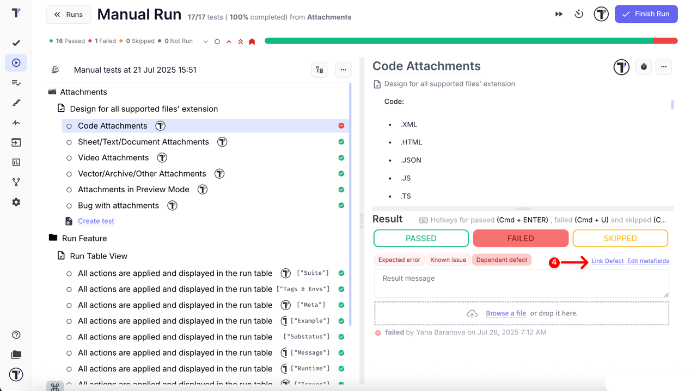

5. Click the **Create new issue** button

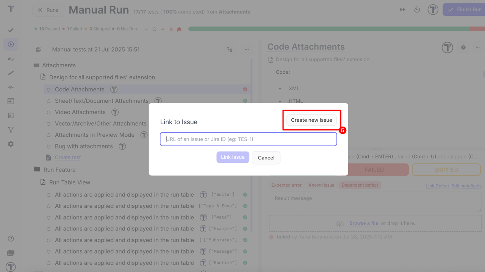

In the **Create new issue** window, just fill in the required fields:

6. Select profile (e.g. Jira Integration) from the dropdown list
7. Select Jira Issue Type from the dropdown list (e.g. Bug)
8. Select Template from the dropdown to apply Defect Templates to automatically prefill the summary and description fields
9. Add a title to the field
10. Write an optional description to the body if needed
11. Click the **'Create Jira Issue'** button

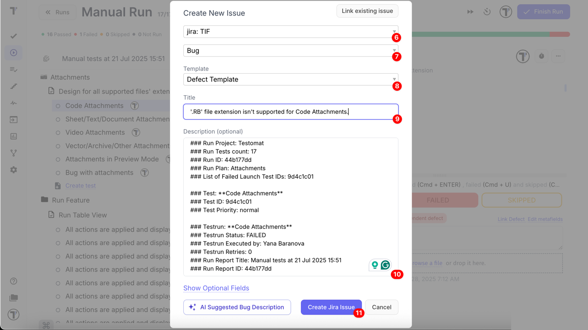

Once the issue is created:

- An icon will appear next to the test case — it includes a direct link to the created issue;
- A confirmation message will show with a direct link to the created issue;

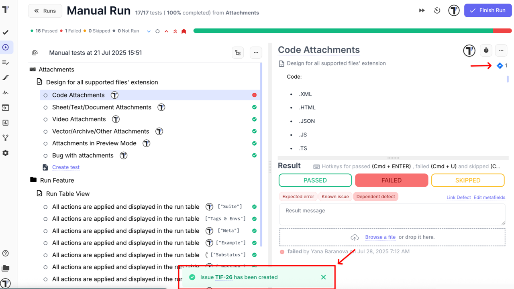

### Applying Meta Templates

**Meta Template** defines which specific meta-data will be displayed in the Run Report View. It only controls the display of data and does not affect how the meta-data is generated, stored, or passed by the test.

- Unlike other template types, there is **no manual option** to select a **Meta Template** during a test run
- You specify which keys should be shown
- Meta-data can be added manually **only for manual runs**
- It works strictly with **key–value pairs**
- It is recommended to use **Meta Template** in automated tests to dynamically display important information without manual input
- **Meta Template** helps standardize meta-data display and focus on key information

#### How it Works for Manual Run

Once the default **Meta Template** is created with specific keys (variables),

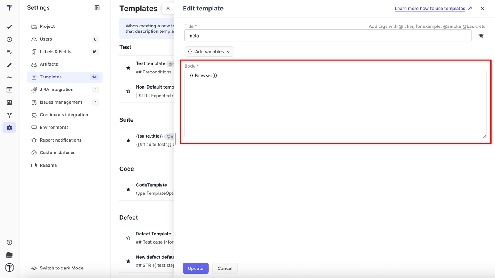

1. Go to **Runs** tab
2. Open the relevant ongoing run
3. Click the **Continue** button


4. Click the **Edit metafields** button under the test result

5. Fill in the **Key** and **Value**

:::note

Enter the Key exactly as defined in the default **Meta Template**.

:::

6. Click the **Save** button

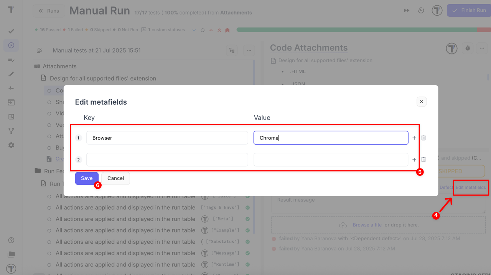

7. Click the **Finish Run** button

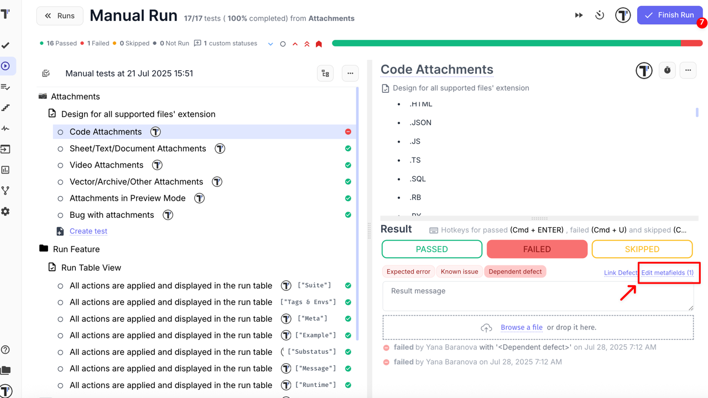

8. Open the test in run report to see how meta data is applied

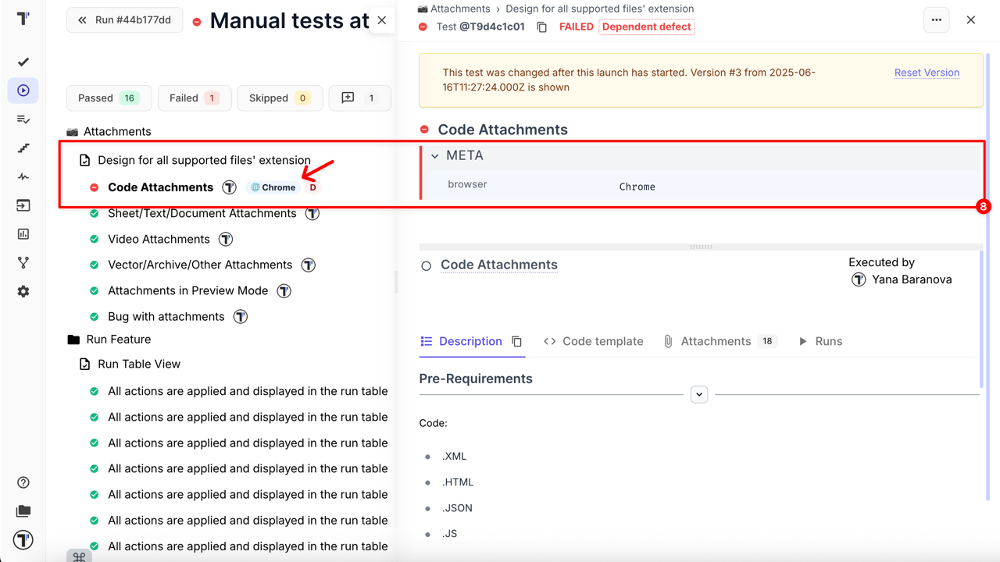

:::note

It’s recommended to use default **Meta Template** with automated tests whenever possible to ensure consistency and reduce manual effort.

:::

#### How it Works for Automated Run

When using automated tests, a default **Meta Template** is applied automatically to display meta-data in the Run Report View based on the keys defined in the template.

Once the default **Meta Template** is created with specific keys (variables):

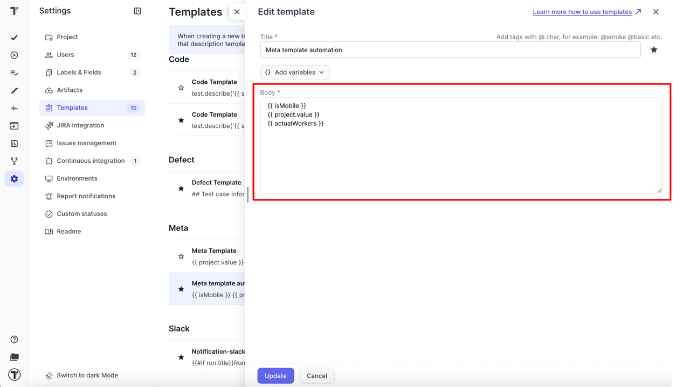

1. Go to **Runs** tab
2. Open the relevant finished run

In the Run Report View, the values corresponding to the keys defined in the template are displayed in the order specified in the template.

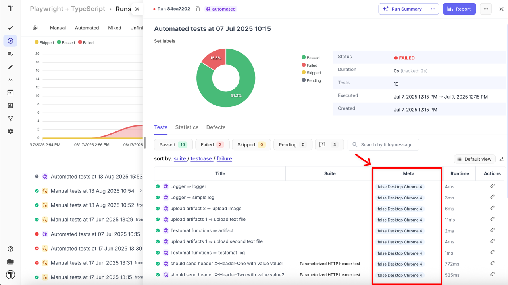

### Applying Notification Template

Unlike other template types, **there is no manual option to select a Notification Template** during a test run or when sending report notifications.

Once you have configured [Slack Notification](https://docs.testomat.io/integrations/report-notifications/slack/), [MS Teams Notification](https://docs.testomat.io/integrations/report-notifications/ms-teams/), or [Telegram Notification](https://docs.testomat.io/integrations/report-notifications/telegram), and created a default Notification Template, it will be automatically applied to all notifications triggered by your configured Notification Rules.

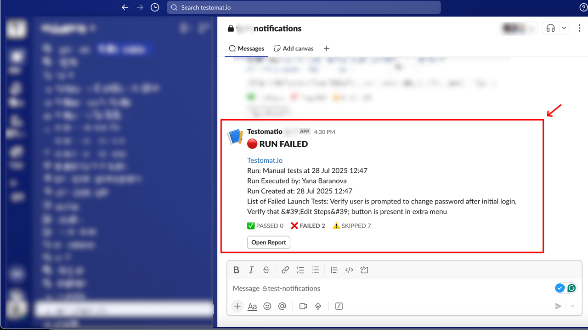

:::note

If no Notification Template is configured, the system will automatically generate the notification message using **all supported variables** in the default layout.

Currently, test status counts (e.g., `PASSED 10`, `FAILED 10`, `SKIPPED 10`) are **not configurable** within the template and will appear in the system’s default format.

:::

## Best Practices

- Regularly review and update templates to ensure relevance
- Utilize labels and tags strategically for efficient organization
- Encourage collaboration to create standardized templates across teams
