Templates provide a structured way to standardize test cases, test suites, code snippets, defects, and test run metadata. They help streamline the creation and maintenance of test assets across the project. By using templates, teams can apply consistent formatting, reduce manual input, and improve clarity in test documentation and reporting.

## Types of Templates

- **Test Templates**: used to define the structure and content for individual test cases;
- **Suite Templates**: used to define the structure and content of individual test suites;
- **Code Templates**: used to define the default code structure for automated tests using dynamic variables;
- **Defect Templates**: used to automatically prefill the issue summary and description fields when reporting defects to integrations like Jira, GitHub, or Azure;
- **Defect Description Templates**: used to structure the description field for defects inside Testomat;
- **Meta Templates**: used to define custom metadata fields that are shown in test run reports and help enrich report context;

:::note

You can mark any template as the default template during creation or editing by checking the **Default** checkbox. Only one default template can exist in each type. If a template is set, it is automatically applied when creating new tests, suites, defects, etc.

:::

## Managing Templates

Use the Templates section in Settings to create, edit, or delete reusable content structures for tests, suites, defects, and more. Templates help maintain consistency and reduce repetitive manual input when documenting or reporting within your project.

### How To Create Templates

All templates share a similar creation flow:

1. Navigate to **Settings** in the sidebar
2. Click on **Templates**
3. Click the **`+`** icon next to the relevant template type

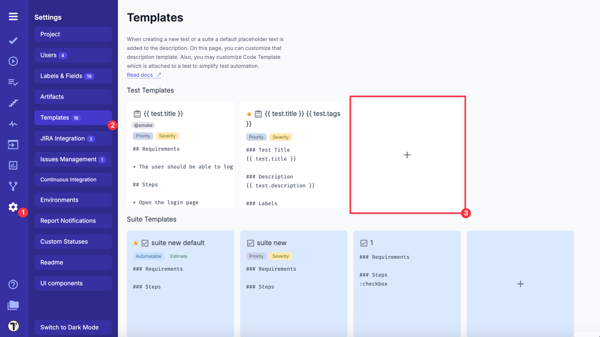

Once the **Add template** sidebar opens,

3. Fill in the following fields:

- **Title** (required): enter a unique title and optionally add tags using @ syntax (e.g., @smoke);
- **Type**: select template type from the dropdown (e.g., test, suite, code, meta, defect, defect-details);
- **Default** (optional): check the **Default** option if necessary;
- **Labels & Custom Fields**: select from dropdown; if you want to add more, see <a href="https://docs.testomat.io/advanced/tags-labels/#how-to-add-labels--custom-fields" target="_blank">Labels & Custom Fields</a> documentation;
- **Template** (required): Add body content using dynamic variables and logic;

4. Click **Save** button to apply changes or **Cancel** button to discard

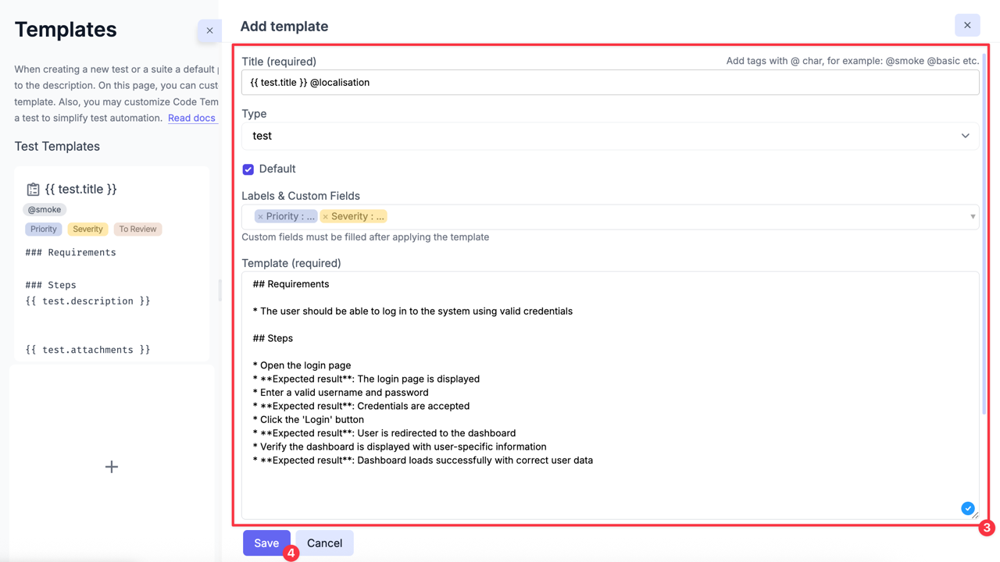

:::note

Only **Test** and **Suite** Templates include additional configuration options for Labels & Custom Fields.

:::

### How To Edit Templates

1. Navigate to **Settings** in the sidebar
2. Click **Templates**
3. Click a template you want to edit
4. Modify content as needed
5. Click **Update** button to save changes

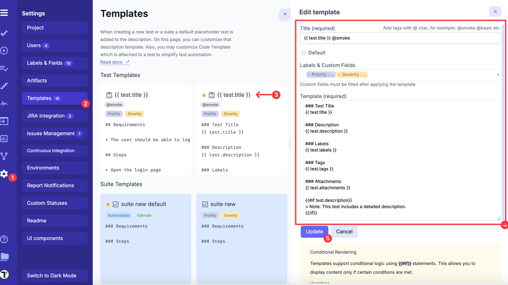

### How To Delete Templates

1. Navigate to **Settings** in the sidebar
2. Click **Templates**
3. Hover over the needed template and click the **Delete** icon

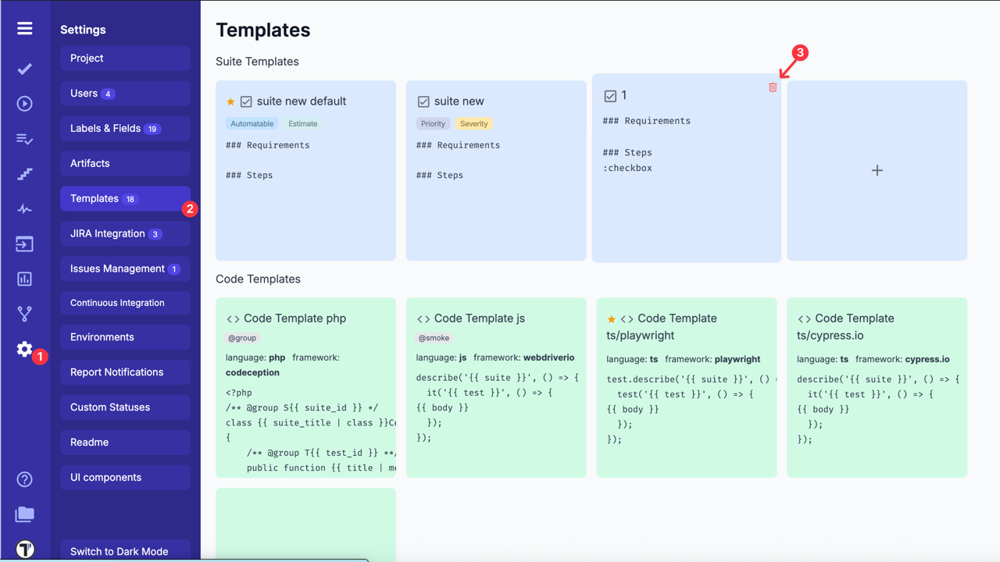

4. Click the **Delete** button in the **'Are you sure?'** pop-up to confirm deletion

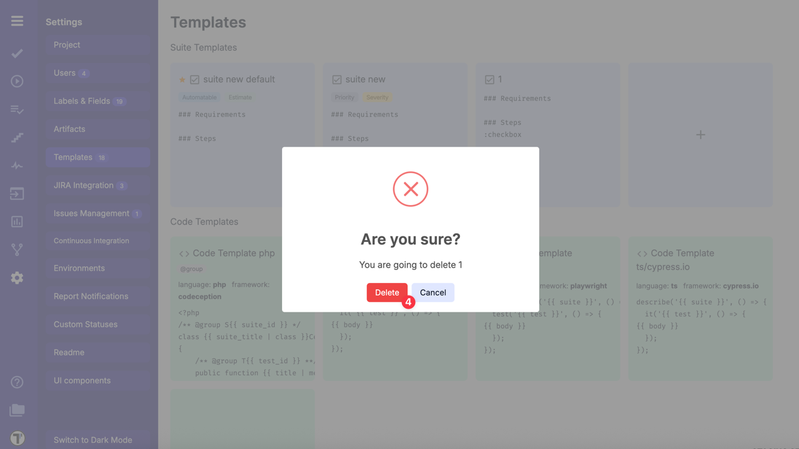

:::note

Default templates do not have a **Delete** icon. To delete a default template, you must first assign another template as a default.

:::

## Using Variables in Templates

Templates in **Testomat.io** support dynamic content using variables. Variables are enclosed within double curly braces {{ }}. This syntax ensures they are correctly parsed and rendered with the corresponding value.

**Example**: {{ test.title }}

### Supported Variables

Below is an overview of which variables are supported for each template type:

| Template Type    | Supported Variables                                                                                  |
| ---------------- | ---------------------------------------------------------------------------------------------------- |
| Test Templates   | test.title, test.description, test.tags, test.labels, test.attachments                               |
| Suite Templates  | suite.title, suite.description, suite.tags, suite.labels                                             |
| Code Templates   | test.title, test.description, suite.title, suite.description, body                                   |
| Defect Templates | test.title, test.description, test.assignee, test.priority, test.tags, test.attachments, jira.issues |

### Conditional Rendering

Templates support conditional logic using {{#if}} statements. This allows you to display content only if certain conditions are met.

- `{{#if test.tags}}`
  Tags: `{{ test.tags }}`
  `{{/if}}`

**Explanation**:

- The block will render Tags: [actual tags] only if test.tags has a value;
- If test.tags is empty or undefined, nothing will be displayed;

## Applying Templates

Templates can be applied either automatically (when marked as default) or manually while working on tests, suites, defects, or code structures in your project.

### Applying Templates To Tests And Suites

1. Go to **Tests** tab
2. Open the relevant test case or suite in **Edit** mode
3. Select the needed template in the **Use Template** dropdown

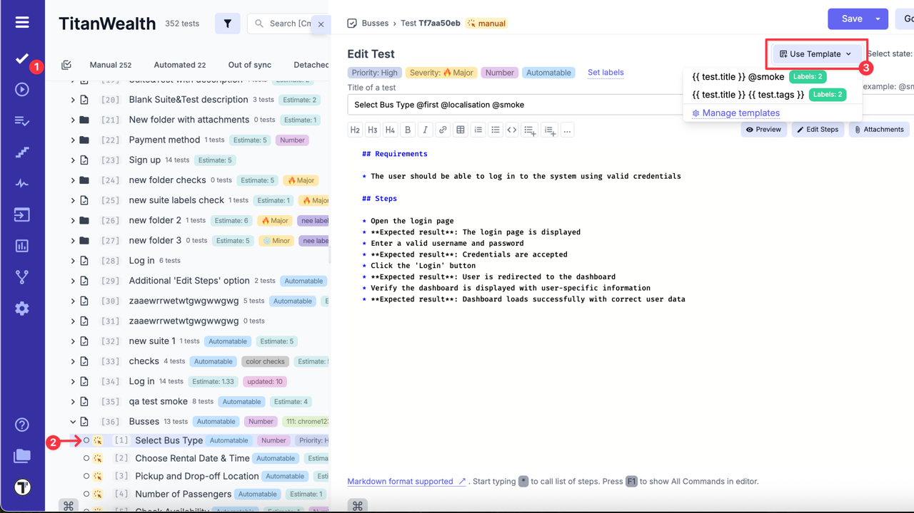

4. Confirm your selection - the template will be applied to the current item

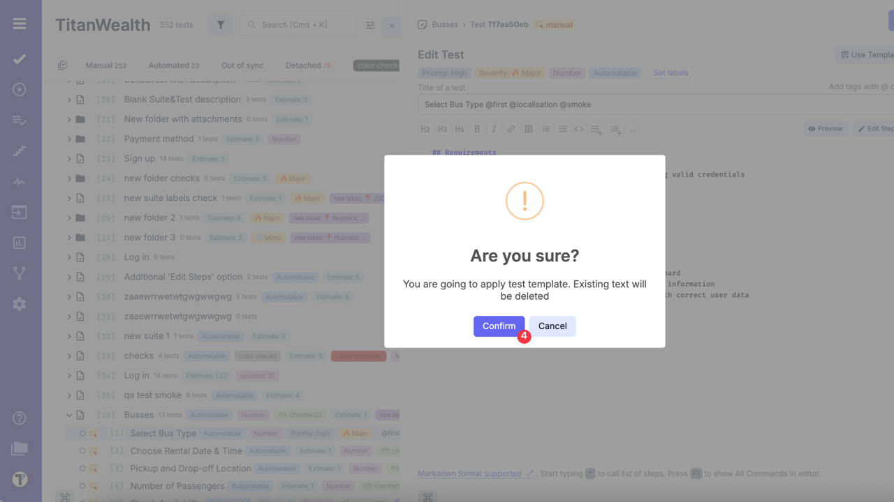

The selected template will automatically populate the fields (like title or description) using the defined variables.

::: note

When you create a new test or suite, the default template (if configured) will be applied automatically. This helps ensure consistent formatting and structure without manual selection.

:::

### Applying Code Templates

1. Go to **Tests** tab
2. Open the relevant test case in the **CODE TEMPLATE** tab
3. Select the needed template in the extra menu

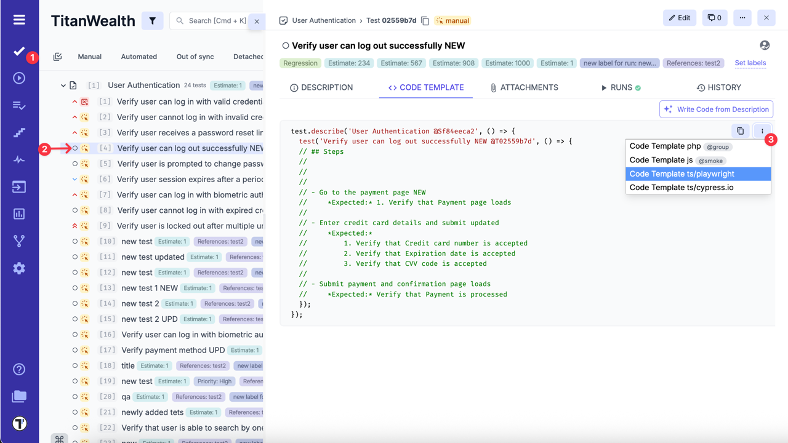

### Applying Templates To Defects

1. Go to **Runs** tab
2. Open the relevant ongoing run
3. Click the **Continue** button

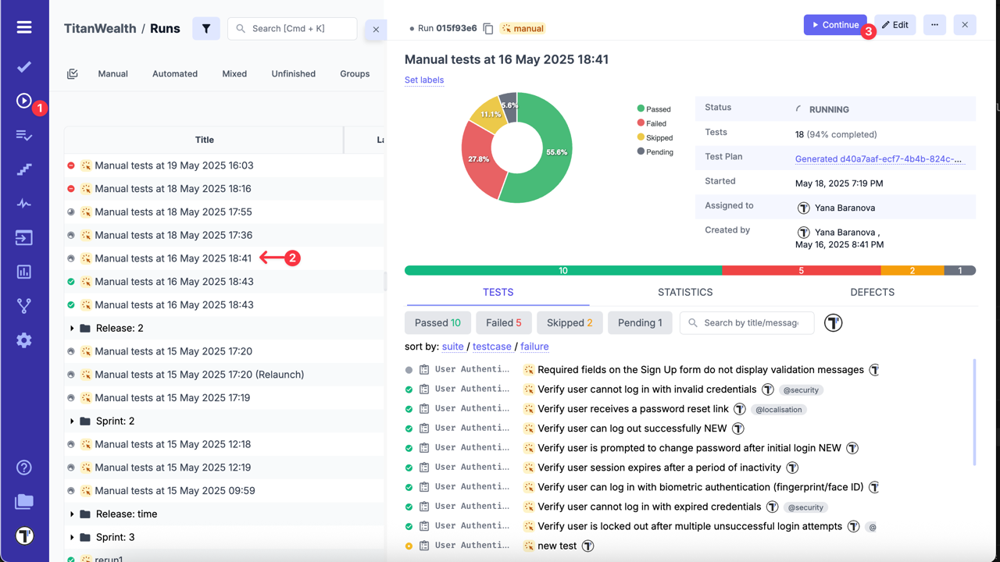

4. Click the **Link Defect** in the failed test

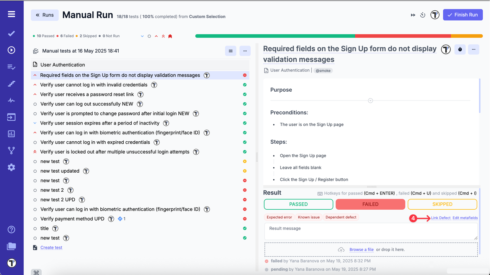

5. Click the **Create new issue** button

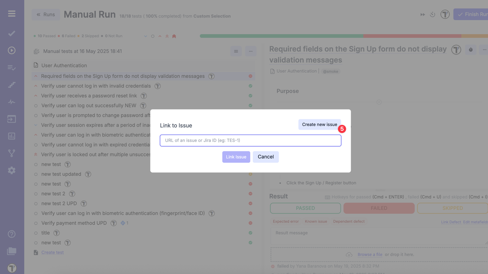

When the **Create New Issue** modal window is opened, fill in the required fields:

6. Select profile (e.g. Jira Integration) from the dropdown list
7. Select Jira Issue Type from the dropdown list (e.g. bug)
8. Select Template from the dropdown to apply Defect Templates to automatically prefill the summary and description fields
9. Add a title to the field
10. Click the **'Create Jira Issue'** button

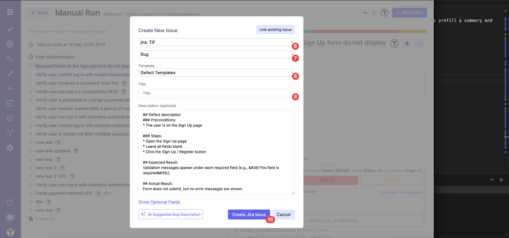

### Applying Meta Templates

1. Go to **Runs** tab
2. Open the relevant ongoing run
3. Click the **Continue** button

4. Click the **Edit metafields** button under the test result

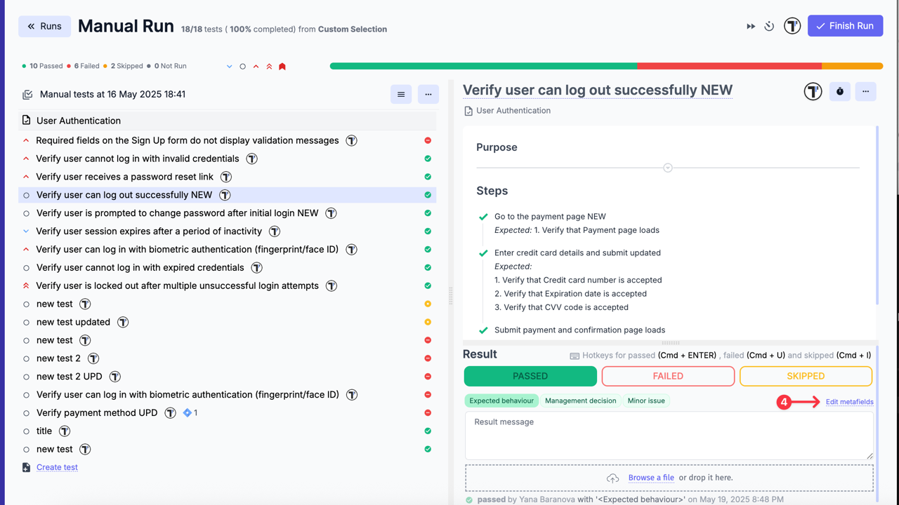

5. Fill in the **Key** and **Value**
6. Click the **Save** button

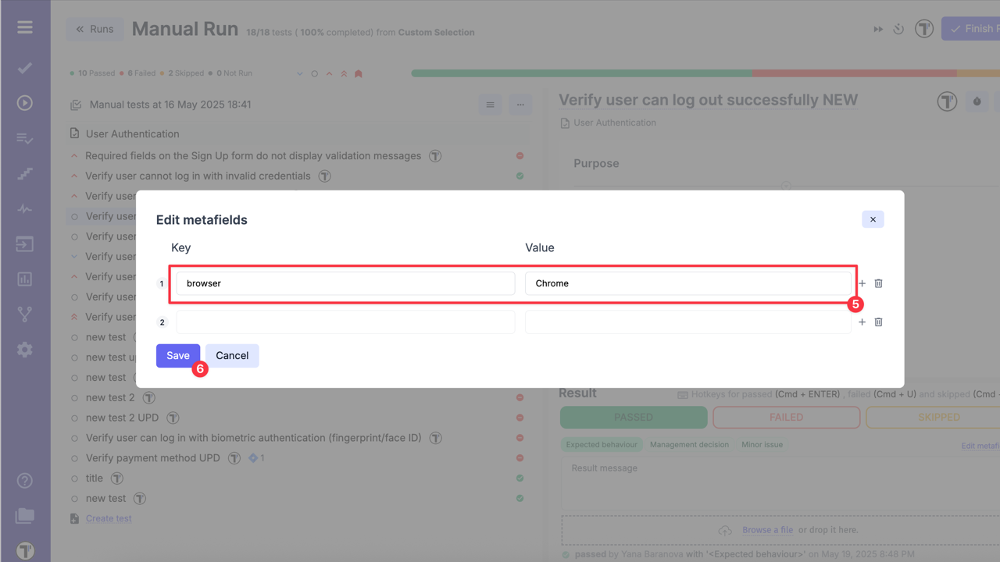

7. Click the **Finish Run** button

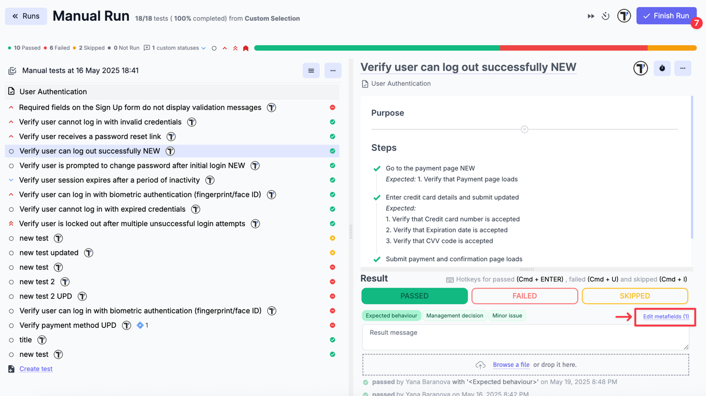

8. Open the test in run report to see how meta data is applied

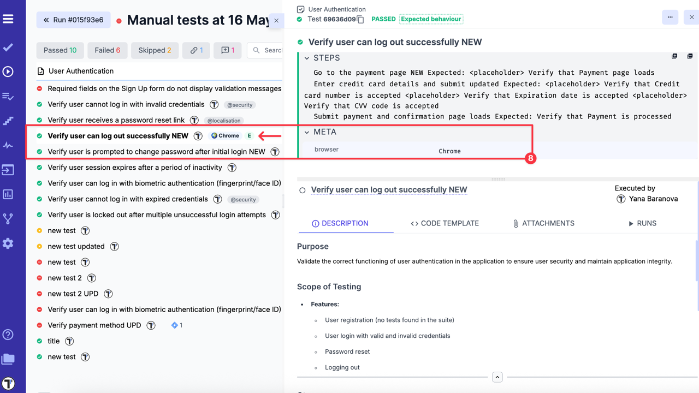

## Best Practices

- Regularly review and update templates to ensure relevance
- Utilize labels and tags strategically for efficient organization
- Encourage collaboration to create standardized templates across teams
