Testomat.io tracks your automated and manual tests, aggregates their statuses history, analyzes them, defines tests by Analytics categories, and shows them to you. You can configure these metrics. Analytics widgets are updated and supplemented with each completed Test Run.

All available widgets are selected and displayed on the main analytics board by default. Customize your board by selecting/unselecting widgets to meet your specific needs.

To change the board view:

1. Go to Settings.
2. Select the widgets you need.
3. Click Save button.

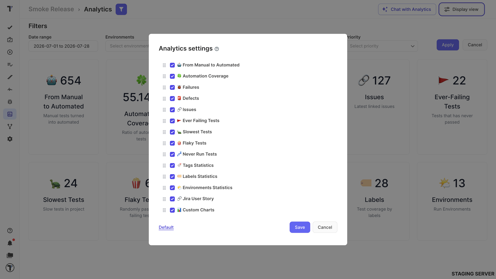

To restore all settings to default:

1. Go to Settings.
2. Click Default.
3. Click Save button.

## AI Analytics Chat

Chat with Analytics is an AI-powered feature that helps to get specific insights from project analytics data. It works across analytics widgets and metrics, and you can quickly access relevant information without manually exploring dashboards. 

:::note

By default, metrics are calculated over a 30-day window unless a different range is specified. 

:::

## Filter by Date range

Analytics data loads for the last 4 weeks by default. You have options to change the date range to suit your specific needs:

1. Specify the range manually by entering a value in the field using a template.
2. Select the desired date range from the drop-down calendar.
3. Choose convenient templates to quickly view your analytics.

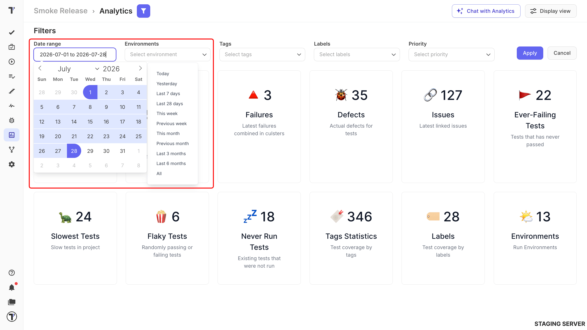

## Automation Coverage

In an Automation Coverage Board where you can track the progress of automation coverage on the project. You can sort your tests by Suite and Automation indicators.

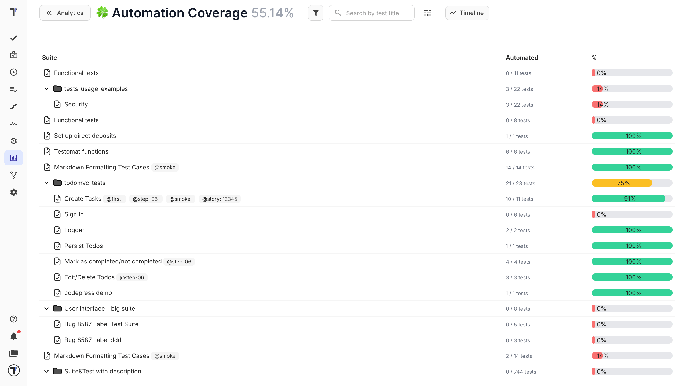

## From Manual to Automated

The **From Manual to Automated** widget tracks how your test suite progresses from manual to automated. It shows how many tests changed state during the selected date range and updates as you change the supported filters, so automation progress is easy to measure and review.

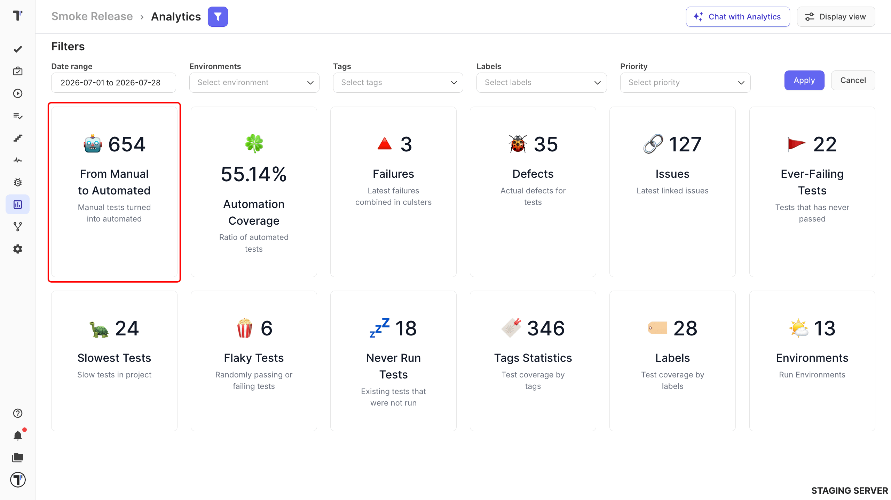

:::note

This widget reports state changes that have already happened. It does not create automated tests and does not change their state.

:::

## Custom Charts

Custom charts allow  to customize the display of the data most relevant to you for **Tests** and **Test Runs**. You can build custom charts using search queries to get a comprehensive view of your testing process, providing visibility into trends, completion metrics, and overall testing performance.

| Metric | What it gives you |
| --- | --- |
| **Environment-Based Metrics** | The number of test runs executed on specific platforms or environments to monitor execution across systems. |
| **Label-Based Metrics** | Tests or test runs tied to a specific label, such as a build version or milestone, for insight into a particular testing context. |
| **Run Duration Analysis** | Average or total duration of test runs over time. |
| **Trends Over Time** | Metrics across a period you select in the timeline settings. |
| **Widgets** | Any chart added to your dashboard as a widget, shown alongside other analytics. |

## Create a Custom Chart

The flow for creating a custom chart is the same for both **Tests and Test Runs**. The only difference is which **Data Source** you select.

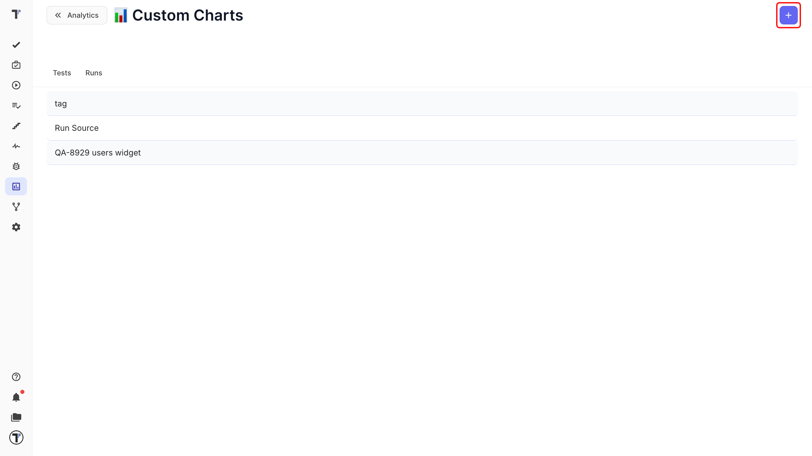

1. Navigate to the **Analytics** tab in the left sidebar.
2. Click **Custom Charts** on the dashboard.
3. Click the **+** button to open a new chart.
4. Enter **Title**.
5. Toggle **As widget** (optional).
6. Enter **Description** (optional).
7. Select **Data Source**:

- **Tests:** for Test data
- **Runs:** for Test Run data

8. Click the **Add Query** button to open the Query Editor:
9. Click the **Save** button — it will appear on your dashboard or as a widget if selected.

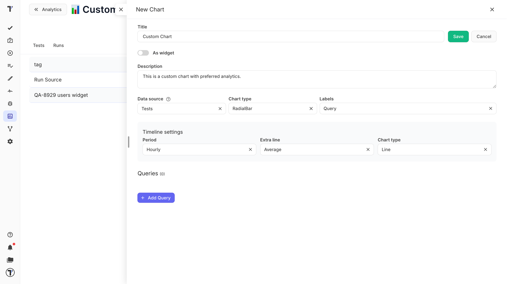

This extended chart functionality enhances your ability to make data-driven decisions by offering insight into both tests and test runs.

### Additional configuration

| Setting | Required | What it does |
| --- | --- | --- |
| **Chart Type** | Required | Chooses how the data is visualized — bar, donut, pie, and so on. |
| **Labels** | Required | Sets how labels are displayed — short query, titles, numbers, title and %, and so on. |

**Timeline settings:**

| Setting | Required | What it does |
| --- | --- | --- |
| **Period** | Optional | Turns on the Timeline to track data changes over a period you select. |
| **Extra Line** | Optional | Adds a second line to compare metrics inside the Timeline. |
| **Chart type** | Optional | Sets the visualization style for the timeline chart only. |

Configure queries according to your metrics using supported query variables [Tests Variables](https://docs.testomat.io/advanced/tql/#tests-variables) and [Runs Variables](https://docs.testomat.io/advanced/tql/#runs-variables).

:::note

By toggling **As widget**, your custom chart will appear as a separate widget on the Analytics dashboard. This allows you to monitor key metrics continuously alongside other analytics without navigating back to the Custom Charts page.

:::

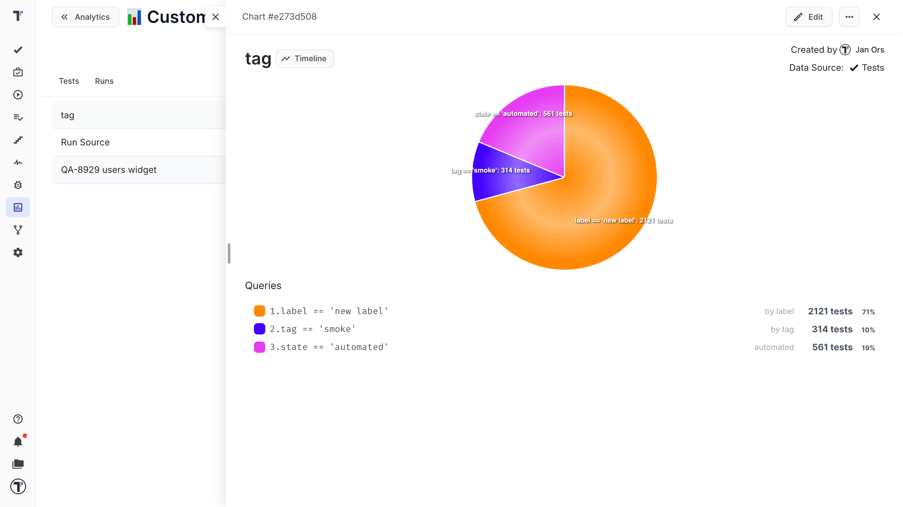

## Customize The Chart View

Custom charts can be tailored to match your reporting needs. You can adjust how chart information is displayed - by modifying labels, colors, and other visual settings. 

### Labels

During chart creation or in the **Edit** mode, select the **Labels** dropdown to customize the information on the chart to your preference.

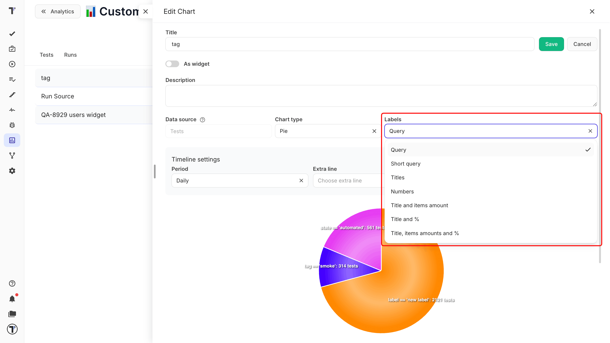

### Color Customization

Personalize the colors of your queries for better data visualization. Use the color palette to choose your preferred shade. Alternatively, enter RGB, HSL, or HEX values manually for precise color selection.

1. Open a Custom Chart you want to customize.
2. Scroll down to the list of queries displayed under the chart.
3. Click the color box next to a query to change its color.
4. After a color picker appears, select a new color.
5. Click the **Save** button to apply changes.

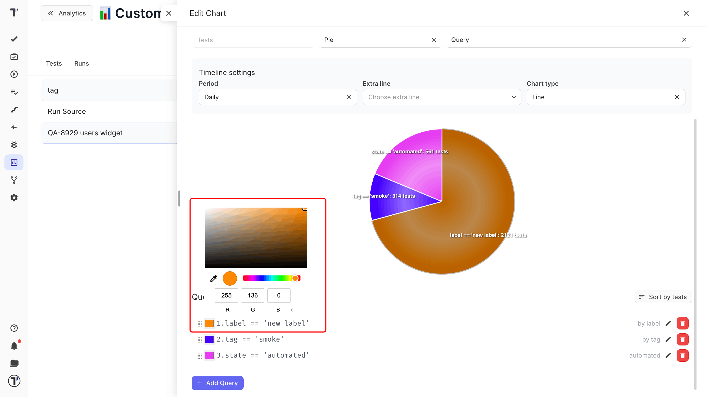

### Duplicate Chart

Quickly create a copy of an existing chart and modify it without starting from scratch

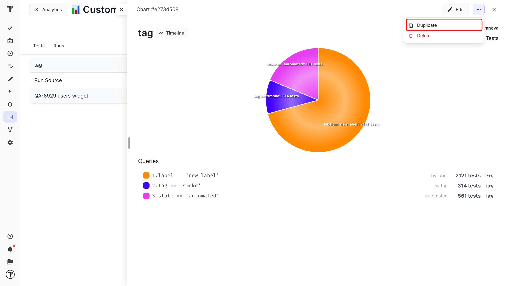

## Sort Queries by Tests/Default 

On Edit Mode, set up the order of queries in the chart. These options give you full control over both the appearance and functionality of your custom charts, making it easier to create professional and insightful visualizations.

## Timeline

**Timeline** is a graphical representation of events or data points in chronological order. It helps in understanding trends, patterns, and changes over time by displaying information in a linear format. Each timeline is associated with a unique URL and can be copied and shared with the project team.

| Step | Events |
| --- | --- |
| **Search Query-Based Timeline** | Set the timeline period based on the test search queries. |
| **Data Collection** | Data collection for the test search queries over the period selected. |
| **Timeline Chart View** | Test metrics changed over time. |

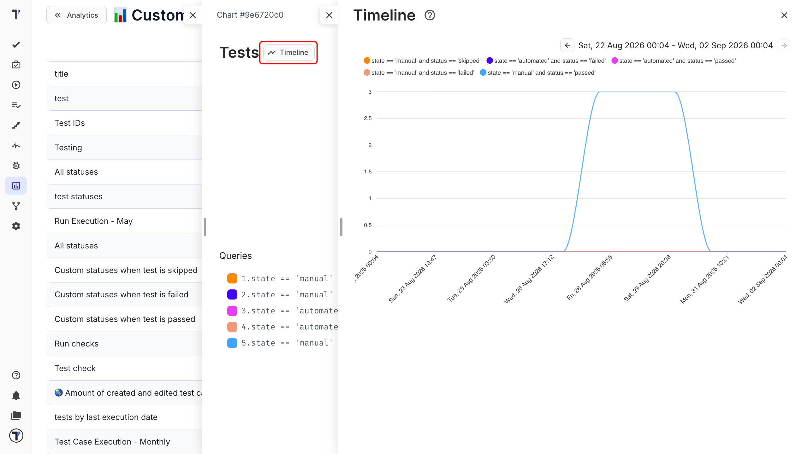

## Failures Board

The Board shows failures from the latest test runs. You can group and sort data in the Failures widget. Defect column allows to see any linked issues right away through IMS links like GitHub, Azure DevOps, or Jira.

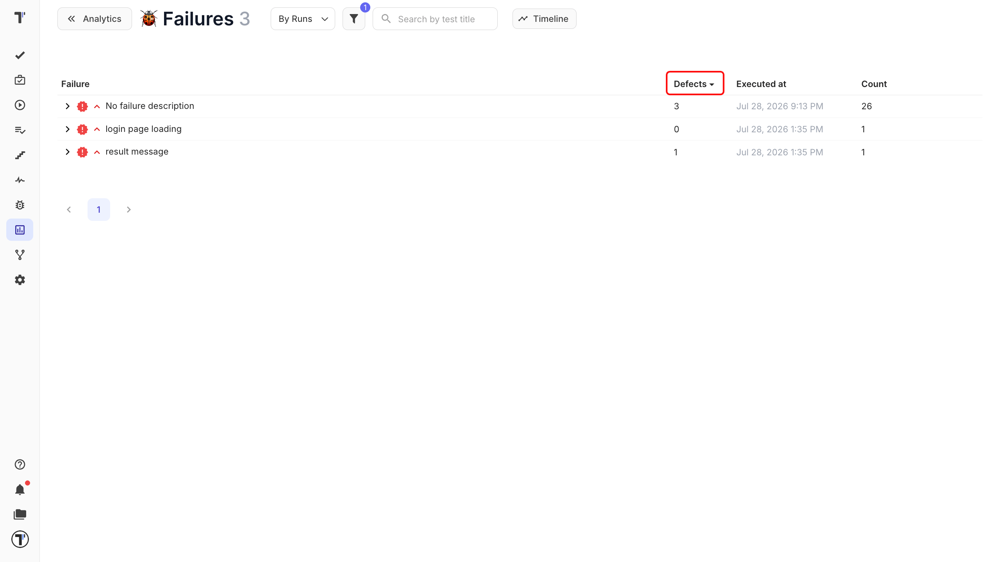

## Issues Board

The Issue Board provides a comprehensive view of all tests, suites and runs associated with an issue. It displays a list of associated test cases and test suites, ensuring visibility of relevant automated or manual tests. This feature helps maintain traceability between issues and tests, making it easier to monitor coverage.

Visit the [Issues Management Systems](https://docs.testomat.io/integration/issues-management-systems/#_top) page to find out which systems Testomat.io supports and how to connect.

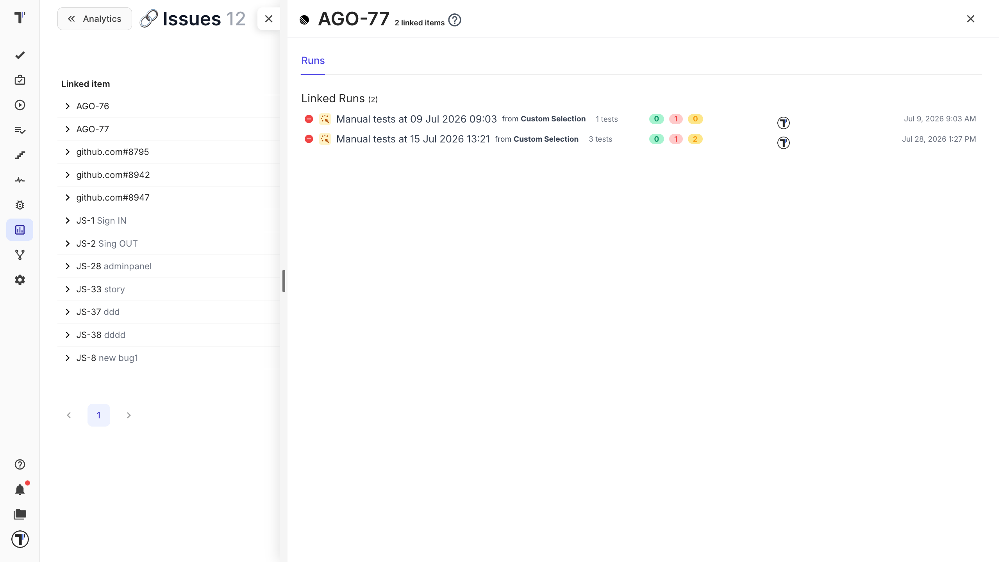

## Defects Board

The Defects report answers a question: which of your tests are blocked, and by what. Each row is a test case, with its defects nested underneath. Expand a test to see every defect holding it back, each with its severity, status, and a link to the tracker. Choose how defects reach a test with the data-source selector:

| Data source | What it shows |
|-------------|---------------|
| **All Defects** | Both routes merged; a defect is counted once even when it is linked twice. |
| **By Tests** | Only defects attached to the test case itself. |
| **By Test Runs** | Only defects raised on that test's runs. |

This separates bugs someone filed against a test from bugs the test actually caught.

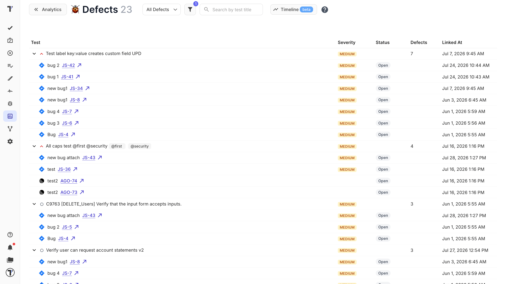

## Flaky Tests

Flakiness is determined by calculating the average value of run statuses for a given test. The method of calculation can be defined based on specific parameters, including a minimum and maximum success rate threshold.

- Minimum Success Rate: Defines the lowest acceptable pass rate to be considered within the flakiness range.
- Maximum Success Rate: Defines the highest acceptable pass rate to be considered within the flakiness range.

Analytics will identify and display tests that have a pass rate falling within the defined range. **The pass rate is calculated based on the last 100 runs.**

If a test has been run 14 times and succeeded 7 times, the success rate is calculated as 50%. Since 50% falls within the defined range (40% to 60%), this test would be considered flaky and displayed in the analytics report.

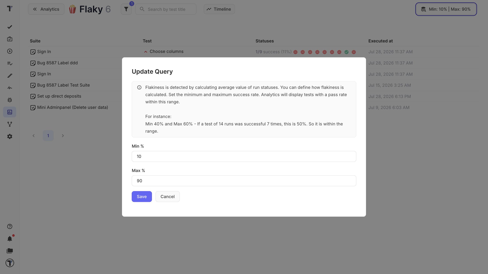

## Slowest Tests

It is well known that automated tests need maintenance and refactoring. The Slowest Tests widget will help you to define such automated tests and help to visualize them. You can sort them by execution duration and passed/failed status to prioritize your work effectively.

## Never Run Tests

There may be tests that were never executed on your project because they simply got lost or forgotten. To avoid such situations we added Never Run Tests that will show you test those ones.

## Ever Failing Tests

Ever Failing Tests is another useful Analytics widget that will show you automated tests that never passed. This feature will help you to pay attention to potential risks in your application.

## Labels Statistics

Labels Statistics is a feature that allows users to visualize test coverage by labels on an interactive chart. 

View information about which tests need to be reviewed, which can be automated, and what impact they have on the system. You can set up [your own labels](https://docs.testomat.io/usage/labels-and-custom-fields/#_top) or use the ready-made ones offered by Testomat.io.

You can filter by Environments, Tags, Labels, Jira issues, Date Range, Priority, as well as search options to quickly find tests by name or other criteria, making it easier to locate specific tests.

The feature allows to export the chart in multiple formats such as PNG, SVG, or CSV, facilitating further analysis or sharing with team members.

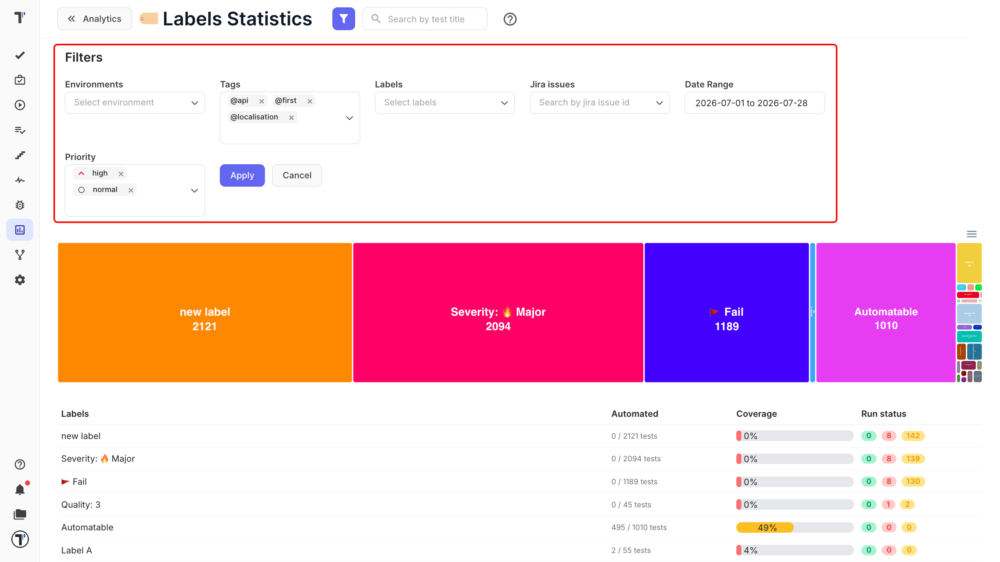

You can evaluate the level of test automation, helping to identify which parts of the testing process are already automated and where additional efforts are needed. Click on the label to open another window with the detailed statistics for a particular label

You can also filter by Tags, Priority and Jira Issues or search for specific tests.

There is a special option to display tests:

- **By Tests** - shows all tests created in the project with this label.
- **By Runs** - only shows tests that have a run result.

## Analytics In Run Reports

We empowered Testomat.io Run Reports with Overview chart, Flaky and Slowests tests widgets, so you receive more essential information in one place at one time.

Overview chart visualizes aggregated tests statuses by suites:

Flaky and Slowests tests widgets show the latest 5 tests and navigate to dedicated Analytics pages:

