As a test management system, Testomat.io Team intends to provide our users with as much valuable testing data as possible. For this purpose, we developed Analytics Feature.

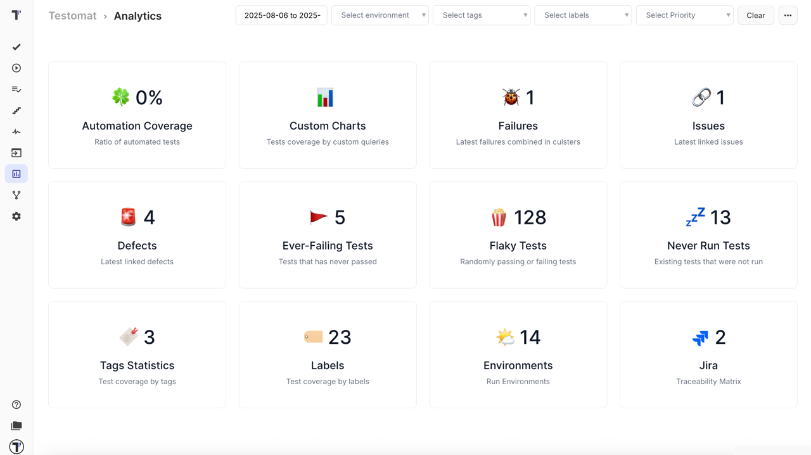

## How Does It Work

Testomat.io tracks your automated and manual tests, aggregates their statuses history, analyzes them, defines tests by Analytics categories, and shows them to you. You can configure these metrics. So you can give a more precise glance to prevent bugs. This also means that Analytics widgets are updated and supplemented with each completed Test Run.

All available widgets are selected and displayed on the main analytics board by default. However, you can customize your board by selecting/unselecting widgets to meet your specific needs.

To change the board view, follow these steps:

1. Go to Settings.
2. Select the widgets you need.
3. Click Save button.

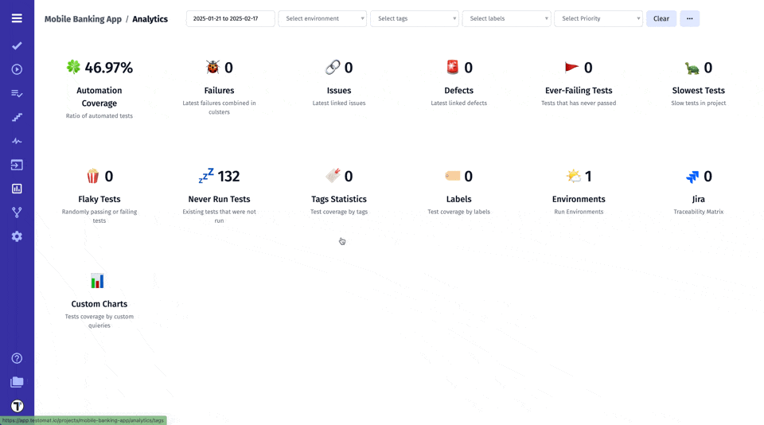

To restore all settings to default:

1. Go to Settings.
2. Click Default.
3. Click Save button.

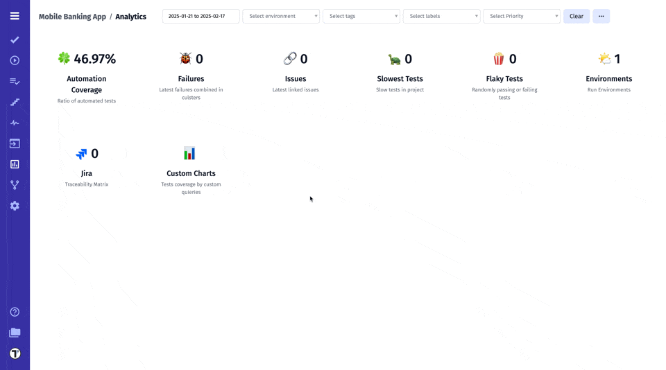

Let's have more close look at each widget!

## AI Analytics Chat
 Chat with Analytics is an AI-powered feature that helps to get specific insights from project analytics data. It works across analytics widgets and metrics, and you can quickly access relevant information without manually exploring dashboards. is specified. Example: ask which tests are most unstable, which areas have the highest failure rate, or how execution trends changed over time.

:::note

By default, metrics are calculated over a 30-day window unless a different range is specified. 

:::

## Analytics range

Analytics data loads for the last 4 weeks by default. But you have the option to change the date range to suit your specific needs.

1. You have the option to specify the range manually by entering a value in the field using a template: `2024-06-30 to 2024-07-27`.
2. Or select the desired date range from the drop-down calendar. The calendar is very flexible and will provide you with accurate analytics for the specified range.
3. You can also choose convenient templates to quickly view your analytics.

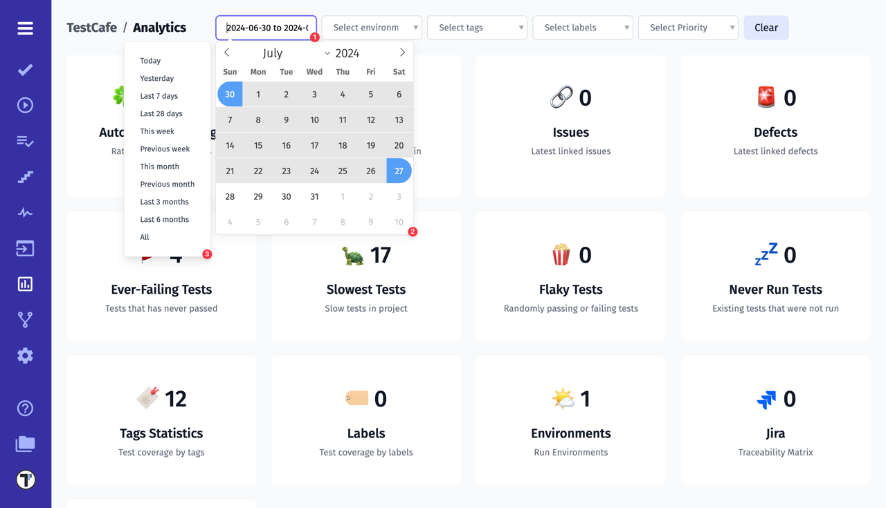

## Automation Coverage

As a management system for automated tests, Testomat.io team created an Automation Coverage Board where you can track the progress of automation coverage on the project. You can sort your tests by Suite and Automation indicators.

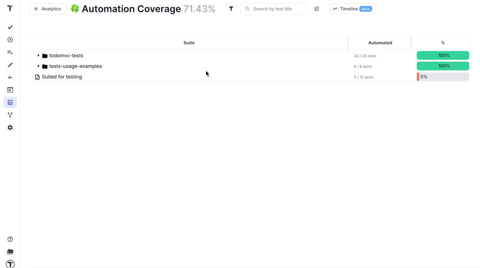

## Custom Charts

Custom charts are a powerful addition to analytics. They allow you to customize the display of the data most relevant to you — not only for **Tests**, but also for **Test Runs**.

You can build custom charts using search queries to get a comprehensive view of your testing process, providing visibility into trends, completion metrics, and overall testing performance.

Custom charts help teams to visualize key testing metrics at a glance:

- **Environment-Based Metrics**: Track the number of test runs executed on specific platforms or environments, helping you monitor execution across systems.
- **Label-Based Metrics**: Track tests or test runs associated with specific labels, such as a build version or milestone, to gain insights into particular testing contexts.
- **Run Duration Analysis**: Visualize average or total duration of Test Runs over time.
- **Trends Over Time**: With timeline settings, track metrics across a selected period.
- **Widgets**: Any chart can be added as a widget to your dashboard, giving a separate view alongside other analytics.

### How to Create a Custom Chart

The flow for creating a custom chart is the same for both **Tests and Test Runs**. The only difference is which **Data Source** you select.

1. Navigate to the **Analytics** tab in the left sidebar
2. Click **Custom Charts** on the dashboard

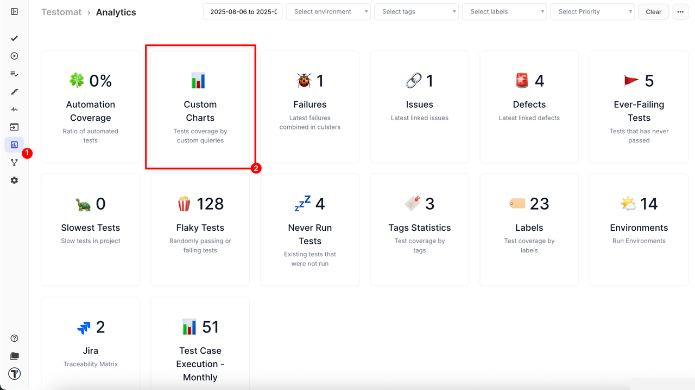

3. Click the **+** button to open a new chart

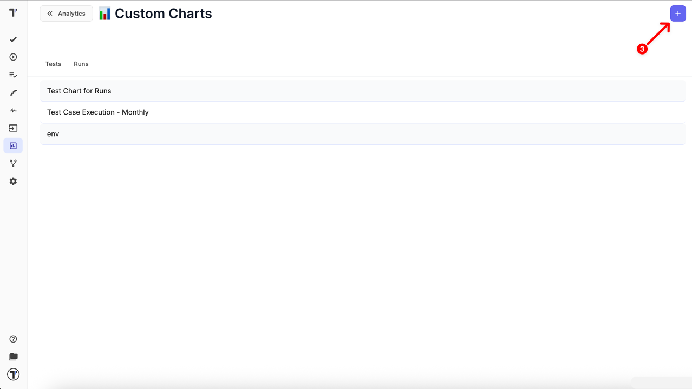

4. Enter **Title** (required)
5. Toggle **As widget** (optional)

:::note

By toggling **As widget**, your custom chart will appear as a separate widget on the Analytics dashboard. This allows you to monitor key metrics continuously alongside other analytics without navigating back to the Custom Charts page.

:::

6. Enter **Description** (optional)
7. Select **Data Source**: (required)

- **Tests:** for Test data
- **Runs:** for Test Run data

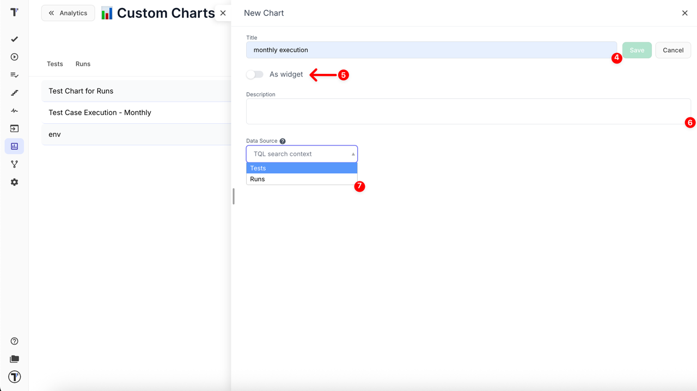

After selecting the Data Source, additional configuration options appear:

8. **Chart Type** (required) – choose how data will be visualized (bar, donut, pie, etc.)
9. **Labels** (required) – customize the display of labels (short query, titles, numbers, title and %, etc.)

**Timeline settings:**

10. **Period** (optional) – enable Timeline to track data changes over a selected period
11. **Extra Line** (optional) – add an additional line to compare metrics within the Timeline
12. **Chart type** (optional) – select the visualization style specifically for the timeline chart
13. Click the **Add Query** button to open the Query Editor:

Configure queries according to your metrics using supported query variables:

- [Tests Variables](https://docs.testomat.io/advanced/tql/#tests-variables)
- [Runs Variables](https://docs.testomat.io/advanced/tql/#runs-variables)

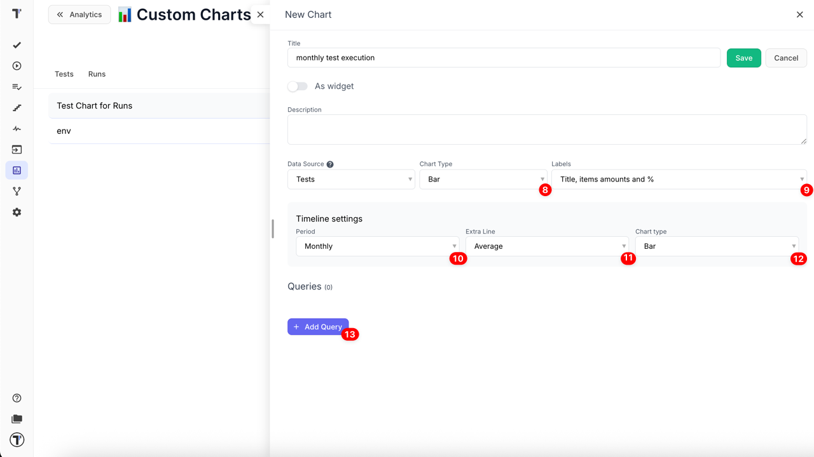

14. Click the **Save** button — it will appear on your dashboard or as a widget if selected.

This extended chart functionality enhances your ability to make data-driven decisions by offering insight into both tests and test runs.

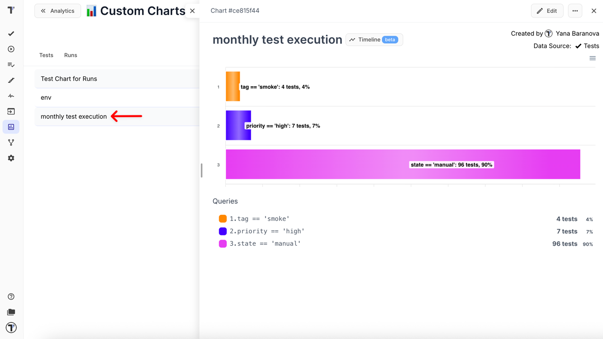

### How To Customize The Chart View

Custom charts can be tailored to match your reporting needs. In this section, you can adjust how chart information is displayed — by modifying labels, colors, and other visual settings. These options help make your data easier to read and interpret.

- **Labels**

During chart creation or in the **Edit** mode, select the **Labels** dropdown to customize the information on the chart to your preference:

For example, if a query `state == 'manual' and status == 'passed'` has been selected:

| **Label**                  | **View**                                                 |
| -------------------------- | -------------------------------------------------------- |
| Query                      | `state == 'manual' and status == 'failed': 9 tests`      |
| Short query                | `state == 'manual' and status ...: 9 tests`              |
| Titles                     | `state == 'manual' and status == 'failed'`               |
| Numbers                    | `9`                                                      |
| Title and items amount     | `state == 'manual' and status == 'failed': 9 tests`      |
| Title and %                | `state == 'manual' and status == 'failed': 1% `          |
| Title, items amounts and % | `state == 'manual' and status == 'failed': 9 tests, 1% ` |

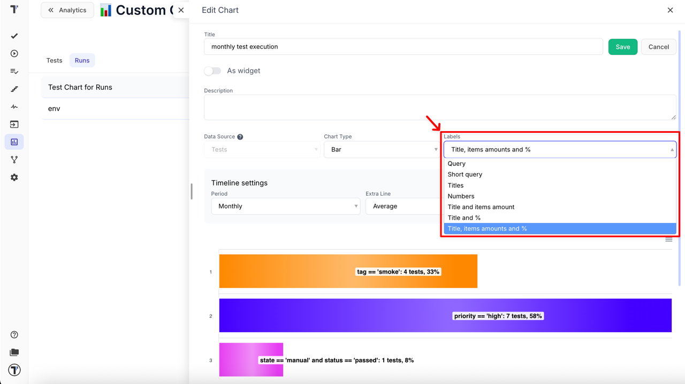

- **Color Customization**

In addition to customizing labels, you can also personalize the colors of your queries for better data visualization. To do this, follow these steps:

1. Open a Custom Chart you want to customize
2. Scroll down to the list of queries displayed under the chart

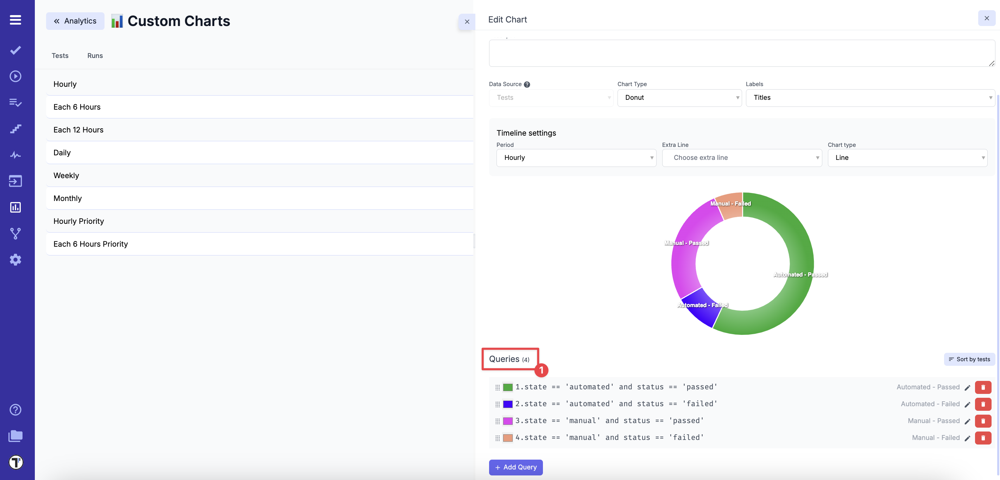

3. Click the color box next to a query to change its color
4. After a color picker appears, select a new color

- Use the color palette to choose your preferred shade
- Alternatively, enter RGB, HSL, or HEX values manually for precise color selection

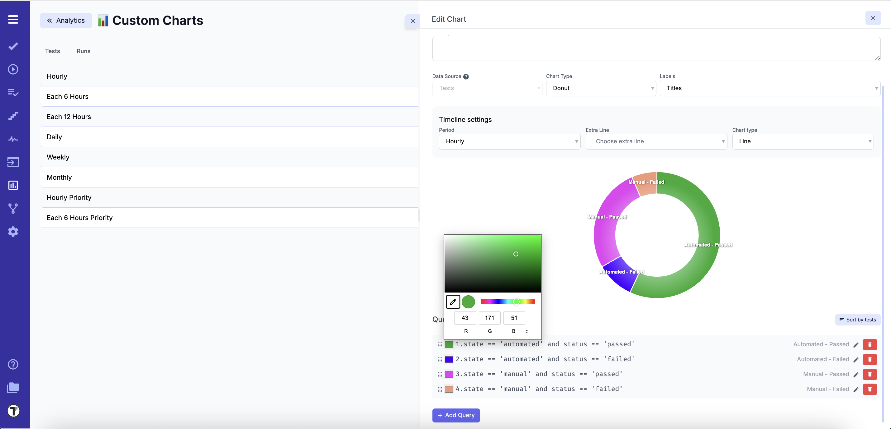

Once selected, the chart will automatically reflect the applied color.

5. Click the **Save** button to apply changes

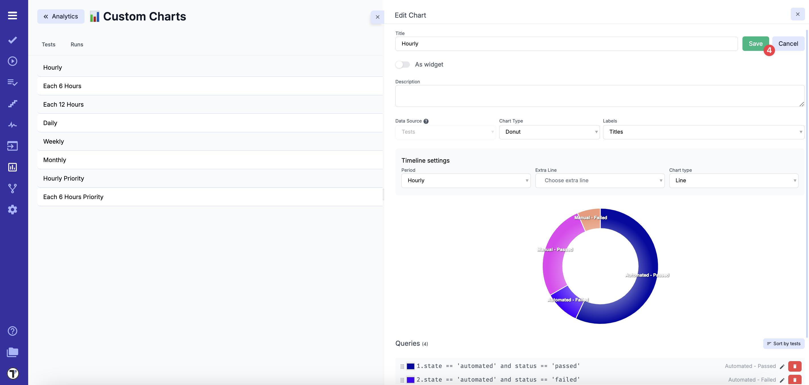

This feature gives you greater control over the visual presentation of your custom charts by allowing you to select colors for each query.

- **Additional Features:**

  - **Duplicate Chart**: Quickly create a copy of an existing chart and modify it without starting from scratch

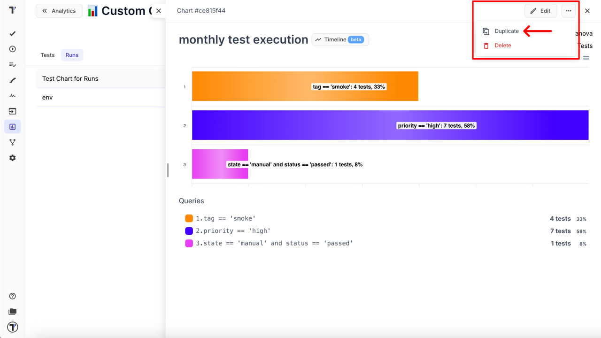

- **Download Chart**: Download your chart as **SVG, PNG, or CSV** for reporting or sharing

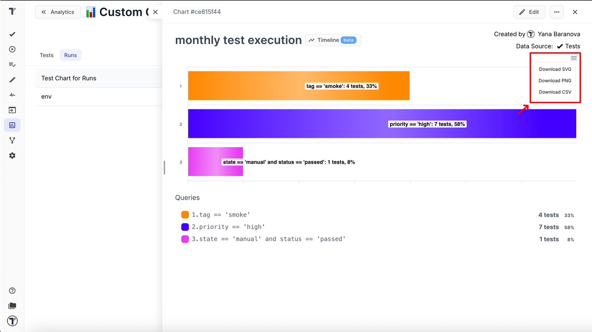

- **Sort Queries by Tests/Default**: On Edit Mode, set up the order of queries in the chart

These options give you full control over both the appearance and functionality of your custom charts, making it easier to create professional and insightful visualizations.

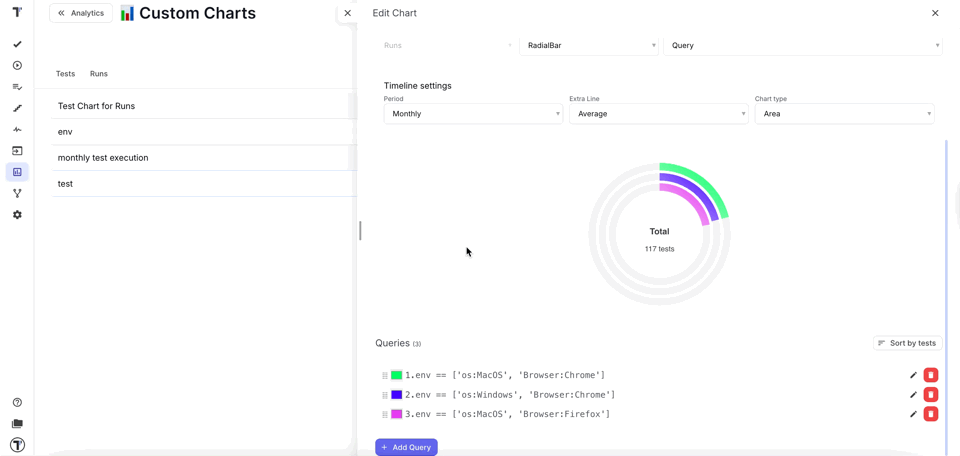

### Timeline

**Timeline** for Custom Charts, a feature that allows you to visualize data trends over a specified period. A timeline is a graphical representation of events or data points in chronological order. It helps in understanding trends, patterns, and changes over time by displaying information in a linear format.

- Search Query-Based Timeline: When creating custom charts, you can now set up a timeline period based on your test search queries.
- Data Collection: Testomat.io will collect data for the specified test search queries over the selected period.
- Timeline Chart View: The collected data is displayed in a timeline chart view, providing a clear visual representation of how your test metrics evolve over time.

This feature enhances your ability to track progress, identify trends, and make informed decisions based on historical test data.

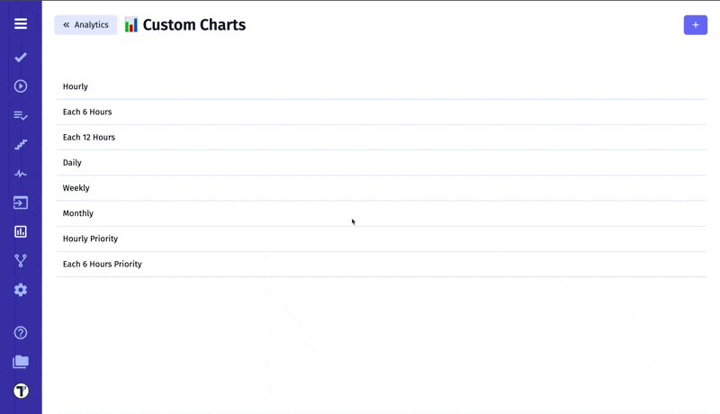

Each timeline is associated with a unique URL, which can be copied and shared with other members of the project team.

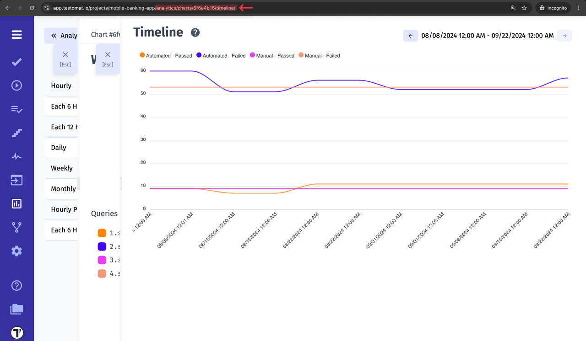

:::note

Timeline feature is also available for other widgets, such as:

- Automation Coverage
- Failures
- Issues
- Defects
- Ever Failing Tests
- Flaky Tests
- Jira

:::

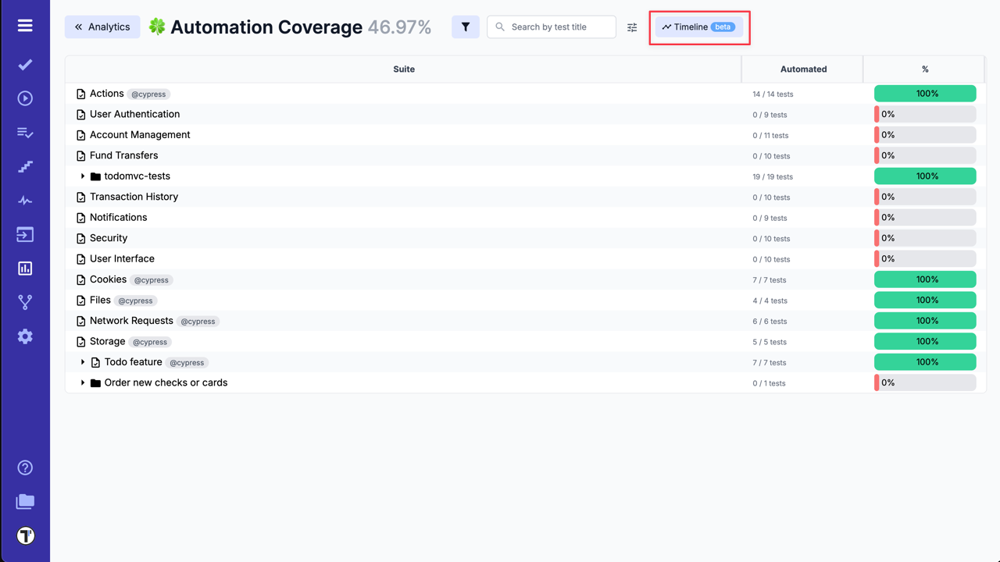

## Failures Board

To make it easier for your team to track what's going on in the project, we’ve added a Failures Board. It shows failures from the latest test runs and lets you quickly jump to the suite, the test run, or the failed test itself. You can now also group and sort failures in the Failures widget to help make sense of the data faster. On top of that, there’s a new Defect column, so you can see any linked issues right away through IMS links like GitHub, Azure DevOps, or Jira.

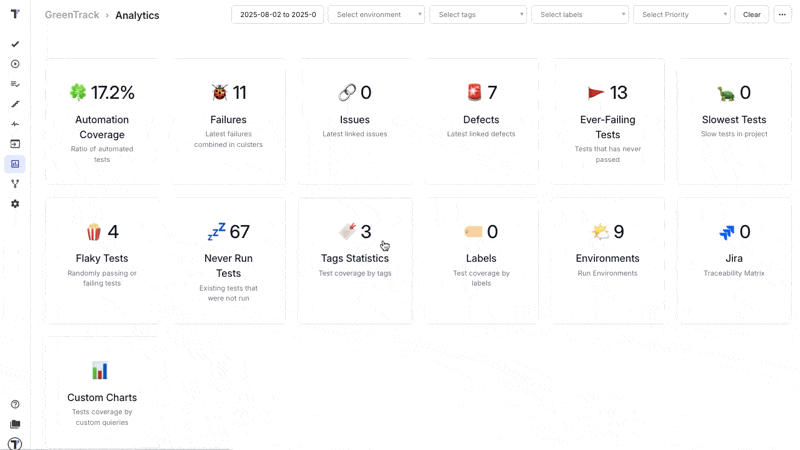

## Issues Board

The Issue Board provides a comprehensive view of all tests, suites and runs associated with an issue. It displays a list of associated test cases and test suites, ensuring visibility of relevant automated or manual tests. This feature helps maintain traceability between issues and tests, making it easier to monitor coverage.

Visit the [Issues Management Systems](https://docs.testomat.io/integration/issues-management-systems/#_top) page to find out which systems Testomat.io supports and how to connect.

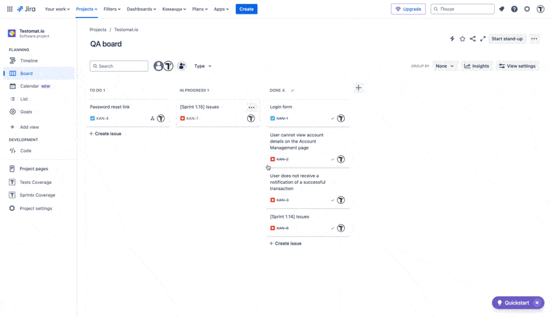

## Flaky Tests

There may be some unstable automated tests on your project that sometimes fail and sometimes pass.

**How does it work?**

Flakiness is determined by calculating the average value of run statuses for a given test. The method of calculation can be defined based on specific parameters, including a minimum and maximum success rate threshold.

- Minimum Success Rate: Defines the lowest acceptable pass rate to be considered within the flakiness range.
- Maximum Success Rate: Defines the highest acceptable pass rate to be considered within the flakiness range.

Analytics will identify and display tests that have a pass rate falling within the defined range. **The pass rate is calculated based on the last 100 runs.**

Example:

- Minimum Success Rate: 40%
- Maximum Success Rate: 60%

If a test has been run 14 times and succeeded 7 times, the success rate is calculated as 50%. Since 50% falls within the defined range (40% to 60%), this test would be considered flaky and displayed in the analytics report.

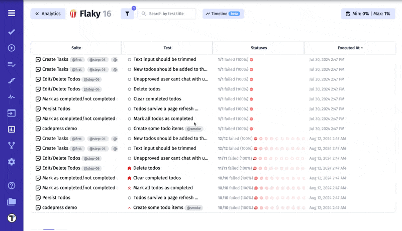

## Slowest Tests

It is well known that automated tests need maintenance and refactoring. The Slowest Tests widget will help you to define such automated tests and help to visualize them. You can sort them by execution duration and passed/failed status to prioritize your work effectively.

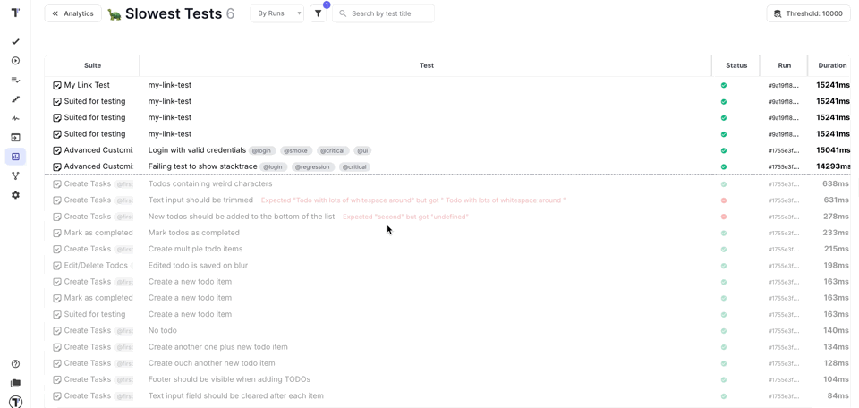

## Never Run Tests

There may be tests that were never executed on your project because they simply got lost or forgotten. To avoid such situations we added Never Run Tests that will show you test those ones.

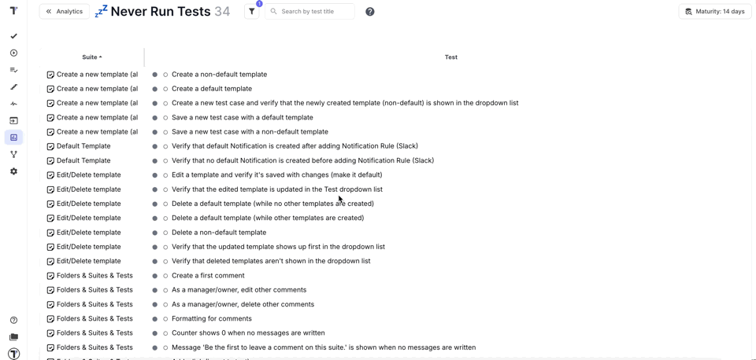

## Ever Failing Tests

Ever Failing Tests is another useful Analytics widget that will show you automated tests that never passed. This feature will help you to pay attention to potential risks in your application.

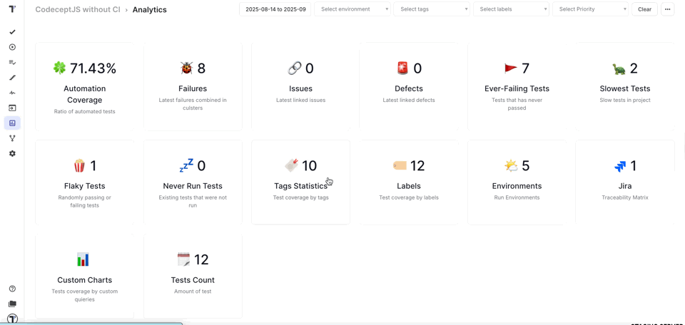

## Labels Statistics

Labels Statistics is a feature that allows users to visualize test coverage by labels on an interactive chart. It provides an efficient way to analyze and track the status of testing with the following capabilities:

- **Label coverage visualization:** you can view information about which tests need to be reviewed, which can be automated, and what impact they have on the system. You can set up your own labels or use the ready-made ones offered by Testomat.io. To learn how to add labels to the project, visit a [dedicated page](https://docs.testomat.io/usage/labels-and-custom-fields/#_top).

- **Test filtering (1) and search (2):** for convenience, there is filtering by Environments, Tags, Labels, Jira issues, Date Range, Priority, as well as search options to quickly find tests by name or other criteria, making it easier to locate specific tests.

- **Chart download (3):** the feature allows to export the chart in multiple formats such as PNG, SVG, or CSV, facilitating further analysis or sharing with team members.

- **Automation coverage analysis:** you can evaluate the level of test automation, helping to identify which parts of the testing process are already automated and where additional efforts are needed.

This tool enables teams to manage the testing process more efficiently, quickly identify issues, and optimize automation efforts.

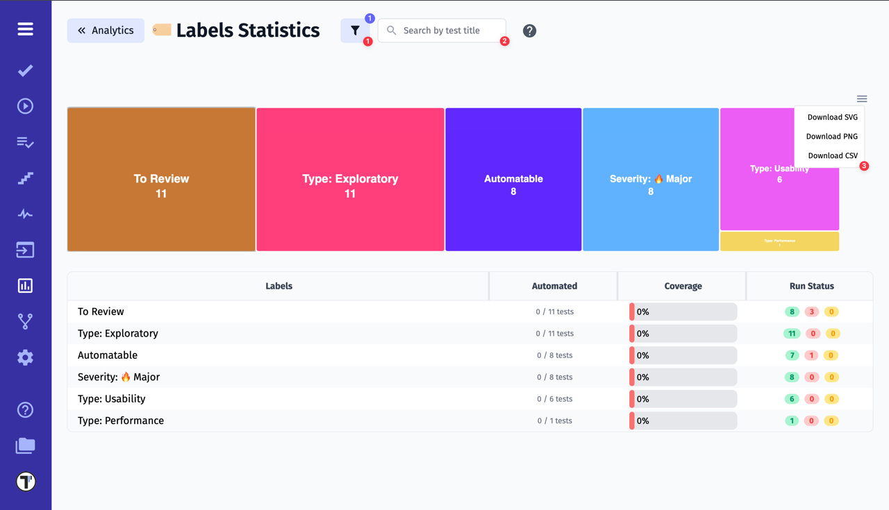

Another big plus is the detailed statistics for a particular label. Click on the label to open another window with options.

You will see all tests with this label. You can also filter **(2)** by Tags, Priority and Jira Issues or search **(3)** for specific tests.

Additionally, there is a special option **(1)** to display tests:

- **By Tests** - shows all tests created in the project with this label.
- **By Runs** - only shows tests that have a run result.

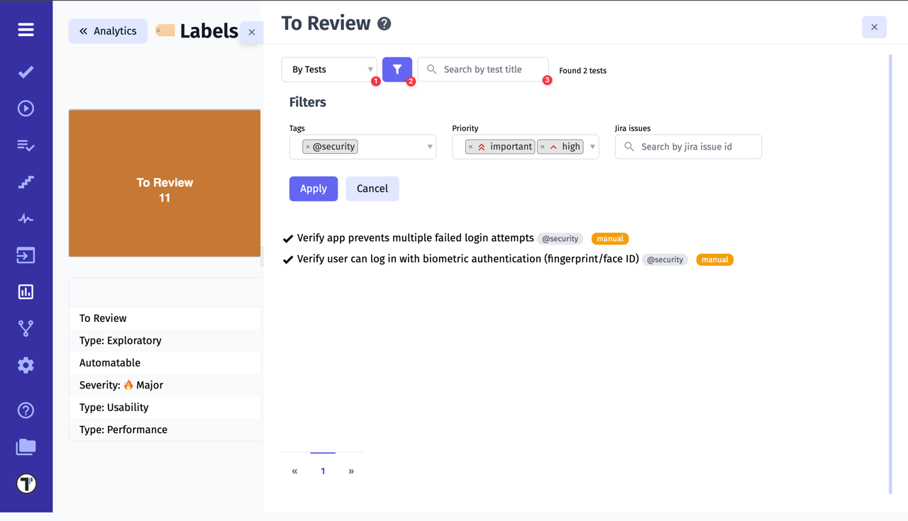

## Analytics In Run Reports

We empowered Testomat.io Run Reports with Overview chart, Flaky and Slowests tests widgets, so you receive more essential information in one place at one time.

Overview chart visualizes aggregated tests statuses by suites:

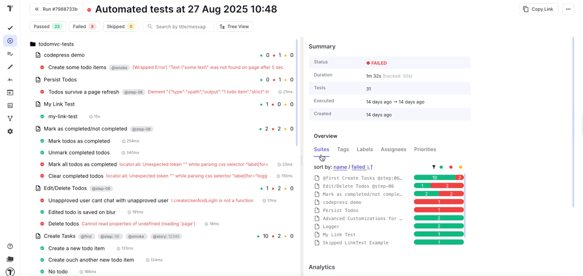

Flaky and Slowests tests widgets show the latest 5 tests and navigate to dedicated Analytics pages:

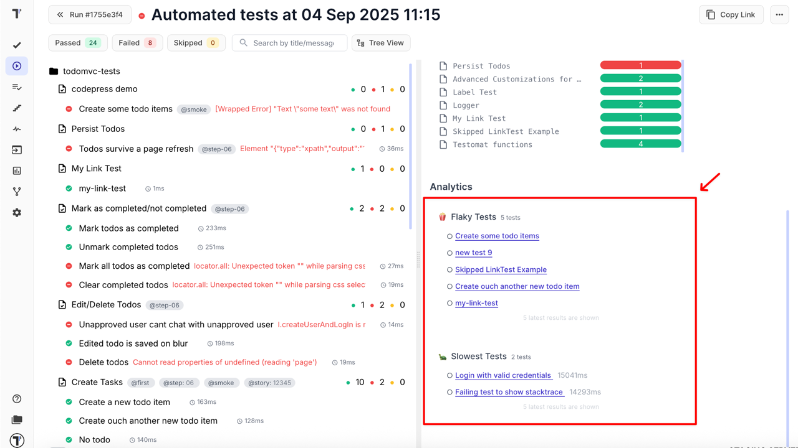
