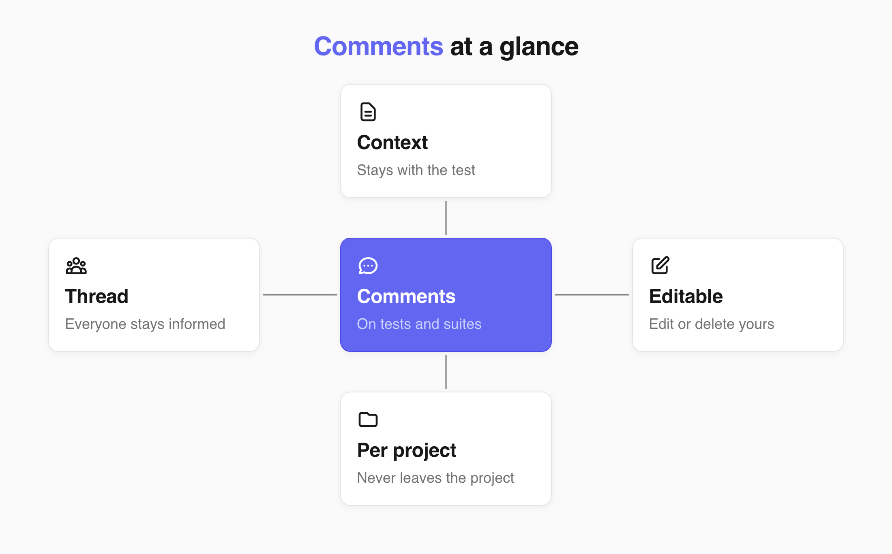

Comments are for your work convenience. Comments keep a discussion next to the test it is about. 

Everyone who opens the test later sees the context, and everyone already in the thread knows when it updates.

## Comment on a test or suite

1. Open the test or the suite you want to discuss.
2. Open the **Comments** tab.
3. Enter your comment.
4. Click **Comment**.

Your comment appears in the thread with your name and the time you posted it. Everyone who has already commented there is notified that the conversation has updated.

:::note

To pull one specific person in, mention them with `@`. See [Mentions and notifications](./mentions-and-notifications.md).

:::

## Edit or delete a comment

You can edit or delete your own comments after posting. 

Editing also lets you remove a mention you no longer need. To edit a comment:

1. Open the test or the suite you want to discuss.
2. Open the **Comments** tab.
3. Edit your comment.
4. Click **Update**.

:::caution[Important]

Deleting a comment removes it from the thread for everyone. This cannot be undone.

:::

## Comments in shared projects

Comments are always project-specific. When a suite or test [is shared](https://docs.testomat.io/project/tests/other-features-for-test-case-design/#sharing-tests-suites-and-folders) with another project, its comments are not transferred with the shared tests.

:::note

The same applies in the other direction: a comment left in a target project is not visible in the source project.

:::

## Next steps

- [Mentions and notifications](./mentions-and-notifications.md)
- [Running tests manually](https://docs.testomat.io/project/runs/running-tests-manually)
- [Other Features for Test case Design](https://docs.testomat.io/project/tests/other-features-for-test-case-design)
