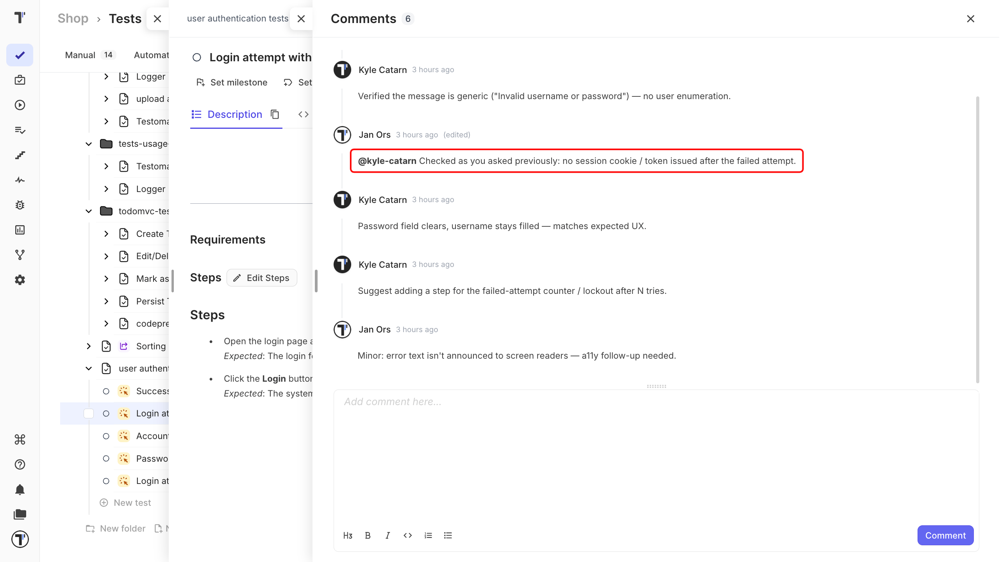
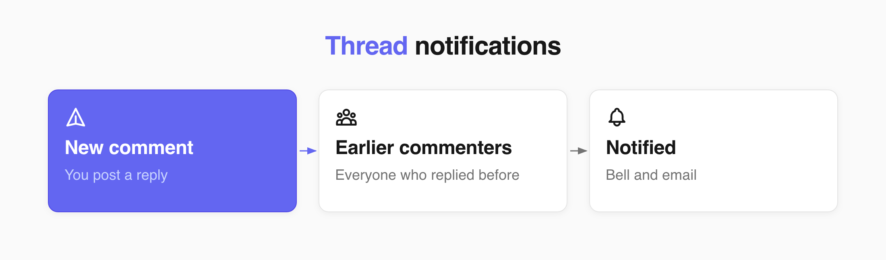

## Mention a teammate

A mention invites the teammate to a comment. The teammates are notified right away.

Mentions work inside a comment on a test or a suite.

1. Open the **Comments** tab on the test or the suite.
2. Type `@` in the comment field.
3. Start typing a name to filter the list.
4. Select the teammate you need.
5. Enter the rest of your comment and click **Comment**.

The person you mentioned is notified at once.

:::note

Only people invited to the current project appear in the list. A teammate who is not a member of the project cannot be mentioned.

:::

To delete, edit or remove the comment see [Comments](./comments.md).

## Thread notifications

A thread keeps everyone already involved in the loop. When you post a comment on a test or suite, everyone who has commented it before is notified.

## The notifications bell

You can see the new notification on the left in the side bar. A red dot appears on the notification bell when you receive a new comment or mention.

Each notification shows who wrote it, a preview of the comment, and the test/suite it is about. Click it to mark it read and open the thread.

## Email notifications

Email notifications are on by default for everyone.

You can set the email notifications in your account settings. For this you need to mark the **Email notifications for mentions and threads** checkbox.

## Next steps

- [Comments](./comments.md)
- [Milestones](https://docs.testomat.io/advanced/milestones)
- [Pulse](https://docs.testomat.io/project/pulse)
