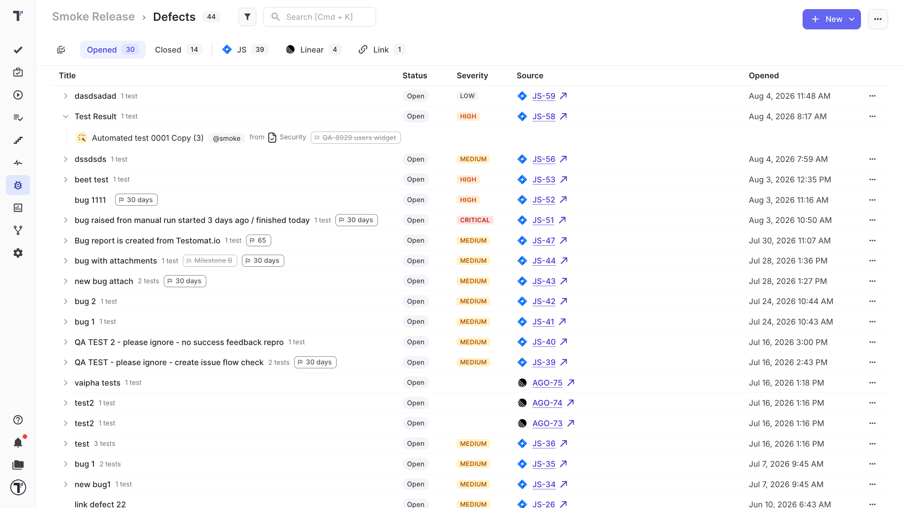
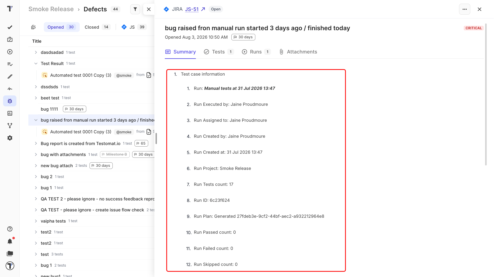
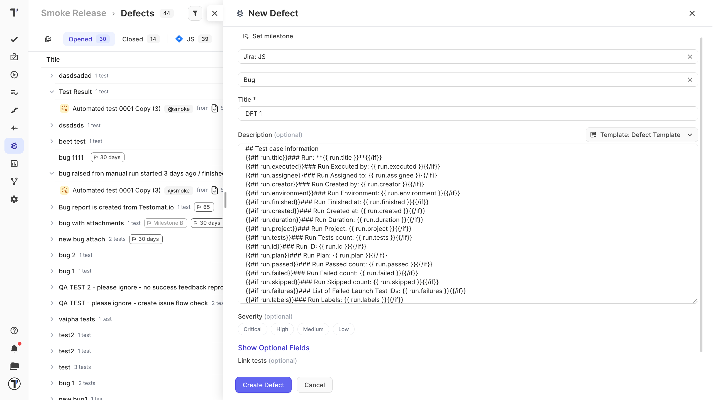

Every project has a **Defects** page that lists the tracker issues raised against your failing tests. Titles, descriptions, comments, status, and severity stay in step with the tracker, so the page tells you the truth about a defect without Jira.

## Triage the list

**Opened** and **Closed** tabs split the work in two. Further tabs break it down by where the issues live - each connected Jira project, plus GitHub, GitLab, Linear, Azure, YouTrack, and plain links.

To narrow the list:

* Filter by state, source, severity, milestone, or the date a defect was opened.
* Search by title or issue key.

Every row shows its status, severity, and a link straight to the tracker. Expand a defect to see the test cases it affects inline, with their priority, tags, and suite, so you can see how much of your suite one bug is touching.

## Open a defect in detail

Open a defect in full to see its description and comments rendered alongside its affected tests, runs, and test runs. You can attach files, and they travel back to the tracker issue.

## Raise a defect

Most defects appear on their own: attach a tracker issue to a failed test result, and the [defect is created](https://docs.testomat.io/integrations/issues-management/#how-to-create-defect-for-failed-test) for you.

To raise one from the Defects page:

1.  Click **New**.
2.  Enter the title, description, and severity.
3.  Link the tests and milestones you want on the same form.
4.  Click **Create**.

The **New** button creates a real issue in your tracker, filed as a **Bug** with the priority mapped across. 

To prefill the title and description, set up a [defect template](https://docs.testomat.io/management/project/templates/#applying-templates-to-defects) first.

## Detached defects

If an issue is later deleted in the tracker, its defect is marked detached and dimmed rather than vanishing quietly. Once you have reviewed them, a single action clears out the detached ones.

## Next steps

- [Issues Management Systems](https://docs.testomat.io/integrations/issues-management/)
- [Defect templates](https://docs.testomat.io/management/project/templates/#applying-templates-to-defects)
- [Analytics](https://docs.testomat.io/project/analytics/)
