## Export & Version Control Manual Tests in Git (Markdown Support)

You can now **export your manual tests as Markdown files directly into your Git repository** and keep them under version control by using **'Export to Markdown'** feature.

This allows your team to write, edit, and track changes to manual test cases just like code — with full history, branching, and collaboration benefits that Git offers.

**Key benefits:**

- **Export manual tests to Markdown** – keep human-readable test cases in your repository.
- **Import manual tests via CLI** – instantly sync Markdown changes from Git into Testomat.io.
- **Version control for manual tests** – review, revert, and track changes over time.
- **Write and modify in your editor** – use your favorite IDE to create or update test cases.

## How to Export Manual Tests to Markdown

To begin managing your manual test cases as files:

1. Create a directory on your computer where you want to export the tests.

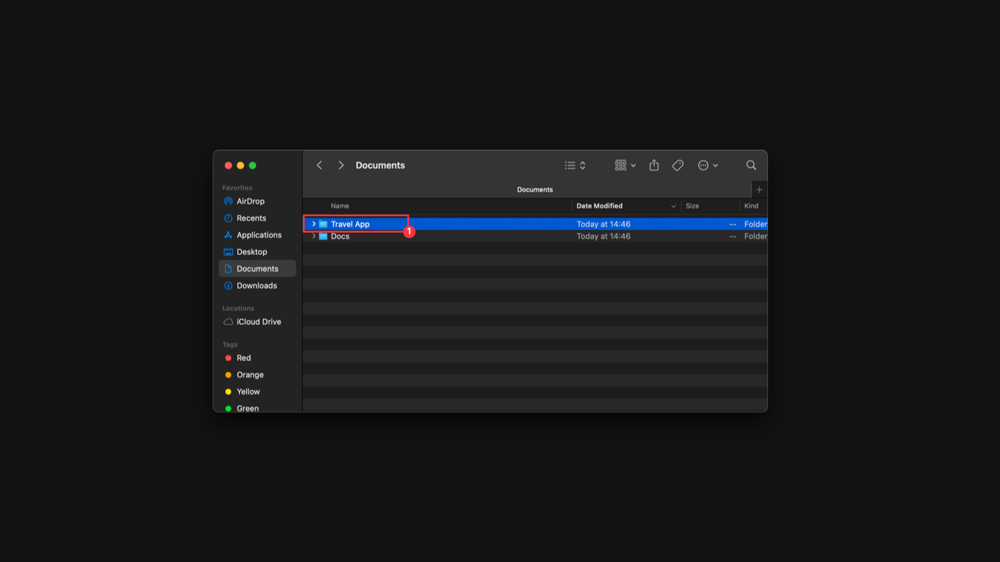

2. Open Terminal with the created project directory.

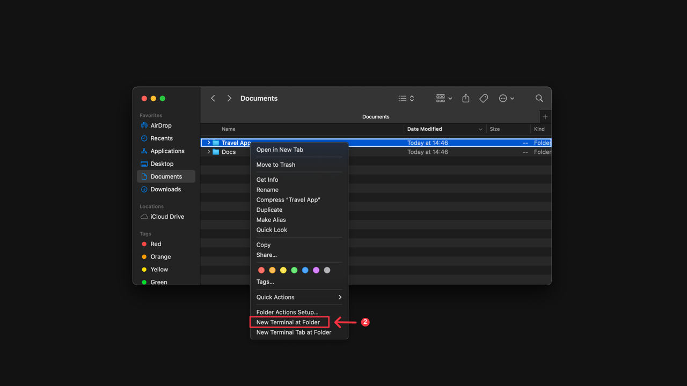

3. Open your project in Testomat.io on **'Tests'** page.
4. Click **'Extra menu'** button.
5. Select **'Export to markdown'** option.


6. Select your OS from the dropdown list.
7. Copy the displayed pull command.


8. Run the export command in your project directory to download tests from Testomat.io.

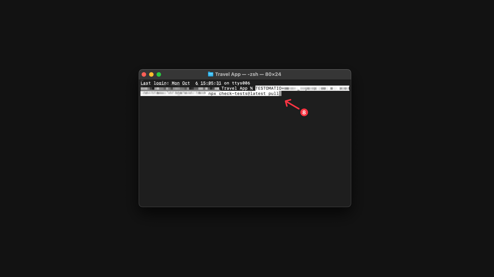

Congrats! Your tests are downloaded from Testomat.io and created in Markdown format. 


Now you can find your project in the previously created folder.

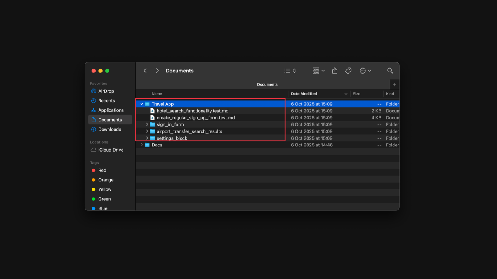

**What Gets Exported?**

- All test suites and tests from your current project.
- Test IDs, descriptions, priorities, labels, tags and structure are preserved in the generated files.

To continue working with your manual test cases and manage them locally as files, it’s highly recommended to use **Git Version Control**.

In order to do this, you need:

1. Open the directory with exported tests in your text editor.


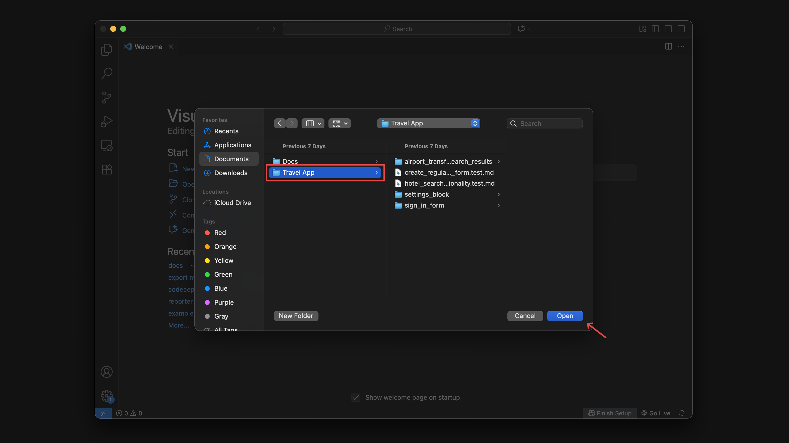

2. Run `git init` command in the Terminal.
3. Go to **'Source control'** tab in your editor.
4. Stage all changes.
5. Click **'Commit'** button.

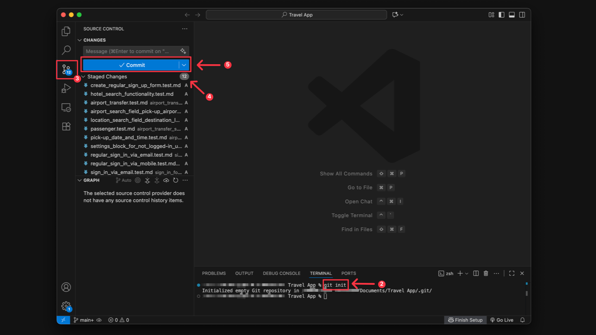

6. Confirm your action to commit changes.


Your tests now reside right next to your application code in Git, so you can start updating exported suites and test cases, adding new ones, or deleting irrelevant tests.


## User Scenario for Export to Markdown

Imagine you’re working on a new product release and your QA team collaborates closely with developers.
Instead of switching back and forth between Testomat.io and your code editor, the **manual test cases** live right next to your application code in Git.

- A developer spots a missing step in a test case and updates the Markdown file in their branch.
- The change is committed, reviewed in a pull request, and merged into main.
- The updated test case is automatically synced back into Testomat.io via CLI.

This workflow makes test case management seamless, collaborative, and fully traceable — aligning your manual testing process with modern DevOps practices.

## User Scenario for Mixed Projects

If you are working on a Mixed project (have both manual and automation tests), with **Export to Markdown** feature you can export your manual tests to the same directory as your automation tests. This will allow you to manage all tests in one place.

## Folder Naming and Normalization Rules

When organizing your projects, ensure that folder names adhere to the following naming conventions to maintain compatibility during import and export processes.

**In folder names, you can use:**
**Allowed Characters**
- Any Unicode letters (Multiple languages supported).
- Digits (0-9).
- Spaces.
- Underscore `_`.
- Hyphen `-`.
- Dot `.`.

**Prohibited Characters:** All other special characters or symbols not listed above are strictly forbidden.

**Automatic Normalization**
To ensure consistent file paths, Testomat.io applies the following normalization rules:
- **Consolidation:** Multiple consecutive spaces, underscores, hyphens, or dots are transformed into a single entity. (Example: `...` becomes `.`).
- **Trimming:** Any spaces, underscores, or dots at the beginning or end of a folder name are automatically removed.

:::note

Visit [Classical Tests Markdown Format](https://docs.testomat.io/project/import-export/export-tests/classical-tests-markdown-format/) page to read about the correct structure for your suites and tests in the markdown format.

:::

## What You Can Do with Tests Exported as Files

After your project is downloaded to Markdown you can:

- Create new tests and suits.
- Update existing tests, including using **Bulk Edit** to modify multiple tests (add/change tags, labels, custom fields, assignee or priority).
- Delete tests that are no longer relevant.
- Change Project structure.
- Work with Dynamic parameters.

### Create New Suites/Tests

Each suite is represented as a single markdown file. All metadata is written as inside comments.

To create a new test in a file, you need to add:

1. The **Test Header** (required)

```
<!-- test -->
```

**Test Header** elements can include:

- **Email of test creator** (if not added, defaults to 'Unknown user').
- **Priority**: low, normal, high, important, ctitical (if not set up, defaults to 'normal').
- **Tags** (optional) - can be added in the header or test title. You can create and add new Tags, or use existing.
- **Labels and Custom Fields** (optional) - can only be added in the header. **Important!** You can only use Labels and Custom fields that already exist 

in your project.

2. Test title (Starts with `#`).
3. Test description with Requirements, Pre-conditions, Steps and Expected Results in Markdown format.

:::note

Don't add the ID as it will be created automatically after tests are synced into Testomat.io.

:::

**Example of structure for Test Case:**

```
<!-- test
priority: high
creator: creator_email@gmail.com
tags: @user, @update
labels: smoke
-->

# Test Title

### Requirements

### Steps

1. Step 1
  **Expected Result**: For Step 1.

2. Step 2
  **Expected Result**: For Step 2.

3. Step 3
  **Expected Result**: For Step 3.
```


The **Header** for Suites has a similar format:

```
<!-- suite
emoji: 
labels:
-->
```
### Update Existing Suites/Tests

Update the description for an existing suite/test in the markdown format.
If you need to change/add a specific Step, Pre-condition, Priority, Tags, Labels, etc. for multiple tests, you can do this using **Bulk edit**.


:::note

Avoid renaming folders or suites within the directory structure, as this may disrupt the Project structure upon import. To change a suite name, edit it within the Markdown file header or directly in Testomat.io.

:::

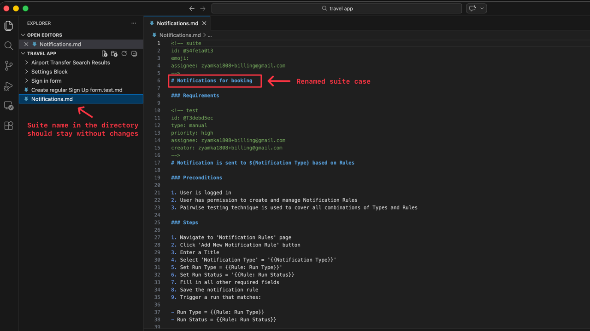

| **Suite Name Before**             | **Suite Name After**             |
| --------------------------- | ------------------------------------- |
| 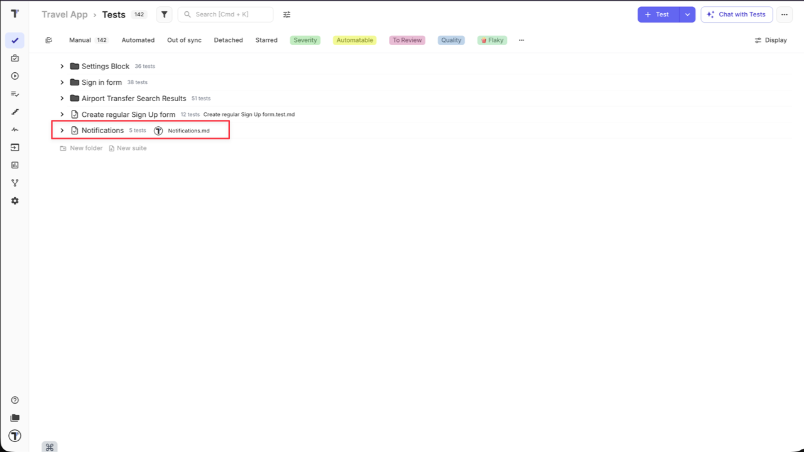 | 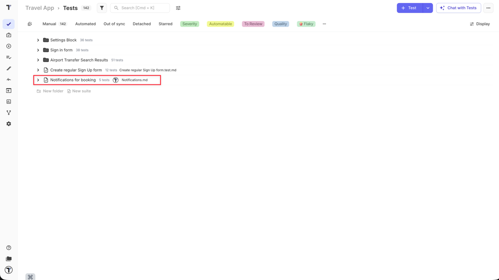 |

### Delete Irrelevant Tests

Simply delete the irrelevant suites/tests from the file and save the changes before the import process.

### Change Project Structure

Project structure **cannot** be modified by moving folders or suites within the directory structure. Only **individual test cases** can be moved between suites in the Markdown file. After the import, changes will be displayed on Testomat.io side.

:::note

If you modify the project structure directly within Testomat.io after an initial Markdown export, clear your local directory and perform a fresh pull to ensure files remain synchronized.

:::

### How to Work with Dynamic Parameters

To create a test case with **Dynamic Parameters** in a markdown file, you need to add them in the markdown format.

1. Add an **'Example'** section at the end of your test case using the markdown format:
```
<!-- example -->
```
2. Assign headers for parameters and dynamic parameters for testing in the table structure.
```
| Header 1 | Header 2 |
| --- | --- |
| Param name 1 | Param name 2 |
| Param name 3 | Param name 4 |
```
**Example of structure for Test Case with Dynamic Parameters:**

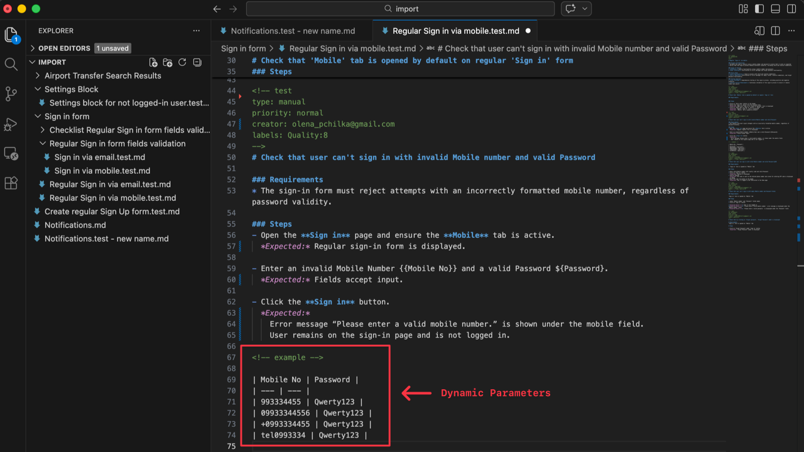

:::note

**Character Limit:** If a parameter name exceeds 250 characters, it will be truncated on UI (only the first 247 characters will be displayed).

**Parameter Order:** The order of parameters cannot be manually changed within the markdown file. On the UI, they are always displayed by the latest IDs assigned during the import from markdown to Testomat.io.

**Synchronization:** While the order in the markdown file and on the UI might not match initially after an import, the order will be synchronized once you export them back from Testomat.io to a markdown file (the exported file will match the UI order).

:::

For more information about **Dynamic Parameters** follow the [link](https://docs.testomat.io/project/tests/test-case-creation-and-editing/#how-to-add-dynamic-parameters-to-a-test).

## How to Import Manual Tests from Markdown

Once you have finished updating the test cases in the file system, use the **'Import from Markdown'** feature to import all the changes into Testomat.io.

:::note

Before importing your tests back to Testomat.io you must:

1. **Save** and **commit** your changes.

2. **Pull latest changes** from Testomat.io before importing to avoid accidentally overwriting data inside Testomat.io. First, run the same command that you used for exporting tests `npx check-tests@latest pull` to pull your tests and fetch latest data from Testomat.io. Verify all changes. Then you can upload them back. In case you use Git, this would be the safest way to deal with tests. Alternatively, you can use `--force option`.

:::

To **'Import from Markdown'** you need:

1. Open your project in Testomat.io on **'Tests'** page.
2. Click **'Extra menu'** button.
3. Select **'Import from markdown'** option.


4. On the displayed **'Import Project from Source Code'** page select **'Manual tests (markdown files)'** from the **'Project Framework'** dropdown list.

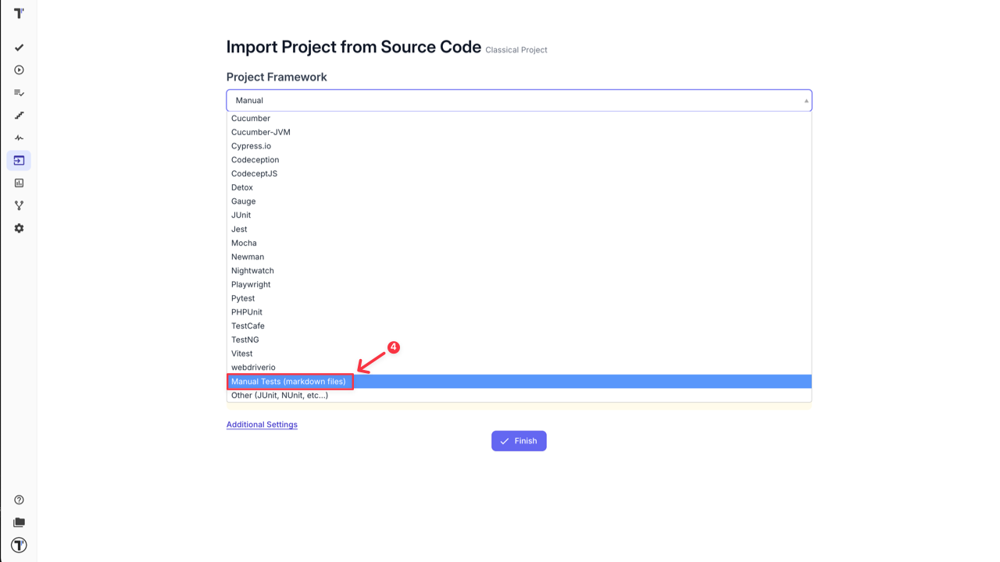

5. Select **'Markdown'** option from the **'Project Language'** dropdown list for a **Classical Project**.
6. Select your OS from the dropdown list.
7. Copy the displayed push command.


8. Run the import command in your project directory to sync tests back to Testomat.io.

After your tests are imported back to Testomat.io, all new tests will be automatically synced to the project without additional confirmation and all updated tests will be displayed with **'out of sync'** label and will required confirmation from your side. You can use **'Out of Sync'** filter to find all of them, so you can verify and save the changes.

Each test with **'out of sync'** label should be verified manually one by one.

**To check and save changes for updated tests:**

1. Click on **'Out of Sync'** label.


2. Open the test you want to check.
3. Click **'Compare Description'**.

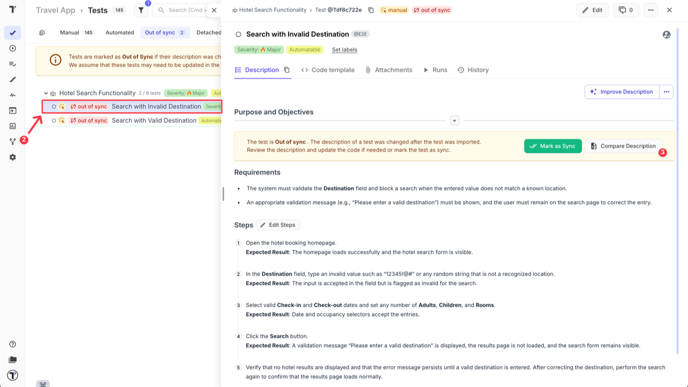

4. There are 2 options on this Step:
- Click **'Revert to Previous'** button if you want to cancel the changes.

OR

- Click **'Keep Current'** button if you want to save the changes.


:::note

By clicking on **'Mark as Sync'** button you can sync the test with the latest changes.

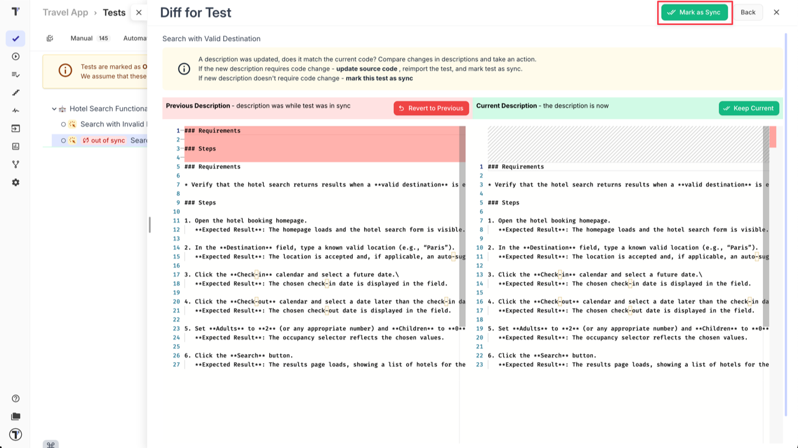

:::

### Importing Automated Tests as Manual

If you maintain only automated test cases or both, manual and automated, within the same source files (e.g., in a single .feature file), but you want to import your automated tests as manual, you can use the **'Additional Settings'** during import to ensure these tests are correctly mapped and synchronized within Testomat.io.

**To use this feature:**

1. Go to the **Import Project from Source Code** menu: select your **Project Framework**, **Project Language** and **OS**.
2. Click on **'Additional Settings'**.

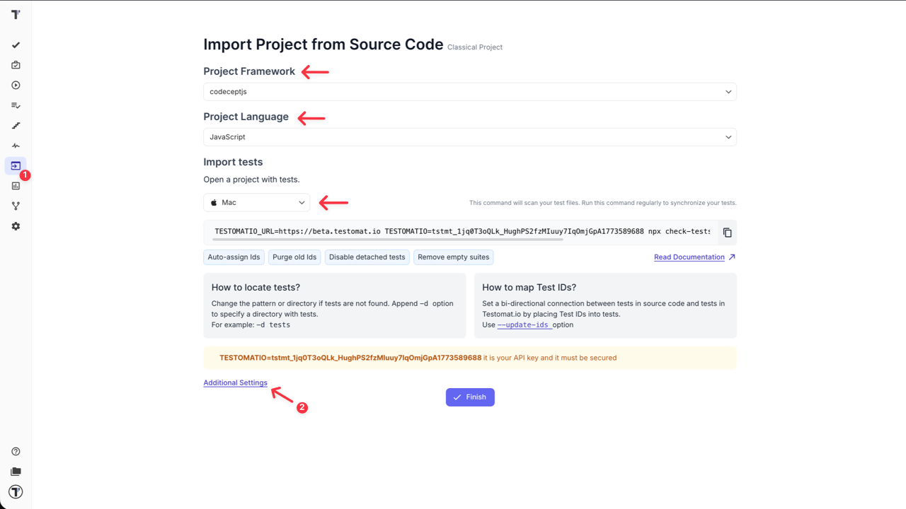

3. In the field **'Import automated tests as manual when a test is marked with a tag'**, enter the dedicated tag you use in your code for tests that should be imported as manual tests (e.g., `@manual`, `@smoke`, etc.).
4. Copy the displayed import command from Testomat.io, for example:
`TESTOMATIO=tstmt_... npx check-tests@latest codeceptjs "**/*.js"`

5. Click the **'Finish'** button.

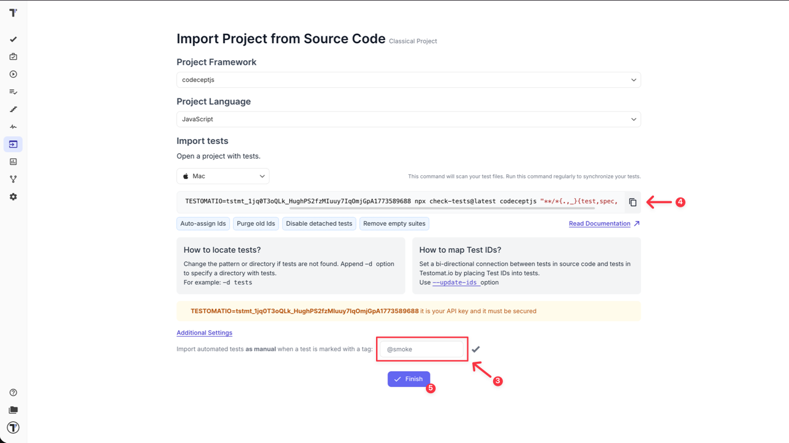

6. Run coppied import command in the terminal.

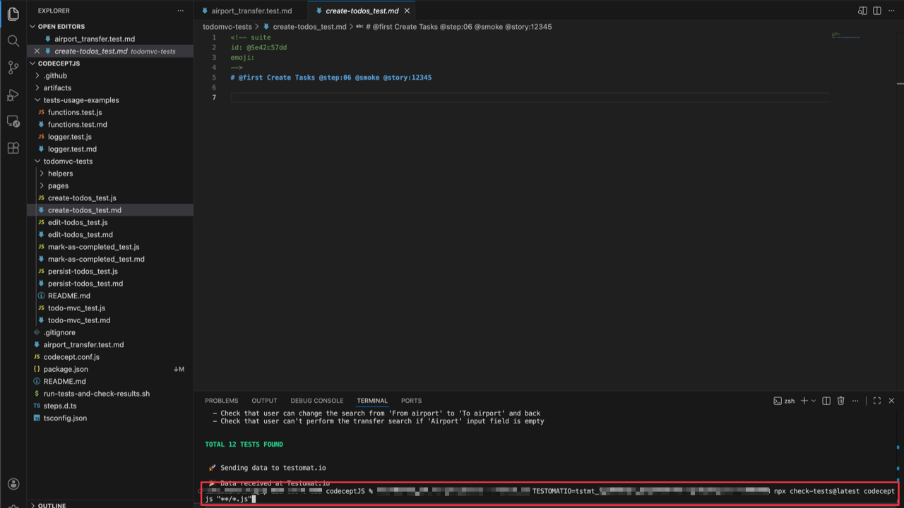

7. Verify the state of imported tests.

| **Tests State Before = Automated**             | **Tests State After = Manual**             |
| --------------------------- | ------------------------------------- |
| 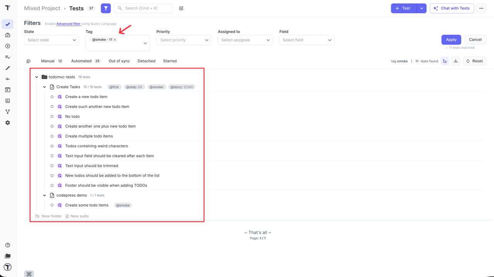 | 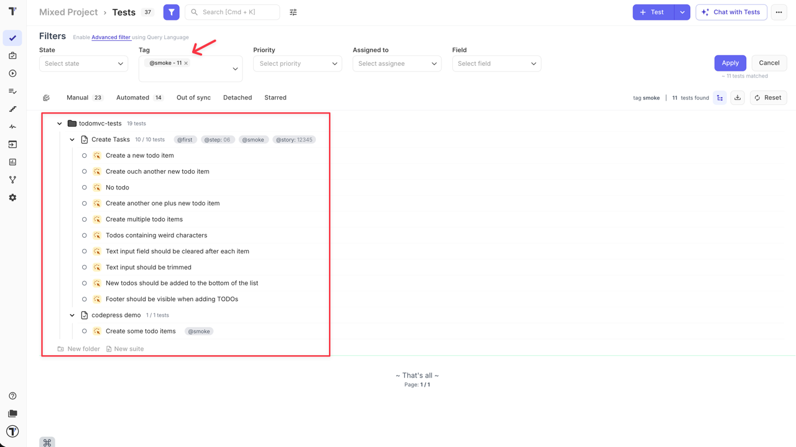 |

:::note

**Single State Rule:** A test can have only one state: **manual** or **automated**. It cannot hold both statuses simultaneously in Testomat.io.

**Applicability:** This feature works for both **BDD** and **Classical** project types.

**Scope:** The setting is applicable to both **individual tests** and **entire suites**.


:::