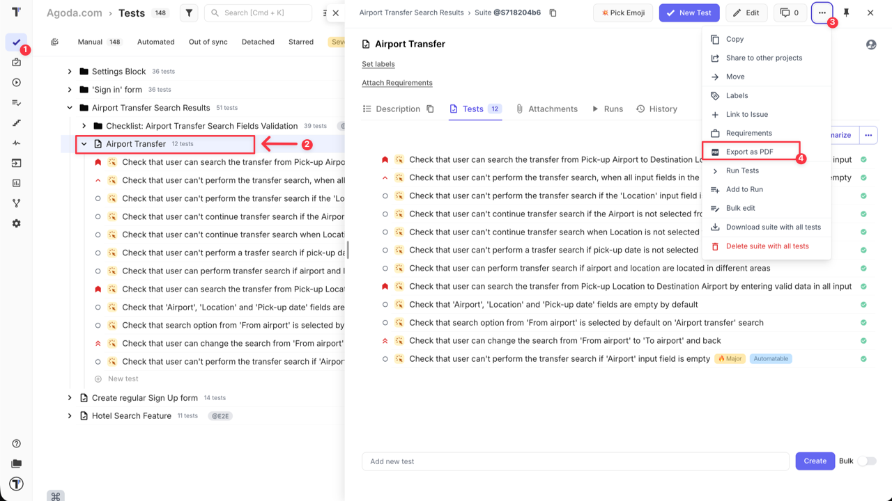
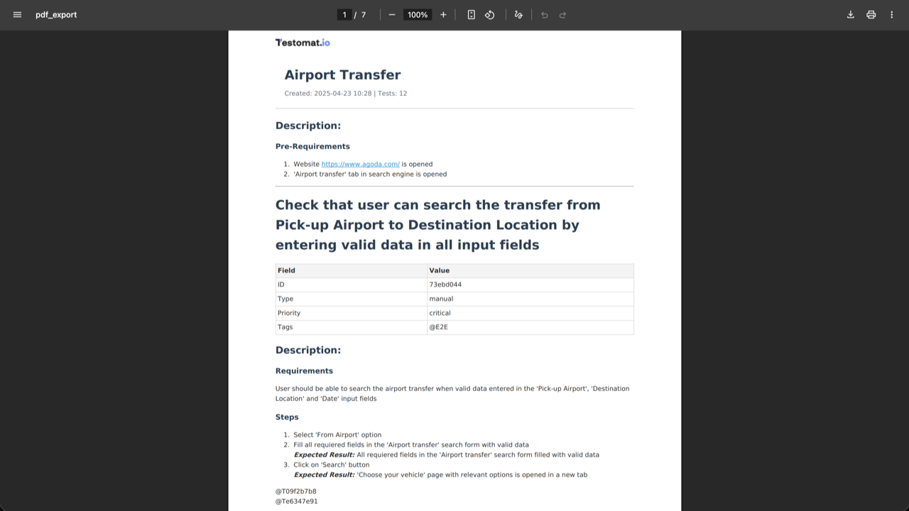

Any suite can be downloaded as a PDF. Use it to hand test documentation to reviewers, auditors, or stakeholders who do not have access to the platform.

## Export a suite

1. Go to the **Tests** page.
2. Open the suite you want to export.
3. Click the **Extra menu** button.
4. Select **Export as PDF**.

The PDF downloads to your machine.

## What the export contains

The file captures the whole suite — every test case in it, with its ID, type, steps, expected results, and screenshots.

## PDF, spreadsheet, or share

Three features get test content out of a project, and they suit different readers.

| | What you get | Best for |
| --- | --- | --- |
| **Export as PDF** | A formatted document, frozen at export time | A reviewer or auditor who needs to read the tests |
| **Export to Spreadsheet** | An Excel file of the tests you select | Data you want to sort, filter, or import elsewhere |
| **Share** | Live, read-only access in another project | A team that needs the tests to stay current |

The PDF is a snapshot, which is exactly why it works for an audit trail — it records what the suite said on the day you exported it. It is the wrong choice when the reader needs the current version next month.

See [Export to Spreadsheet](https://docs.testomat.io/project/import-export/export-tests/export-to-spreadsheet) for the Excel export and [Sharing tests and suites](https://docs.testomat.io/project/tests/sharing-tests-and-suites) for live access.

## Next steps

- [Export to Spreadsheet](https://docs.testomat.io/project/import-export/export-tests/export-to-spreadsheet)
- [Download as Markdown Files](https://docs.testomat.io/project/import-export/export-tests/download-manual-tests-as-files)
- [Sharing tests and suites](https://docs.testomat.io/project/tests/sharing-tests-and-suites)
