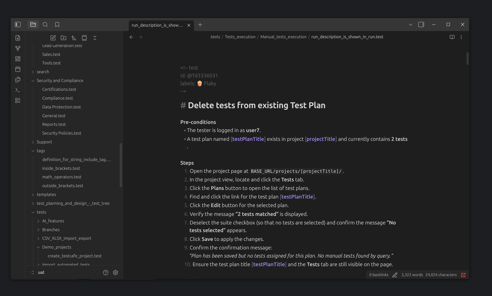

[Obsidian](https://obsidian.md) is a powerful knowledge base application that works on top of plain Markdown files. Since Testomat.io can export manual tests as Markdown, you can use Obsidian to browse, search, and organize your test cases locally.

## How to Export Tests to Obsidian

### Step 1: Export Tests as Markdown

First, export your manual tests from Testomat.io as Markdown files using the **Export to Markdown** feature:

1. Create a directory on your computer where you want to store the tests.
2. Open your project in Testomat.io on the **Tests** page.
3. Click the **Extra menu** button.
4. Select **Export to markdown**.
5. Select your OS and copy the displayed pull command.
6. Run the export command in your project directory.

For detailed export instructions, see [Download Manual Tests as Files](../download-tests-as-files/download-manual-tests-as-files).

### Step 2: Open the Folder as an Obsidian Vault

Once the tests are exported, open the folder directly in Obsidian:

1. Open **Obsidian**.
2. Click the **Open another vault** button (vault icon in the bottom-left corner) or go to **File → Open vault**.
3. Select **Open folder as vault**.
4. Navigate to the folder containing your exported Markdown tests and click **Open**.

All your test suites and test cases will appear in Obsidian immediately — no copying or importing is needed. Obsidian reads `.md` files directly from the folder.



### Step 3: Browse Your Tests

Once the vault is open, you can:

- **Navigate the test tree** using the file explorer sidebar — folders represent suites.
- **Search across all tests** using Obsidian's built-in search (`Ctrl+Shift+F` / `Cmd+Shift+F`).
- **Use graph view** to visualize connections between test suites and cases.
- **Tag filtering** — if your tests include tags, Obsidian will recognize them for filtering.

## Editing Tests in Obsidian

You can edit and update your test cases directly in Obsidian. Any changes you make to the Markdown files — updating steps, adding preconditions, changing tags or priorities — will be picked up when you push the changes back to Testomat.io.

When editing tests, keep the existing Markdown structure intact:

- **Test headers** (`<!-- test -->` comments) contain metadata like priority, tags, and labels.
- **Test titles** start with `#`.
- **Steps and expected results** follow the standard Markdown format.

You can also create new test files or delete irrelevant ones. For details on test file structure, see [Download as Markdown Files](../download-tests-as-files/download-manual-tests-as-files).

### Pushing Changes Back to Testomat.io

Once you've finished editing, push your changes back to Testomat.io using the CLI. You will need your project's **TESTOMATIO** API key, which can be found in your project **Settings → API Key**.

Run the following command in the directory with your tests:

```bash
TESTOMATIO={your-api-key} npx check-tests@latest push
```

:::note

Before pushing, it's recommended to **pull the latest changes first** to avoid overwriting updates made in Testomat.io:

```bash
TESTOMATIO={your-api-key} npx check-tests@latest pull
```

Review any differences, then push your changes.

:::

After the push, new tests will be added to your project automatically. Updated tests will appear with an **'out of sync'** label in Testomat.io, where you can review and confirm each change.

## Keeping Tests in Sync

To update your Obsidian vault with the latest tests from Testomat.io, re-run the pull command in the same directory:

```bash
TESTOMATIO={your-api-key} npx check-tests@latest pull
```

Obsidian will automatically reflect the updated files.

## Using Obsidian with Git

For full version control, you can initialize a Git repository in the same folder as your Obsidian vault. This lets you track changes, review diffs, and collaborate with your team. See [Download as Markdown Files](../download-tests-as-files/download-manual-tests-as-files) for details on setting up Git with exported tests.
