The export feature provides users with the ability to download test cases and suites in various formats, offering flexibility in how the data is exported. You can export test cases in Excel format. This functionality supports filtering by tags, labels, or specific suites, allowing users to export only the relevant test data. Depending on the export mode selected, users can choose to export individual tests, complete suites, or the entire set of tests with additional details.

Below, you will find export guidelines to help you quickly get the necessary test suites and cases.

## How to Export All Suites with Tests (including extra columns)

1. Click on the **Tests** in the sidebar
2. Click on the **Extra Menu**
3. Click on **Export as Spreadsheet**

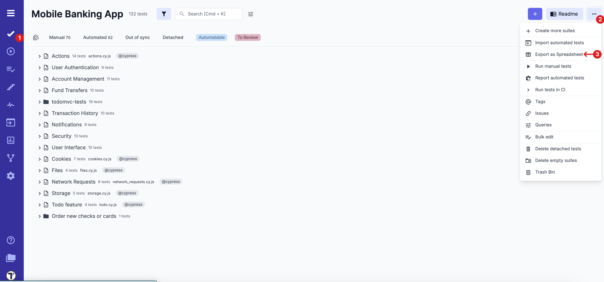

Once the pop-up appears, optionally, you can configure your spreadsheet by adding extra columns.

4. Click on the **Add extra columns**
5. Fill out extra columns, e.g.

- Preconditions
- Steps
- Expected results

6. Click on the **Launch export** button to start the export with the applied columns

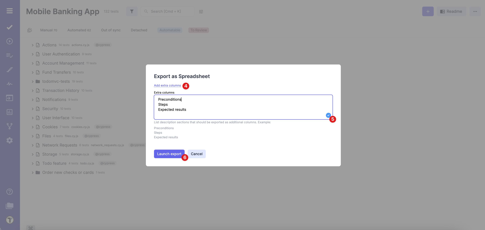

The result file will be available in the **Account files** tab after it is filled out. Once the export is complete, you can download it from the provided link.

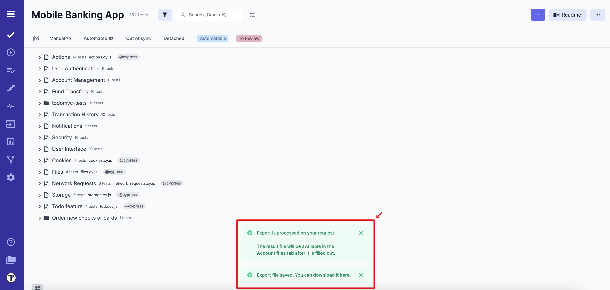

:::note

Once you select extra columns for export, Testomat.io remembers your choices, so you don’t need to configure them again next time.

:::

## How to Export a Suite with All Tests

1. Click on the **Tests** in the sidebar
2. Select a specific suite or a folder, you want to export
3. Click on the **Extra Menu**
4. Click on **Download suite with all tests**

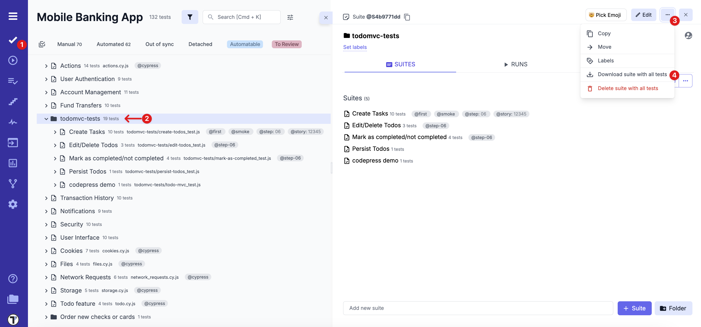

The result file will be available in the **Account files** tab after it is filled out. Once the export is complete, you can download it from the provided link.

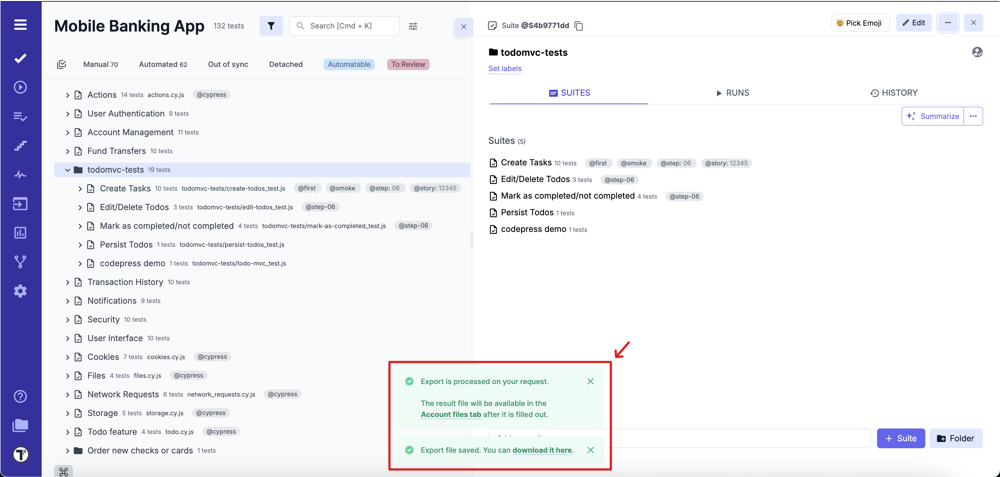

## How to Export Found Test Suites and Cases

### Search Criteria: Export Mode – Only found Tests

1. Click on the **Tests** in the sidebar
2. Search, e.g., by tag @localisation

Search criteria (e.g. @localization) are saved when switching between tabs, which ensures consistent exports.

Once all exact test matches are shown:

3. Click on **Download results** icon

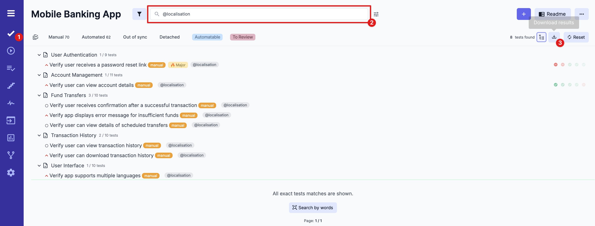

4. Select **Only found Tests** in the **Export mode** dropdown
5. Click on the **Launch export** button

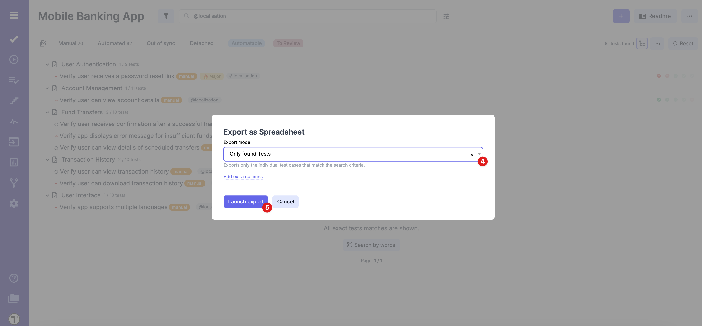

The result file will be available in the **Account files** tab after it is filled out. Once the export is complete, you can download it from the provided link.

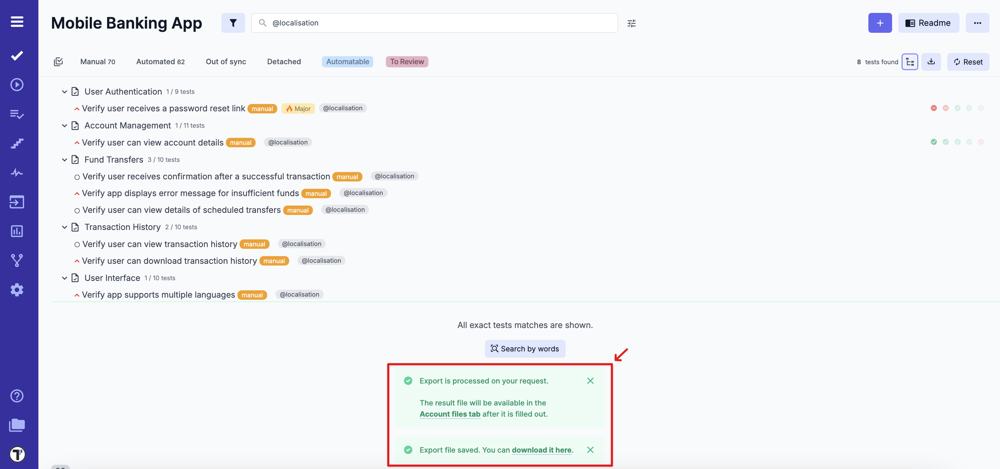

### Search Criteria: Export Mode – Found Suites and Found Tests

To export both matching test suites (with their content) and individual matching test cases, follow these steps:

1. Click on the **Tests** in the sidebar
2. Search, e.g., by tag @localisation

Search criteria (e.g. @localization) are saved when switching between tabs, which ensures consistent exports.

Once all exact test matches are shown:

3. Click on **Download results** icon

4. Select **Found Suites and found tests** in the **Export mode**
5. Click on the **Launch export** button

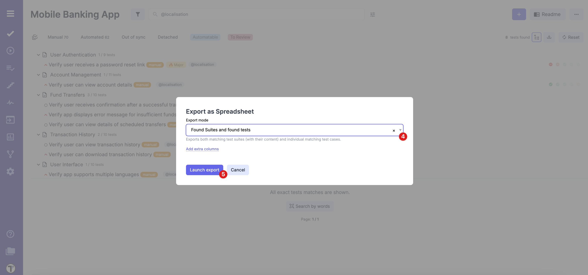

The result file will be available in the **Account files** tab after it is filled out. Once the export is complete, you can download it from the provided link.

### Export Tests With Multiselection

1. Click on the **Tests** in the sidebar
2. Click **Multi-Select**
3. Select specific tests or suites, you want to export
4. Click on the **Extra Menu** at the bottom
5. Click on the **Download** button

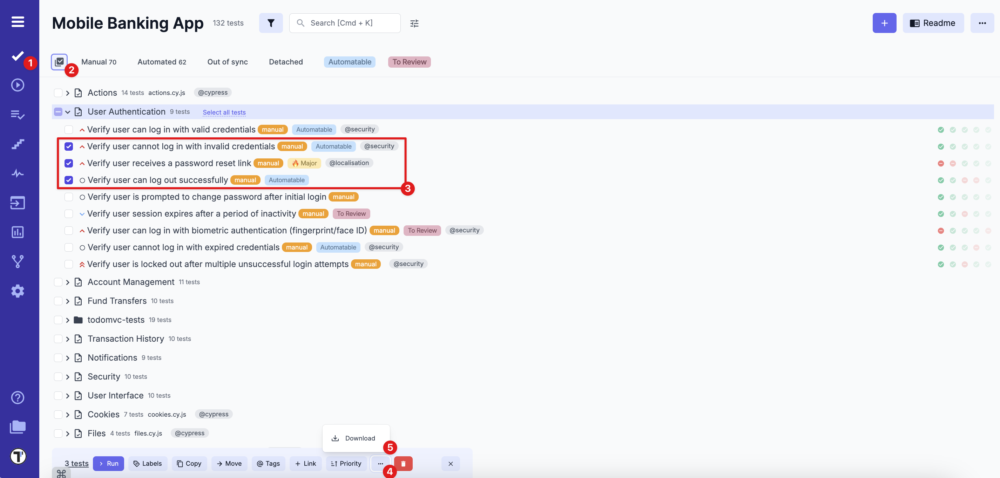

6. Once the pop-up appears, click on **Launch export** or add extra columns before

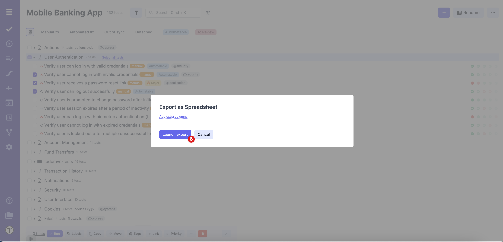

The result file will be available in the **Account files** tab after it is filled out. Once the export is complete, you can download it from the provided link.

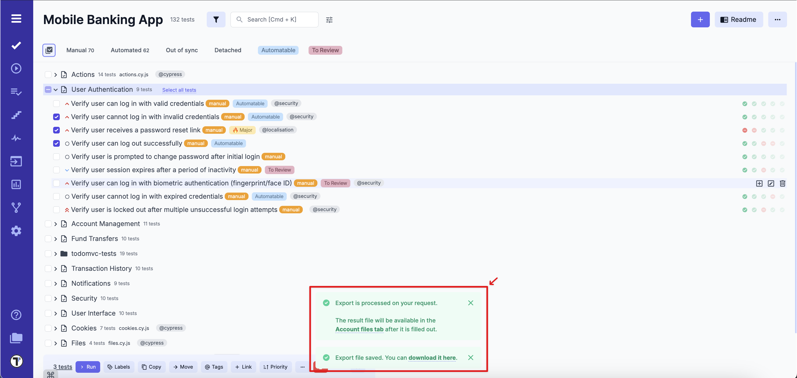

Testomat.io allows teams to export test suites and cases, making it easier to share, review and work with them outside the platform. This helps to optimize collaboration and keep all the necessary data accessible when needed.
