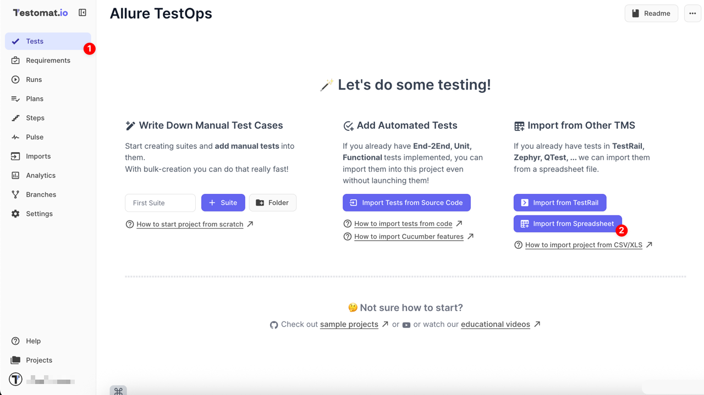
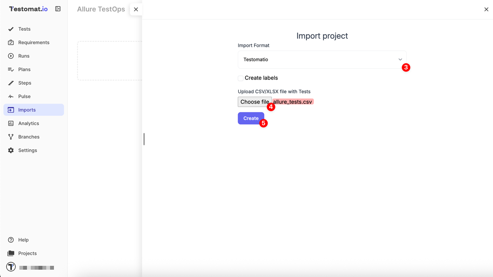
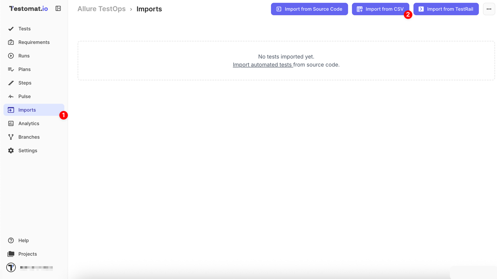

If you have existing tests in Allure TestOps and wish to migrate to Testomat.io, you can import tests from Allure TestOps using a customizable migration script for more advanced, tailored imports.

## Where to Find a Migration Script

Use the custom migration script to convert an Allure TestOps CSV file into Testomat.io’s CSV format. This method is recommended if you need customization or want to adjust the structure of your test cases during the migration process.

Click [migration script instructions](https://github.com/testomatio/migrate-allure) to access the script and get started.

## How to Import Tests into Testomat.io

Once tests are converted and a new project is [created](https://docs.testomat.io/getting-started/#create-project),

1. Navigate to the **Tests** page
2. Click the **Import from Spreadsheet** button

Once redirected to the **Imports** page

3. From the dropdown menu, select the **Testomatio**
4. Select the file generated by the migration script
5. Click the **Create** button to complete the import

Or alternative way, if you're working in an existing project,

1. Navigate to the **Imports** page
2. Click the **Import from CSV** button

3. From the dropdown menu, select the **Testomatio**
4. Select the file generated by the migration script
5. Click the **Create** button to complete the import

