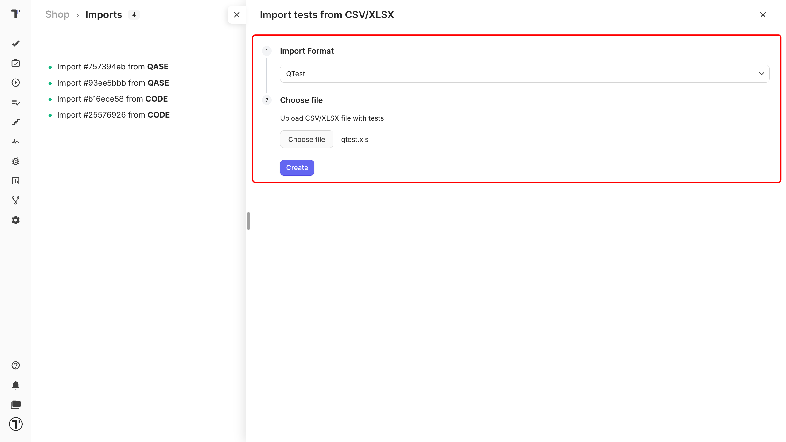
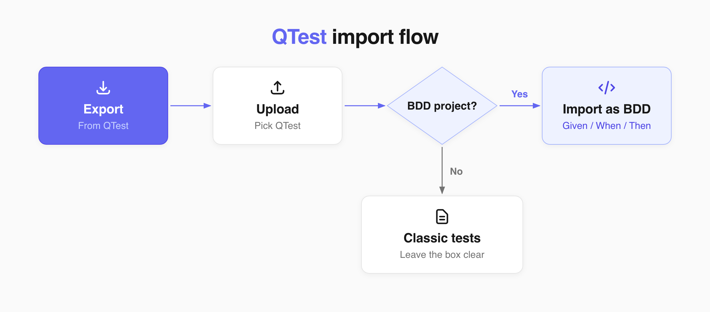

Export your tests in QTest to a file and import that file into Testomat.io. Your project will keep the same structure, as it was. Each test will keep its steps and expected results.

## Export QTest file

1. Open your QTest project.
2. Export your test cases as a **CSV** file.
3. Save it on your computer.## Import your Qase file

Start importing your tests to Testomat.io:

1. Open your project and go to the **Tests** tab.
2. Click the (`…`) menu.
3. Choose **Import from other TMS**. 

In the **Imports** window:

1. Click **Import**.
2. Choose **Import from CSV**. A sidebar opens on the right.
3. Choose **QTest** from the dropdown. 
4. Click **Choose file**, select your exported CSV.
5. Click **Create**.

Testomat.io reads the file, and your tests appear on the **Tests** page.

## Turn your tests into BDD scenarios

QTest is one of only two sources that can be converted on the way in. If your project is a BDD project, an **Import as BDD** checkbox appears in the sidebar. Tick it, and every row becomes a scenario:

- Precondition becomes **Given**
- Step becomes **When**
- Expected Result becomes **Then**

Your tests are saved as feature files. Leave the checkbox clear and they arrive as classic test cases instead. Full details are in [Import from CSV/XLSX](https://docs.testomat.io/project/import-export/import/import-tests-from-csv-xlsx).

## Example file

Not sure your export looks right? Download the [sample file](https://testomatio-artifacts.ams3.cdn.digitaloceanspaces.com/documentation/qtest.xls) and compare the first row with yours.

## If this doesn't work

* **The import fails.** Check that the first row of your file holds column names.
* **Your folders are flat.** Make sure you picked **QTest** in the dropdown, not another format.
* **The BDD checkbox is missing.** It only appears in BDD projects. Check your project type first.
* **Something is still off.** Contact [support](https://docs.testomat.io/support) with your file attached.

## Next steps

* [Import from CSV/XLSX](https://docs.testomat.io/project/import-export/import/import-tests-from-csv-xlsx) - the column reference and every other supported format.
* [BDD Test Case Editor](https://docs.testomat.io/project/tests/bdd-test-case-editor) - work with the scenarios once they are imported.
* [Labels and Custom Fields](https://docs.testomat.io/advanced/tags-labels/labels-and-custom-fields) - organize your imported tests by priority, type, or any QTest field.