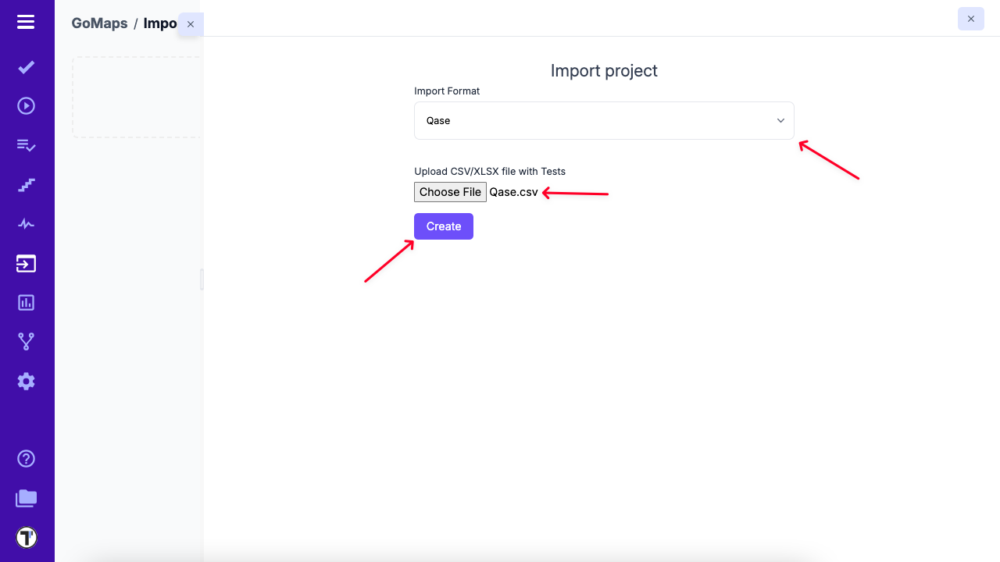

> If you have existing tests in Qase and want to migrate to Testomat.io, you can easily import them using the CSV Import feature.

## How to Import Tests from Qase to Testomat.io

1. Open your project in Testomat.io.
2. Click on the **Imports** tab.
3. Click the Import from CSV button.

4. From the dropdown menu, choose **Qase**.
6. Select the CSV file containing your exported Qase tests.
7. Click the **Create** button to complete the import.

## Example Files For Import 

Below is a sample of the supported format:

[Qase](https://testomatio-artifacts.ams3.cdn.digitaloceanspaces.com/documentation/Qase.csv)