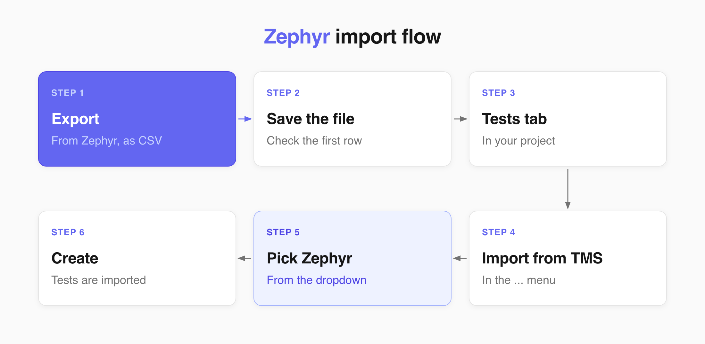
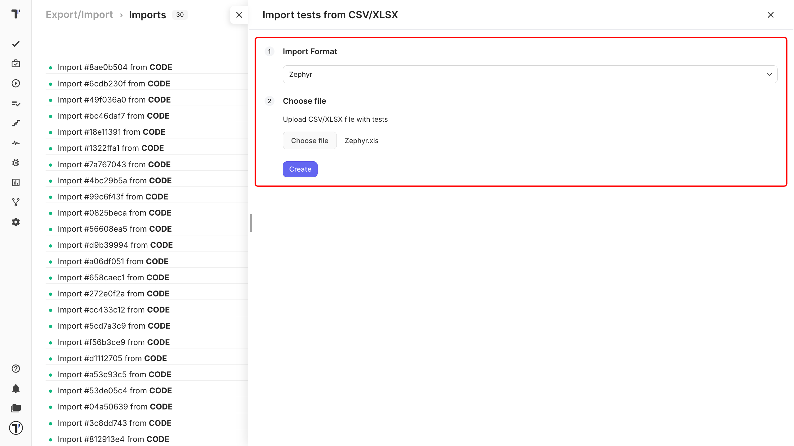

Export your tests in Zephyr to a file and import that file into Testomat.io. 

## Export Zephyr file

1. Open your Zephyr project.
2. Export your test cases as a **CSV** file.
3. Save it on your computer.

## Import your Zephyr file

Start importing your tests to Testomat.io:

1. Open your project and go to the **Tests** tab.
2. Click the (`…`) menu.
3. Choose **Import from other TMS**. 

In the **Imports** window:

1. Click **Import**.
2. Choose **Import from CSV**. A sidebar opens on the right.
3. Choose **Zephyr** from the dropdown. 
4. Click **Choose file**, select your exported CSV.
5. Click **Create**.

Testomat.io reads the file, and your tests appear on the **Tests** page.

## Turn your tests into BDD scenarios

You can also import your BDD projects into Testomat.io. Follow the import steps in your BDD project and every row of the CSV file becomes a scenario:

- Precondition becomes **Given**
- Step becomes **When**
- Expected Result becomes **Then**

Your tests are saved as feature files. Leave the checkbox clear and they arrive as classic test cases instead. Full details are in [Import from CSV/XLSX](https://docs.testomat.io/project/import-export/import/import-tests-from-csv-xlsx).

:::note

Not sure your export looks right? Download the sample and compare the first row with yours [Zephyr](https://testomatio-artifacts.ams3.cdn.digitaloceanspaces.com/documentation/Zephyr.xls).

:::

## If this doesn't work

* **The import fails.** Check that the first row of your file holds column names.
* **Your folders are flat.** Make sure you picked **Zephyr** in the dropdown, not another format.
* **Something is still off.** Contact [support](https://docs.testomat.io/support) with your file attached.

## Next steps

* [Import from CSV/XLSX](https://docs.testomat.io/project/import-export/import/import-tests-from-csv-xlsx) - the column reference and every other supported format.
* [Running Tests Manually](https://docs.testomat.io/project/runs/running-tests-manually) - run the tests you just imported and record the results.
* [Labels and Custom Fields](https://docs.testomat.io/advanced/tags-labels/labels-and-custom-fields) - organize your imported tests by priority, type, or any Zephyr field.