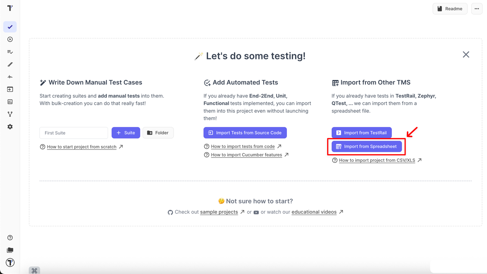
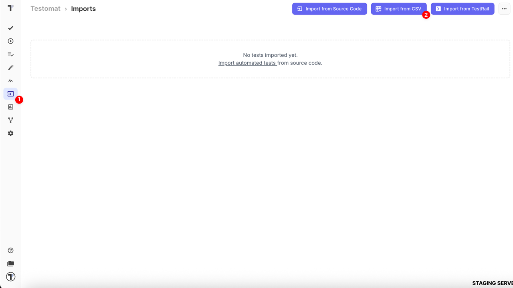
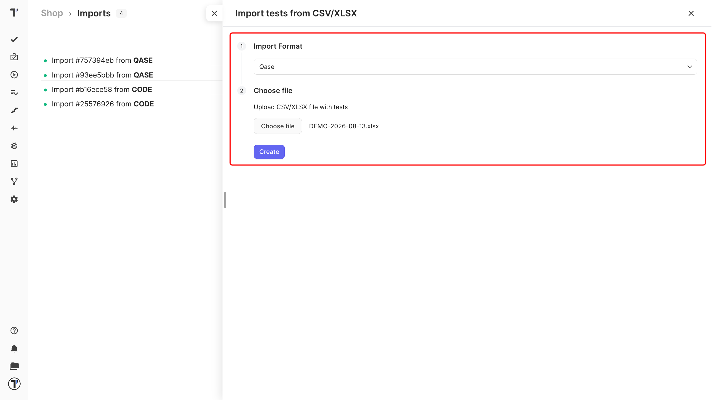

Testomat.io allows you to import tests from **CSV** or **XLSX** files. This is useful if you are migrating from another Test Management System (TMS) or if you already have test cases documented in spreadsheets.

## Supported Test Management Systems

Testomat.io supports importing test cases from many popular TMS tools. There are two ways to import:

- **Direct Import** — via built-in integration
- **CSV/XLSX Import** — supported for selected TMS formats

### Supported For CSV/XLSX Import

- Testomatio
- TestRail
- Testmo
- Zephyr
- QTest
- Qase

### Direct Import Guides

Click any tool below to see step-by-step instructions:

- [Qase](https://docs.testomat.io/project/import-export/import/import-tests-from-qase/)
- [QTest](https://docs.testomat.io/project/import-export/import/import-tests-from-qtest/)
- [QMetry](https://docs.testomat.io/project/import-export/import/import-tests-from-qmetry/)
- [TestCaseLabs](https://docs.testomat.io/project/import-export/import/import-tests-from-testcaselabs/)
- [Testmo](https://docs.testomat.io/project/import-export/import/import-tests-from-testmo/)
- [Testomat.io](https://docs.testomat.io/project/import-export/import/import-tests-from-csvxlsx/)
- [TestRail](https://docs.testomat.io/project/import-export/import/import-tests-from-testrail/)
- [XRay](https://docs.testomat.io/project/import-export/import/import-tests-from-xray/)
- [Zephyr](https://docs.testomat.io/project/import-export/import/import-tests-from-zephyr/)

## How to Import Tests from CSV/XLSX in Classic Projects

Now you can import tests into your project via:

- **Imports** page — ideal when existing data is present.
- **Tests** page — best for new projects without data.

In a **new project**, simply click **Import from Spreadsheet** on the **Tests** page and continue from **Step 3** below.

### Steps to Import

1. Click **Imports** button in the sidebar
2. Click **Import from CSV** button

When the sidebar opens,

3.  Select the format from which your CSV/XLSX was exported (e.g. Qase)
4.  Click **Choose file** and select your CSV/XLSX file
5.  Click **Create** button to start the import

Your file will be processed, and the test cases will appear in your project.

:::note

Currently, the CSV/XLSX import is an experimental feature. Some data might not be imported correctly, depending on the TMS format. Please review your imported test cases after migration.

:::

## How to Import Tests from CSV/XLSX in BDD Projects

If your project type is **BDD**, the import steps are **exactly the same** as described above for [Classic projects](https://docs.testomat.io/project/import-export/import/import-tests-from-csv-xlsx/#how-to-import-tests-from-csvxlsx-in-classic-projects).

The only difference is the appearance of a new checkbox:

- **Import as BDD** – available **only** for imports from **TestRail** and **QTest**.
- When checked, all rows from the CSV/XLSX file are converted into **BDD scenarios**.
  - Mapping:
    - Precondition → **Given**
    - Step → **When**
    - Expected Result → **Then**
  - All imported tests are saved as **feature files** in your project.

:::note

Currently, the feature works for TestRail and QTest. If you need support for other systems, please [submit a request](https://testomat.nolt.io/).

:::

## How to Сreate Custom XLS for Testomat.io

You can also create your own XLS file to import tests into Testomat.io. Follow these rules when preparing a custom XLS file:

| Column name | Content                                                                                                         |
| ----------- | --------------------------------------------------------------------------------------------------------------- |
| ID          | leave it empty                                                                                                  |
| Title       | put the title of your test here, one title per row                                                              |
| Status      | goes for test type manual or automated, can be blank                                                            |
| Folder      | enter the suite name here, and use `/suite name/sub-suite name` format to create suites nesting                 |
| Emoji       | can be blank                                                                                                    |
| Priority    | you can set priority to your test normal, important, high, critical or low, can be blank                        |
| Tags        | place here any tags you need, can be blank                                                                      |
| Owner       | name of test owner, can be blank                                                                                |
| Description | put here the description of your test, [Markdown format ](https://www.markdownguide.org/basic-syntax/)supported |
| Labels      | place here labels and custom fields, can be blank                                                               |   
| Issues      | place here Jira key in format ABC-123 or other IMS keys, can pass multiple Jira keys separated by a comma, can be blank|                                                               | 

You can download the custom Testomat.io example file [here](https://testomatiofiles.ams3.cdn.digitaloceanspaces.com/Testomat_example.xlsx).
