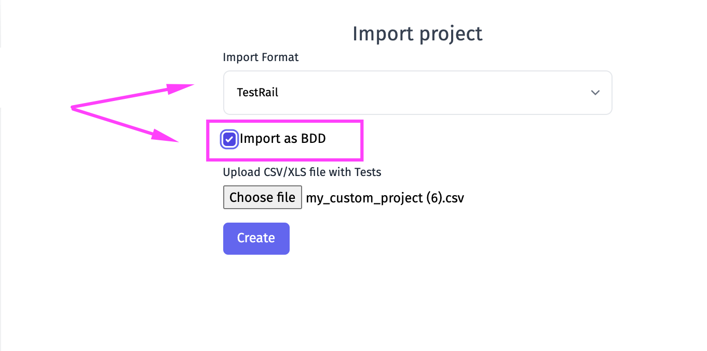

> If you have tests in CSV/XLS format - follow this guide to learn how to import your tests to Testomat.io

## Supported Test Management Systems

Testomat.io supports importing test cases from a wide range of popular test management systems.  
**Click any tool name below to view a step-by-step guide for importing from that specific system**:

- [Qase](https://docs.testomat.io/project/import-export/import/import-tests-from-qase/)
- [QTest](https://docs.testomat.io/project/import-export/import/import-tests-from-qtest/)
- [QMetry](https://docs.testomat.io/project/import-export/import/import-tests-from-qmetry/)
- [TestCaseLabs](https://docs.testomat.io/project/import-export/import/import-tests-from-testcaselabs/)
- [Testmo](https://docs.testomat.io/project/import-export/import/import-tests-from-testmo/)
- [Testomat.io](https://docs.testomat.io/project/import-export/import/import-tests-from-csvxls/)
- [TestRail](https://docs.testomat.io/project/import-export/import/import-tests-from-testrail/)
- [XRay](https://docs.testomat.io/project/import-export/import/import-tests-from-xray/)
- [Zephyr](https://docs.testomat.io/project/import-export/import/import-tests-from-zephyr/)

## Import CSV/XLS As BDD

> Please note that this is experimental feature and some data can be imported wrongly. 

Testomat.io allows converting CSV/XLS to BDD Scenarios, where your Precondition equals **Given**, Step = **When**, and Expected Result = **Then**.

For this moment this feature is implemented for TestRail and QTest. But you can request it for other systems [here](https://testomat.nolt.io/).

## Create Custom XLS For Testomat.io

You can create your own XLS to import your tests to Testomat.io. There are such rules to create custom XLS files for Testomat.io import
| Column name  |  Content |
|---|---|
|ID|leave it empty|
|Title |put the title of your test here, one title per row|
|Status | goes for test type manual or automated, can be blank|
|Folder| place here the name of the suite, and use `/suite name/sub-suite name` format to create suites nesting|
|Emoji |can be blank| 
|Priority| you can set priority to your test normal, important, high, critical or low, can be blank|
|Tags| place here any tags you need,  can be blank|
|Owner |name of test owner, can be blank|
|Description |put here the description of your test, [Markdown format ](https://www.markdownguide.org/basic-syntax/)supported|

You can download the custom Testomat.io example file [here](https://testomatio-artifacts.ams3.digitaloceanspaces.com/documentation/testomatio.xlsx).

