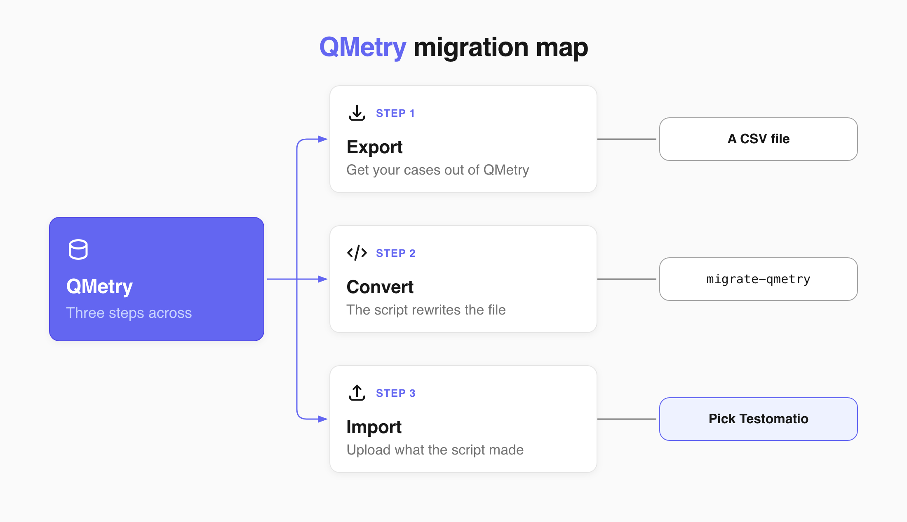
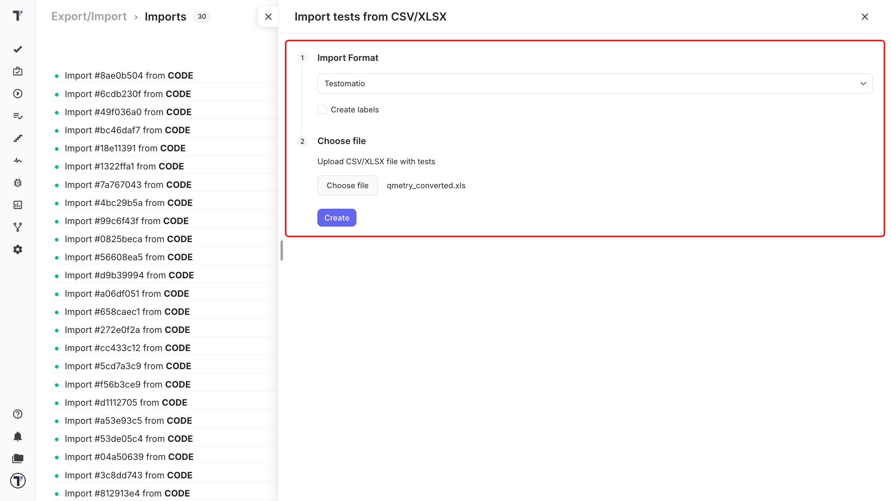

Bringing tests in QMetry into Testomat.io takes three steps: export them from QMetry, run a script that converts the file, then upload what the script produced.

:::note

QMetry files should be converted before export into the Testomat.io.

:::

## Export from QMetry

1. Open your project in QMetry.
2. Export your test cases as a **CSV** file.
3. Save the file on your computer.

## Convert the file

The migration script turns your QMetry CSV into a file Testomat.io can read. You can also use it to rename columns or restructure your cases on the way across.

1. Open the [migration script instructions](https://github.com/testomatio/migrate-qmetry) on GitHub.
2. Follow the setup steps there and run the script against your QMetry file.
3. Save the file the script produces. That is the one you upload.

## Import your QMetry file

Start importing your tests to Testomat.io:

1. Open your project and go to the **Tests** tab.
2. Click the (`…`) menu.
3. Choose **Import from other TMS**. 

In the **Imports** window:

1. Click **Import**.
2. Choose **Import from CSV**. A sidebar opens on the right.
3. Choose **Testomatio** from the dropdown. 
4. Click **Choose file**, select your exported and converted CSV.
5. Click **Create**.

Testomat.io reads the file, and your tests appear on the **Tests** page.

## If this doesn't work

- **There is no QMetry option in the dropdown.** There is not meant to be one. Pick **Testomatio** instead.
- **The import fails.** Check that you uploaded the file the script produced, not your original QMetry export.
- **Something is still off.** Contact [support](https://docs.testomat.io/support) with your file attached.

## Next steps

* [Import from CSV/XLSX](https://docs.testomat.io/project/import-export/import/import-tests-from-csv-xlsx) - the column reference and every other supported format.
* [Running Tests Manually](https://docs.testomat.io/project/runs/running-tests-manually) - run the tests you just imported and record the results.
* [Labels and Custom Fields](https://docs.testomat.io/advanced/tags-labels/labels-and-custom-fields) - organize your imported tests by priority, type, or any QMetry field.
