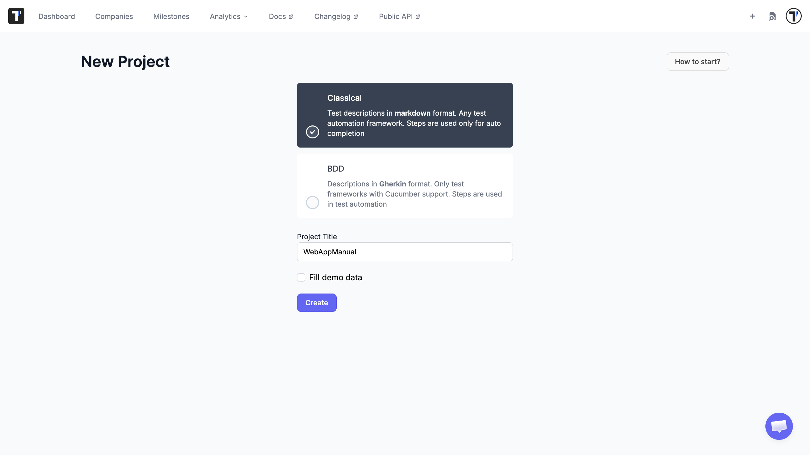
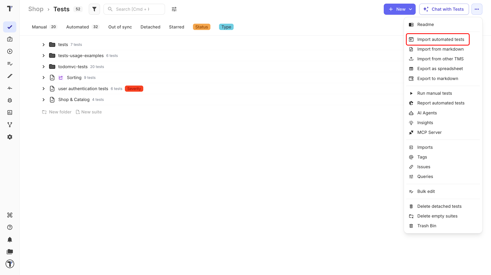
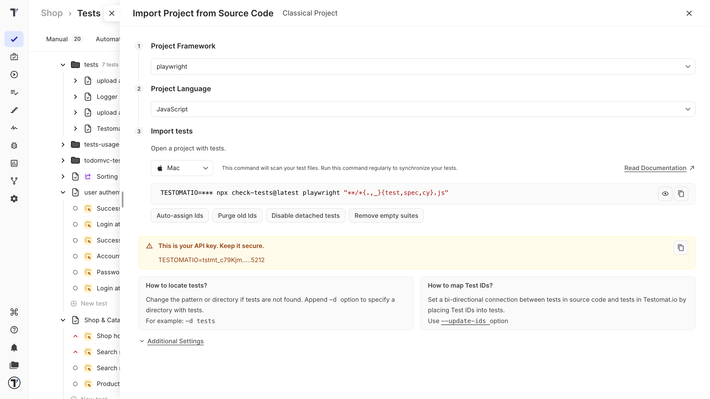
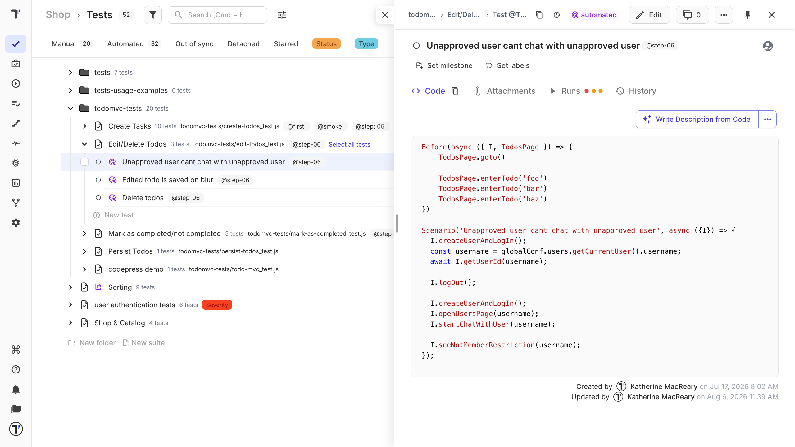
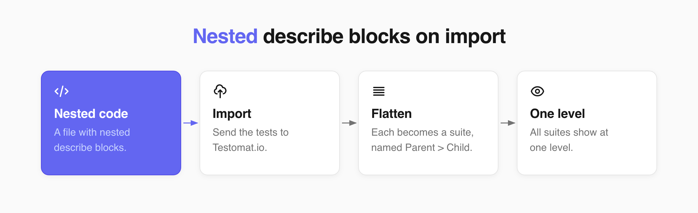
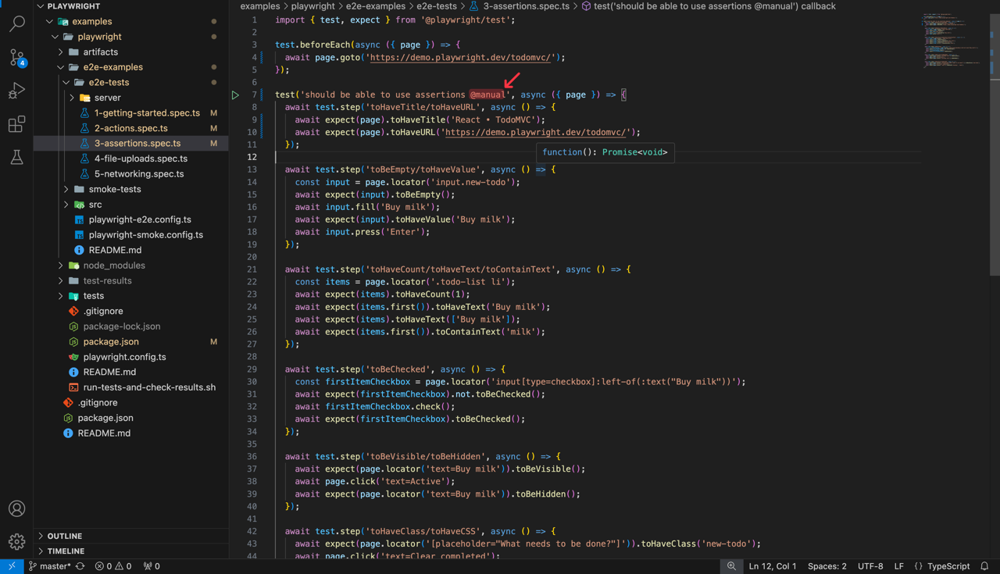
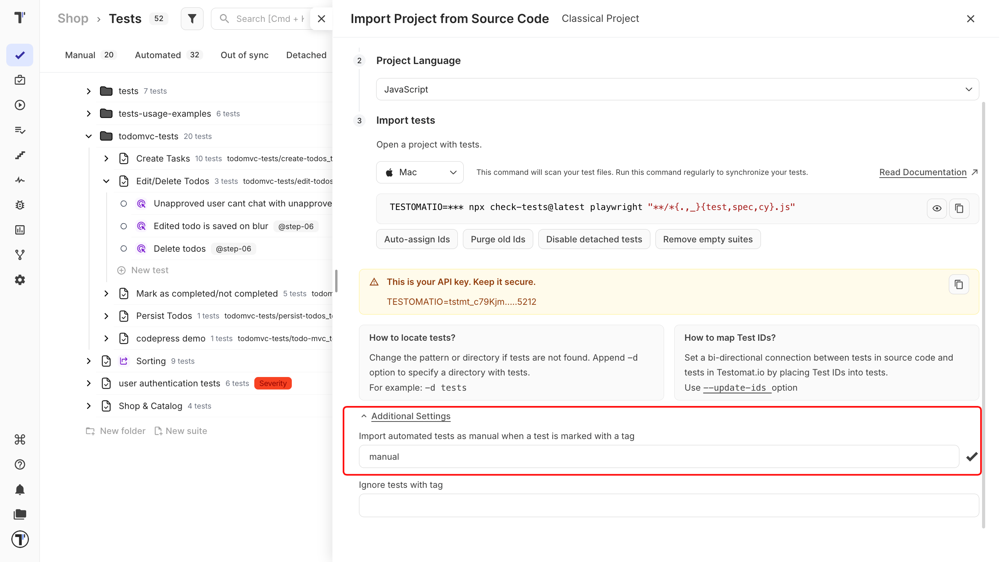

Import end-to-end, API, or unit tests into Testomat.io. Import keeps a large test base manageable. Once imported, you can search across every test, map tests to specifications or Jira tickets, plan new test cases, and get reports.

## Benefits of importing tests

Importing automated tests into Testomat.io makes your work visible to the whole team. It also keeps a large test base manageable. Once imported, you can search across every test, map tests to specifications or Jira tickets, plan new test cases, and get reports.

## Before import

First, you need to have a project. Follow [Start With Testomat.io](https://docs.testomat.io/getting-started/start-from-scratch/#create-project) to create it. Choose the project type - see [Classical vs BDD](https://docs.testomat.io/project/classical_vs_bdd). 

This guide covers [Classical projects](https://docs.testomat.io/tutorials/manual-testing-classic). To import a BDD project, see [Import Tests From Cucumber](https://docs.testomat.io/getting-started/import-tests-from-cucumber/#why-do-i-need-to-import-my-tests).



When you create the project, add your **repository URL** (GitHub, GitLab, BitBucket, or self-hosted) and point it at the directory where your tests live. Testomat.io links each test case to its source.

:::note

Make sure the repository path matches the URL. For example, for `https://github.com/testomatio/examples/tree/master/playwright/e2e-examples/e2e-tests`, navigate to `e2e-tests` in your project to import the tests.

:::

## Import tests

First, you need to import sources code.



1. Click **Import from Source Code**.
2. In the **Import** section, select:
  - your framework.
  - your language.
  - your operating system.

3. Copy the command provided.



Finally, run the command you copied:

1. Open a terminal.
2. Go to your tests folder.
3. Run a command.
4. Reopen the project, your tests appear with their folders and files.


A report of how many tests were found means the import worked. If you do not see that message, the default settings may not match your setup. The usual causes are a different file-naming format or the wrong import directory.

Every imported test is marked **Automated**. Open a test to see its code and a link to its repository. If the link is wrong, update the repository URL in project settings.



## Nested describe blocks

Testomat.io keeps one file as one suite. When a file has nested `describe` blocks, they are flattened on import. Each nested block becomes its own suite at the same level, named after its parent. 



This is expected behavior: it shows every test at once, so you do not expand block after block, and it fits the way most projects are organized - one file, one suite.

For example, this test file:

```js
describe('ActionResult', () => {
  it('aaaa', () => {
    // ...
  });

  describe('isMatchedBy', () => {
    it('should match exact URL', () => {
      // ...
    });
  });
});
```

Imported in Testomat.io like this:

```
ActionResult (action-result.test.ts)
  - aaaa
ActionResult > isMatchedBy (action-result.test.ts)
  - should match exact URL
```

The inner `isMatchedBy` block is not nested under `ActionResult` - it becomes a separate suite named `ActionResult > isMatchedBy`. This format stays the same by design, so there is nothing to fix if you see it.

## Import automated tests as manual

You need to add the tag to the tests in your own code to import them. In code, the tag starts with **@**, for example `@manual`.



Then you can use the same tag in the import settings. To import an automated test as manual:

1. Open **Import Project from Source Code**.
2. Set your project parameters.
3. Click **Additional Settings**.
4. Enter the tag name (without the **@**).
5. Run the command in your project.
6. Click **Finish**.

On the **Tests** page, the tagged tests are listed as manual.



## Next steps

- [Auto-Import](https://docs.testomat.io/project/import-export/auto-import) - re-import on each commit to keep the project in sync with your code.
- [Run Reports](https://docs.testomat.io/project/runs/reports) - get detailed reports on each test execution.
- [Test Plans Overview](https://docs.testomat.io/project/plans) - plan new tests, then automate from there.