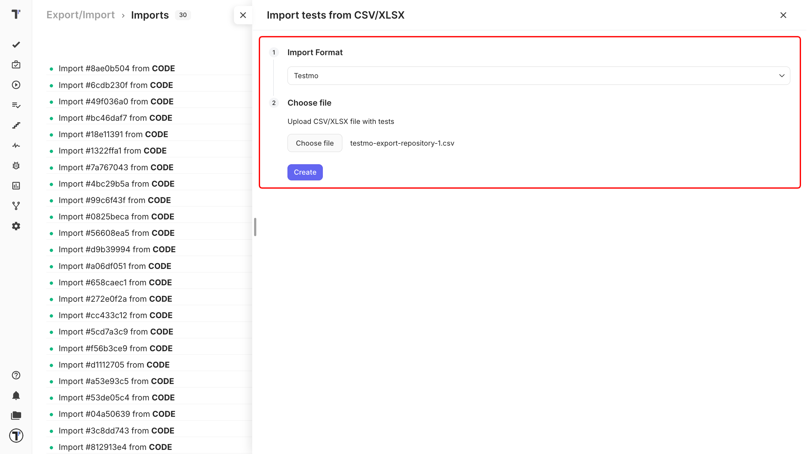

Export your tests in Testmo as a CSV file and bring them into Testomat.io. There are two ways to do it.

| Method | Use it when |
| --- | --- |
| **CSV import** | Your Testmo export goes straight in |
| **Migration script** | You need to reshape the file first - rename columns or restructure your cases|

## Export Testmo file

1. Open your Testmo project.
2. Export your test cases to **CSV** file.
3. Save it on your computer.

## Import your Testmo file

Start importing your tests to Testomat.io:

1. Open your project and go to the **Tests** tab.
2. Click the (`…`) menu.
3. Choose **Import from other TMS**. 

In the **Imports** window:

1. Click **Import**.
2. Choose **Import from CSV**. A sidebar opens on the right.
3. Choose **Testmo** from the dropdown. 
4. Click **Choose file**, select your exported CSV.
5. Click **Create**.

Testomat.io reads the file, and your tests appear on the **Tests** page.

## Reshape with migration script

Use the custom migration script to convert a Testmo CSV file into Testomat.io’s CSV format. This method is recommended if you need customization or want to adjust the structure of your test cases during the migration process.

Click [migration script instructions](https://github.com/testomatio/migrate-testmo) to access the script and get started.

## Turn your tests into BDD scenarios

You can also import your BDD projects into Testomat.io. Follow the import steps in your BDD project. Every row of CSV file becomes a scenario:

- Precondition becomes **Given**
- Step becomes **When**
- Expected Result becomes **Then**

Your tests are saved as feature files. Leave the checkbox clear and they arrive as classic test cases instead. Full details are in [Import from CSV/XLSX](https://docs.testomat.io/project/import-export/import/import-tests-from-csv-xlsx).

## If this doesn't work

* **The import fails.** Check that the first row of your file holds column names.
* **Your folders are flat.** Make sure you picked **Testmo** in the dropdown, not another format.
* **Something is still off.** Contact [support](https://docs.testomat.io/support) with your file attached.

## Next steps

* [Import from CSV/XLSX](https://docs.testomat.io/project/import-export/import/import-tests-from-csv-xlsx) - the column reference and every other supported format.
* [Running Tests Manually](https://docs.testomat.io/project/runs/running-tests-manually) - run the tests you just imported and record the results.
* [Labels and Custom Fields](https://docs.testomat.io/advanced/tags-labels/labels-and-custom-fields) - organize your imported tests by priority, type, or any Testmo field.
