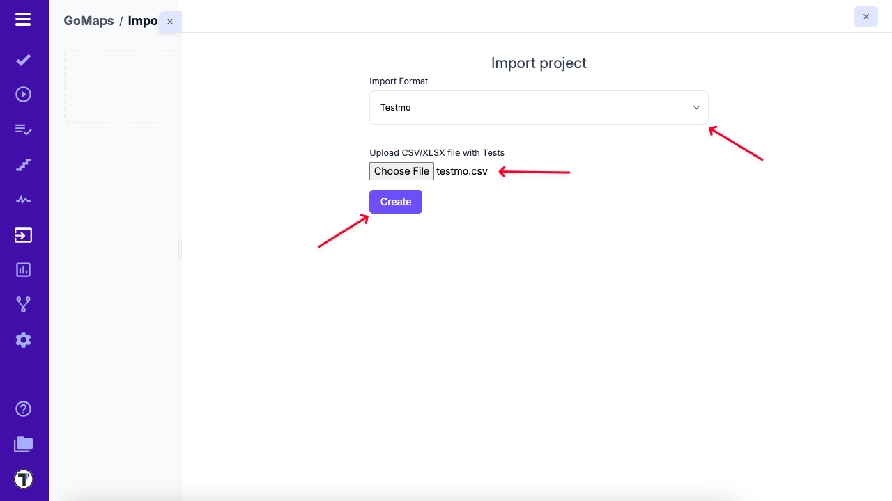

> If you have existing tests in Testmo and wish to migrate to Testomat.io, this guide will walk you through the process of importing your tests into Testomat.io.

Currently, Testomat.io supports two methods for importing tests from Testmo

- Import via CSV
- Customizable migration script

## How to Import Tests via CSV

1. Open your project in Testomat.io.
2. Click the **Imports** tab.
3. Click the **Import from CSV** button.

4. From the dropdown menu, choose **Testmo**.
5. Select the CSV file containing your exported Testmo tests.
6. Click the **Create** button to complete the import.

## Convert Testmo Project Using the Migration Script

Use the custom migration script to convert a Testmo CSV file into Testomat.io’s CSV format.
This method is recommended if you need customization or want to adjust the structure of your test cases during the migration process.

Click [migration script instructions](https://github.com/testomatio/migrate-testmo) to access the script and get started.

