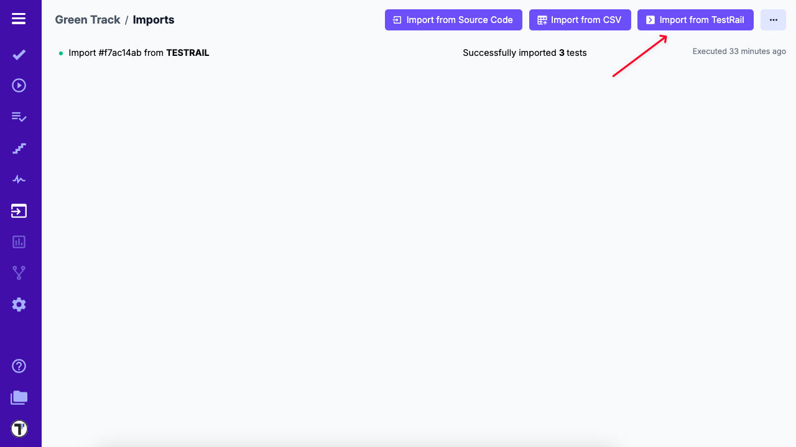
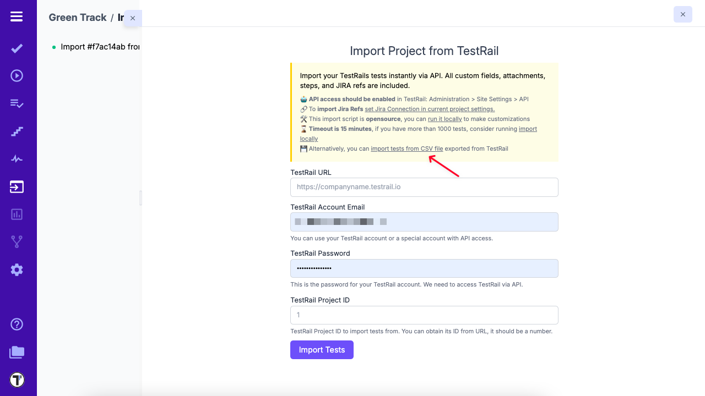
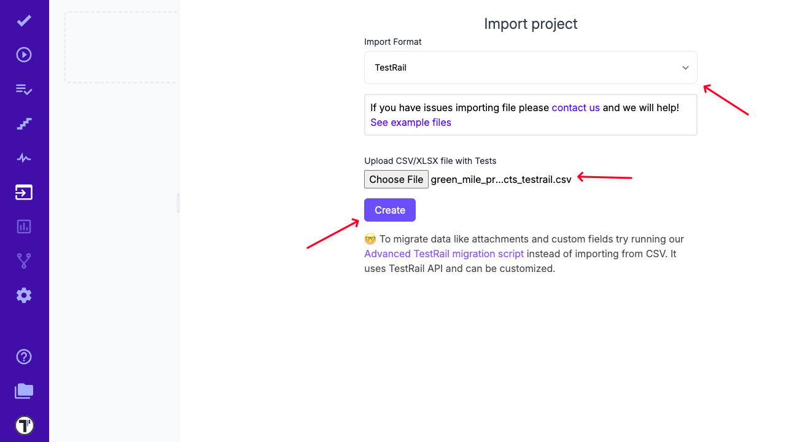
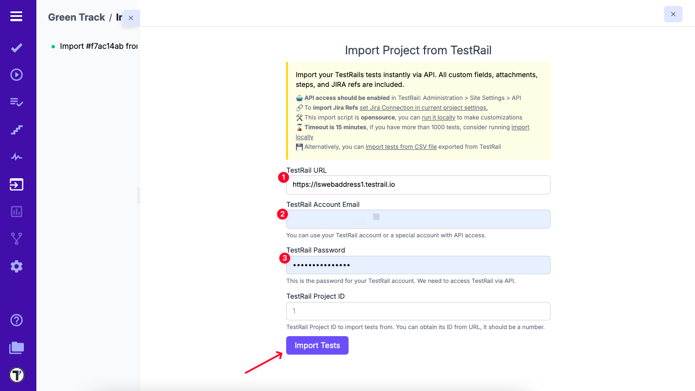
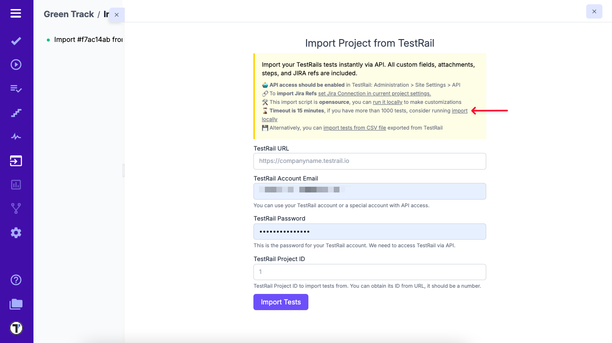

> If you have existing tests in TestRail and wish to migrate to Testomat.io, this guide will walk you through the process of importing your tests into Testomat.io.

Currently, Testomat.io supports three methods for exporting tests from TestRail

- Import via CSV
- Built-in UI tool (via API)
- API migration script

## How to Import Tests from CSV

> Use CSV Import for quick imports without attachments. It’s ideal for straightforward migrations, especially when you don’t need to include test attachments or extra metadata.

1. Navigate to your project in Testomat.io.
2. Click on the **Imports** tab.
3. Select the **Import From TestRail** button.

4. Click on the **Import tests from CSV file** link. 

5. From the dropdown menu, choose **TestRail**.
6. Select the CSV file containing your exported TestRail tests.
7. Click the **Create** button to complete the import.

## Example Files For Import 

Below is a sample of the supported format:

[TestRail](https://testomatio-artifacts.ams3.cdn.digitaloceanspaces.com/documentation/TestRail.csv)

## Import TestRail Project via Build-in UI Tool (via API)

>If you have a small or medium-sized TestRail project (up to 1000 tests) that you'd like to import into Testomat.io, you can easily use our intuitive built-in UI tool, which imports tests via the API.

1. Navigate to your project in Testomat.io.
2. Click on the **Imports** tab.
3. Select the **Import From TestRail** button.
4. Enter your valid TestRail credentials in the provided fields.
5. Click the **Import Tests** button to begin the import process.

> Make sure that you have enabled API in the administration area in TestRail under Administration > Site Settings > API.

## Import TestRail Project via API Migration Script

>Use the API Migration Script when migrating large TestRail projects (more than 1000 tests) that include attachments or require more customization than the built-in UI tool can handle. This method is ideal for transferring extensive datasets, ensuring that all test cases, including attachments, are accurately imported into Testomat.io.

1. Navigate to your project in Testomat.io.
2. Click on the **Imports** tab.
3. Select the **Import From TestRail** button.
4. Click on the **Import Locally** link to access the [migration script instructions](https://github.com/testomatio/migrate-testrail).

