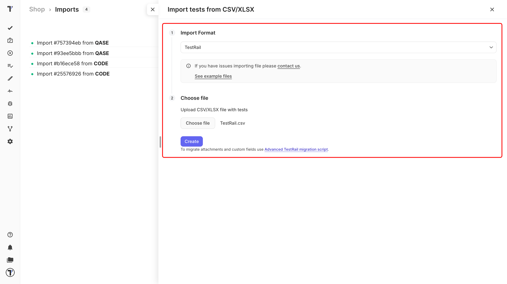
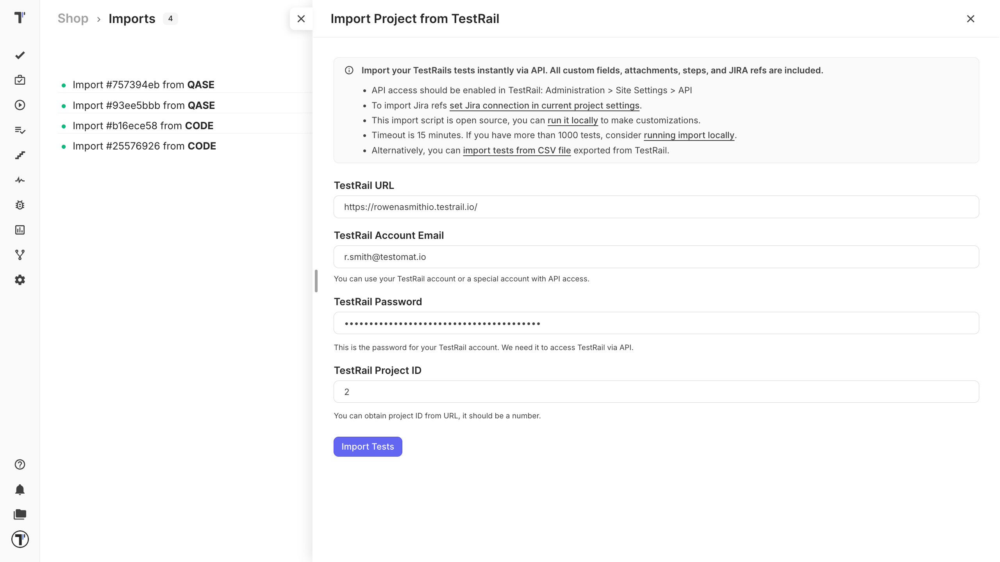

There are three ways to bring your tests from TestRail into Testomat.io. Pick one by the size of your project and whether you need attachments. [Migration from TestRail](https://docs.testomat.io/tutorials/migration-from-testrail) walks through the whole move step by step.

| Method | Best for | Attachments |
| --- | --- | --- |
| **CSV file** | Simple import | No |
| **Built-in UI tool** | Up to 1000 tests | No |
| **Migration script** | Projects over 1000 tests | Yes |

## Start the import process

The importing beggins on the **Imports** window. Thus, you need to go there first.

1. Open your project and go to the **Tests** tab.
2. Click the (`…`) menu and choose **Import from other TMS**.
3. Click **Import**, then choose **Import From TestRail**.

From here, you have three options. Please, choose the best for your project: 
- Import Tests from CSV.
- Import via TestRail API.
- Import with the migration script.

## Import from CSV

Next, on the **Imports** window:

1. Click **Import**.
2. Choose **Import from CSV**. A sidebar opens on the right.
3. Choose **TestRail** from the dropdown. 
4. Click **Choose file**, select your exported CSV.
5. Click **Create**.

Testomat.io reads the file, and your tests appear on the **Tests** page.

Not sure your export looks right? Download the [sample TestRail CSV](https://testomatio-artifacts.ams3.cdn.digitaloceanspaces.com/documentation/TestRail.csv) and compare the first row with yours.

## Import via TestRail API

This method pulls your tests straight from TestRail through its API, so there is no file to export.

:::note

Before you start, turn on the API in TestRail:

1. Go to **Administration**
2. Click **Site Settings**.
3. Toggle **API**. 

:::

Next, in the **Imports** tab in Testomat.io:

1. Enter your TestRail API credentials.
2. Click **Import Tests**.

Your tests are pulled across and appear on the **Tests** page.

## Import with the migration script

This option suits for projects over 1000 tests, or when you need to attach files to your tests from TestRail.

1. Click **Import Locally**.
2. Follow the [migration script instructions](https://github.com/testomatio/migrate-testrail).

## If this doesn't work

* **The UI tool cannot connect.** Check that the API is enabled in TestRail.
* **The CSV import fails.** Check that the first row of your file holds column names.
* **Attachments are missing.** CSV and the UI tool do not carry attachments. Use the migration script instead.

## Next steps

* [Migration from TestRail](https://docs.testomat.io/tutorials/migration-from-testrail) - the full tutorial, including how to check the result afterwards.
* [Import from CSV/XLSX](https://docs.testomat.io/project/import-export/import/import-tests-from-csv-xlsx) - the column reference and every other supported format.
* [Labels and Custom Fields](https://docs.testomat.io/advanced/tags-labels/labels-and-custom-fields) - organize your imported tests by priority, type, or any TestRail field.