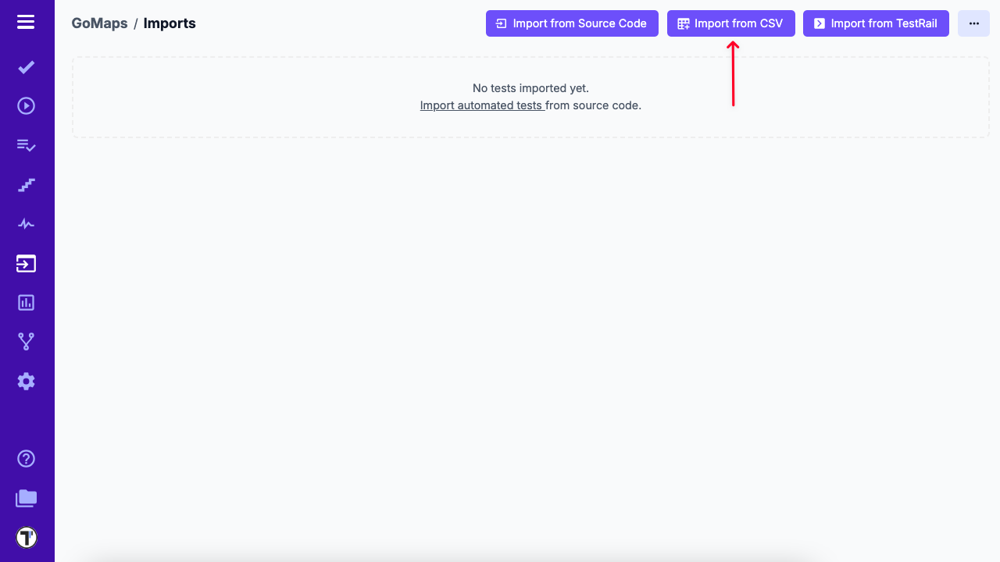
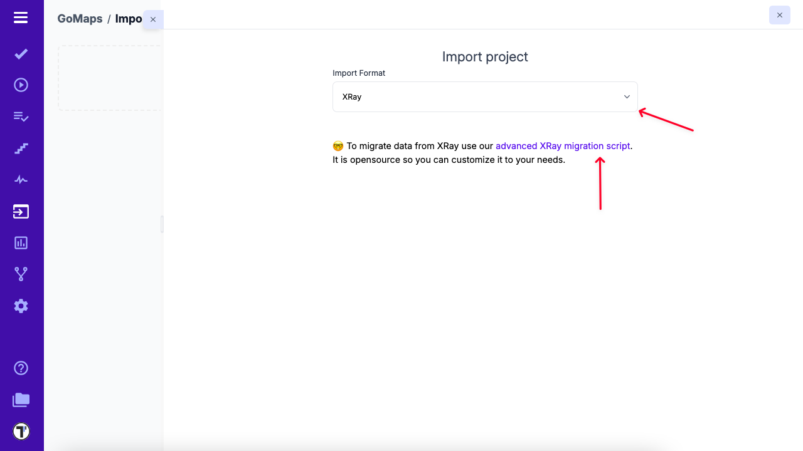
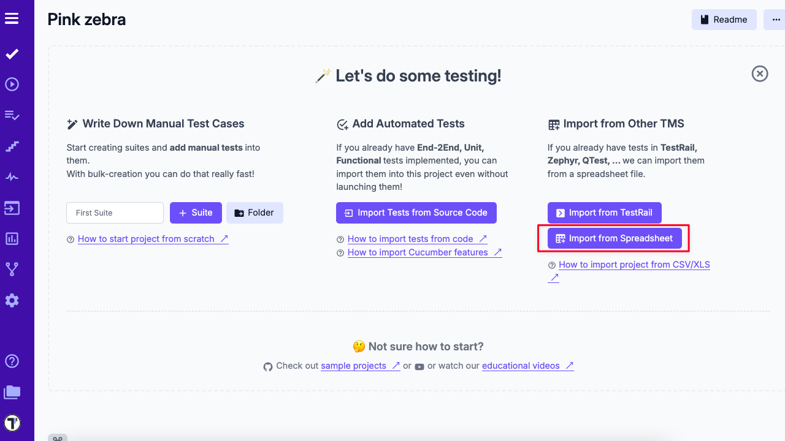
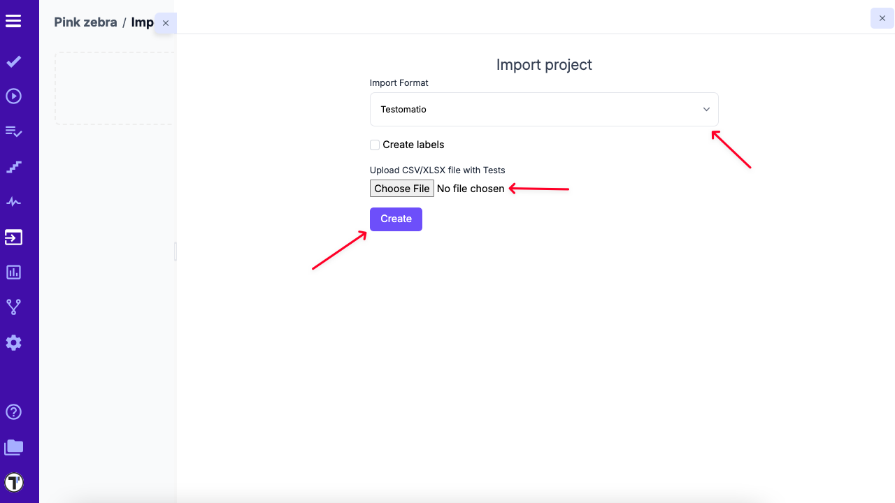

> If you have existing tests in XRay and want to migrate to Testomat.io, you can use our migration script, which pulls test cases via the XRay API and converts them into Testomat.io’s format.

## Import XRay Project via Migration Script

This method is ideal if you need to migrate test cases directly from XRay, including custom fields or complex structures.

### Steps:

1. Open your project in Testomat.io.  
2. Go to the **Imports** tab.  
3. Click the **Import from CSV** button.

4. From the dropdown, select **XRay**.  
5. Follow the instructions in the [advanced XRay migration script](https://github.com/testomatio/migrate-xray) to export your tests via API and convert them into a CSV format compatible with Testomat.io.

## How to Import Tests into Testomat.io

1. If you're creating a brand new project, the **Import from Spreadsheet** button will be available under the Test tab.

2. If you're working in an existing project, open it in Testomat.io.
3. Click the **Imports** tab.
4. Click the **Import from CSV** button.

5. From the dropdown menu, choose **Testomatio**.
6. Select the file generated by the migration script.
7. Click the **Create** button to complete the import.

