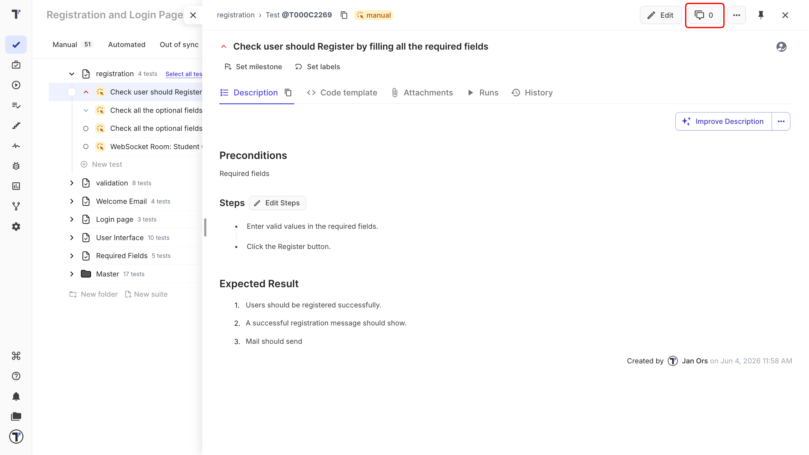

Comments keep a discussion next to the test it is about, instead of in a chat thread nobody can find a month later.

## Comment on a test or suite

You can comment on any test or suite, and everyone who has commented there before hears about it.

1. Open the test or the suite you want to discuss.
2. Open the **Comments** tab.
3. Enter your comment.
4. Click **Comment**.

Your comment appears in the thread with your name and the time you posted it.

## Mention a teammate

Type `@` followed by a teammate's username inside a comment. They are notified right away, so a question aimed at one person does not sit unread in a thread they had no reason to open.

Everyone who has already commented on that test or suite is notified when a new comment arrives. For how those notifications reach you, see [Notifications](./index.md).

## Comments in shared projects

Comments are always project-specific. When a [suite is shared](https://docs.testomat.io/project/tests/other-features-for-test-case-design/#sharing-tests-suites-and-folders) with another project, its comments stay in the project they were written in and do not travel with the shared tests.

:::note

The same applies in the other direction: a comment left in a target project is not visible in the source project.

:::

## Next steps

- [Notifications](./index.md)
- [Running tests manually](https://docs.testomat.io/project/runs/running-tests-manually)
- [Other Features for Test case Design](https://docs.testomat.io/project/tests/other-features-for-test-case-design)
