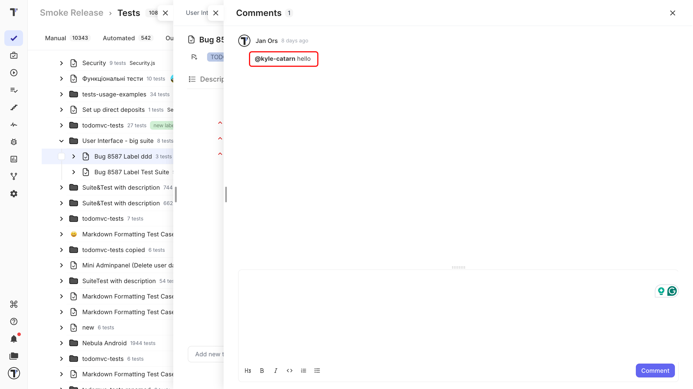
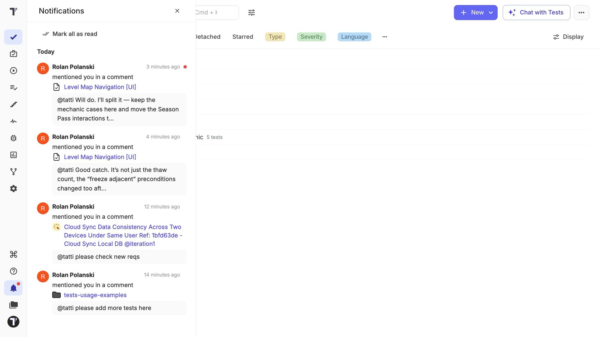

You can comment on any test or suite, mention a teammate to pull them in, and get notified in the app and by email when a conversation moves.

## Mention a teammate

Type `@` followed by a teammate's username in a comment on a test or suite. They are notified right away, so a question aimed at someone does not sit unread in a thread they had no reason to open.

## Thread notifications

A thread keeps everyone already involved in the loop. When you post a comment on a test or suite, everyone who has commented there before is notified that the conversation has moved on.

## The notifications bell

Notifications arrive where you are working. A bell in the left navigation collects them, with a dot when something is unread. 

Each notification shows who wrote it, a preview of the comment, and the test or suite it is about. Click it to mark it read and open the thread.

## Email notifications

Email follows five minutes after the in-app notification. If you have already read the notification in the app by then, the email is skipped, so you are not told twice.

:::note

You can turn email notifications off in [Account settings](https://docs.testomat.io/integrations/report-notifications/email/#_top).

:::

## Next steps

* [Pulse](https://docs.testomat.io/usage/pulse/)
* [Milestones](https://docs.testomat.io/advanced/milestones/)