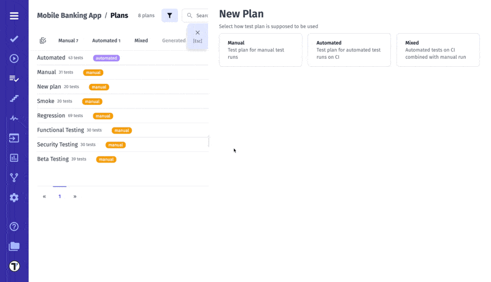
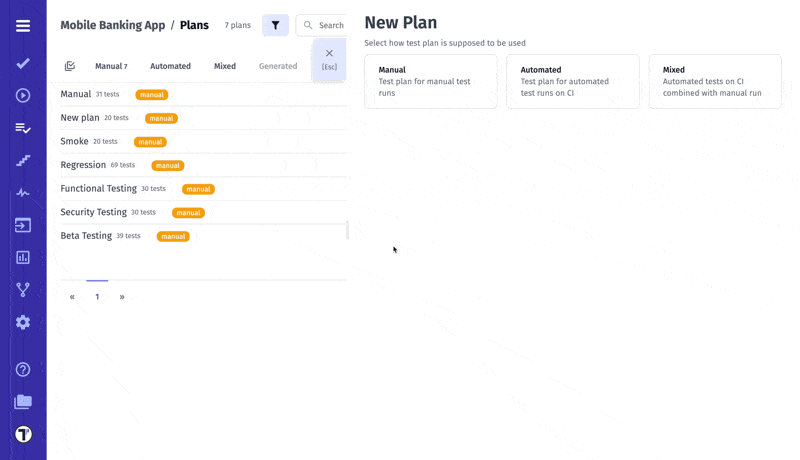
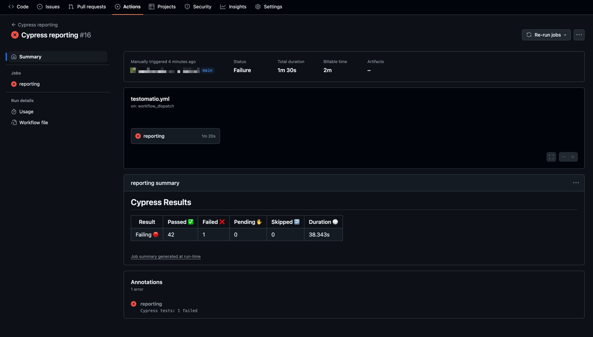
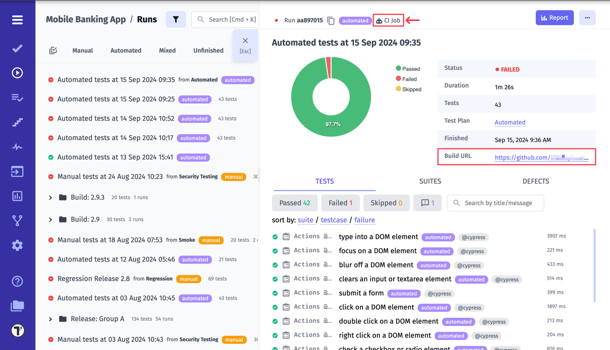

**Test Plan** is a detailed document that outlines the testing strategy, objectives, schedule, resources, and scope of a testing effort. It acts as a blueprint for how testing will be conducted, ensuring all stakeholders are aware of what will be tested, when, how, and by whom. A well-defined test plan is essential for ensuring product quality and aligning the testing process with project goals.

In Testomat.io, the **Plans** page is your central hub for managing all test plans. Here you can:

- **Search** – Quickly find your plans by name, tags, or other criteria.
- **Filter by type** - Manual, Automated, Mixed, or Generated.
- **Filter by label** – Narrow down plans by labels for better organization.
- **Add Labels & Link to Issues** – You can add labels or link a plan to an issue individually for a single plan, or select multiple plans at once using Multiselect.
- **Multiselect** – Select multiple plans to perform actions like adding labels, linking to issues, or deleting runs in bulk.
- **Create & Delete Runs** – Easily create a new run from a plan or delete existing runs.

This overview allows you to quickly navigate, filter, and manage your test plans before diving into their details.

## Types of Test Plans

In Testomat.io, there are three main types of test plans, each suited for different testing strategies:

- **Manual Plans** are intended for tests that are executed by testers. They provide full control over how tests are run, making them ideal for exploratory testing, usability checks, and scenarios requiring human assessment.

- **Automated Plans** are designed for tests that run automatically, either via CI or CLI. They ensure consistent, reproducible execution and are well suited for regression or other repetitive testing.

- **Mixed Plans** combine manual and automated tests in a single plan. They provide a flexible approach for teams that want to manage both manual and automated testing within the same testing scope.

## How to Create a New Plan

### Common Flow for All Plan Types (Including All Tests)

Before selecting test cases for any plan, the creation process follows the same initial steps for all plan types:

1. Go to the **'Plans'** page
2. Click the **'+ New plan'** dropdown
3. Choose one of the following options from the dropdown:

- **Manual**
- **Automated**
- **Mixed**

4. Enter a **Title** (required)
5. Add a **Description** (optional)

The description helps clarify the plan’s purpose, scope, and objectives. It can also be viewed later in the plan details or when inspecting Runs.

6. Enable the **'Run Automated as Manual'** toggle (optional)
7. Click the **'+ All tests'** button, then confirm

:::note

Clicking 'All tests' adds all tests to the collection and clears any other filters.

:::

8. Click the **'Save'** button

### How to Work with Test Collections

| Feature / Action                | Description                                 | Notes / Logic                                                                                                                                               |
| ------------------------------- | ------------------------------------------- | ----------------------------------------------------------------------------------------------------------------------------------------------------------- |
| **Enable/Disable collection**   | Toggle to show/hide tests in the collection | No restrictions                                                                                                                                             |
| **Mode: All tests**             | Adds all tests to the collection            | All tests are included, removes any active filters                                                                                                          |
| **Delete collection**           | Deletes the collection                      | All tests are included in the collection (logic same as Select All)                                                                                         |
| **Filters within a collection** | Combine multiple filters                    | **OR** logic is applied between filters inside a single collection; **AND** logic applies between different collections                                     |
| **Nested filters**              | Add filters within a collection             | Cannot add nested filters in a collection where tests are already selected; to use nested filters, apply different filters or create/use another collection |

### Filter-based selection

Filters allow you to dynamically include or exclude tests based on metadata.

**Include Tests by Filters**

- Adds tests to the collection that match any of the selected filters.
- Supported filters for Include:
  - Suites & folders
  - Tags
  - Priority
  - Assignees
  - Labels
  - Custom labels
  - Query
- Logic: OR within a collection, AND between collections.

**Exclude Tests by Filters**

- Removes tests from the collection that match selected filters.
- Supported filters for Exclude:
  - Suites & folders
  - Query
- Works in combination with included tests, respecting the same OR/AND logic.

:::note

Selecting **Tests** is a chosen mode, not a filter. It cannot be combined with **Include tests by filters** in the same collection.

:::

## Manual Plan

Manual plans provide a flexible way to create and manage manual runs. When creating a manual plan, you can choose how tests are included based on your workflow:

- Selecting specific tests using the Test Tree
- Selecting all tests using filters
- Selecting tests using filters
- Multiple filter groups (OR logic)
- Excluding tests by filters

Each of these options is described in detail in the sections above.

## Mixed Plan

Mixed Plan is a combination of automated and manual tests. Automated tests are running in **Continuous Integration**, while you run manual tests in parallel. As a result, you get one report for both automated and manual runs.

## Automated Plan

By choosing automated plan, you need to configure **Continuous Integration**. Also, tests need to have IDs. This can be done by adding the `--update-ids` option when importing tests.

To learn how to set up Continuous Integration in Testomat.io, visit the [dedicated page](https://docs.testomat.io/usage/continuous-integration/).

After running tests via CI, the report will be sent to Testomat.io. You can view it on the **Runs** page.

Automated run report:

A **Plan ID** can also be used to run an Automated Plan. To learn how to do this, visit the [Filter Test](https://docs.testomat.io/reference/reporter/pipes/testomatio/#filter-tests) page (currently available for Playwright and CodeceptJS frameworks).
