**Test Plan** defines the scope, structure, and execution model of a run. It helps teams clearly understand which tests will be executed, how they are grouped, and how results will be reported.

In Testomat.io, Test Plans allow you to organize tests, control how they are executed (manually, automatically, or both), and keep test results consistent and transparent for all stakeholders.

The **Plans** page is the central place where you create, manage, and organize all test plans. From here, you can:

1. **Filter by label** – Narrow down plans by labels for better organization
2. **Search** – Quickly find plans by name
3. **+ New plan** – Create Manual, Automated, or Mixed plans
4. **Multiselect** – Select multiple plans to apply bulk actions
5. **Filter by type** – Narrow down plans by types (Manual, Automated, Mixed, or Generated)
6. **Labels** – Assign or remove labels to one or multiple plans
7. **Link to Issue** – Link plans to issues individually or in bulk
8. **Delete** – Remove one or multiple plans using multiselect

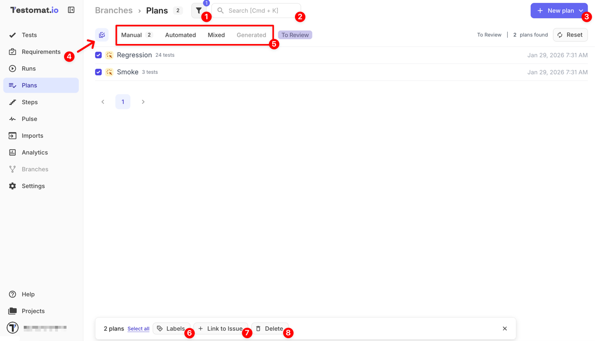

This overview helps you quickly navigate, filter, and manage test plans before working with plan details and runs.

## Types of Test Plans

Testomat.io supports three main types of test plans. Each type is designed for a specific testing goal and execution model. Choosing the right plan type depends on how your tests are executed and how results should be reported.

- **Manual** – for executing tests manually and reporting results from the UI
- **Automated** – for running automated tests via CI or CLI and reporting results automatically
- **Mixed** – for combining manual and automated tests in a single plan and report

Below, we’ll walk through each plan type and explain how and when to use it.

### Manual Plans

**Manual Plans** are designed for tests that are executed manually by testers.

They are typically used when:

- Tests require human validation or judgment
- Exploratory or usability testing is performed
- Manual regression or acceptance testing is needed

#### Add Automated Tests as Manual

Manual Plans include an optional toggle: **Run Automated as Manual**.

**When enabled:**

- Automated tests can be added to a Manual Plan **using the same selection logic as manual tests** (test tree, folders/suites, or filters)
- These tests are executed manually, and test run statuses (**Passed / Failed / Skipped**) are assigned manually during the run

**When disabled:**

- Automated tests are not selectable

This toggle is the **only exception** to the strict plan-to-test-type mapping.

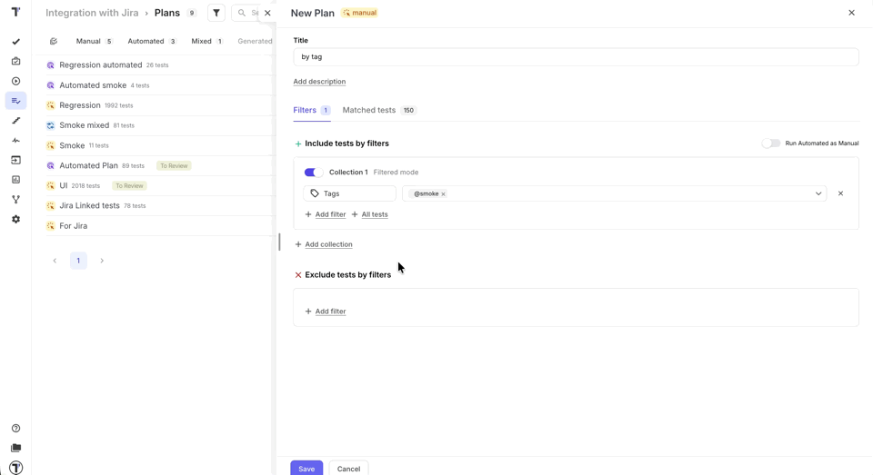

### Automated Plans

**Automated Plans** are designed for running automated tests and sending their results to Testomat.io.

They are typically used when you:

- Want to run a fixed or predefined set of automated tests
- Execute tests automatically via a **Continuous Integration (CI) service** or **from CLI**
- Need tests to run regularly (e.g., nightly, on every commit, or before a release)
- Want test results reported automatically, without manual intervention

With Automated Plans:

- Only **automated tests** can be added to the plan
- Test execution is triggered via a CI pipeline or CLI command
- Execution results are sent automatically to Testomat.io

To use an Automated Plan:

- Tests must have **IDs**
- IDs can be generated using the `--update-ids` option during test import
- Each plan has a **Plan ID**, which can be used to run this specific collection of tests

For example,

`TESTOMATIO={API_KEY} npx @testomatio/reporter run 'actual run command' --filter 'testomatio:plan={Plan_ID}'`

- `{API_KEY}` – your Testomat.io Reporting API key
- `{Plan_ID}` – ID of the plan you want to run
- `'actual run command'` – your test framework command (e.g., `npx codeceptjs`)

#### How to Launch an Automated Run from a Plan

Once your Automated Plan is created, you can start an automated run from the **'Plans'** page.

If you want to run tests automatically on a CI service:

1. Go to the **'Plans'** page
2. Open your Automated Plan
3. Click the **'Launch'** button → you will be redirected to the **Runs** page
4. A new run **'Run automated tests in CI'** will be triggered in the sidebar

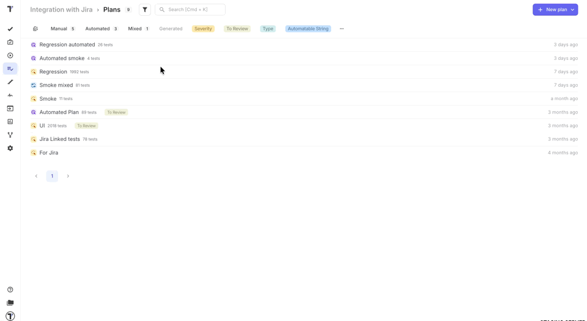

:::note

The **'Launch'** button on the Plans page will **not be active** if Continuous Integration is not configured. Make sure CI is set up first. Learn more on the [Continuous Integration page](https://docs.testomat.io/usage/continuous-integration/).

:::

### Mixed Plans

**Mixed Plans** combine both manual and automated tests in a single plan.

They are typically used when you:

- Include automated tests that run via CI or via CLI
- Have other tests that still require manual execution
- Want a **single report** for the entire testing scope

With Mixed Plans:

- Both **manual and automated tests** can be added in the same plan
- Automated tests can be executed via CI or triggered via CLI
- Manual tests are executed manually
- Results from both test types are combined into a single run report

This makes Mixed Plans suitable for flexible or transitional testing strategies.

#### How to Launch a Mixed Run from a Plan

Once your Mixed Plan is created, you can start a run directly from the **'Plans'** page. When triggered:

1. Go to the **'Plans'** page
2. Open your Mixed Plan
3. Click the **'Launch'** button → you will be redirected to the **Runs** page
4. A new run **'New Mixed Run'** will be triggered in the sidebar
5. You can choose whether to **enable or disable CI build** for this run

:::note

The **'Launch'** button on the Plans page will **not be active** if Continuous Integration is not configured. Make sure CI is set up first. Learn more on the [Continuous Integration page](https://docs.testomat.io/usage/continuous-integration/).

:::

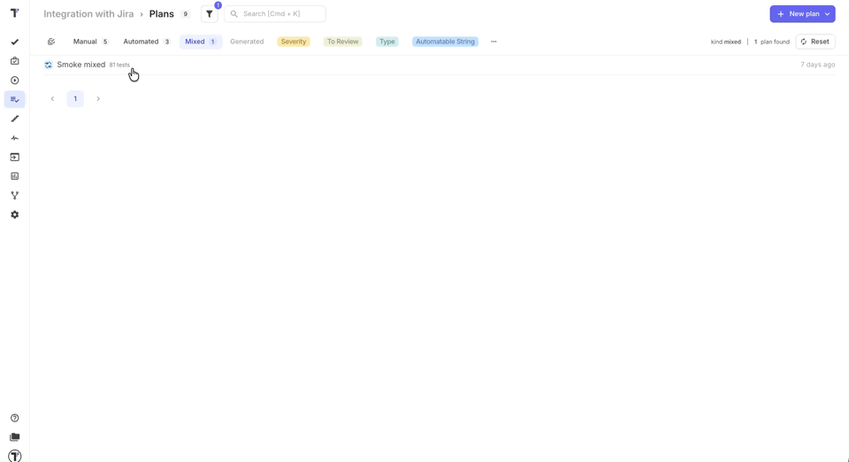

## How to Create a New Plan

This section explains how to create a Test Plan in Testomat.io and configure its basic settings. You can create a plan from different parts of the application, depending on your workflow.

### Ways to Create a Test Plan

There are two ways to create a Test Plan in Testomat.io:

1. **From the Plans page**  
   This is the standard way to create and manage plans. It is suitable for all plan types and is described in detail below.

2. **From the Runs page**  
   You can also create a plan directly while launching a run.  
   In this case:
   - The plan creation settings are **identical** to creating a plan from the Plans page
   - The newly created plan is **automatically pre-selected** for the current run
   - This is the **only supported way** to create a plan during **Manual or Mixed run**

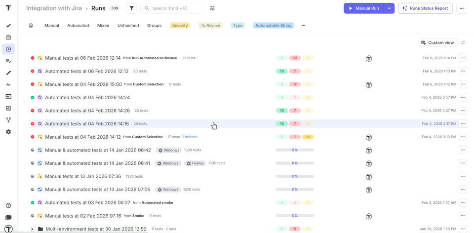

Regardless of where you start — from the **Plans** page or directly from the **Runs** page — the plan creation and configuration flow remains the same.

### Common Flow for All Plan Types (Including All Tests)

Before selecting test cases for any plan, the creation process follows the same initial steps for all plan types:

1. Go to the **'Plans'** page
2. Click the **'+ New plan'** dropdown
3. Choose one of the following options from the dropdown:

- **Manual**
- **Automated**
- **Mixed**

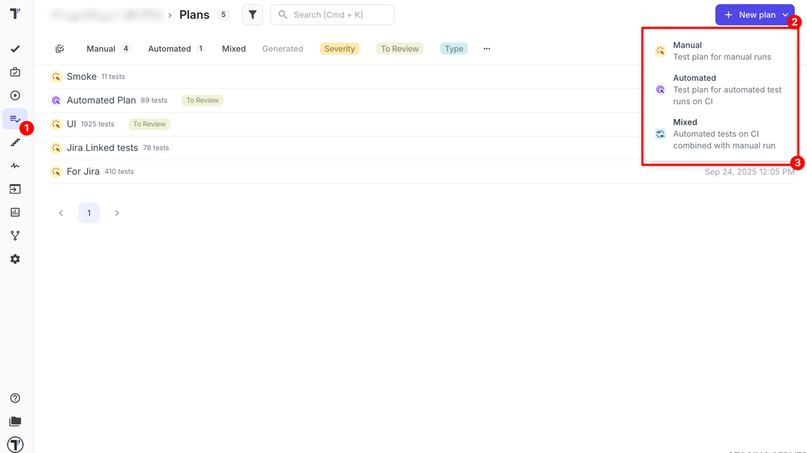

4. Enter a **Title** (required)
5. Add a **Description** (optional)

The description helps clarify the plan’s purpose, scope, and objectives. It can also be viewed later in the plan details or when inspecting Runs.

6. Enable the **'Run Automated as Manual'** toggle (optional)
7. Click the **'+ All tests'** button, then confirm

:::note

Clicking 'All tests' adds all tests to the collection and clears any other filters.

:::

8. Click the **'Save'** button

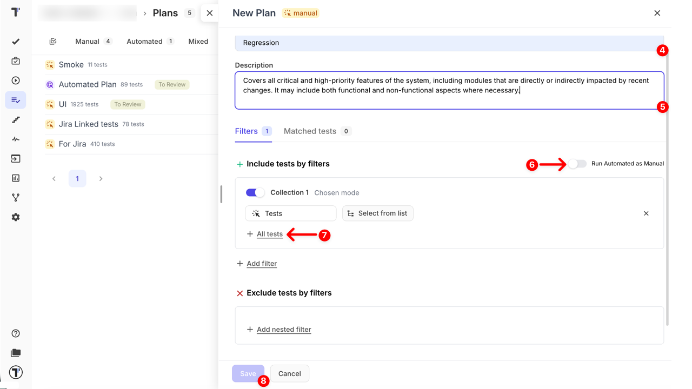

## How to Work with Test Collections

| Feature / Action              | Description                                 | Notes / Logic                                                                                                                                                                                                                   |
| ----------------------------- | ------------------------------------------- | ------------------------------------------------------------------------------------------------------------------------------------------------------------------------------------------------------------------------------- |
| **Enable/Disable collection** | Toggle to show/hide tests in the collection | No restrictions                                                                                                                                                                                                                 |
| **Add filter**                | Adds filters within a collection            | **AND** logic is applied between filters inside a single collection.   Cannot add any filters in a collection where **Tests** are already selected   To use filters, apply different filters or create another collection |
| **Delete filters**            | Removes filters from the collection         | If the **last remaining filter** is removed while the collection toggle is enabled,   **all tests are included in the collection**.  Removing one of multiple filters works as expected                                   |
| **All tests**                 | Includes all tests in the collection        | All tests are included in the collection; removes any active filters                                                                                                                                                            |
| **Add collection**            | Adds a new collection with its own filters  | Allows combining different sets of filters across collections; **OR** logic applies between collections                                                                                                                         |
| **Delete collection**         | Deletes the collection                      | Removes the collection along with all its filters. The first (default) collection cannot be deleted                                                                                                                             |

### Filter-based selection

Filters allow you to dynamically **include or exclude tests in a plan** based on metadata. Adding or removing tests via filters directly affects the plan, not just the collection.

**Include Tests by Filters**

- Adds tests to the collection **and the plan** that match any of the selected filters
- Supported filters for Include:
  - Suites & folders
  - Tags
  - Priority
  - Assignees
  - Labels
  - Custom labels
  - Query
- Logic: **AND** within a collection, **OR** between collections
- All tests selected by the filters are displayed in the **Matched tests** tab

**Exclude Tests by Filters**

- Removes tests from the collection **and the plan** that match selected filters
- Supported filters for Exclude:
  - Suites & folders
  - Query
- Works in combination with **Include Tests by Filters**
- Logic: **AND** within a collection

:::note

**Tests** is a chosen mode, not a filter. It cannot be combined with **supported filters** in the same collection.

:::

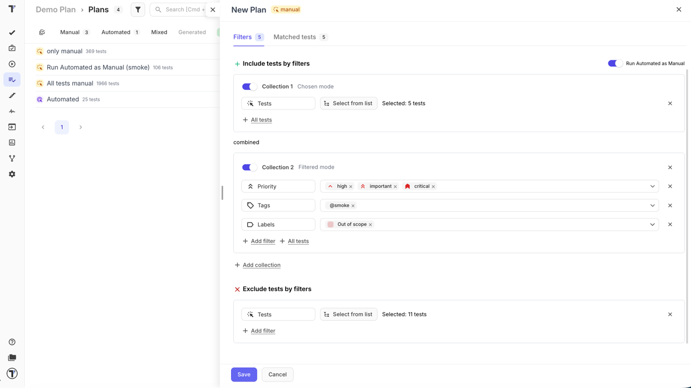

## Managing Plans

Efficient management of test plans is key to keeping your testing organized and transparent. In Testomat.io, you can group and organize plans using **Labels**, making it easy to filter, find, and manage multiple plans at once.

### Benefits of Using Labels for Plans

By assigning labels to your plans, you can:

- Organize plans by category, team, or purpose – e.g., 'Regression', 'Smoke', 'QA'
- Filter plans quickly – instantly narrow down the list of plans by selecting specific labels
- Maintain consistency across projects – ensure all plans follow a structured labeling system
- Apply bulk actions easily – assign or remove labels from multiple plans at once using multi-selection

Labels provide a flexible way to group and manage plans according to your workflow.

### How to Assign Labels to Plans

1. Go to the **Plans** page
2. Open a plan or select multiple plans using multi-selection mode
3. Click the **Labels**
4. Select the labels you want to assign
5. Click **Add** button

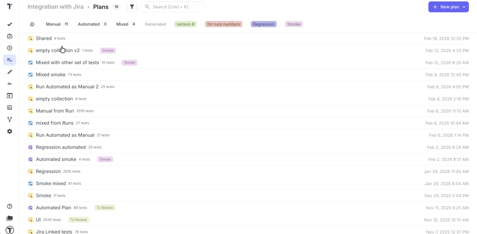

:::note

You can create new labels or manage existing ones in [Settings → Labels & Fields](https://docs.testomat.io/advanced/tags-labels/labels-and-custom-fields/#how-to-add-labels--custom-fields). Make sure to set the Scope to Plans so labels are applied correctly.

:::

### Filtering Plans by Labels

Testomat.io offers two convenient ways to filter your plans using **labels**:

1. Using the **Filter Bar**:

- Click the **filter** icon next to the search bar
- Apply one or multiple labels
- This method allows multi-label filtering, showing only plans that match all selected labels

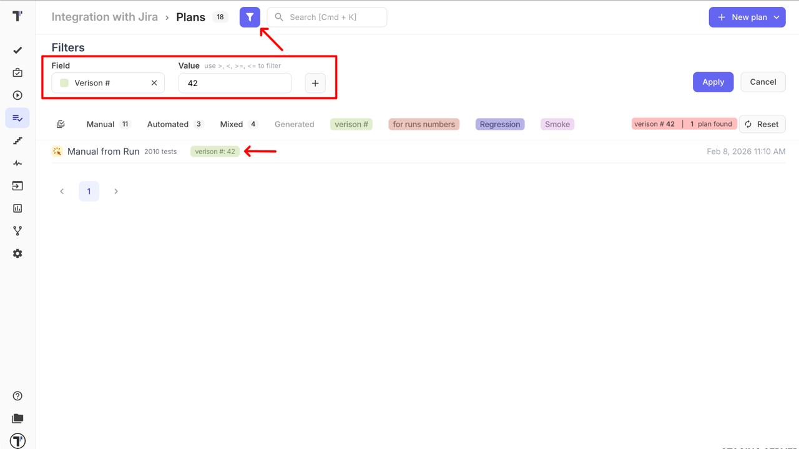

2. Using the **Quick Filter Panel**

- All labels currently in use are displayed
- Select a single label from this list to quickly filter plans
- This method is ideal for fast, one-label filtering

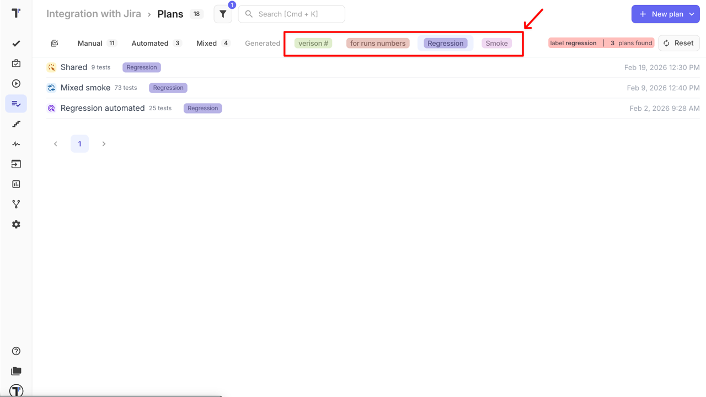

:::note

Use the **Filter Bar** for more advanced multi-label filtering, and the **Quick Filter Panel** for fast access to frequently used labels.

:::

### Tree View for Plans

Plans can be displayed in a hierarchical tree structure that mirrors the test organization. To switch to tree view, open a plan and click the tree view icon in the top right corner of the test list.

You can:

* Expand folders
* Collapse sections
* Navigate large test sets faster
* Focus on specific areas of a project

:::note

This is particularly useful for large projects containing hundreds or thousands of tests.

:::

### Example Use Cases

- QA lead wants to see only Regression plans – assign a 'Regression' label to all relevant plans and filter by it
- A team working on Frontend tests can quickly access all their plans by using the 'Frontend' label
- During release planning, project managers can filter plans by priority or milestone labels to focus on relevant test coverage
