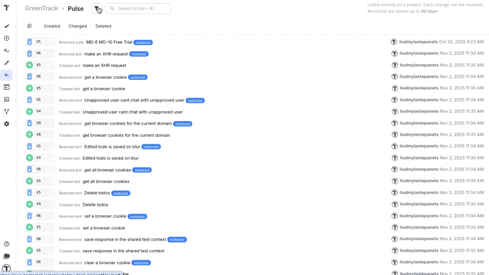
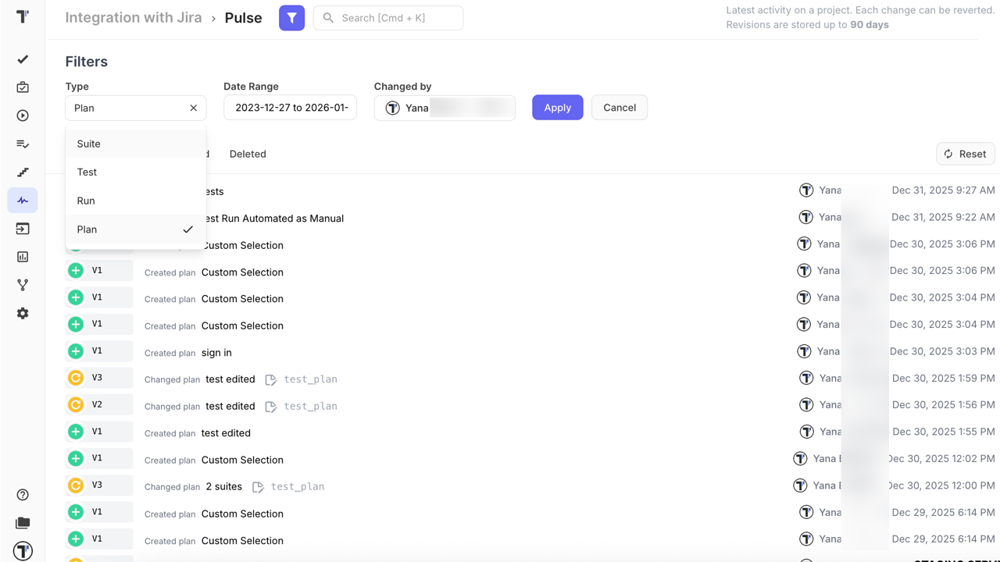
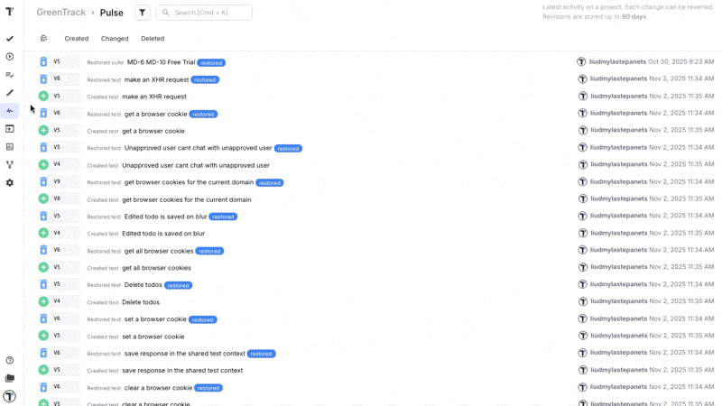
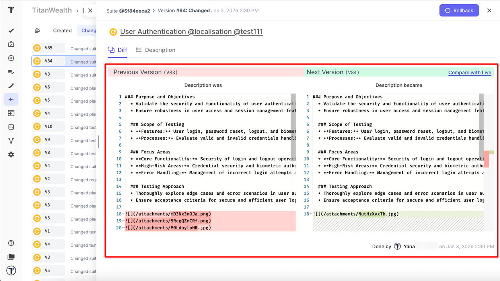
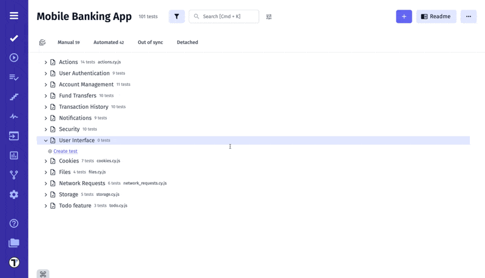

**Pulse** is a powerful feature in [Testomat.io](https://app.testomat.io) that brings full visibility, traceability, and control to your QA workflow. It tracks every change made within your projects — including **tests, suites, plans, and runs** — giving you a clear picture of how your testing assets evolve over time.

Pulse provides instant visibility into team activity and testing progress. This helps **QA Leads** and **Project Managers** stay informed without manually requesting status updates.

## What is Pulse

Pulse acts as your **project’s activity log** and **version history**, automatically recording all modifications across **tests, suites, plans, and runs**. It’s designed to ensure transparency, accountability, and easy recovery, so your team can work confidently knowing that every action is tracked and reversible.

Every action related to these entities is recorded, providing full visibility into how your testing assets evolve over time.

With Pulse, you can:

- See **who made a change**, **what was changed**, and **when** it happened.
- Review the history of edits, additions, or deletions for any test, suite, plan, or run.
- **Restore deleted items** or roll back to previous versions with a single click.

For **QA Engineers**, this means full control over versioned work. For **managers**, it offers a reliable audit trail and a clear view of project momentum over time.

This ensures you’ll never lose important test data or struggle to understand how your project has evolved — Pulse keeps your QA process transparent and your history intact.

## How Pulse Works

You can access Pulse directly from the **Pulse** tab in your Testomat.io project. There, you’ll find a chronological list of all activities recorded over the last **90 days**. Each entry contains detailed information about the change, including timestamps, item type, and the responsible team member.

Pulse allows you to track every action across your QA workflow, giving you a clear picture of how tests, suites, plans, and runs evolve over time.

### Activity Types

Activity tracking applies to all main QA entities in your project. For each entity, Pulse records **who performed the action** and **when it happened**:

- **Suite** — tracking full **CRUD** activity for suites, with versioned changes, before/after diffs, including title and description updates, attachment changes, bulk edits within a suite, and suite restore.
- **Test** — tracking full **CRUD** activity for tests, with versioned changes, before/after diffs, including title and description updates, attachment and priority changes, test state updates (manual, automated), and test restore.
- **Run** — tracking activity for runs, with versioned changes, before/after diffs, including manual or automatic purge, run restore, and permanent removal.
- **Plan** — tracking full **CRUD** activity for plans (manual, automated, mixed), with versioned changes, before/after diffs, including filter updates, included/excluded suites and tests, query changes, manual/automated state changes, and plan restore.

**QA Leads** can use this overview to identify active contributors, while **PMs** can quickly assess whether recent changes align with sprint goals or release timelines.

:::note

Every recorded event provides a clear snapshot of the change and supports **rollback functionality**, so you can revert to a previous version or recover deleted items when needed.

:::

## Filtering and Navigation

Pulse includes powerful filters to help you quickly find the information you need. You can narrow down activities based on:

- **Item Type** – filter logs by **Suite, Test, Run, or Plan**.
- **Date Range** – filter changes within a specific time window.
- **Changed By** – see actions performed by a particular user.

Each filter can be applied individually or in combination, enabling precise tracking of team activity and project evolution.

This makes it easy to monitor specific team members’ contributions or isolate changes from a given testing phase.

In addition to filters, Pulse provides activity tabs that allow you to switch between:

- **Created** — new tests, suites, or plans added to the project.
- **Changed** — updates to existing items.
- **Deleted** — items removed from the project, including tests, suites, plans, or runs.

These tabs instantly filter the activity feed by action type, making navigation faster and more intuitive.

## Diff

Pulse provides a Diff view for items with the **Changed** action. It allows you to compare different versions of the same item and clearly see what was modified between them.

## Bulk Restore

Bulk Restore is a great extension for Pulse. It is designed to save you time and effort by allowing you to restore multiple deleted tests and suites at once.

With Bulk Restore, you can:

- **Batch Restore:** Quickly and efficiently recover multiple deleted tests and suites at once, eliminating the need to restore each item individually.

- **Multi-Selection Mode:** Easily activate multi-select mode, choose the tests and suites you wish to restore, and bring them all back with a single action.

:::note

**Runs activity in Pulse** tracks all purge actions for transparency. Permanently deleted Runs cannot be restored. Full details: [Runs Activity Tracked in Pulse](https://docs.testomat.io/project/runs/managing-runs/#runs-activity-tracked-in-pulse).

:::
