## Custom Statuses

Custom Statuses let QA teams extend the context of test results by going beyond the standard test results — PASSED, FAILED, and SKIPPED. They are especially useful in manual testing to capture workflow-specific outcomes that default results alone cannot express.

Each custom status is linked to one of the default test results and can:

- Clarify the reason behind a passed, failed, or skipped result
- Indicate follow-up actions or required next steps
- Enhance filtering and analysis using a query language

### How to Configure Custom Statuses

When you create a new project, the system provides a set of default custom statuses to help you get started right away. However, you can fully customize these statuses to better fit your team’s workflow and testing needs. Let's see how it works.

1. Open **Settings** in the sidebar
2. Click on the **Custom Statuses** tab

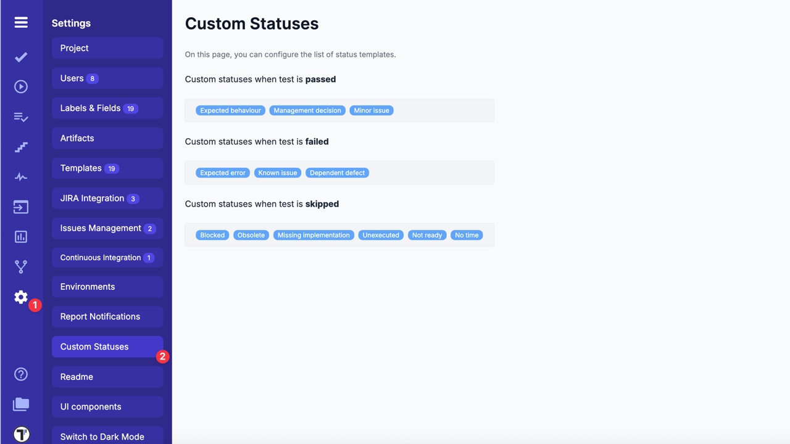

You can now add or edit existing statuses by clicking on the relevant field where you want to make changes.

3. Write a report message per line, for example, **'Needs review'**
4. Click the **'Update'** button to save the changes

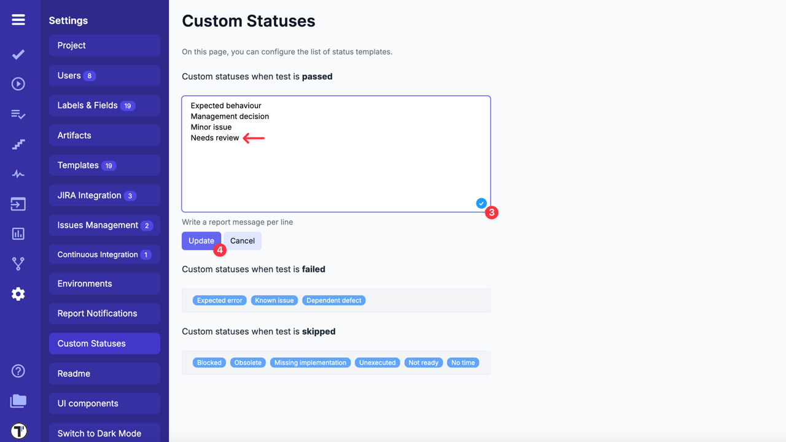

The same actions can be applied to each field, such as **'Custom statuses when test is failed'** or **'Custom statuses when test is skipped'**.

### How to Apply Custom Statuses During Test Execution

Custom statuses appear as an additional optional field below the standard test results: PASSED, FAILED, and SKIPPED. When you select one of these standard results during a manual test run, the custom statuses configured specifically for that result become available.

For example, if your test result is **'PASSED'**, you can optionally select a custom status configured for **'PASSED'**, such as **'Needs review'** or another one.

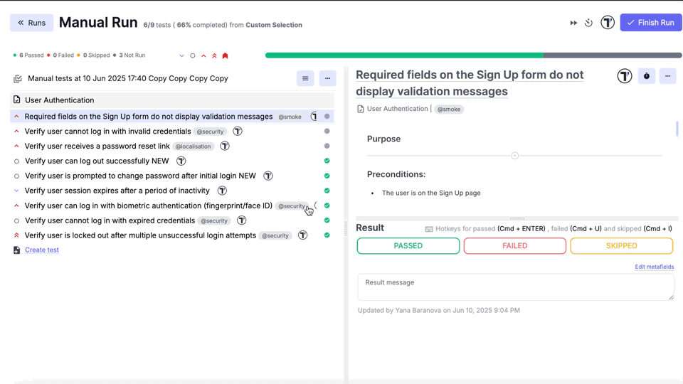

:::note

Custom statuses do not replace the standard test results; they provide an additional layer of detail. They are only available after selecting a standard result. If no standard result is chosen, the custom status field remains hidden.

:::

For detailed steps on setting test results during manual runs, see:
[How to Set Test Case Results in Manual Run](https://docs.testomat.io/project/runs/running-tests-manually/#how-to-set-test-case-results-in-manual-run).

### How to Filter Test Results by Custom Statuses

Find what matters quickly by filtering your test results based on custom statuses — either within a single run or across multiple runs using Query Language.

- **Quick Filter**: Use the Custom Statuses dropdown in the Run sidebar or Run Report to view results within a single test run

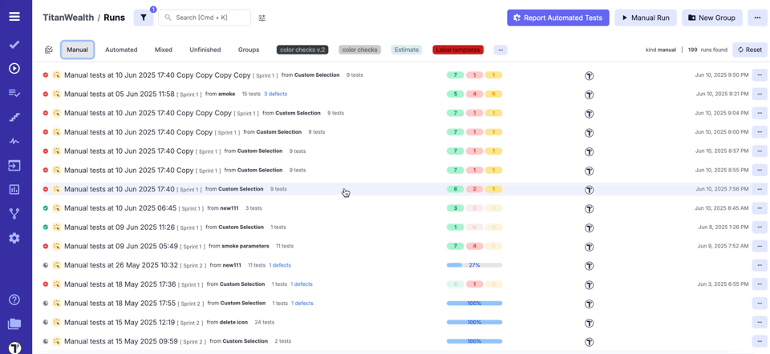

- **Advanced Filter (Query Language)**: Use query language to search across runs or tests and combine filters for deeper analysis

**Filtering in Runs Query Editor**

1. Go to the **Runs** tab in the sidebar
2. Click on Query Language Editor at the top of the page
   (Or simply start typing in the search field)

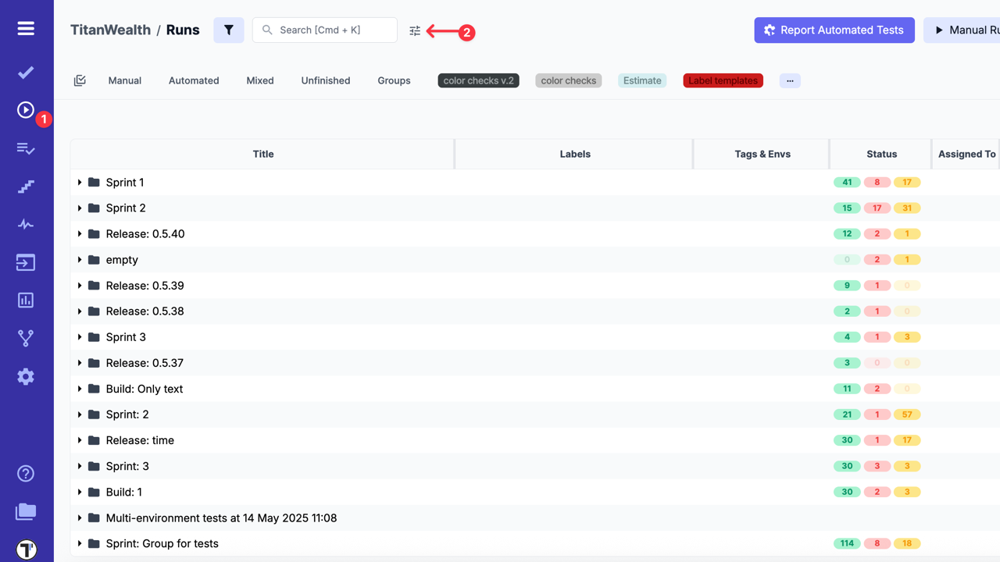

3. In the Runs Query Editor, enter your query,

- Filter by a single custom status:

```ini
has_custom_status == 'Known issue'
```

- Filter by multiple statuses:

```ini
has_custom_status in ['Expected behavior','Minor issue','Management decision']
```

4. Click the **Apply** button

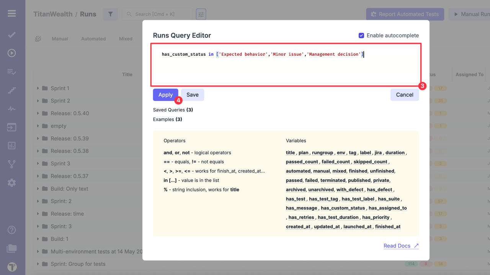

After applying the query, you will see a filtered list of test runs that match your criteria. This helps you quickly understand how much of your testing scope falls under a particular custom status.

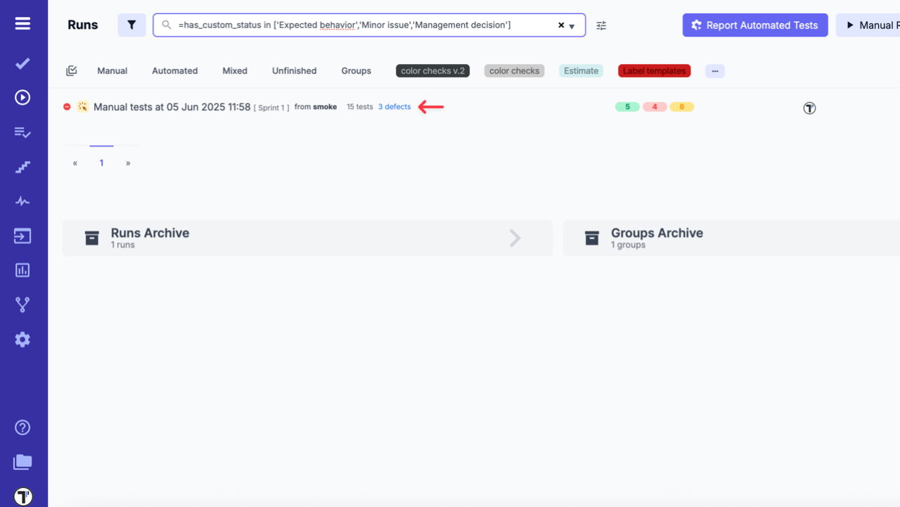

**Filtering in Tests Query Editor**

In contrast, the Tests Query Editor uses the field **custom_status** to filter individual tests by their custom status.

1. Go to the **Tests** tab in the sidebar
2. Click on Query Language Editor at the top of the page
   (Or simply start typing in the search field)

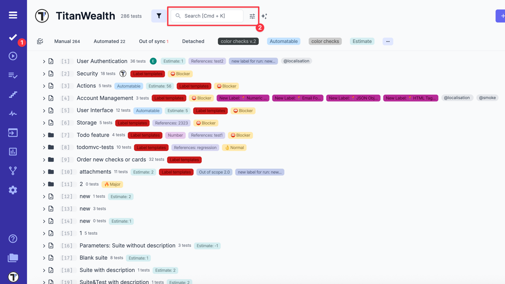

3. In the Tests Query Editor, enter your query,

- Filter by a single custom status:

```ini
custom_status in ['Expected behavior','Minor issue','Management decision']
```

- Filter by multiple statuses:

```ini
custom_status in ['Expected behavior','Minor issue','Management decision']
```

4. Click the **Apply** button

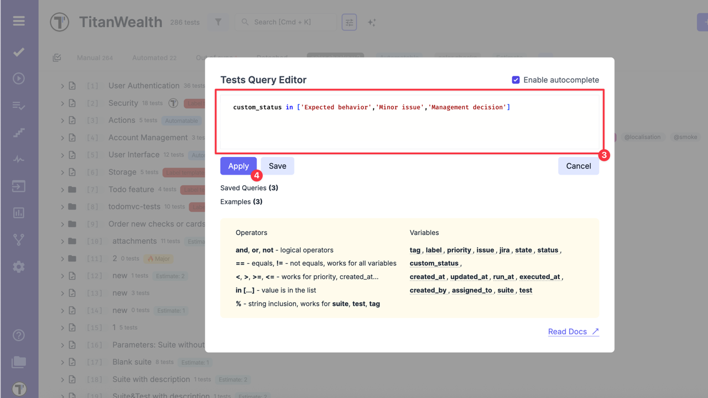

After applying the query, you will see a filtered list of tests that match your criteria. This helps you quickly identify tests categorized under a particular custom status.

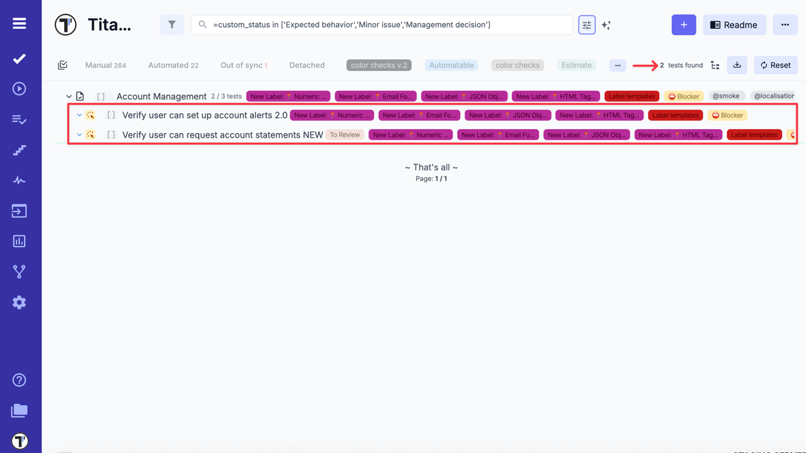

See the Query Language documentation for a full list of available variables to use in run and test queries — including custom statuses:

- [Run Query Language (RQL) documentation for run queries](https://docs.testomat.io/advanced/tql/#runs-variables)
- [Test Query Language (TQL) documentation for test queries](https://docs.testomat.io/advanced/tql/#tests-variables)

### How to Use Custom Statuses in Analytics

You can use Сustom Statuses in Analytics to gain better visibility into your testing outcomes — both at the run level and the test level.

**Custom Charts** help you:

- Track the status and progress of tests over time
- Identify recurring issues or bottlenecks
- Make informed decisions based on detailed test outcome trends

**Example queries for test runs (RQL)**:

```ini

has_custom_status in ['Blocked', 'Obsolete', 'Missing implementation', 'Unexecuted', 'Not ready', 'No time']
has_custom_status in ['Expected error', 'Known issue', 'Dependent defect']
has_custom_status in ['Expected behavior', 'Minor issue', 'Management decision']

```

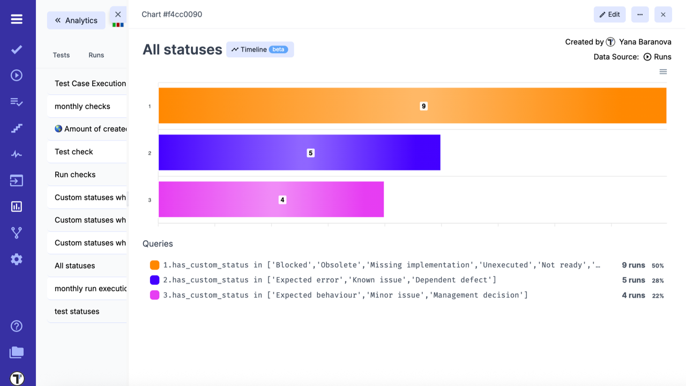

**Example queries for individual tests (TQL)**:

```ini

custom_status in ['Blocked', 'Obsolete', 'Missing implementation', 'Unexecuted', 'Not ready', 'No time']
custom_status in ['Expected error', 'Known issue', 'Dependent defect']
custom_status in ['Expected behavior', 'Minor issue', 'Management decision']

```

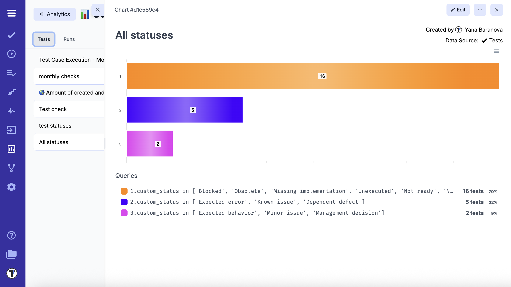

Additionally, use the Timeline view in the sidebar to visualize how custom statuses evolve over time across runs and tests.

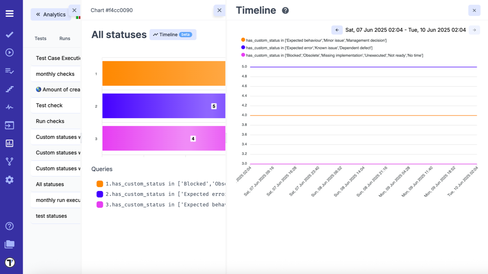

For detailed instructions on creating and customizing charts, see:
[How to Use Custom Charts with Test Runs](https://docs.testomat.io/project/analytics/#how-to-use-custom-charts-with-test-runs).

:::note

Keep queries up to date. If your team updates or renames custom statuses, update your queries accordingly, including those used in analytics dashboards. Otherwise, the filters may not return the expected results or and relevant data may be missed.

:::

**Use Cases:**

- Add a custom status to clarify the reason behind a test result (e.g. further investigation needed, blocked by dependencies, waiting for implementation)
- Highlight tests that require specific follow-up actions, such as re-execution, review, or coordination with other teams
- Categorize skipped or failed tests to reflect different workflow conditions or business decisions
- Use meaningful labels to improve visibility and collaboration during triage or reporting

**Tips:**

- Keep custom statuses short and action-oriented
- Use consistent naming conventions for easier filtering
- Regularly review and remove unused statuses to avoid clutter
- Maintain consistent names across projects to improve team collaboration
- Avoid long descriptive phrases; use concise labels like Blocked, Needs Review, etc.
