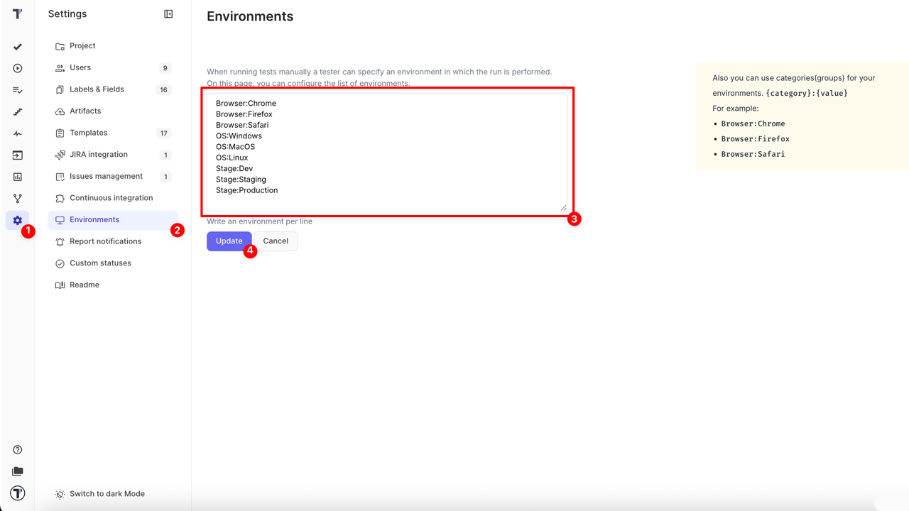
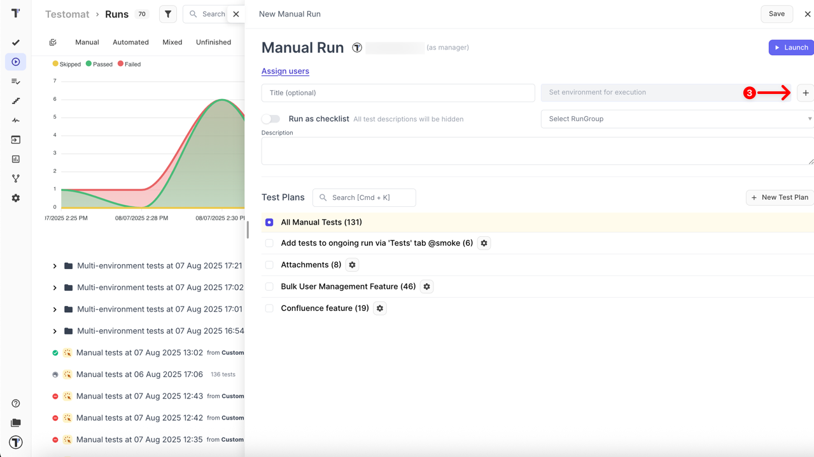
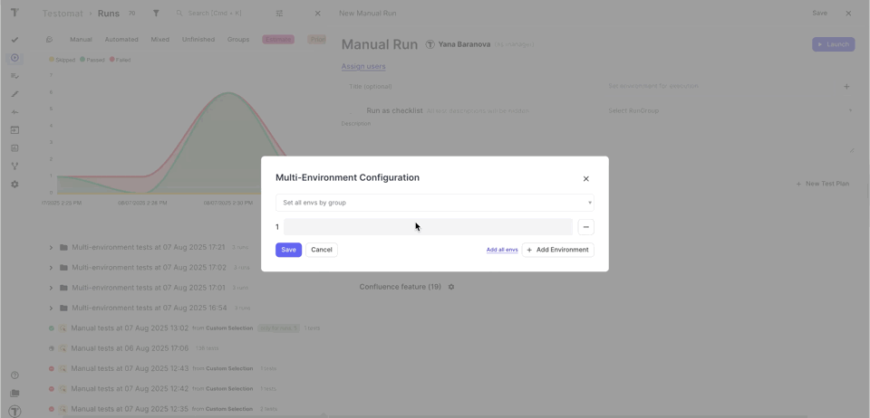
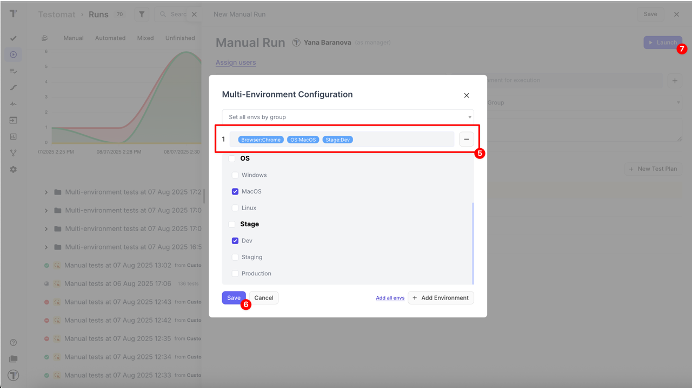
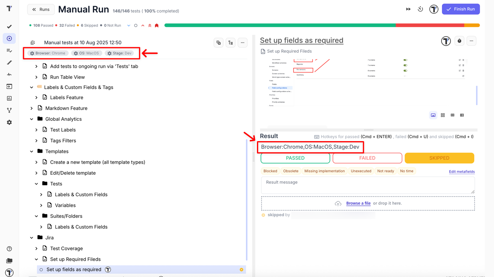
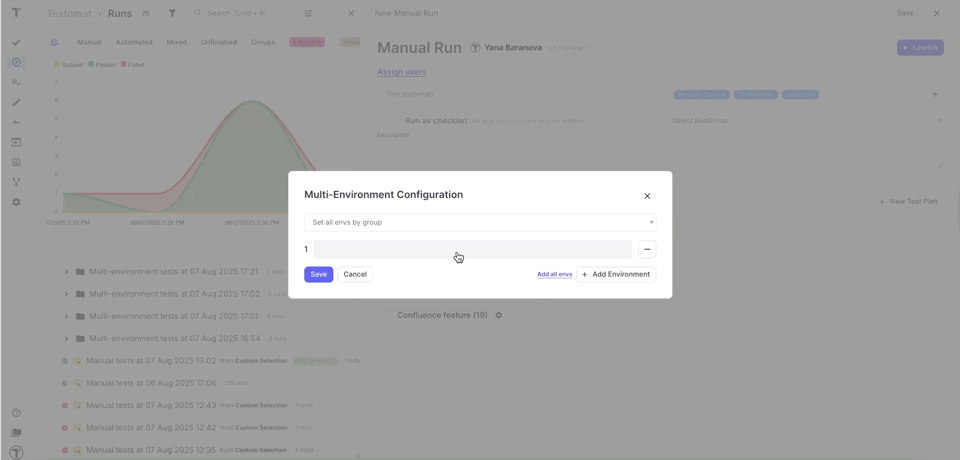
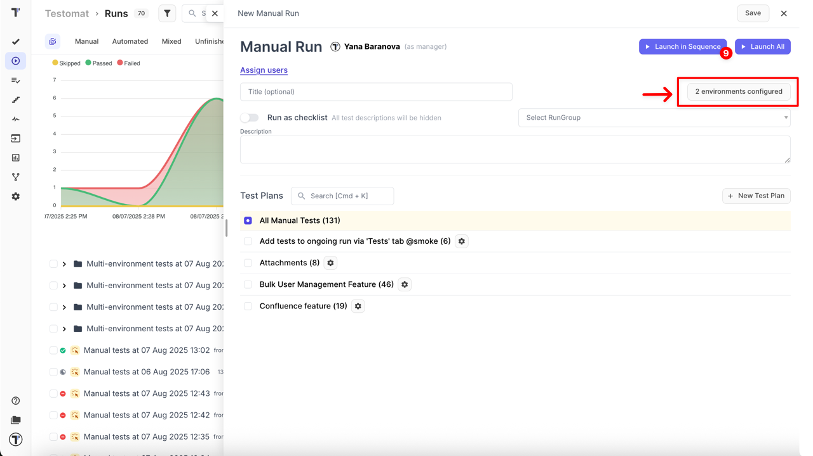
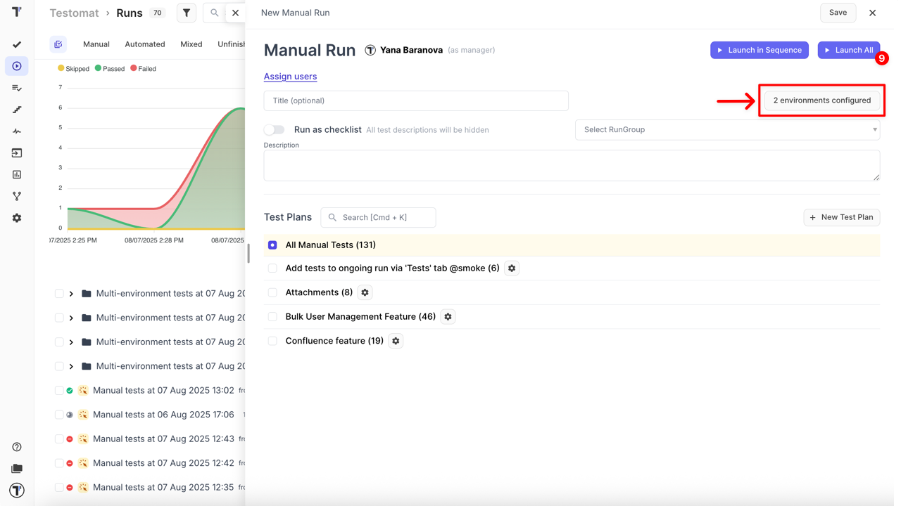
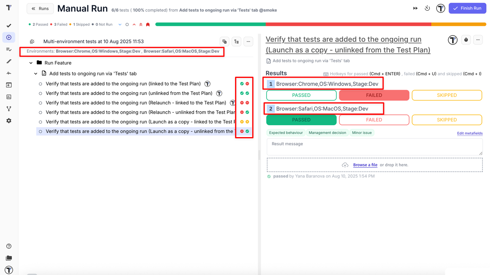

Multi-Environment Feature allows you to execute the same set of test cases across multiple environments — such as different operating systems, browsers, or devices. This is essential for validating cross-platform compatibility, behavior under various configurations, and deployment consistency.

You can run tests in multiple environments either in a single run, sequentially, or in parallel — depending on your project needs and available resources.

## How to Configure Environments

Configuring environments means defining different platforms, browsers, devices, or other variables where you want to run your tests. Managing environments centrally in the project settings ensures clarity, reduces errors, and improves reporting since all test results are linked to standardized environment names. This setup supports consistent and reusable environment definitions across manual test runs, automation, and CI/CD.

To better structure and filter environments, you can organize them using categories (groups) in the format **{category}:{value}**:

```
Browser:Chrome
OS:Windows
Device:iOS
Stage:Dev
```

This structure allows flexible combination and filtering of environments.

### How to Add New Environments

To get started with environments, you’ll need to add them in your project settings. Follow these simple steps:

1. Navigate to **Settings** in the sidebar
2. Click the **Environments**
3. Enter an environment(s) per line
4. Click the **Update** button



Need to update or edit your environments later? Just follow the same steps above to make changes anytime.

## How to Run with Multi-Environments

This section explains how to execute tests using different Multi-Environment configurations. After setting up environments in project settings, you can choose among several run modes depending on your testing strategy and infrastructure capabilities.

Each Multi-Environment group creates a separate test run. All created runs are collected in a dedicated group for easier management and overview.

### Run Multi-Environment Tests in One Run

This mode runs a single test run where each test is executed across all configured environments within one group. For example, if you select **Browser: Chrome, OS: Windows, and Stage: Dev**, the tests will run with this combined environment configuration. Test results are shown grouped by these environment settings inside this single test run.

How to run:

1. Click the **Runs** in the sidebar
2. Click on **Manual Run** button


3. Click **+** button to set environments for execution



4. Click on **-** button or Group 1, to trigger the dropdown list with all set up environments



5. Select one or more environments from the **Environment** dropdown list for the first group (e.g., `Browser:Chrome`, `OS:MacOS`, `Stage:Dev`)
6. Click the **Save** button
7. Click **Launch** button to run the single test run



After launch, manually set test results for each test with all configured environments. Details: [How to set test case results in Manual Run](https://docs.testomat.io/project/runs/running-tests-manually/#how-to-set-test-case-results-in-manual-run).



### Run Multi-Environment Tests Sequentially

This mode creates separate runs for each environment group and executes them one after another in sequence.

Use this mode when:

- Infrastructure resources are limited
- You need to control execution order
- Sequential validation is required

**Example:**

You have the following environment configurations:

- Group 1 - `Browser:Chrome + OS:Windows + Stage:Dev`
- Group 2 - `Browser:Safari + OS:MacOS + Stage:Dev`

Testomat.io will create two separate test runs:

- Run #1 — Browser:Chrome + OS:Windows + Stage:Dev
- Run #2 — Browser:Safari + OS:MacOS + Stage:Dev

How to run:

1. Click the **Runs** in the sidebar
2. Click on **Manual Run**


3. Click **+** to set environments for execution


4. Click on Group 1 or **-** button, to trigger the dropdown with all set up environments


5. Select one or more environments from the **Environment** dropdown list for the first group (e.g., `Browser:Chrome + OS:Windows + Stage:Dev`)
6. Use **Add Environment** button to add multiple groups
7. Select one or more environments from the **Environment** dropdown list for the next groups (e.g., `Browser:Safari + OS:MacOS + Stage:Dev`)
8. Click the **Save** button



Once environments are configured,

9. Click **Launch in Sequence** button to start runs one after another, sequentially



After launch, manually set test results for each run separately. Details: [How to set test case results in Manual Run](https://docs.testomat.io/project/runs/running-tests-manually/#how-to-set-test-case-results-in-manual-run).

### Run Multi-Environment Tests in Parallel (Launch All)

This mode runs tests simultaneously across all selected environment groups. Each group runs as a separate test run.

Use this mode when:

- You want to reduce testing time with parallel execution
- You have sufficient infrastructure resources
- You want independent access to results per environment group

**Example:**

You have the following environment configurations:

- Group 1 - `Browser:Chrome + OS:Windows + Stage:Dev`
- Group 2 - `Browser:Safari + OS:MacOS + Stage:Dev`

Testomat.io will create two separate test runs:

- Run #1 — Browser:Chrome + OS:Windows + Stage:Dev
- Run #2 — Browser:Safari + OS:MacOS + Stage:Dev

How to run:

1. Click the **Runs** in the sidebar
2. Click on **Manual Run**


3. Click **+** to set environments for execution


4. Click on first group or **-** button, to trigger the dropdown with all set up environments


5. Select one or more environments from the **Environment** dropdown list for the first group (e.g., `Browser:Chrome + OS:Windows + Stage:Dev`)
6. Use **Add Environment** button to add multiple groups
7. Select one or more environments from the **Environment** dropdown list for each additional group (e.g., `Browser:Safari + OS:MacOS + Stage:Dev`)
8. Click the **Save** button


9. Click **Launch All** button to start the run tests simultaneously



Once the run is launched, set the test results for each test with all configured environments simultaneously.



### Run Environments via CI/CD

Testomat.io supports executing tests with specific environment configurations directly from your CI/CD pipelines. You can pass environment parameters at runtime via command line or API, enabling fully automated multi-environment testing. This allows triggering test runs based on CI context, like branches or deployment stages (dev, staging, production).

For setup instructions and usage examples, refer to the official documentation:[Environment Configuration in CI/CD](https://docs.testomat.io/integrations/continuous-integration/#environment-configuration)

## Key Benefits and Use Cases

Using environments in Testomat.io enhances testing efficiency by:

- Run tests across different browsers and OSs (Chrome, Safari, Windows, macOS, etc.) to ensure compatibility
- Test on Android, iOS, and other devices
- Separate runs for dev, staging, and production environments
- Choose between sequential or parallel runs depending on resources and needs
- Trigger test runs with environment parameters based on branches or other CI context
- Define environments once and reuse across all runs without duplicating test cases
- Filter and analyze test results by specific environments for clearer insights
- Assign environment-specific test runs to different team members for faster feedback
- Use clear groups like Browser, OS, or Stage and combine them for precise targeting
- Set up key environments early in the project to save time and simplify processes
